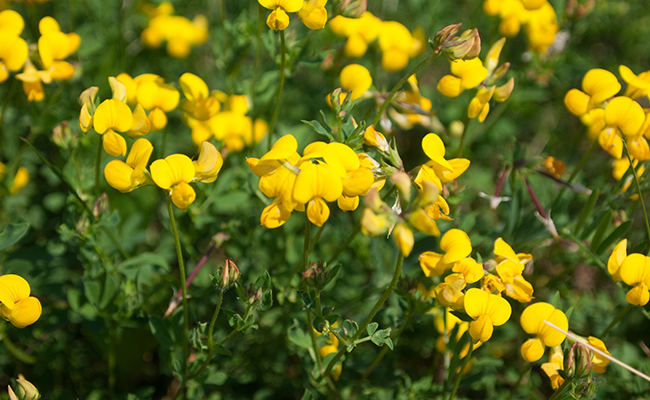
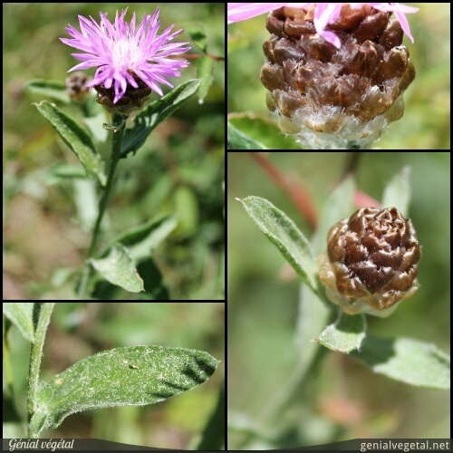
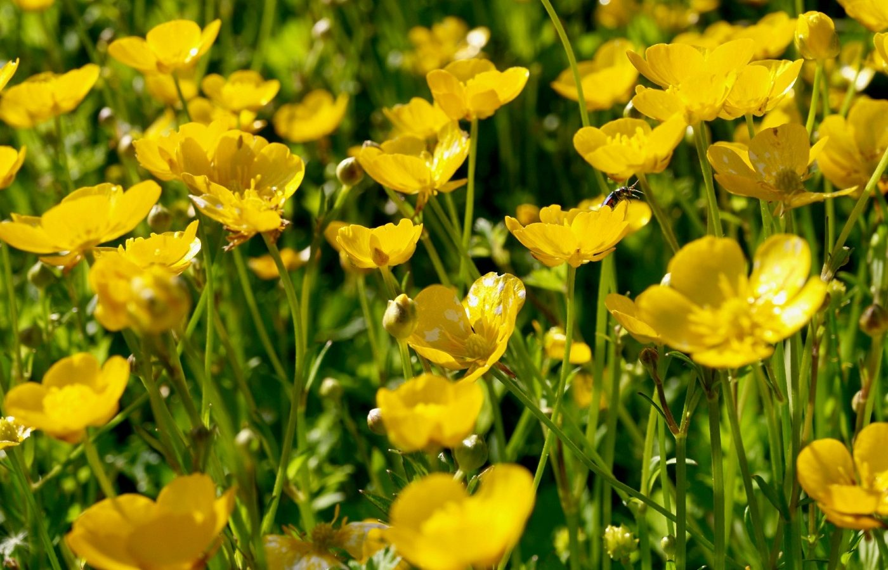
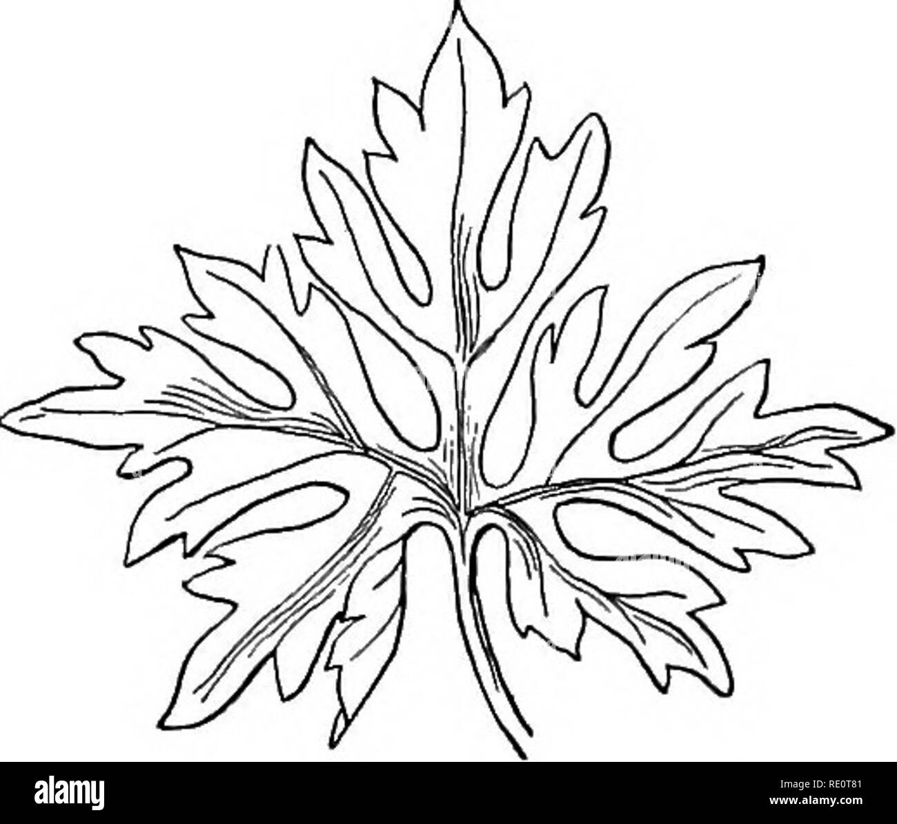
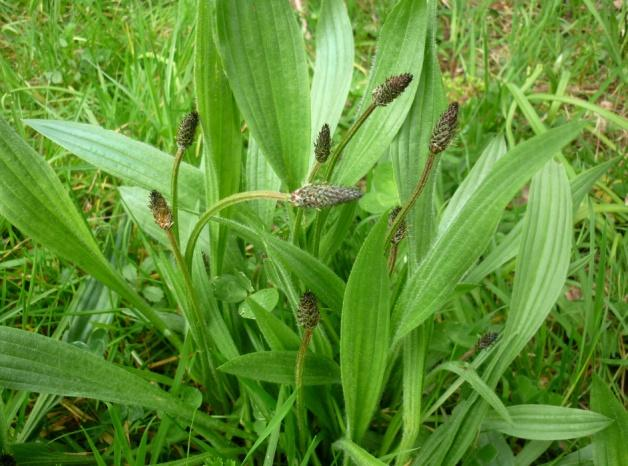
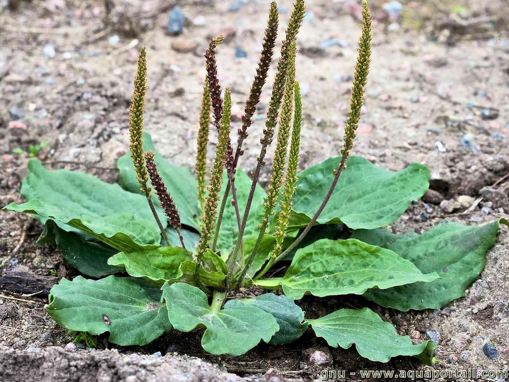
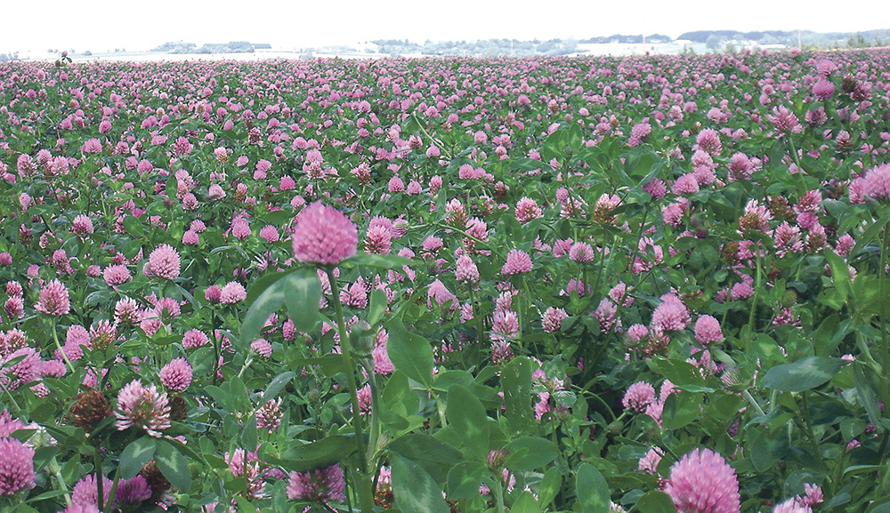

Merci à Damien pour le partage de son savoir !

<!-- more -->
<!-- markdownlint-disable MD033 -->

<a href="https://unsplash.com/@chris23?utm_source=unsplash&utm_medium=referral&utm_content=creditCopyText">Crédits de l'image à Chris</a> sur <a href="https://unsplash.com/s/photos/wild-flowers?utm_source=unsplash&utm_medium=referral&utm_content=creditCopyText">Unsplash</a> Ce qui suit sont mes notes de la vidéo publiée sur la chaîne Permaculture, agroecologie, etc. Vous pouvez retrouver [la vidéo sur YouTube](https://www.youtube.com/watch?v=sw-_HTEgOxM).

## Comment poussent les plantes sauvages

Souvent, les mêmes plantes poussent en association ou en cortège, au même endroit.

## La bio-indication de la plante

La bio-indication, c'est la corrélation entre la cause et la conséquence. C'est accepter un postulat très simple : chaque plante possède une utilité qui contribue à l'aggradation d'un écosystème, dans une situation donnée et à sa manière.

[Extrait de cette source](https://librairie-permaculturelle.fr/plantes-bio-indicatrices/28-livre-encyclopedie-des-plantes-bio-indicatrices-vol-1-gerard-ducerf.html#:~:text=La%20bio-indication%2C%20c%27est%20la%20corr%C3%A9lation%20entre%20la%20cause,dans%20une%20situation%20donn%C3%A9e%20et%20%C3%A0%20sa%20mani%C3%A8re.)

Simplement, cela signifie : que m'apprend la plante sur mon sol ?

## Beaucoup de plantes sauvages sont comestibles, mais tout le temps

Elles peuvent être médicinales.

En tout cas, il faut faire des recherches dans la litterature, car tout le monde n'est pas d'accord.

## Les 5 plantes sauvages de ce premier épisode

### Le lotier corniculé

Crédits de l'image : [Le Monde](https://jardinage.lemonde.fr/dossier-3160-lotier-cornicule.html)

C'est une plante :

- vivace
- de la famille des fabacées, c'est-à-dire une plante fixatrice de l'azote de l'air.
- qui peut indiquer un blocage de phosphore
  - cela signifie que le phosphore est présent, mais en quantité insuffisante pour les plantes de la zone.

Ses utilités :

- elle attire les polinisateurs
- elle est un très bonne plante fouragère
- on utilisait les fleurs pour calmer ou en tant que somnifère naturel
  - 1 cueillière à café de fleurs sèchés dans une grande tasse en infusion.
  - Il ne faut pas en abusé (max. 3 tasses par jour), car elle contient de l'acide cianirique qui est toxique à grande dose.

On peut la manger cuite, ce qui supprimera l'acide cianirique. Son goût est très prononcé.

_Pour information :_ on consomme souvent des plantes "toxiques", comme la pomme de terre, la tomate, l'épinard, la blette, et bien d'autres. On a l'habitude de consommer ces plantes toxiques quand on sait comment bien les consommer (cuites, bien mûres entre autre).

### La centaurée jacée

Crédits de l'image : [Génial végétal](https://www.genialvegetal.net/-Centauree-jacee-)

C'est une plante :

- qui fait de 30 cm à 1 m
- qui indique
  - des contrastes hydriques, c'est-à-dire que le sol n'a pas une bonne rétention de l'eau
  - que le sol manque d'azote ou / et de potasse

Ses utilités :

- elle attire aussi les polinisateurs
- les infusions stimularaient l'immunité
- elle peut remplacer l'houblon dans la composition de certaines bières

### Les boutons d'or ou renoncule

Crédits de l'image : [Troyes Champagne Tourisme](https://www.troyeslachampagne.com/le-luxueux-et-rutilant-bouton-dor/)

Crédits de l'image : [Alamy](https://www.alamyimages.fr/photos-images/feuille-simple-lob%C3%A9e.html?blackwhite=1)

La plante entière est toxique, et même allergisante.

C'est une plante qui peut indiquer, si présente en grande quantité, un engorgement des sols en eau et matière organique.

Attention, il existe plusieurs sortes de renoncules et toutes n'indique pas toutes la même chose à propos du sol : [voir Wikipedia.fr](https://fr.wikipedia.org/wiki/Renoncule).

### Le plantain lancéolé ou le plantain majeur

Crédits de l'image : Issue du [site Santé et nature](https://www.sante-et-nature.fr)

Crédits de l'image : [AquaPortail](https://www.aquaportail.com/fiche-plante-3741-plantago-major.html)

C'est une plante :

- qu'on trouve dans des zones naturelles, c'est-à-dire, non tondues, non piétinées, non tassées. En résumé, le plantain lancéolé indique un seul sol de bonne qualité.
  - C'est le contaire pour le plantain majeur.
- qui a un goût de champignons

Les utilités des deux plantains :

- elle a soulagé les piqûres d'orties, de guêpes, d'abeilles en machant la feuille et en appliquant la pâte sur la zone irritée.

### Le trèfle violet (ou le trèfle des prés)

\r
"Crédits de l'image : [Paysan breton](https://www.paysan-breton.fr/2014/2022-05/trefle-interessant-meme-a-3-feuilles/)")

C'est une plante :

- comestible
  - les fleurs sont légèrement sucrées (mes filles aiment déguster le nectar au fond du style).
  - les feuilles sont comestibles, mais sans abus.
- qui a la capacité à fixer l'azote atmosphérique grâce à des bactéries symbiotiques hébergées dans leurs racines.
- qui indique des informations différentes selon le trèfle :
  - le trèfle violet se rapproche de la centaurée jacée, e.g. sol léger.
  - le trèfle blanc se rapproche du plantain majeur, e.g. sol compacté

Ses utilités :

- elle attire aussi les polinisateurs
- elle est un très bonne plante fouragère
