[Des semis de divers choux](/images/2022-10-05-10-legumes-a-planter-en-octobre-au-potager-le-potager-d-olivier-hero.jpg)

Crédits : image extraite du vlog d’Olivier

C’est l’automne et le potager est encore bien actif. Que peut-on planter ce mois-ci ?

Merci à Olivier pour le partage de son savoir ! Cet article résume mes notes du vlog. Vous pouvez retrouver [la vidéo sur YouTube](https://www.youtube.com/watch?v=awu7IKRwVw0).

<!-- more -->

## Zones climatiques en France

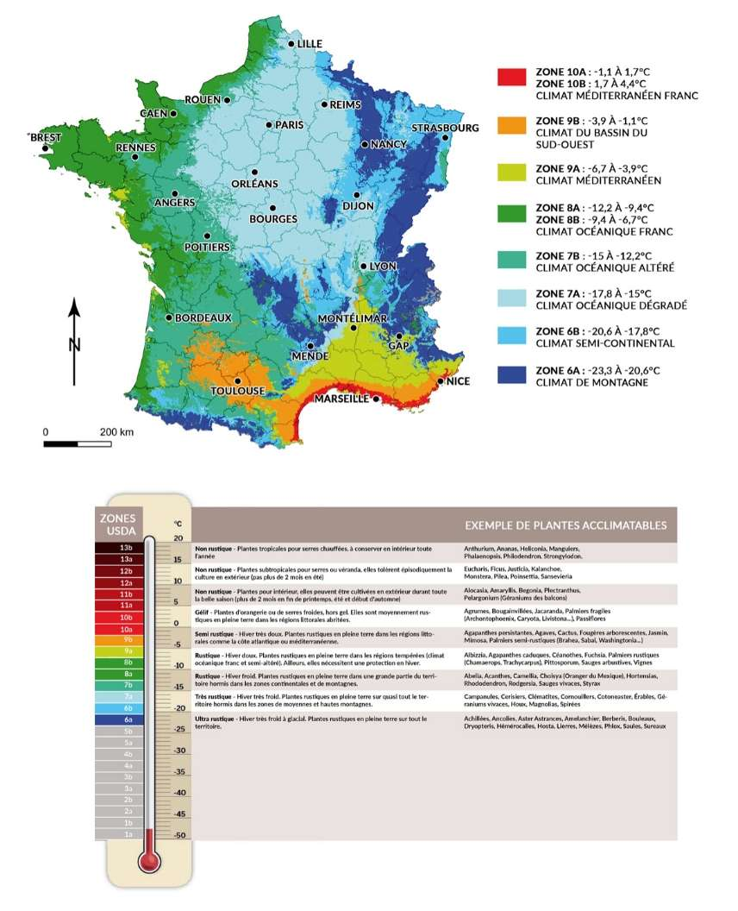

_Crédits de l’image : [Les promesses de fleurs](https://www.promessedefleurs.com/conseil-plantes-jardin/ficheconseil/climat-carte-france-zone-rusticite-usda-definition)_

### Dans les zones 1 à 3

Il faudra réaliser les cultures listées ci-dessous sous abri, dans des serres ou des tunnels.

### Dans les zones 4 et 5

Il est possible de réaliser les cultures listées ci-dessous, tout en gardant à l’esprit qu’il faudra protéger en cas de gros gel.

### Dans les zones 6 à 8

Il n’y a pas de contraintes pour planter les cultures listées ci-dessous dans ces zones.

## Les cultures d’octobre

### Les fèves

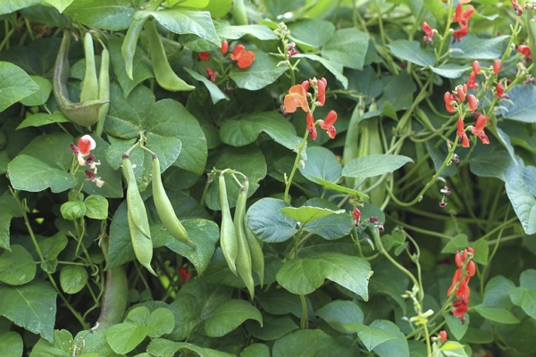

Crédits de l’image : [Le Droit](https://www.ledroit.com/2019/04/11/legumes-originaux-pour-votre-potager-e9a764139ba81d9db4304da8a5b3fb26).

On peut les planter en toutes les saisons, mais on n’aura pas la productivité des tomates.

Les cosses sont comestibles et, en les consommant, cela permet d’obtenir une quantité importante de nourriture.

Dans les climats 4 et 5, le plantage a lieu fin octobre, Dans les climats 6 à 8, on attendra début novembre. Cela évitera que les plants soient trop hauts en plein hiver et se plient en deux.

Dans les climats plus froids, il est vraiment préférable d’attendre le printemps.

De manière générale, on peut les tuteurer, mais dans l’idéal, il est préférable de retarder le plantage des fèves.

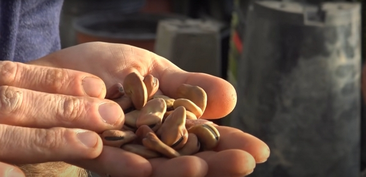

Crédits : image extraite du vlog d’Olivier.

Les fèves se sèment individuellement (espacées de 10-15 cm) ou par poquet de 3 graines (plus espacées de 30-40 cm).



Les fèves font partie de la famille des _Fabaceae_, ou Leguminosae (Légumineuses). Cela signifie qu’elles capturent l’azote de l’air dans les racines.

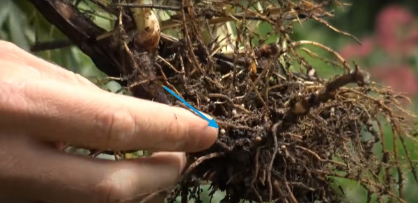

Crédits : image extraite du vlog d’Olivier.

Elles sont donc un très bon engrais vert où on compostera les plants après la récolte.

Cela permet d’enrichir le sol.

Enfin, leurs racines puissantes décompactent bien le sol où elles ont poussé.



### L’ail

La culture ne prend pas beaucoup de place.

Il y a 3 variétés d’ail :

- l’ail rose
- l’ail blanc
- l’ail violet

L’ail blanc et l’ail violet seront ceux que l’on plantera à l’automne.

Toutes les régions sont concernées pour la plantation à ce moment de l’année.



Les anciens disaient que l’ail ne s’enterre pas. Il fallait juste les recouvrir de terre meuble.

On veut aussi faire affleurer les caïeux d’ail.



On peut se servir des caïeux d’ail achetés dans les magasins d’alimentation, toutefois, ceux issus de jardineries seront plus qualitatifs.

### Les petits pois

Il faudra un climat assez doux pour cette culture.

Donc les climats 1 à 3 devront attendre le printemps tandis que les climats 4 à 8 peuvent commencer en octobre et novembre.



Il faut bien tuteurer des grillages, grilles ou filets sur les plants pour éviter qu’ils ne s’effondrent et qu’ils soient dans trop d’humidité au sol.



Le semi se fait bien serré, tous les 2-3 cm.

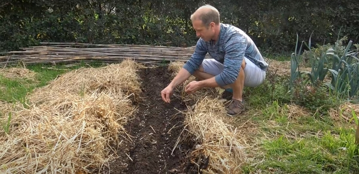

Crédits : image extraite du vlog d’Olivier.

Les petits pois vont sortir de 20-30 cm quelques semaines après et la croissance stagnera le reste de l’hiver.



Les petits pois à cosse lisse résistent mieux au froid que les petits pois à cosse ridée.

Cela est spécifié sur les sachets de graines.



### Les artichauts

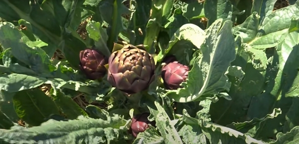

Crédits : image extraite du vlog d’Olivier.

La culture est possible dans tous les climats, mais en climats 1 à 3, il faudra pailler ou abriter les plants.

Si l’on a un grand plant,

1. on peut récupérer les nouveaux plants, appelés _oeilletons_, au pied du pied parent.
2. on fera ensuite ce qu’on appelle un habillage où l’on coupe une bonne partie des feuilles
3. et on plante l’œilleton dans un godet avec une terre bien meuble.

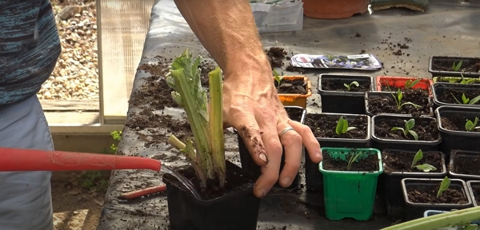

Crédits : image extraite du vlog d’Olivier.

On réserve cette technique aux climats doux, même s’ils résistent aux gelées de -5 °C.

### Les fraises

Cette culture est adaptée à toutes les régions.

C’est le moment idéal en ce mois d’octobre de planter les fraisiers, soit issus de plants de jardineries, soit issus des stolons de plants existants.

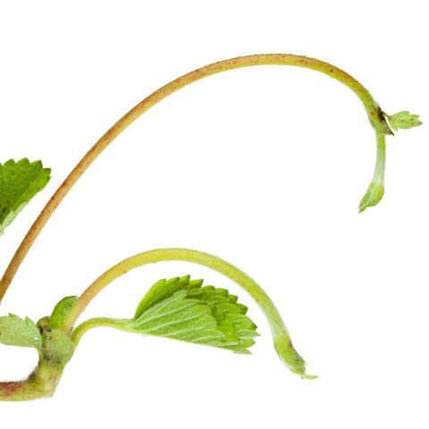

Crédits : image issue du [Magasin Aveve](https://magasinsaveve.be).

versus

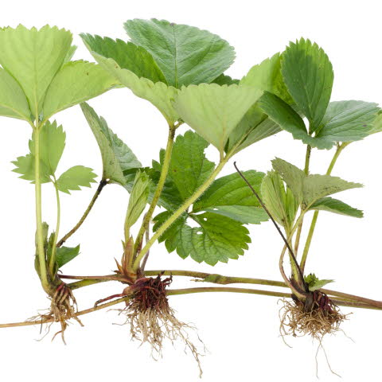

Crédits : image issue du [Le Magasin Aveve](https://magasinsaveve.be).

Les stolons sont à planter dans des godets si l’on veut les implanter dans une zone différente des plants parents.

### L’échalote (de préférence grise)

Cette culture est adaptée à toutes les régions.

Comme l’ail, on démultiplie la nourriture facilement avec l’échalote.

L’échalote se plante aussi dans une terre bien meuble pour éviter l’excès d’humidité.

### Les épinards

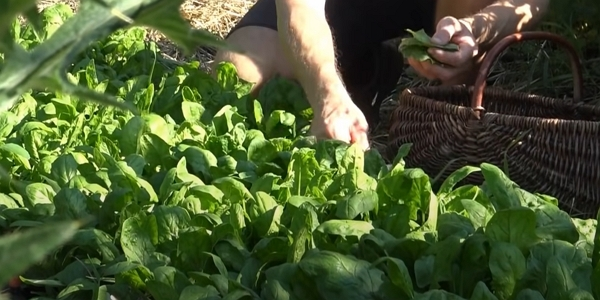

Crédits : image extraite du vlog d’Olivier.

On peut les planter depuis 2 mois et en ce mois d’octobre, on est encore bon pour en planter.

L’épinard pousse bien à 15 °C.



Dès que les gelées arrivent, on plantera ou on protègera sous abri à partir de décembre.



Et…



Voir [ce vlog d’Olivier](https://www.youtube.com/watch?v=j-dKPtWlsaY) pour ses astuces sur ces gastéropodes…



### Les oignons

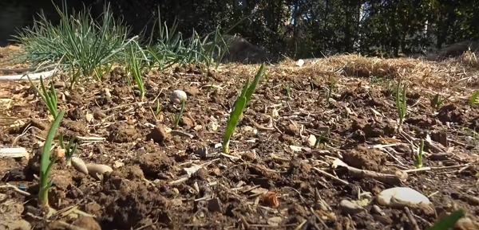

Crédits : image extraite du vlog d’Olivier.

Cette culture est réservée aux régions aux climats 4 à 8 pour une culture à partir d’octobre. Pour les autres climats, on attendra le printemps, car il y a un trop gros risque que cela pourrisse à cause du gel.

Ce qui peut se passer en plantant en octobre est que les oignons montent en graines au printemps.

On peut planter aux deux périodes, peu importe le climat. Cela dépend de quand on voudra les oignons.

Les bulbilles (semence d’oignons) se trouvent en jardinerie en plus de centaine.

### Les choux

Ils se plantent partout. Il est toutefois nécessaire de devoir les installer sous abri dans les climats plus froids.

Les choux n’aiment la chaleur ni le froid important.

Donc,

- aux climats 6 à 8, on les plantera à l’automne
- aux climats 1 à 3, on les plantera au printemps
- pour le reste, on s’adaptera à la météo, mais il est possible de planter toute l’année.

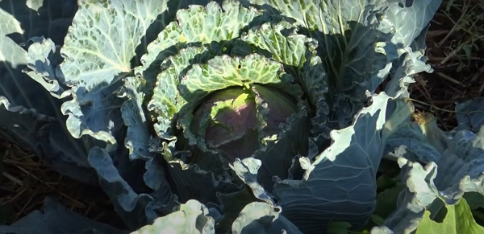

Crédits : image extraite du vlog d’Olivier.

### Les engrais verts

Ils sont là pour nourrir le sol.

On y trouve :

- Pour le semi en octobre
  - Le trèfle incarnat
  - Le sègle
  - L’avoine
  - Le sarrasin
- Pour le semi de mai à septembre
  - La moutarde
- Pour le semi de mars à septembre
  - La phacélie
