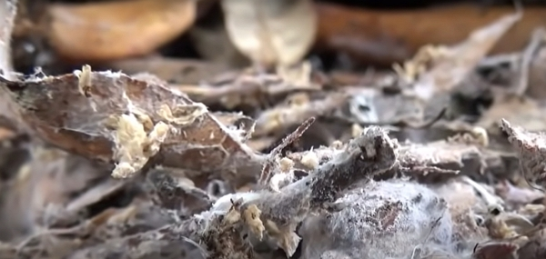

.

Un sol vivant est le moyen le plus efficace de jardiner et ce n’est pas complexe à mettre en œuvre. Par contre, il faut de la patience…

Merci à Damien pour le partage de son savoir ! Cet article résume mes notes du vlog réalisé par Permaculture, agroécologie, etc.

Vous pouvez retrouver [la vidéo sur YouTube](https://www.youtube.com/watch?v=WApK6d1ucz4).

<!-- more -->

## Pourquoi de la vie dans le sol

La vie du sol permet la dégradation de la matière organique.

Par exemple :

- quand une feuille tombe au sol, des limaces viennent la manger
- quand du bois tombe au sol, des champignons vont le dégrader

Toute cette vie va permettre la création de l’humus.

Aussi, une vie dans le sol permet d’obtenir une bonne structure du sol, c’est-à-dire qu’il est bien décompacté.

Par conséquent, cela permet une bonne gestion de l’eau. Dans un sol très compacté, l’eau ne peut pas bien pénétrer. Au contraire, un sol décompacté favorise le développement des micro-organismes, comme le mycélium.

Crédits : image extraite du vlog de Damien.

## Le stockage du carbone dans le sol

Un arbre absorbe le CO2, ou gaz carbonique, pour accumuler dans sa matière organique le _C_ ou Carbone et il rejette le _O2_ ou l’Oxygène.

## Sol vivant vs sol labouré

Il n’y a quasiment pas de vie dans un sol labouré.

Pourquoi ?

Car la vie anaérobie se retrouve à l’air et elle meurt et l’inverse est vrai pour la vie aérobie.

Les champignons ne peuvent vivre dans un sol labouré. C’est pour ça qu’on est amené à _booster_ le sol avec des produits toxiques, même en agriculture biologique.

Même le cuivre pour tuer les champignons, le pyrèthre pour tuer les insectes.

Dans un sol labouré, les herbes à croissance rapide sont les herbes que l’on retrouve toujours. Ce sont les mauvaises herbes.

Quelle dépense d’énergie inutile !

## Succession végétale

Il s’agit de quatre stades d’un cycle naturel

1. Sur un sol nu, on commence toujours par avoir de mauvaises herbes.
2. Ensuite viennent les plantes buissonnantes et les arbustes.
3. Puis, des arbres pionniers s’installent, comme l’érable, le sumac, du frêne, du pin…
4. Viennent enfin les espèces climaciques, comme les chênes. À ce stade, les mauvaises herbes ont depuis longtemps disparu…

C’est un phénomène naturel et le travail du sol nous laisse dans le stade 1…

## La biodiversité apparait à partir d’un certain stade

La vie et la biodiversité commencent à apparaitre dès que les herbes hautes sont présentes.

Pourquoi ?

Car la vie vient s’installer à l’ombre des herbes, ou dans les tiges creuses de certaines plantes.

## La population dans le sol

Dans une grosse poignée, il y a plus d’organismes vivants d’humains sur la Terre.

Il y a plusieurs types d’organismes vivants :

1. Les phytophages : ils consomment nos plantes… On ne les aime pas en général. Ex. : les escargots, les limaces…
2. Les décomposeurs primaires : ils mangent les végétaux morts. Ex. : les vers de terre.
3. Les décomposeurs secondaires : ils se nourrissent des rejets des premiers animaux.
4. Les prédateurs, que l’on nomme les animaux auxiliaires, se nourrissent des trois premières catégories.

Il faut bien voir ces catégories comme un ensemble qui s’autogèrent et qui dépendent l’une de l’autre.

### Les vers de terre

On trouve :

- les vers de terre _épigés_ en surface,
- les vers de terre _endogés_ plus en profondeur,
- et les vers de terre _anéciques_ qui mélangent toutes les strates du sol.

Ils sont très efficaces pour aérer le sol.

### Les champignons

Le sujet est complexe.

On peut avoir deux tonnes de mycélium à l’hectare.

Souvent, nous pensons souvent à la partie aérienne visible (c’est la partie qui permet la reproduction ou _le sporophore_).

Toutefois, il y a aussi les _ifs_ : ce sont des filaments extrêmement fins, invisibles à l’œil nu, qui composent le mycélium visible.

### Les mycorhizes

L’origine du mot :

- myco : en grec, signifie « champignon »
- rhiza : en grec, signifie « racine »

On en déduit qu’il s’agit de la symbiose entre les plantes et les champignons.

Comment ?

Les plantes, par la photosynthèse, donnent des sucres aux champignons et ces derniers cherchent des minéraux et autres alimentations pour les plantes avec beaucoup d’étendues que les racines de la plante lui permettent.

Pour un mètre de racine, il y a 1000 mètres de réseaux mycéliens.

En mettant des engrais dans le sol, on détruit à la fois le support des mycorhizes aux plantes et on rend les plantes dépendantes de nos engrais, qui n’importent pas le même équilibre que la nature.



80 % des plantes sont mycorhiziennes



## N’utilisez pas les engrais

Le cuivre par exemple, autorisé en agriculture biologique, détruit les mycorhizes dans le sol.

Ça empêche vraiment les plantes de devenir autonomes…



Le plus grand champignon vit en Orégon. On le nomme _Armillaria gallica_.

Il serait le plus grand organisme vivant du monde, en s’étendant sur 8,9 km² et pesant environ 400 à 600 tonnes.



## Les bactéries

Elles se trouvent vraiment partout dans le sol.

Par exemple, les bactéries vivant en symbioses avec les légumineuses sont responsables de la fixation de l’azote de l’air.

Comme pour les champignons, le labour et les traitements tuent les batteries…

## Comment développer les champignons dans un jardin

### Le compostage de surface

On met les vieux légumes, par exemple, sous du paillage humide ou de matière carbonée.

### Un sol vivant = un sol couvert

Il faut toujours couvrir le sol, que ce soit pour protéger du froid, de la chaleur, de la pluie, etc.

En gros, on reproduit ce qui a lieu dans la nature.

### Le « non agir »

Masanobu Fukuoka, agriculteur japonais très connu, recommande de « ne rien faire » :

- laisser les racines,
- arrêter les pesticides,
- ne pas labourer,
- utiliser des graines biologiques, non génétiquement modifiées

### Les animaux phytophages peuvent aider

Ils aiment consommer les feuilles malades, par exemple l’oïdium, qu’ils permettent de réduire et même réduire par la digestion des feuilles contaminées.

## Les informations sur le phosphore

Aujourd’hui, l’agriculture conventionnelle le puise dans des mines épuisables, qui seront sûrement vides en 2040.

Le phosphore est très utile pour le sol, mais il est lessivé par l’eau.

Dans l’agriculture sur sol vivant, tout ce qui est vivant est rempli de phosphore et en mourant, cet élément est relâché.

## Les plantes autotrophes et le système mycorhizien

Un organisme autotrophe est un organisme capable de générer sa propre matière organique à partir d’éléments minéraux. Il utilise pour cela l’énergie lumineuse soit par photosynthèse, soit par chimiosynthèse chez quelques espèces.

Ce n’est pas le cas des êtres vivants comme les animaux ou les êtres humains.

Les champignons ne sont pas autotrophes, comme nous, et le réseau mycélien est comme un grand système digestif ouvert sur le monde. Les champignons mettent en commun via ce réseau l’ensemble des nutriments pour eux-mêmes, mais aussi tous les autres champignons et aussi les plantes.

## Les mycorhizes et leur nourriture

Les champignons

## Comment retrouver du phosphore dans le jardin

Après un certain temps, le phosphore part à la mer. Mais comment peut-il revenir ?

Autrefois, les saumons, les oiseaux migrateurs, les anguilles, tous ces animaux amenaient une bonne portion du phosphore nécessaire pour le sol.

Toutefois, les cycles naturels ayant été détruits ou fortement fragilisés, il est important de les aider à se remettre en marche.

Par exemple, voici quelles actions pour redonner au sol le phosphore dont il a besoin :

- favoriser l’accueil des oiseaux avec des arbres fruitiers
- utiliser les toilettes sèches, car l’urine est riche en phosphore, donc plutôt que de polluer (surtout en ville), n’est-il pas mieux de recycler nos rejets organiques ?

## Une terre peut devenir vivante

En quelques années, on peut rendre une terre pauvre très riche en laissant la vie se développer. C’est elle qui est capable de nous redonner un sol riche.

Il faut la couvrir de matière organique et la vie se développera !

Rappelez-vous que les animaux, même les moins souhaités, sont là pour nous aider bien qu’ils semblent être _une peste_ par moment.

Donc, donnez-leur le plus de nourriture possible et le sacrifice de la nourriture qu’ils mangent n’en sera que bénéfique sur le long terme.
