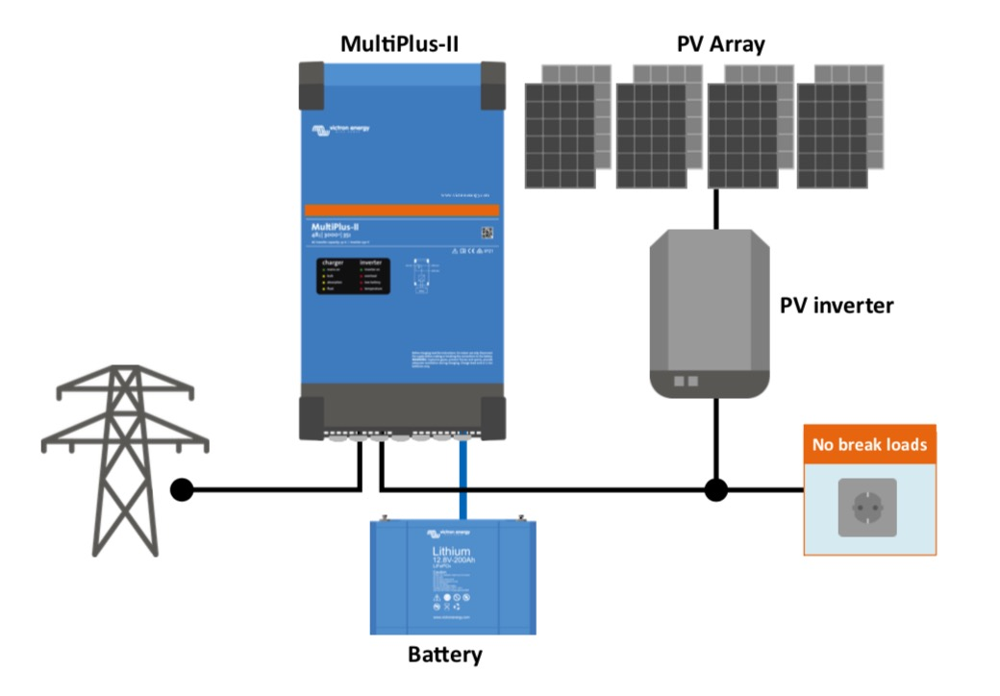
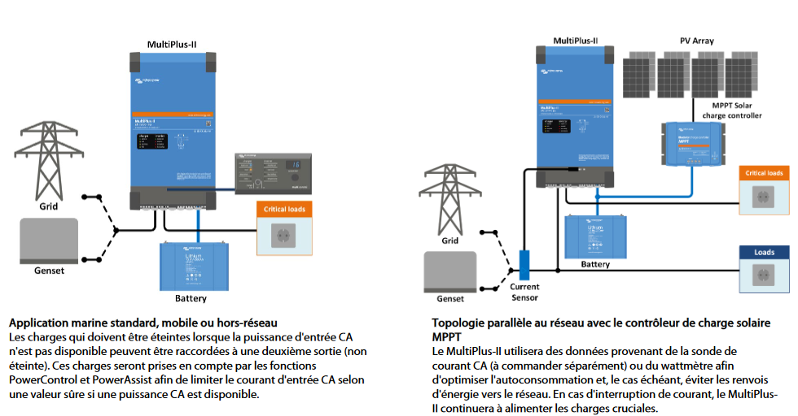

## Objectif

Obtenir tous les éléments et conseils d’un professionnel pour me permettre la réalisation du besoin décrite ci-dessous pour un budget d’environ 2000 euros.

Je ne savais pas si j’avais les moyens pour un onduleur Victron Multi plus II (le modèle 24V 3000VA). De plus, il semblait qu’il nécessite d’avoir un chargeur séparé.

Je n’ai clairement pas les moyens pour des batteries Ni-Fe (vu les prix que Perma-batteries m’a donnés), mais je ne souhaite pas non plus utiliser la techno Gel ou OPZS,

Donc ça laisse uniquement les LiFePO4.

## Besoin

Alimenter au minimum un poêle à granuler Ravelli HR70 de fin septembre à début mai qui consomme :

- 234 à 260W de puissance au démarrage (12 premières minutes),

- puis 25W minimum en fonctionnement nominal,
  - la visse « sans fin » crée un pic de consommation à 25W pendant 5 secondes toutes les 5 secondes,
  - le circulateur maintient une puissance de 33W supplémentaires à interval régulier pour la circulation de l'eau chaude.

Cela équivaut à environ 750 Wh par jour.

J’aurais aimé obtenir une autonomie de 1 à 2 jours.

Donc, si j’ai bien compris le calcul, une batterie de la capacité suivante est nécessaire : on prend 750 Wh divisés par 0,8 (avec une [DOD ou Profondeur de décharge](https://www.google.com/search?q=profondeur+de+d%C3%A9charge) = 80 %) = 900 Wh par jour soit

- 2 batteries de 75 Ah en 12V
- 2 batteries de 40 Ah en 24V

Je n’exclus pas d’alimenter d’autres appareils, comme :

- les lumières (23 LED de max. 4W) où on en utilise 10 de 4W plus que les 13 autres, soit :
  - 4 Wh x 10 x 6 h = 240 Wh par jour
  - 4 Wh x 13 x 2 h = 104 Wh par jour
- et une [VMI ou ventilation mécanique insufflée](https://heero.fr/guide-travaux/ventilation/vmi/qu-est-ce-que-la-vmi/) avec filtre (600 Wh sur 24 h mesurés).

Mais ce n’est pas une priorité.

Donc, une batterie de 2 kWh (type : Polyntech) de capacité donnerait 1 jour à 2 jours d’autonomie selon notre usage.

Un bonus non négligeable : permettre le chargement des batteries sur notre surplus solaire (ou une piste pour câbler cela).

## Comment ai-je procédé

J’ai contacté 3 personnes et entreprises (en dehors des recherches sur Internet et mes échanges sur le forum [https://forum-photovoltaique.fr/](https://forum-photovoltaique.fr/)) :

- Patrick de [la Maison autonome](http://heol2.org/)
- Rémi de [Nos pieds sur terre](https://nospiedssurterre.fr/)
- Eliot, ingénieur chez [My Shop Solaire](https://www.myshop-solaire.com/)

### Avec Patrick

L’échange téléphonique a été court.

Il utilise des [batteries Rolls Royce](https://www.google.com/search?q=batteries+Rolls+Royce) (comme la marque de voiture) de 400 Ah en 24 v.

Il ne passe pas en dessous de 70 %.

Sur [ce site](https://www.batterie-solaire.com/236-batterie-rolls-serie-4000), on voit qu’il y a quasiment le double de cycle en décharge à 50 % vs décharge à 80 %, 3,28 ans vs 5,48 ans d’espérance de vie.

Son système est trop onéreux pour moi.

Il faut dire qu’il est autonome et il n’utilise pas beaucoup d’appareils modernes chez lui. Vous pouvez facilement le retrouver sur Internet: [la Maison autonome](http://heol2.org/).

### Avec Rémi

J’ai eu un long échange par courriel début septembre.

Voici ce qui est en ressort :

Devenir autonome en électricité n’est pas simple :

- il faut bien connaitre son usage, autant du point de vue des équipements à alimenter, lequels sont critiques et lesquels sont du bonus et de la consommation type au jour le jour.
- Ensuite, si l’on cherche à réaliser le projet soi-même, il faut des compétences en électricité et savoir comment on peut équilibrer le prix, le dimensionnement et le temps nécessaire pour mener à bien le projet.

Devenir autonome en électricité ne va pas vous permettre d’économiser de grosses sommes, du moins à court et moyen terme.

L’accent doit être mis sur la définition de l’objectif.

Dans mon cas, ce n’est pas le but.

Toutefois, je pense que devenir autonome est un projet de long terme pendant lequel vous apprenez en testant, en expérimentant et en affinant le projet.

Pour résoudre ma problématique, l’utilisation d’un onduleur informatique, pour sécuriser juste le poêle, doit pouvoir fonctionner. Mais il m’a conseillé de bien prendre un onduleur _pure sinus_, ce qui requiert de prendre du haut de gamme et bien calculer la consommation.

Rémi a aussi parlé d’un système « ESS » de Victron en mode « AC Coupling ». Sur le papier, ça ressemble à la solution à long terme.

Je comprends qu'il s’agit :

- d’utiliser une ou plusieurs installations solaires et le réseau pour charger la ou les batteries
- de permettre le fonctionnement de mon installation avec micro-onduleur comme si la maison était isolée du réseau, ce qui n’est pas possible à ce jour à cause de la norme sur les onduleurs réseau
- de faire la bascule automatique du réseau vers les batteries quand le premier coupe.

Toutefois, mon budget était bien au-dessous de ce qui est nécessaire pour aller dans cette direction.

L’investissement pour l’onduleur uniquement varie de 1200 à 1800 euros minimums, cela dépendant bien sûr de la puissance à couvrir dans la maison.

Comment se présente une installation avec le Victron Multiplus II GX en couplage AC ? Allez lire sur le principe du _Couplage AC_ sur [le site Victron](https://www.victronenergy.com/live/ac_coupling:start).

Ce qui est sûr, pour un foyer comme le mien, il aurait nécessité :

- un modèle de 5kVa,
- des batteries de 48V, car, bien que des batteries en 12V ou 24V existent, des onduleurs 12V ou 24V sont plus rares et donc plus chers. Après, il est toujours possible de tomber sur une bonne affaire.
- un kit pour le suivi de l’installation et sa configuration
- le câblage et tous les petits accessoires.

Finalement, le coût aurait dépassé les 10 000 euros… au moins !

Conclusion : il m’a proposé une batterie de 2,5 kWh en 24V pour 1000 euros HT, un onduleur chargeur MultiPlus 1600/24V à environ 763 euros HT.



Pour faire tourner juste le poêle à granuler, cela suffit et surtout, il n’existe pas vraiment d’onduleur 48V avec une puissance inférieure à 2000VA.



Avec le système de monitoring (Cerbo GX) sans écran tactile (\*), on dépassait mon budget avec plus de 2500 euros **hors temps de pose que j’aurai dû réaliser moi-même.**

(\*) : Un smartphone suffit en Bluetooth pour communiquer avec le Cerbo GX.



Pour donner des conseils aux gens sur le sujet, il faut au moins réaliser sa propre installation.

Ensuite, il faut se former sur les solutions de sites autonomes et lire sur le sujet de la résilience qui ne doit pas se limiter au point de vue énergétique.

J’ai acheté [le livre co-écris par Rémi](https://amzn.to/3fwo1iS) où l’on apprend sur tous les domaines pour créer son foyer résilient. Je vous le recommande. Je réaliserai dans le futur un avis sur le livre, mais pour le moment, je l'aime beaucoup !



### Avec Eliot de My Shop Solaire

J’ai un bon échange par courriel courant septembre.

Il a été très pédagogue en m’expliquant la différence entre l’onduleur Victron MultiPlus et le MultiPlus II.

Concernant le MultiPlus, l’avantage du modèle II est qu’il possède 2 sorties. Ainsi, j’aurais pu profiter de la production des panneaux pour les 2 sorties et même celle qui ne sera pas alimentée en cas de coupure..

Si je faisais le choix d’un MultiPlus simple, alors il n’aura qu’une sortie, vous y raccorderez les appareils listés à savoir le poêle et la production des panneaux ne servira que pour ces derniers.

J’ai posé une question supplémentaire à propos de l’alimentation d’un réfrigérateur : dans mon cas, un réfrigérateur de 300 L aurait été trop juste pour un convertisseur 800VA, d’après des tests qu’ils ont effectués. Si je voulais l’alimenter, un modèle 1200VA aurait été mieux adapté.

Concernant le GX Touch, il n’apporte aucune fonctionnalité supplémentaire. C’est simplement un écran tactile qui indique les informations récoltées par le Cerbo, ces mêmes informations sont disponibles en Bluetooth sur un téléphone.

## Le choix

Après environ 24 h de recherches, d’échanges et de réflexions, je n’ai pas sélectionné l’option de Rémi ni celle proposée par Eliot à cause du dépassement de budget. En effet, ce qui est vraiment indispensable pour ma famille cet hiver n'est pas En fin de compte, même 2000 euros de budget étaient plus que ce que je pouvais me permettre.

Mais surtout, dans mon échange sur le forum [https://forum-photovoltaique.fr/](https://forum-photovoltaique.fr/), quelqu’un a mentionné la solution d’Ecoflow.

A la mi-septembre, ils étaient sur le point de lancer leur nouvelle station électrique: la nouvelle station Delta 2.

J’avais vu ces stations auparavant, mais elles utilisaient toujours des batteries li-ion que je ne voulais pas utiliser pour les raisons de sécurité et de durée de vie (maximum 800 cycles).

L’évolution majeure avec la Delta 2 est bien la chimie de la batterie. Ecoflow a décidé d'utiliser une batterie LiFePo4, permettant de passer de 800 à 3000 cycles et une durée de vie de 10 ans avec un cycle par jour.

Ensuite, les autres atouts qui ont retenu mon attention étaient :

- la recharge en courant alternatif modulable (de 200W à 1200 W), car je ne suis pas intéressé par la charge ultra rapide en 80 min.
- la recharge en courant continu avec des panneaux solaires et les limites de 500Wc, 15A et 60V en entrée.
- le mode « EPS » pour « Emergency Power Source » ou Source d’alimentation d’urgence qui permet de passer du réseau à la batterie sous 30 ms. Le constructeur de mon poêle à granuler Ravelli m’a confirmé qu’un changement de source d’alimentation en 30 ms est transparent pour le poêle.
- le prix de 1200 euros pour 1 kWh de capacité, même si pour le même, j’avais 2 fois plus de capacité avec la batterie Pylontech. En effet, il faut ensuite au minimum 1200 voir 1500 euros d’investissement supplémentaires pour un système complet.
- le fait que la station est démontable comme le montre [cette vidéo](https://www.youtube.com/watch?v=OTUValSLnrQ) d’Ecoflow. Cela semble bien pour le futur lorsqu’il faudra changer des pièces.

J’ai donc fait l’achat à la sortie de la Delta 2.

Rémi m’a même confirmé avoir reçu des retours d’expérience positifs sur les stations Ecoflow donc cela me conforte dans mon choix

Pour finir, je souhaite rappeler qu’il n’agit pas d’une solution pour passer en site isolé. Mon but est de garantir que mon poêle à granulé hydraulique fonctionne cet hiver, même en cas de coupure.

## Remarques

Avec notre installation, même s’il fait moins beau, on aura de la production qui va dans le cumulus d’eau chaude.

Bien sûr, nous sommes toujours couplés au réseau, donc sans réseau, il n’y a rien…

Même s’il fait mauvais, mais des éclaircies, on chauffe l’ECS par le photovoltaïque uniquement. Toutefois, il semble qu’il soit nécessaire de produire 1,5 kWh ou 2kWc chaque jour pour subvenir au besoin de la famille (3 personnes).
