Merci à Damien pour le partage de son savoir ! Cet article résume mes notes du vlog réalisé par Damien sur sa chaîne _Permaculture, agroécologie, etc_.

<!-- more -->

Vous pouvez retrouver le vlog sur YouTube [3 Trucs à faire en janvier au Jardin](https://www.youtube.com/watch?v=5ShdlruxnwI)

## Bonus : cendre dans le jardin

Si vous avez un poêle à bois, épandre de la cendre sur le jardin peut s'avérer très bénéfique.

À raison d'une poignée _par mètre carré par an_, cela apporte :

- de la silice
- du calcium
- de la potasse

Souvent, les légumes ne poussent pas très bien à cause d'un manque de calcium.

## _Truc 1_ en janvier : Récolter les greffons

Bien que Damien soit fan des arbres non greffés, la greffe est utile.

Par exemple, un amandier pousse très mal dans un sol humide. Sauf si l'on greffe celui-ci sur un prunier, qui lui supporte très bien l'humidité.

Autre exemple, dans un sol trop acide, l'abricotier aura du mal. Sauf si l'on greffe celui-ci sur certains pêchers.

### Terminologie

Donc, pour commencer, qu'est-ce que le porte-greffe et le greffon ?

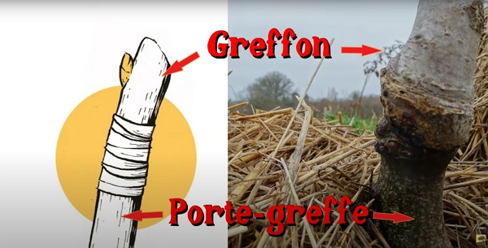

Crédits : image extraite du vlog de Damien.

- Le porte-greffe correspond à la partie qui est enracinée, dépassant au-dessus du sol.
- Le greffon correspond à la partie aérienne.

### Comment extraire les greffons

En gros, vous avez simplement à trouver des branches (bois de l'année) d'arbres fruitiers et les extraire à l'aide d'un sécateur bien aiguisé.

Par exemple, Damien possède un très bon poirier duquel il va extraire les greffons pour les greffer sur des aubépines sauvages !



J'ai beaucoup d'aubépine chez moi.

J'aurais aimé faire la même chose.

Problème : les aubépines se trouvent sur le terrain en terrasse où les moutons pâturent... et se nourrissent des feuilles d'aubépine...

A étudier.

En tout cas, je trouve l'idée excellente !



Dans l'idéal, on prend donc des branches à 45° pour que les arbres produisent plus vite, mais en vrai, voulons-nous vraiment que les arbres produisent plus vite si vous avez déjà beaucoup ? Pas forcément.

On évite les branches qui _regardent vers le bas_, car en général, les arbres issus de ces greffons démarrent moins bien.

### Conserver les greffons

C'est simple : on les emballe dans un papier journal humide comme un bouquet de fleurs, doublé avec un sachet plastique.

On les stocke ensuite dans un réfrigérateur.



Je me demande si une cave à moins de 10 °C peut remplacer le réfrigérateur.



Damien suggère à la place du réfrigérateur la solution suivante :

- dans un conteneur adapté à la quantité de greffons, mettre du sable jusqu'à moitié
- mettre les greffons
- compléter avec du sable
- ==Le plus important== : les greffons doivent être positionnés dehors, au nord et ne doivent jamais voir le soleil jusqu'à la greffe.

### Réaliser la greffe

Damien utilise :

- un bon sécateur
- un couteau bien aiguisé
- des élastiques à greffer
- du mastic à greffer

Elle sera réalisée en mars/avril.

### Gros avantage de la greffe

Encore une fois, le gros avantage est de la possibilité de transformer des zones en friche en verger.

Je pense que je peux trouver un arbre sur mon terrain assez haut (pour être hors de portée des brebis).

## *Truc 2* : Réaliser un nichoir à chiroptère

Mais c'est quoi un chiroptère ? Une chauve-souris.

C'est un très utile insectivore.

Non, la chauve-souris ne s'emmêle pas dans les cheveux.



Il s'agit simplement d'une histoire racontée aux jeunes filles pour qu'elles ne sortent pas le soir.



En Europe, 36 espèces de chauve-souris sont répertoriées, dont aucune ne suce le sang...

### Matériaux

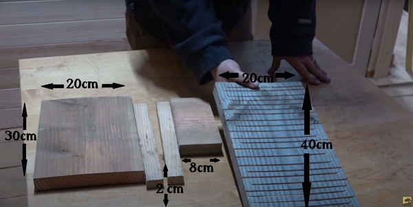

Crédits : image extraite du vlog de Damien.

Les planches ci-dessus sont un exemple. Vous êtes libres d'adapter.

La planche rainurée sert pour les chauves-souris à s'accrocher.

### Montage

L'assemblage est simple :

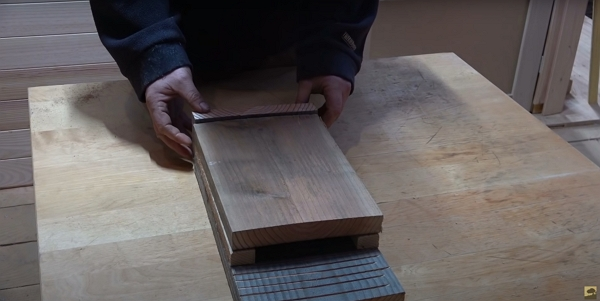

L'entrée doit être orientée vers le bas. Crédits : image extraite du vlog de Damien.



Les chauves-souris n'ont pas besoin de plus de 2 cm d'épaisseur, en tout cas, par chez nous.

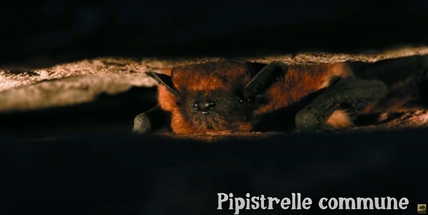

Comme vous le voyez, l'espace de 2 cm leur suffit largement. Crédits : image extraite du vlog de Damien.

Pour plus d'informations sur les chiroptères, allez visiter le site [Plan National d'Actions Chiroptères](https://plan-actions-chiropteres.fr/).



Les planches sont ensuite clouées ou vissées.

On installe les nichoirs l'hiver pour permettre une colonisation au printemps.



Prévoyez du bois résistant à l'humidité et un petit _toit_ comme ci-dessous :

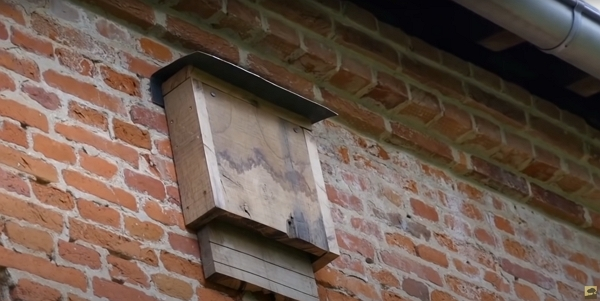

Crédits : image extraite du vlog de Damien.



### Exemple de triples nichoirs

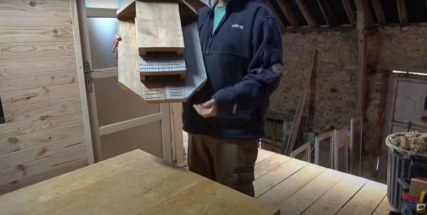

Comme un hôtel... mais pour chiroptères. Crédits : image extraite du vlog de Damien.

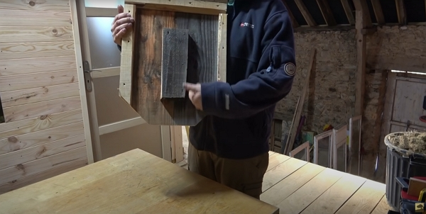

Crédits : image extraite du vlog de Damien.

### Où l'installer

Privilégier l'est ou sud-est, pour qu'elles reçoivent les rayons du soleil le matin, loin des vents dominants.

Aussi, installer loin des pollutions lumineuses (fenêtres, lampadaires, etc.).

### En quoi le nichoir a à avoir avec le potager

Les chauves-souris font partie de la biodiversité.

Par exemple, elles mangent les papillons qui peuvent donner naissance à des chenilles, mangeurs de choux.

Elles aident à réguler la population d'insectes et les chauves-souris sont malheureusement impactées par les pesticides... comme beaucoup !

Créer des nichoirs permet (re) créer un habitat pour ces animaux utiles où nous, les hommes, avons très souvent détruit leur maison d'autant.



Chez moi, l'été surtout, on voit voler quasiment tous les soirs, pas trop chaud, je crois, des chauves-souris.

Elles volent plutôt bas et on entend leurs petits cris.

Malheureusement, nos chats ont réussi à en attraper 2, dont 1 a été relâchée avant de finir comme les musaraignes...



## *Truc 3* : Structure au potager

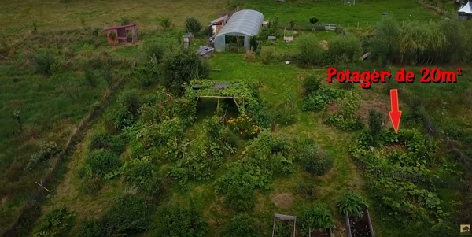

À droite, la flèche indique le potager de petite taille que Damien utilise pour motiver les gens qui ne peuvent pas avoir plus que 20 mètres carrés. Crédits : image extraite du vlog de Damien.

Avec _seulement 20 m²_, pensez en trois dimensions : on va faire grimper les végétaux.

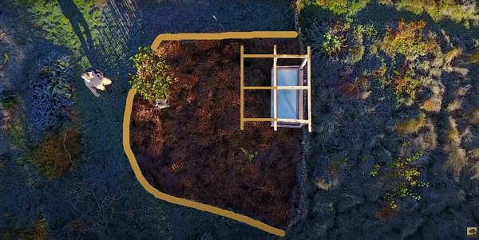

Crédits : image extraite du vlog de Damien.

Pour optimiser l'espace, Damien va :

- renforcer les clôtures pour qu'elles puissent supporter des végétaux grimpants
  - pour la clôture, Damien utilise :
    - des piquets de 2 m reliés par un câble métallique tous les 1.5 m environ (à vue d'œil 😁)
    - et de la ganivelle en bois de châtaigner de moins d'un mètre

- agrandir le toit du châssis à droite pour le même but. Le châssis sert pour les semis.

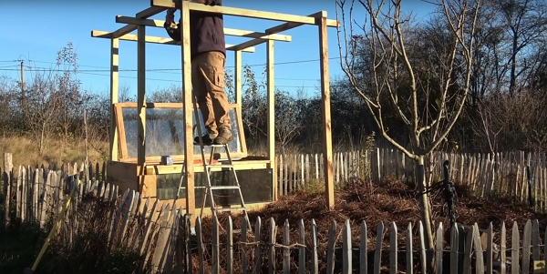

Pour les haricots grimpants, les concombres : le but est d'obtenir un toit végétal. Crédits : image extraite du vlog de Damien.

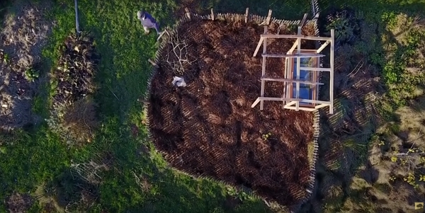

Crédits : image extraite du vlog de Damien.
