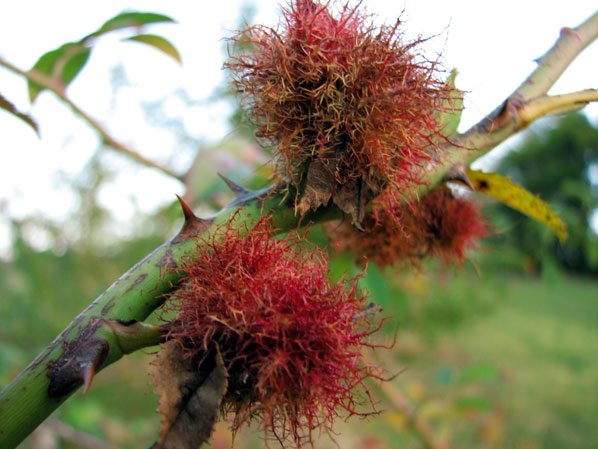

Merci à lui pour le partage de son savoir ! Cet article résume mes notes du vlog réalisé Par Christophe sur sa chaîne Altheaprovence.

<!-- more -->

Vous pouvez retrouver [la vidéo sur YouTube](https://www.youtube.com/watch?v=jdNDboKaa7A).

## Variétés sauvages très nombreuses

On trouve entre autres :

- la _rosa agrestis_, ou le rosier des haies.
- la _rosa arventis_ ou l’églantier des champs.
- la _rosa canina_, ou le rosier des chiens, la plus connue.
- la _rosa cinnamomea_, ou le rosier de mai ou le rosier cannelle.
- etc.

La bonne nouvelle est que toutes les variétés sont comestibles et médicinales.



Il s’agit d’une espèce rare et protégée en France.



## Utilisation de la fleur

On peut récolter les pétales aux environs du mois de mai ou juin.

On les fera sécher avant de les stocker dans un sac en papier.

C’est un gros travail de récolte, surtout quand on respecte la plante pour ne pas lui prendre toutes les fleurs.

Il faut respecter la flore sauvage.

Les pétales contiennent une combinaison de flavonoïdes et de tanins qui donnent des propriétés :

- antiinflammatoires
- protectrices de la peau et des muqueuses
- astringentes

La propriété tonifiante des tissus (par les tanins) et adoucissante (par les flavonoïdes) nous confère une action 2 en 1 intéressante.

Autrement dit, les pétales ont un effet asséchant et rafraichissant.

Pour toute inflammation, les pétales seront utiles : par exemple, pour la gorge, les gencives, les ulcères.

Le problème de cette utilisation est la quantité de pétales nécessaire : 20 g par litre.

Christophe suggère plutôt l’utilisation plus simple pour les mêmes actions :

- avec de la feuille de ronce et de camomille matricaire.
- avec des feuilles de noisetier avec des fleurs de mauve.



En macérat huileux, Christophe trouve l’utilisation des pétales plus adaptée, car cela ne demande que peu de pétales.

On utilisera une huile végétale bio et on laissera macérer 4 à 6 semaines avant de filtrer.





En combinaison avec les sommités fleuries d’aubépine, les pétales infusés se révèlent efficaces dans des moments difficiles émotionnellement.



Enfin, l’eau de rose, hydrolat des pétales, s’utilise plus pour la tonification de la peau.

Et on mentionnera l’huile essentielle de rose qui est très chère, car cela requiert 5 tonnes de pétales pour un kilogramme d’huile…

## Utilisation du bédégar

Crédits : image extraite du site orchidee-poitou-charentes.org.

On la nomme aussi la _barbe de Saint-Pierre_ et il se développe à cause de la présence d’un parasite dans la plante.

Ils sont très riches en tanins et les anciens l’utilisaient pour les saignements forts.

## Utilisation des bourgeons

Christophe n’entre pas dans le détail sur cette utilisation.

Pour plus de détails, je vous invite à [lire l’article que j’ai réalisé sur le cynorhodon](../le-rosier-sauvage-bourgeons-et-cynorhodons/index.md#gemmothérapie) sur les bases des vlogs d’un autre Christophe, auteur du Chemin de la Nature.

## Utilisation du cynorhodon

Il s’agit du faux fruit, ou le réceptacle de la fleur.

Les vrais fruits se trouvent sous cette peau rouge et se nomment les akènes.

### Que contient-ils

Le cynorhodon est riche en :

- flavonoïdes
- vitamine C
- caroténoïdes

Toutes ces substances vont contribuer à l’amélioration immunitaire et on utilise le cynorhodon en prévention pour les personnes avec une immunité un peu faible.

### Préparations

Sous forme de confiture ou de gelée, les propriétés des cynorhodons se conservent d’après des études réalisées sur le sujet.

Autrement, on peut faire sécher les cynorhodons entre 30° et 40° au four ou sur un déshydrateur.

Pour préparer le cynorhodon, il faut privilégier les méthodes qui permettent de conserver au maximum la vitamine C, sans en faire une obsession.



Avec 50 g de faux fruits séchés, il réalise les étapes suivantes :

- mettre les cynorhodons dans 1 litre d’eau froid à macérer une nuit
- le lendemain, séparer l’eau et les cynorhodons
- écraser les cynorhodons
- remettre les cynorhodons et l’eau ensemble
- faire chauffer à 80° max.
- dès les 80° atteints, laisser infuser 15 min à couvert
- passer le mélange à travers un filtre à café non blanchi ou un tissu en coton fin
- consommer ce liquide pendant les 2 jours qui suivent.



### Consommation des faux fruits frais

Il faut simplement couper le cynorhodon en deux, éliminer les akènes et les poils avant de mâcher longuement la chaire rouge.

On peut aussi tout consommer, akènes et poils inclus.

Les poils possèdent un effet antiparasitaire contre les oxyures.

Les poils démangent sur la peau, toutefois ils ne démangent pas dans le système digestif.



On disait aux enfants de manger 5 ou 6 cynorhodons crus et entiers pour plusieurs jours d’affilé pour supprimer les vers.



### Renforcement et adoucissant

Comme les cynorhodons contiennent des tanins condensés, ils viennent agir sur les veines.

La pectine contenue dans les cynorhodons vient adoucir les conditions diarrhéiques.

De même, les inflammations urinaires peuvent être traitées par le cynorhodon, avec des combinaisons avec d’autres plantes pour ajouter des effets antibactériens.

### Actions sur les inflammations articulaires

En combinaison avec la feuille de frêne ou feuille de cassis ou les sommités fleuries de reine des prés, le cynorhodon vient aider les articulations douloureuses.

### Huile de rose musquée

En pressant les akènes, on obtient la fameuse huile.

Elle est très chère dans le commerce en provenance du Chili.

Bien sûr, il faudrait un petit pressoir pour la réaliser chez vous.

## Précautions

Il n’y en a aucune donc allez-y.



Les rameaux sont équipés d’épines, mais personnellement, c’est moins compliqué avec l’églantier qu’avec la ronce 😅



## Conclusion

Voilà, cela conclut mes notes sur l’églantier ou le rosier sauvage.

Encore une fois, [l’article](../le-rosier-sauvage-bourgeons-et-cynorhodons/index.md#gemmothérapie), que j’ai réalisé sur le cynorhodon sur les bases des vlogs d’un autre Christophe, auteur du Chemin de la Nature, complétera bien celui-ci.

Et comment toujours, pour ne rien rater...



Assurez-vous de [me suivre sur X](https://x.com/LitzlerJeremie), de [vous abonner à ma publication Substack](https://iamjeremie.substack.com/) et d’ajouter mon blog à vos favoris pour ne pas manquer les prochains articles.


