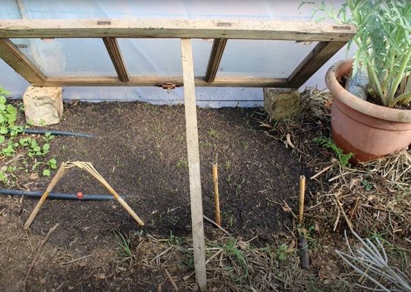

En janvier, la température est trop basse et la luminosité très faible pour planter quoi que ce soit. Olivier nous explique sa stratégie.

Merci à Olivier pour le partage de son savoir ! Cet article résume mes notes du vlog réalisé par Olivier sur sa chaîne _Le Potager d'Olivier_.

<!-- more -->

Vous pouvez retrouver [la vidéo sur YouTube](https://www.youtube.com/watch?v=VHHPJaZKeHk).

<!-- markdownlint-disable MD033 -->

<iframe class="newsletter-embed" src="https://iamjeremie.substack.com/embed" frameborder="0" scrolling="no"></iframe>

## Température

En janvier, on est très loin des températures de germination.

Pour information, d'après [La Ferme de Sainte-Marthe](https://www.fermedesaintemarthe.com/les-besoins-des-semences-pour-bien-germer-p-7695), voici les températures minimales du sol à respecter au moment du semis pour les principales espèces :

> - 8 à 10 °C : épinard, oignon, radis.
> - 10 à 12 °C : carotte, chicorée, chou, laitue, petit pois.
> - 15 à 18 °C : céleri, cornichon, haricot, melon, tomate.
> - 18 à 20 °C : aubergine.

Le risque de gèle est toujours important en janvier et les semis n'y résisteraient pas.

:::tip Note personnelle Quand je vois la vidéo d'Olivier, je vois une contradiction avec Damien, surtout dans [ces notes que j'ai prises](../que-faire-au-jardin-en-janvier-damien-dekarz/README.md#planter-lail).

Damien dit _On peut planter l'ail_, Olivier attend février ou mars pour l'ail, fève, pois pour en semer en pleine terre.

Quand je vois mes fèves et mon ail sortis il y a 3 semaines, je vais sûrement les couvrir avec une sorte de _tente hivernale_ réalisée avec une toile d'hivernage.

On verra ce que ça donne et je vous donnerai un retour d'expérience en septembre. :::

## Luminosité

La luminère est indispensable, dès que la plante sort du sol.

Entre janvier et février, on a déjà 1h de différence.

## Semer en janvier, oui, mais sous abris

Ce qu'il vous faudra pour semer en janvier :

- une serre principale, type _tunnel_ ou _maisonnette_.
- un châssis comme montrer ci-dessous.
- utiliser des graines de variétés précoces (pour la carotte, il y a la variété _Touchon_ ou _Napoli F1_).

La serre est indispensable d'après les échanges et les expériences des différents jardiniers présents sur [Terra Potager](https://terra-potager.com/).

Olivier a mentionné d'utiliser de la lumière artificielle pour _recréer_ les conditions naturelles.

Je ne suis pas trop pour. Pourquoi ?

Car il faut chauffer et avec les coûts de l'énergie en 2023, je me demande si Antoine Le Potagiste va continuer.

En fait, la plupart commencent vraiment en février le vrai travail de semis.

On ne gagne pas forcément de temps en lançant des semis en janvier.

## Conclusion

Donc, patience et ne gâchez pas vos graines en janvier.

Conservez-les et elles produiront la nourriture que vous attendez dans quelques mois.

:::center ⏬⏬⏬ :::

<!-- markdownlint-disable MD033 -->

<iframe class="newsletter-embed" src="https://iamjeremie.substack.com/embed" frameborder="0" scrolling="no"></iframe>

