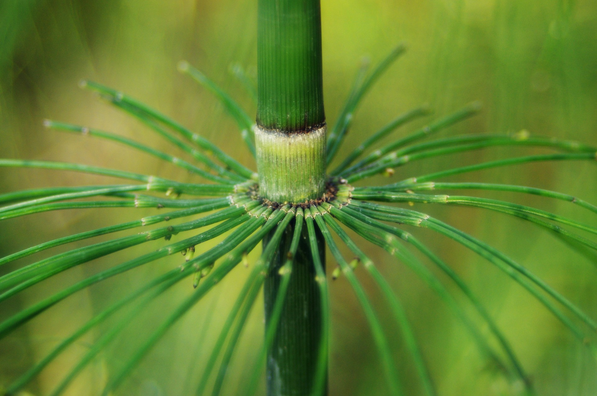

La prêle se trouve dans les zones humides et j'ai le bonheur d'en avoir juste à côté de chez moi. Nous l'utilisons pour le jardin et la santé. Dans ce dernier domaine, Christophe nous détaille son usage.

Merci à Christophe pour le partage de son savoir ! Cet article résume mes notes du vlog réalisé par Christophe sur sa chaîne Altheaprovence.

<!-- more -->

Vous pouvez retrouver [la vidéo sur YouTube](https://www.youtube.com/watch?v=0mV62iU0ZDg).

## Exploration botanique

La prêle appartient à la famille des _equisetacées_ et on les qualifie de plantes primitives.

Pourquoi ? Parce que la plante se trouve sur Terre depuis très longtemps.

Celle dont on parlera ici se nomme _Equisetum arvense_ ou prêle des champs.

Vous trouverez aussi la prêle des marais (_Equisetum palustre_), la prêle d'hiver (_Equisetum hyemale_), la grande prêle (_Equisetum telmateia_) et bien d'autres.

:::warning Toxicité Pour les distinguer les unes des autres, cela ne revèle pas si facile que ça, surtout que certaines sont toxiques, en particulier la grande prêle et la prêle des marais.

Nous verrons plus comment les distinguer, principalement pour utiliser les non toxiques. :::

### Structure

Elle est composée d'emboitements de tubes les uns dans les autres.

En début de printemps, les tiges fertiles sortent en premier. En effet, ces tiges contiennent des spores (comme les champignons) qui permettront à la plante de se multiplier.

Ces tiges apparaissent brunes ou rougeâtres, car elles n'ont pas d'utilité chlorophyllienne.

Ensuite, elles disparaissent pour laisser place aux tiges stériles qui persisteront tout l'été.

Les tiges stériles sont de couleur verte, car celles-ci ont bien une fonction chlorophyllienne.

Au-dessus de chaque emboitement, vous trouvez une gaine (que l'on voit très bien dans l'image ci-dessus).

À ce même niveau, on trouve une couronne et un verticille d'où partent des tiges secondaires, avec une structure identique à la tige principale, mais beaucoup plus fine.

On nomme aussi chaque tube d'une tige secondaire un article.

## Comment distinguer la prêle des champs des autres prêles

:::tip Article de Christophe Je ne vais pas répéter en détail ce que Christophe décrit déjà dans [un de ses articles à lire ici](https://www.altheaprovence.com/reconnaitre-prele-champs/). :::

### Le premier _article_

Il doit être plus long que la gaine, c'est-à-dire la hauteur de la partie plus claire séparant chaque tube de la tige principale.

Si c'est le cas, alors vous avez trouvé la prêle des champs.

### La coupe de la tige secondaire

Si vous coupez la tige secondaire, on découvre une section en étoile à 4 pointes.

### Le nombre de tiges secondaires par verticilles

La prêle des champs en compte en général de 9 à 13, alors que la grande prêle en a beaucoup plus.

## Où la trouver

Elle se trouve dans un endroit humide, donc on fera attention au lieu de récolte pour éviter les zones polluées.

On pense que les rhizomes peuvent descendre à plusieurs mettre de profondeur.

:::note Pour la petite histoire... En Amérique du Nord, les Indiens utilisaient la prêle pour déceler l'eau souterraine. :::

L'enlever du jardin, si elle s'est installée, se révélera difficile. Toutefois, il ne semblerait pas faire concurrence aux autres plantes comme le chiendent...

## Plus de détails sur la toxicité

Elle provient des observations par le passé, en particulier chez les chevaux qui en consommeraient plus d'un kilogramme par jour pendant 1 à 2 semaines et succomberaient de la toxicité des mauvaises prêles.

Toutefois, les événements datent du début des années 1900 et les rapports ne sont pas clairs.

## Quels constituants sont toxiques ?

Au départ, on a pensé à la _palustrine_ (prêle des marais), mais aujourd'hui la _thiaminase_ apparaît être la cause du problème.

La thiaminase correspond à une enzyme qui dégrade la thiamine, ou vitamine B1. Au final, cela engendre une carence en vitamine B1 et les symptômes chez l'animal intoxiqué sont :

- une grande faiblesse,
- une perte de poids,
- une mauvaise coordination,
- une perte de contrôle musculaire.

Avec la chaleur, la thiaminase serait détruite, mais il semble que cela dépende du type de thiaminase.

:::tip Chaleur dans l'eau vs chaleur sèche Une préparation sous forme d'infusion de l'eau à 100°C, la thiaminase serait détruite au passage.

Toutefois, le séchage ne détruit pas la thiaminase. Par contre, sous forme sèche, les autres nutriments utiles de la prêle seraient alors plus assimilables qu'en infusion. :::

### Conclusion

La plante est utilisée depuis très longtemps et jamais aucun problème a été observé chez l'homme, en particulier pour la consommation de la prêle des champs.

Bien sûr, on restera attentif à ne pas abuser comme c'est le cas pour toute plante médicinale.

Connaître les bénéfices et inconvénients d'une plante, son histoire, permet de peser le pour et le contre.

On ne consommera pas de la prêle sur la longue durée et la complémentera avec de l'ortie par exemple, elle aussi riche en minéraux.

Enfin, et simplement, éviter les autres prêles.

## Quel usage

La prêle des champs reconstruits, elle restructure la personne.

Comment ? À travers la régénération par le collagène. En effet, la plante est riche en silicium.

Sans silicium, le collagène ne peut pas se former.

Le collagène se trouve dans tous les tissus.

### Riche en minéraux

La plante est gorgée d'eau et elle _pompe_ avec grande efficacité les minéraux du sol.

Elle est très connue pour sa haute teneur en silicium. Toutefois, certains disent que le silicium de la prêle ne serait pas si absorbable qu'on l'entend dire. [Voir plus bas](#teneur-en-silicium-dans-la-prele).

Les autres minéraux présents dans la prêle sont le calcium, le potassium, le magnésium, le phosphore pour ne citer que les plus connus.

==15 à 20 % de sa matière sèche sont des minéraux.==

Si vous machez la prêle fraise, vous aurez comme l'impression de manger du sable très très fin.

Elle contient aussi :

- de la vitamine C
- des oligoéléments comme le zinc, le manganèse, du chrome
- de nombreux [flavonoïdes](https://fr.wikipedia.org/wiki/Flavono%C3%AFde)
- des [phytostérols](https://www.passeportsante.net/fr/Nutrition/PalmaresNutriments/Fiche.aspx?doc=phytosterols_nu)

Pour simplifier, on retiendra le silicium pour le minéral le plus important dans la plante.

### Importance du collagène

Il s'agit d'un élément clé pour notre corps, représentant 25% de la masse protéique.

Il en faut pour :

- les os
- les cartilages
- les tendons
- les muscles
- la peau
- les ongles
- le tissu pulmonaire
- la paroi des vaisseaux sanguins
- les muqueuses

### Comment la prêle peut aider

Dans le cas des problèmes au niveau de ces tissus, lorsqu'ils sont abimés, enflammés et cassés, soit suite à un accident, soit dû à une situation chronique, la prêle et ses constituants se révèlent d'une grande aide.

### Pour les artères

:::note Par exemple La rigidité des artères pourrait être freinée avec un meilleur apport en silicium pour apporter plus d'élasticité à celles-ci.

En effet, le silicium est nécessaire pour créer le collagène et l'élastine qui compose les artères.

On peut le vérifier chez l'animal. La prise du silicium agit comme un agent anti-plaque. :::

### Pour les inflammations articulaires et les os

La supplémentation par la prêle vient reformer et reconstruire les tendons, les joints et les ligaments douloureux.

C'est idem pour les os qui deviennent fragiles avec l'âge. C'est toutefois aussi vrai pour booster la réparation de l'os, suite à une fracture ou fêlure.

### Pour la peau et les cheveux

Le silicium intervient encore dans la qualité de la peau, des ongles et des cheveux. Voilà pourquoi si vous avez des problèmes de cheveux cassants ou des ongles cassants, le silicium renforce.

Pour la peau, les pathologies, comme l'eczéma, profitent du silicium de la prêle. Une application interne ou externe est réalisable selon la situation.

:::tip Refermer les plais difficiles à se refermer Par une simple décoction, de vieux ouvrages rapportent des effets prouvés de l'action du silicium pour réparer la peau. :::

### Pour les muqueuses

On retrouve le même effet bénéfique :

- les muqueuses digestives ulcérées,
- les problèmes de gencives
- les poumons pour calmer les saignements dus à la tuberculose.
  - le cilice de la prêle aide le tissu pulmonaire à se reconstruire et peu à peu à calmer la situation.

Cette très ancienne utilisation de la prêle pour ses propriétés hémostatiques se révèle aussi utile pour les saignements de nez ou d'hémorroïdes.

:::warning Consulter d'abord pour connaitre la cause des saignements Masquer les saignements n'est pas toujours une bonne idée et le problème racine a peut-être besoin d'une autre action. :::

<!-- markdownlint-disable MD033 -->

:::note Une autre plante <i>cousine</i> L'ortie aide une peu de la même façon. Je reviendrais longuement sur l'ortie. Christophe Bernard, d'Altheaprovence, et Christophe De Hody, du Chemin de la Nature, en parlent dans bon nombre de vidéos (21 en tout). :::

### Pour des effets diurétiques

Selon le site _Santé Magazine_,

> _Les médicaments diurétiques aident l’organisme à **éliminer davantage d’eau et de sel qu’en temps normal**. Ils agissent sur les reins, à des niveaux différents selon le type de diurétique et augmentent la production d’urine. Les reins sont, en effet, « programmés » pour filtrer la quantité d’eau et de sel nécessaire et veiller à leur bon équilibre dans l’organisme. Le médicament diurétique vient « modifier ces paramètres de régulation » [...]_
>
> Source : article [_Hypertension, insuffisance cardiaque : à quoi servent les médicaments diurétiques ?_](https://www.santemagazine.fr/traitement/medicaments/hypertension-insuffisance-cardiaque-a-quoi-servent-les-medicaments-diuretiques-443768)

Donc, Christophe indique que la prêle est consommée sous forme d'infusion.

Cela aide à nettoyer le système urinaire. Aussi, on retrouve la prêle pour les problèmes de prostate, comme une tonifiante.

## Teneur en silicium dans la prêle

On lit que le silicium de la prêle n'est pas très [biodisponible](<https://fr.wikipedia.org/wiki/Biodisponibilit%C3%A9_(m%C3%A9decine)>), c.-à-d. pas très assimilable et que seul un produit de laboratoire est efficace.

Que penser de tout ça ?

Oui, le silicium G5, le plus couramment vendu, est mieux biodisponible que le silicium de la prêle.

On pense que 10% du silicium de la prêle est biodisponible.

==Toutefois, peut-on en conclure que la prêle ne fonctionne pas et que le silicium en bouteille fonctionne à 100% ? Si oui, alors on se moque de siècles d'expérience !==

Qu'en est-il du jus de prêle pour éviter la polymérisation du silicium qui induit une perte d'efficacité ?

Peut-être c'est le cas. Mais le jus de prêle est généralement issu d'un laboratoire et, comme Christophe, ça m'embête aussi...

La prêle a fait ses preuves.

:::tip Parallèle avec la vitamine C Aurons-nous autant de vitamine C dans un petit bouquet de persil ou un kiwi que dans 3 ou 4 compromis de vitamine C naturelle concentrée ?

Bien sûr que non.

Mais, on peut varier et on ne dépend pas d'une forme de laboratoire. :::

Pour le silicium, en plus de la prêle, on peut utiliser l'ortie et la paille d'avoine.

Faites votre choix et décidez si vous voulez être dépendant ou l'inverse.

La prêle apporte plus que _juste le silicium_ : comme [décrit plus haut](#riche-en-mineraux), tous les autres constituants en font sûrement une meilleure option que les produits pharmaceutiques...

## Récolte et transformation

Toute la plante peut être ramassée.

Aussi, ne gardez pas la prêle dans vos sacs, car, malgré l'apparence _sèche_, la prêle est gorgée d'eau.

En effet, cela peut fermenter, surtout par journée chaude.

Donc étalez-la pour la sécher et stockez-la dans des sacs en papier après découpe.

## Préparations possibles

### Forme sèche

Vous moudrez la prêle sèche au moulin à café et tamiser la poudre.

:::warning Finesse du tamis Pour éviter d'avoir l'impression de sable dans la bouche, utiliser un tamis le plus fin possible. :::

On prend environ 1 g à 5 g par jour avec de la compote ou de l'eau pendant 3 semaines, espacées d'une pause.

Si nécessaire, on reprendra la cure, **si nécessaire**.

Pour des dosages plus importants, on le réalisera sur une courte durée. Christophe ne rentre pas dans les détails, car cela dépend de la situation.

:::warning Consulter d'abord pour connaitre la cause du problème :::

### En décoction

À raison de 20 g par litre,

- on laisse frémir 10 min
- on laisse reposer 20 min
- on filtre

On boit alors 1 à 2 tasses par jour.

Pour des situations plus aiguës, on augmentera le dosage de prêle à 40 g ou 50 g par litre.

Comme indiquer [plus haut](#pour-la-peau-et-les-cheveux), cette décoction peut être utilisée en externe. Dans ce cas, assurez-vous qu'elle soit bien concentrée : on parle de 1 kg de prêle fraiche (ou 185 g de prêle sèche à 85 % d'humidité) par litre.

Si vous n'en avez pas autant, à 50 g de plante sèche, cela fera l'affaire.

D'après Mickaël Moore, l'infusion et décoction donne le même résultat.

:::tip Infusion vs décoction L'infusion chaude consiste à faire bouillir de l'eau avant de la verser sur la plante, puis de laisser la plante dans cette eau quelques minutes. La décoction consiste à plonger la plante dans l'eau bouillante et à maintenir l'ébullition quelques minutes.

Source : [Arcadie.fr](https://www.arcadie.fr/blog/infusion-decoction-maceration-difference/#:~:text=L'infusion%20chaude%20consiste%20%C3%A0,maintenir%20l'%C3%A9bullition%20quelques%20minutes.) :::

## Précautions

Sous forme de poudre, ne prenez pas la prêle sur une longue durée pour éviter l'effet néfaste de la thiaminase.

[La _commission E allemande_](<https://www.vidal.fr/parapharmacie/utilisation/bon-usage-phytotherapie-plantes/informations-efficacite-plantes.html#:~:text=La%20Commission%20E%20allemande&text=Cette%20commission%20rassemble%20un%20panel,leur%20description%20d%C3%A9taill%C3%A9e%20(monographie).>) ne recommande pas la prêle en cas d'œdeme de type cardiaque ou rénal.

## Pour conclure

Avez-vous de la prêle chez vous ?

Savez-vous qu'elle est aussi, comme l'ortie, très utile au jardin ?

On en reparlera avec [Damien Dekarz](../../../tag/damien-dekarz).

En attendant...

:::center ⏬⏬⏬ :::

<!-- markdownlint-disable MD033 -->

<iframe class="newsletter-embed" src="https://iamjeremie.substack.com/embed" frameborder="0" scrolling="no"></iframe>

