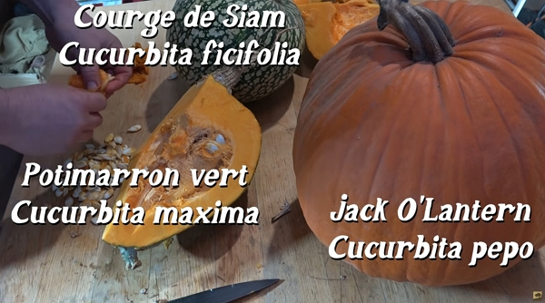
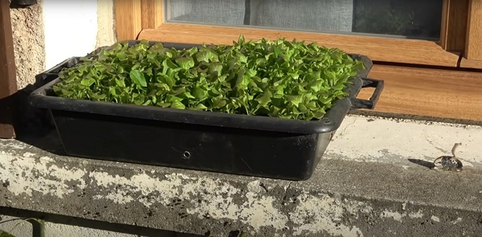
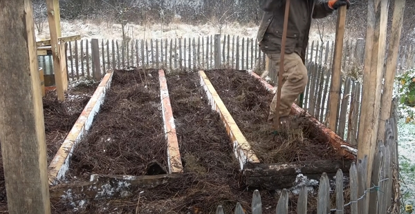
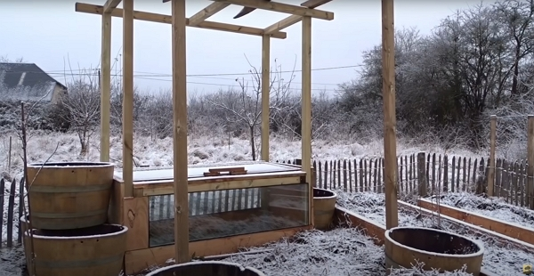
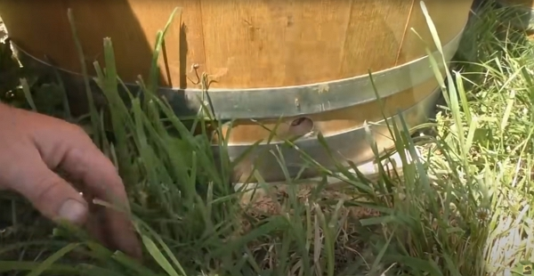
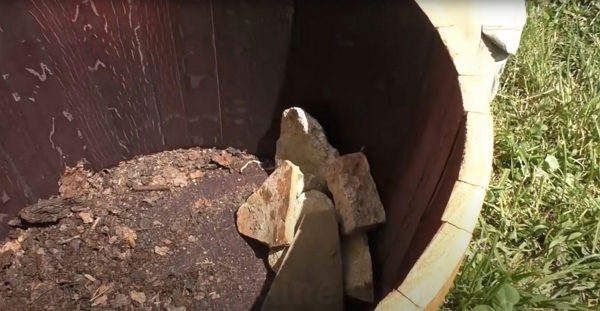
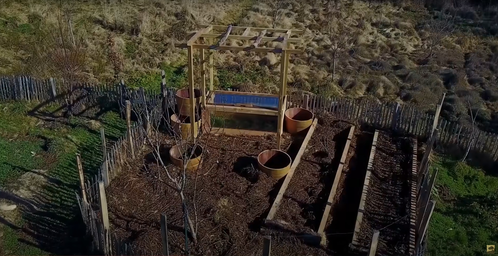
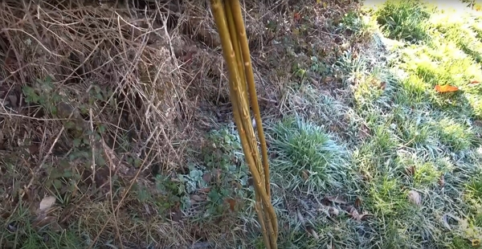

Merci à lui pour le partage de son savoir ! Cet article résume mes notes du vlog réalisé par Damien sur sa chaîne _Permaculture, agroécologie, etc_.

<!-- more -->

Vous pouvez retrouver [la vidéo sur YouTube](https://www.youtube.com/watch?v=VDvyGwyhFWc).

## Trois autres choses non décrites en détail dans le vlog

### Récupérer les graines de courges

Crédits : image extraite du vlog de Damien. Si vous avez encore des courges, récoltées l’automne dernier, récupérez les graines. Elles conservent 6 ans.

Les courges comme la _Jack O’Lantern_ (ou _Cucurbita pepo_), la _courge de Siam_ (ou _cucurbita ficifolia_) ou encore le _potimarron vert_ (ou _cucurbita maxima_) ne peuvent pas s’hybrider.

### Planter les semis de laitue

Crédits : image extraite du vlog de Damien.

Une fois que les températures sont positives, elles peuvent passer du temps dehors, au soleil.

On peut :

- les repiquer dans des godets
- les planter sous serre, si vous n’avez pas des températures trop basses la nuit.

### Tailler la vigne

J’ai pris des notes sur ce sujet l’année dernière et je dois formaliser mes notes dans un article.

## L’avancement dans le mini potager

Damien a décidé de créer des jardinières avec de vieilles poutres.

Crédits : image extraite du vlog de Damien.

Et avec d’anciens tonneaux coupés en deux, utilisés pour le vin, Damien improvise des pots.

Crédits : image extraite du vlog de Damien.

Il prépare les tonneaux de la façon suivante (en avril ou mai):

- il crée un tour à la base

Crédits : image extraite du vlog de Damien.

- il dispose des pierres autour du trou pour éviter que la terre bouche le trou

Crédits : image extraite du vlog de Damien.

- il remplit _en lasagne_ le tonneau de foin, ou une autre matière carbonée, de tonte et de terre ou compostée.

Voici une vue aérienne de potager de 20 m² : on remarque bien que toute la surface est couverte !

Crédits : image extraite du vlog de Damien.

## Bouturer les saules

Les saules peuvent se rendre utiles pour un bon nombre d’utilisations, que ce soit la vannerie ou pour le côté esthétique dans le jardin.

Par exemple, Damien, souhaite créer une sorte de tunnel d’ombre sur le chemin de la maison vers le jardin.

Quand les saules auront grandi, il connectera les branches ensemble.

Au-delà de ce tunnel, les saules produisent énormément de matières organiques : branches, feuilles, etc.

Pour reproduire un saule, Damien coupe simplement une branche et il la plante dans le sol. Rien de plus 😮

Si vous ne me croyez pas, allez voir à la minute [8:23](https://youtu.be/VDvyGwyhFWc?t=503).

Pour faire son arche ou tunnel, Damien dispose des saules de la même espèce de chaque côté du chemin. Cela permet, une fois chaque saule assez grand, de _resouder_ les 2 arbres en un seul.

Pour obtenir un arbre plus solide, on peut aussi prendre plusieurs branches plantées ensemble, entrelacées.

Crédits : image extraite du vlog de Damien.

L’objectif est d’arriver à ce résultat :

Crédits : image extraite du vlog de Damien.

Le saule est un arbre qui aime particulièrement les sols humides.

Pour des sols plus secs, cela peut fonctionner, mais il faudra bien l’arroser les premières années.

## Semer les aubergines, poivrons et piments

Damien partage sa technique sur le sujet, car régulièrement, il reçoit des commentaires de personnes pour qui ces cultures ne réussissent pas.

Pour les semis qui réussissent, suivez ces recommandations :

1. garder une terre chaude et humide, entre 20 °C et 22 °C.
2. réaliser ses semis longtemps en avance, car ces cultures sont des plantes à croissance lente
3. sortir les semis dans un châssis ou une serre la journée et les rentrer le soir.

Tant que les graines n’ont pas germées, il est même préférable de garder les semis dans le noir.
