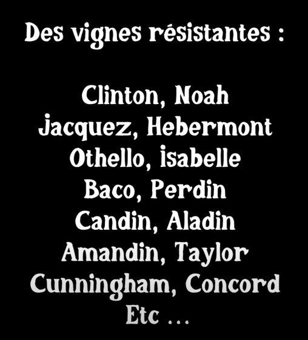
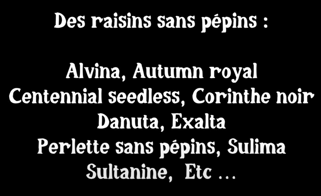
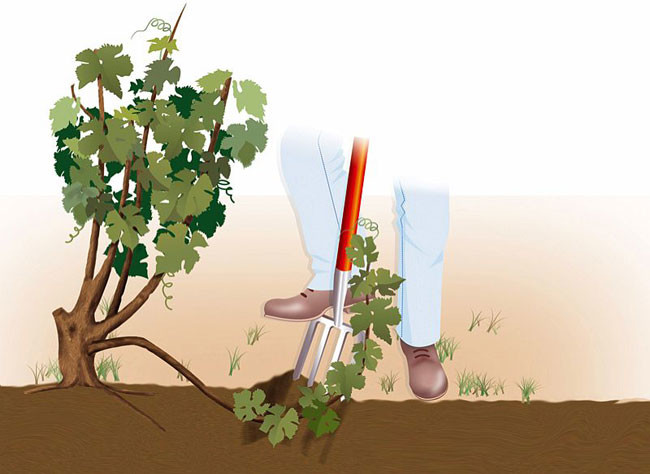

<!-- https://www.notion.so/jeremie-litzler/Taille-et-cultiver-la-vigne-5c5758f3c35a44a2962b589e23bcf418 -->

Damien nous explique tout sur le vigne, comment la cultiver, comment les tailler et quelles variétés sont à privilégier.

Merci à Damien pour le partage de son savoir ! Cet article résume mes notes du vlog réalisé par Damien sur sa chaîne _Permaculture, agroécologie, etc_.

<!-- more -->

Vous pouvez retrouver les vidéos sur le sujet :

- [La Vigne de A à Z (presque)](https://www.youtube.com/watch?v=YrjwJr4wCxA)
- [Comment tailler les vignes et pourquoi ?](https://www.youtube.com/watch?v=w0efTjemrFY)

## Pourquoi cultiver la vigne

Elle est résistante à la sécheresse ou la canicule.

Certains cépages sont résistants à toutes les maladies.

Elle peut être installée dans de grand jardin (+ de 20m²) mais elle peut être cultuvée dans de petits jardins.

## Informations générales

Le nom est Vitis vinifera.

Il s’agit de la famille dont sont issues la plupart des vignes cultivées aujourd’hui.

Les vignes domestiques ont commencé à être cultivées autour de l’Iran et la Georgie (il y a plus de 6000-7000 ans).

Elle a été introduit en Gaule en -600 AC.

Elle se trouve aujourd’hui sur tous les continents.

La vigne est autofertile.

## Les maladies

En 1800, il y avait beaucoup de vignes;

Vers 1845, un champignon, l’odium de la vigne, importé d’Amérique, est arrivé.

Il est présent quand il fait chaud est sec.

PS : l’odium de la vigne est spécifique à la vigne. Pas de risque de contamination interespèce (ex : vigne vs courgette).

On a trouvé 10 ans après le début de l’épidémie que le souffre permettait de combattre la maladie.

En 1860, un nouveau parasite (phyloxera : un petit puceron qui attaque les racines) est arrivé d’Amérique à nouveau.

Les vignes américaines étant résistances aux 2 maladies, le greffage sur vigne américaine fut adopter en priorité au plantage des vignes américaines sur le sol français.

Pour combattre le phyloxera, il y avait 2 solutions :

1. inonder le sol
2. faire pousser les vignes sur du sol sableu.

A noter : toutes les variétés de vitis vinifera n’étaient pas affectées. Par ex, vitis riperia et vitis rupestris étaient indemmes.

En 1878, un nouveau champignon, le mildiou de la vigne (apparaissant avec une météo chaud et humide) est arrivé d’Amérique.

C’est de là que vient le traitement à la bouillie bordelaise des vignes.

## Les vignes interdites

Comme la variété Noa ou la variété Bako, l’histoire du “vin fou” des vignes américaines circule.

Pourquoi ?

- pour privilégier la vente des produits souffrés et cuivrés pour traiter les vignes.
- pour préserver les vignes françaises

Voici la liste des vignes interdites, e.g. les vignes résistantes :

Il y a aussi les vigne sans pépins, pratique pour faire des raisins secs :

## Comment cultiver la vigne

On peut :

- la garder basse
- ou la faire grimper (sur un pergola par ex) afin de faire de l’ombre
- ou la faire courir

Il faut la planter :

- en hiver ou à l’automne dans le sud.
- après les gelées tardive, soit mars / avril plus au nord.

Elle aime bien :

- la terre dure et difficile.
- mais aussi les sol argileux et sableaux.

Cela dépendra du cépage.

Pour limiter la taille de la vigne, on la fait grandir en gobelet pour limiter le besoin en eau.

NB : la vigne peut pousser sous un noyer malgré la présence de [la juglone](https://fr.wikipedia.org/wiki/Juglon).

Les racines sont immenses, jusqu’à 5 m en surface et 20 m en profondeur.

## Comment tailler

En bref, ce n’est pas forcément nécessaire techniquement de tailler pour avoir une production.

Mais pour des raison pratiques (accessibilité des fruits), on taillera pour garder la plante accessible.

Mal tailler peut causer une non production.

La taille a lieu à la fin de l’hiver (février) à un moment où la taille fait pleurer la vigne;

:::tip Note personnelle 💡 Voir [cette vidéo pour le détail sur la taille](https://www.youtube.com/watch?v=w0efTjemrFY). :::

## Comment et quand la récolter

Les vitis vinifera produisent sur les bourgeons restants après la taille.

Au contraire, les vignes américaines peuvent produire sur les bourgeons qui viennen après une gelée très forte par exemple.

Le moment dépend de la météo et du cépage.

Faire courir sa vigne permet d’obtenir une récolte un peu plus étalée.

## Reproduction

C’est très simple pour les vignes américaines. Il suffit de planter un serment et le tour est joué. A tester chez soi.

C’est moins simple pour les vitis vinifera qui requiert des portes-greffe.

Il y a aussi la méthode du marcotage qui consiste à mettre une branche au sol partiellement recouverte de terre. La racine se déveleppera à partir de la partie enterrée.

## Consommation

En plus du vin et autres produits dérivés, les feuilles de vignes sont utilisées :

1. pour remplacer le papier sulfuré
2. pour consommer des plats farcies.
