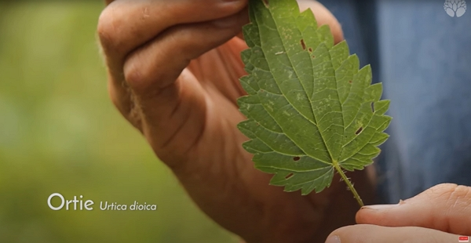

Merci à Christophe pour le partage de son savoir ! Cet article résume mes notes du vlog réalisé par Le chemin de la nature.

<!-- more -->

Vous pouvez retrouver [la vidéo sur YouTube](https://www.youtube.com/watch?v=Ys0-uMZwkSM).

Les grandes différences avec la grande ortie :

- la forme des feuilles:

 Comparez cette feuille à celle ci-dessus. Crédits : image extraite du vlog de Christophe sur le Chemin de la Nature.

- la taille : l’ortie brûlante dépassera rarement 30 cm comparés aux 2 mètres de la grande ortie.

De plus, l’ortie brûlante est :

- une plante annuelle, facilement déracinable, alors que la grande ortie est vivace.
- une plante monoïque c’est-à-dire qu’elle présente des organes mâles et des organes femelles sur le même individu.

Pour le reste, les propriétés culinaires et médicinales restent les mêmes que la grande ortie.
