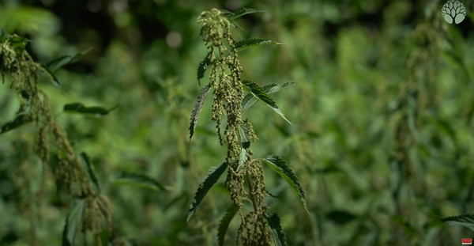
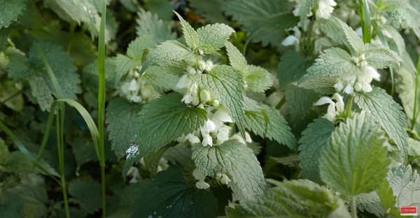
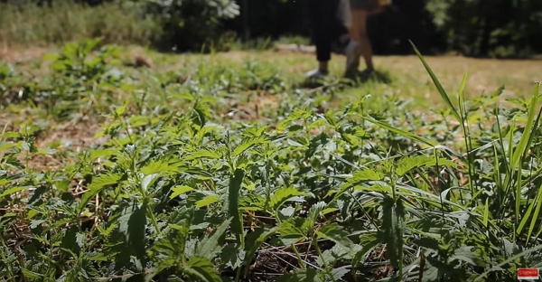
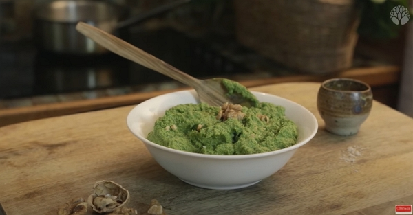
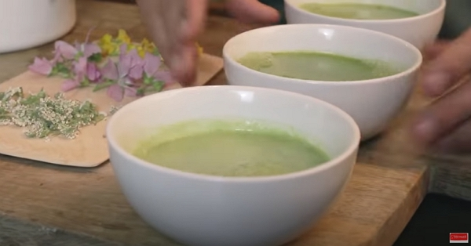
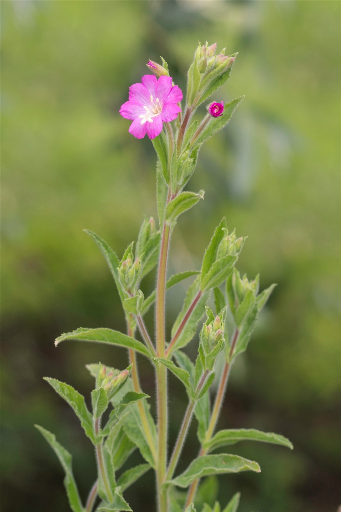

Merci à Christophe pour le partage de son savoir ! Cet article résume mes notes du vlog réalisé par Le chemin de la nature.

<!-- more -->

Vous pouvez retrouver les vlogs qui ont servi à cette prise de notes avec les liens ci-dessous :

- [L'ortie : tous ses secrets](https://www.youtube.com/watch?v=Jv6V7Dm27vE).
- [L'ortie et l'épilobe hirsute : 2 plantes pour les débuts de problèmes de prostate ! 🌱✅](https://www.youtube.com/shorts/flZU0w1PuQ8)
- [Cueillir l’ortie et la manger crue sur place](https://www.youtube.com/shorts/kgrJSPjIsU0)
- [Les propriétés médicinales de l’ortie](https://www.youtube.com/shorts/O2Wa9H2Yfs4)
- [L'ortie, une mauvaise herbe ? Non, un trésor !](https://www.youtube.com/watch?v=-TDi5MWY44s)
- [L'ortie, bombe nutritive](https://www.youtube.com/watch?v=H7xwINdEHYU)
- [L'ortie revient, bonne cueillette](https://www.youtube.com/watch?v=KNGCBwt5ECU)
- [Comment cueillir l'ortie sans se piquer](https://www.youtube.com/watch?v=V_Nx1Pb3cA0)
- [Comment distinguer l'ortie mâle de la femelle ?](https://www.youtube.com/watch?v=EZS2ja_jhQU)
- [L'ortie, Urtica dioïca, la reine des plantes sauvages](https://www.youtube.com/watch?v=mOZdqkCdp78)

## Botanique

L'ortie est une plante dioïque (_deux maisons_), c'est-à-dire qu'il y a des pieds avec que des fleurs mâles et des pieds avec que des fleurs femelles.

Pour reconnaître les pieds femelles, on cherchera des fleurs qui retombent.

Crédits : image extraite du vlog de Christophe sur le Chemin de la Nature.

Dans le cas des mâles, les fleurs sont dressées.

Vers le mois de mars, elle revient à la vie à partir des mêmes tiges, ou rhizomes, souterrains sur plusieurs années.



Les organes mâles s'appellent les étamines. Les organes femelles s'appellent les pistils



La feuille de l'ortie est très proche du lamier blanc (_Lamium album_), qui ne pique pas et surtout possède des fleurs blanches bilabiées.

Crédits : image extraite du vlog de Christophe sur le Chemin de la Nature.

### Pourquoi l'ortie pique

Les poils sont comme des petites serringues de calcium et de silice.

De ce fait, ces poils sont cassants et peuvent facilement rentrer sous la peau.

Les poils contiennent un liquide sous pression qui est relaché une fois le poil cassé.

Ce liquide crée l'inflammation, ou la sensation de piquant, et il contient entre autre :

- de l'histamine
- des leucotriènes
- de l'acetylcholine

## Consommer l'ortie

L'ortie pique beaucoup plus au printemps qu'à la fleuraison.

Et elle est beaucoup plus goûteuse quand elle pique le plus.

Crédits : image extraite du vlog de Christophe sur le Chemin de la Nature.

### Pesto, salades, _gaspatcho_...

Pour les salades, il faudra la hacher finement.

Pour les pestos, la méthode est similaire au pesto de basilic : huile d'olive, câpre, sel.

Crédits : image extraite du vlog de Christophe sur le Chemin de la Nature.

On peut aussi la consommer dans des _gaspachos_.

Crédits : image extraite du vlog de Christophe sur le Chemin de la Nature.

En l'ébouillantant 2 min dans de l'eau, elle se mange aussi très bien avec un filet d'huile d'olive.



J'utilise l'ortie beaucoup à l'automne dans les soupes.

Je les ajoute au dernier moment (pour préserver la vitamine C) sur les légumes bien chauds et avec une bonne quantité d'eau bouillante.

Je mixe ensuite le tout et tout le monde se régale !



### Les graines

Il est préférable de consommer les graines issues des fleurs femelles.

Les fruits issus des graines sont riches en lipides et minéraux.

On peut les manger sans se piquer comme pour les feuilles. Voir [plus bas.](#comment-cueillir-lortie-se-piquer-et-manger-crue)

### Les racines

Quand la fleuraison se termine, on se trouve au moment où il est optimal pour ramasser les racines.

L'ortie s'étend grâce à ses rhizomes, ou tiges souterraines.

Pourquoi ? Pendant la fleuraison, l'énergie de la plante est concentrée dans les fleurs et les tiges aériennes pendant la fleuraison et les racines deviennent plus concentrées en molécules actives après.

Ensuite, tout va se concentrer dans les racines.

On utilise les racines pour les problèmes de prostates.

Une bonne plante accompagnante est l'épilobe hirsute pour traiter les mêmes troubles de la prostate.

On peut utiliser l'intégralité de la plante. Crédit : [Préservons la nature](https://www.preservons-la-nature.fr/flore/taxon/395.html).

La préparation en décoction permet d'extraire au mieux les propriétés de la racine.



- 1,5 g de racines dans 150 ml d'eau

Laisser bouillir 1 min Laisser infuser 15 min

Boire plusieurs tasses dans la journée sans dépasser 4 à 6 h de racines par jour.



ou

 Laisser pendant 3 semaines 100 g de racines fraîches avec 200 ml d'alcool à 55 % mini à macérer.

Consommer 20 à 30 gouttes, trois fois par jour, diluées dans un peu d'eau.



ou



Laisser pendant 3 semaines 100 g de racines fraîches avec 500 ml d'alcool à 45 % mini à macérer.

Consommer 20 à 30 gouttes, trois fois par jour, diluées dans un peu d'eau.



### Les feuilles

L'ortie est très connue pour :

- les problèmes ostéoarticulatoires,
- les inflammations,
- les allergies
- les infections de peau (comme l'acné) ou les petites blessures
- et elle est diurétique.





C'est au printemps que les propriétés médicinales sont optimales : les jeunes pousses sont concentrés en minéraux et vitamines.

### Les fibres

On peut utiliser les fibres des tiges pour réaliser des ficelles ou même des vêtements.

## Comment cueillir l'ortie se piquer et manger crue

C'est possible, oui !

Les étapes sont :

- prendre une tête par le dessous.
  - pourquoi la tête ? C'est la partie la plus tendre et la plus délicate au goût.
- avec les doigts, on écrase légèrement l'extérieur des feuilles contre les tiges puis on la roule entre les doigts
  - pourquoi ? Cela _casse_ les piquants de l'ortie.

Pour la démonstration, [allez visionner le court vlog de Christophe](https://www.youtube.com/shorts/kgrJSPjIsU0).



Vous vous piquerez sûrement les doigts, mais pas la bouche.



## Riche en protéines

Sur des plantes du printemps, on trouve jusqu'à 40 g pour 100 g de protéines.

Apparemment, ces protéines sont équilibrées, c'est-à-dire avec la présence des 8 acides aminés essentiels, équivalent aux produits animaux.

## Riches en nutriments

On trouve toute l'ortie :

- presque tous les minéraux, dont :
  - la silice
  - le fer (facilement assimilé grâce à la vitamine C).
  - le calcium
  - le magnésium
- presque tous les oligo-éléments
- beaucoup de vitamines :
  - provitamine A,
  - vitamine B,
  - vitamine E,
  - vitamine C.

Au printemps, la cure d'ortie vient nettoyer le corps des polluants, de toutes les sources possibles, accumulés pendant l'hiver.

L'ortie s'agit sur la globalité du corps, c'est-à-dire une _plante adaptogène_.
