Merci à Barnabé pour le partage de son savoir et de ses astuces ! Cet article résume mes notes du vlog réalisé par Barnabé sur sa chaîne _Energie autrement_.

<!-- more -->

Vous pouvez retrouver [la vidéo sur YouTube](https://www.youtube.com/watch?v=-siM1AVqB2g).

## Étape 1 : Cultiver le sarrasin

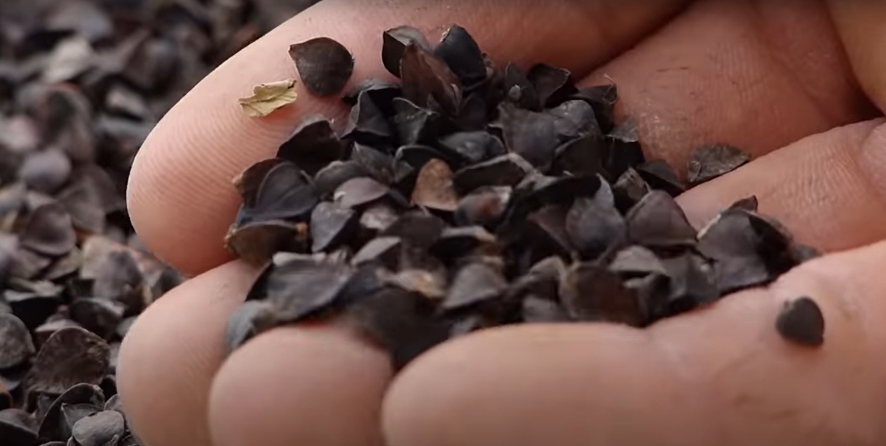

Crédits: image extraite du vlog de L’énergie autrement.

### À la fin du printemps

Barnabé prend une petit partie de la récolte de l’année précédente pour l’année à venir.



Je pense qu’il a utilisé du sarrasin décortiqué d’un magasin bio pour démarrer ;)



Le sarrasin pousse très bien sur des sol pauvre et nécessite aucun engrais ou pesticide.

Barnabé le sème dans des sillons espacés de 30 cm environ sur une surface d’environ 10 m².

### 15 jours plus tard

Les plants sortent.

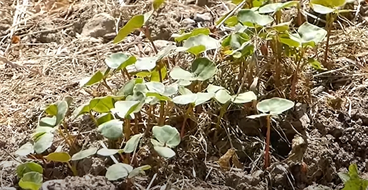

Crédits: image extraite du vlog de L’énergie autrement.

### Au bout d’un mois

On en là :o

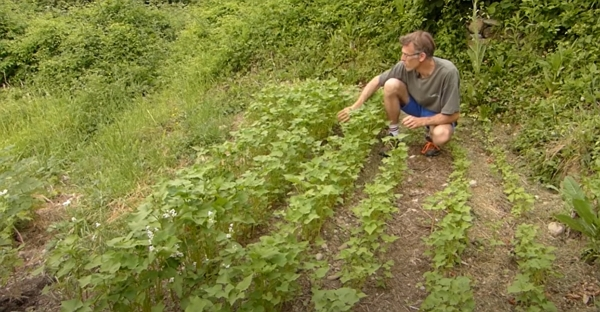

Crédits: image extraite du vlog de L’énergie autrement.

Quand la fleuraison arrive, on voit bien les 5 pétales.

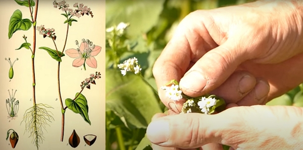

Crédits: image extraite du vlog de L’énergie autrement.

Les pollinésateurs sont alors ravis !

La plante montent bien au-delà de 1.5 m.

### Après les fleurs

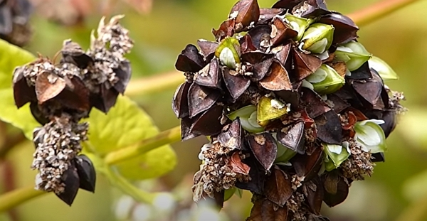

Crédits: image extraite du vlog de L’énergie autrement.

### La récolte et le sèchage

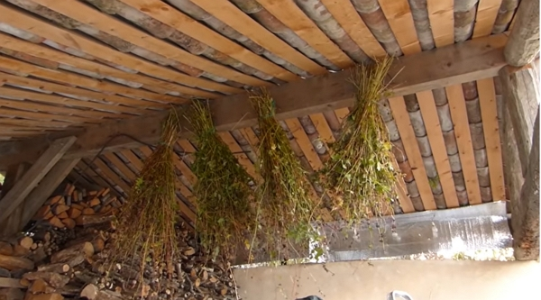

Crédits: image extraite du vlog de L’énergie autrement.

S’il pleut trop à la fin de la croissance ou que les plants ne sèchent pas sur place, coupez-les et les pendez-les la tête en bas.

Au bout de quelques semaines, les graines pourront être séparées facile de la tige.

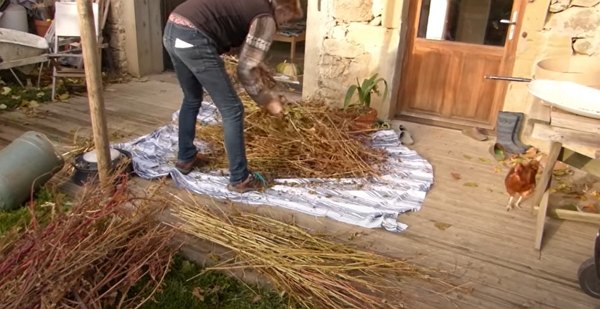

Crédits: image extraite du vlog de L’énergie autrement.

Faites-le sur un drap :)

La paille obtenue à partir des tiges et feuilles est un déchet utile au jardin !

### Décortiquer les graines

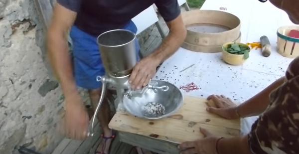

Crédits: image extraite du vlog de L’énergie autrement.

Barnabé suggère d’utiliser un _moulin à céréales manuel_ ou _moulin à grains broyeur_ pour environ 33 euros (les prix ont sûremenet évoluer par rapport à la date de la vidéo…).

Avant de passer les graines au moulinn Barnabé souffle gentillement sur le mix de grains et de déchets pour supprimer les parties plus légères.



J’ai utilisé la même technique pour des lentilles vertes il y a 2 ans.



Ensuite,

- il passe en général deux fois les grains dans le moulin.
- il tamise avec un gros tamis pour séparer le gros de la bale de la farine.
- il tamise avec un tamis plus fin.
- il pilonne le reste des grains trop gros qui ne seraient pas passés dans le tamis pendant une dizaine de minutes.
- il passe au tamis fin le reste de farine. À la farine, aucune perte !

## Étape 2 : préparation de l’accompagnement

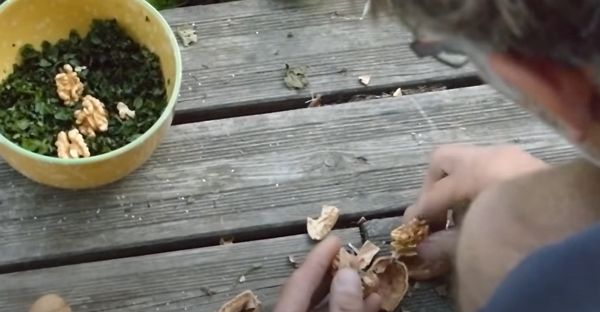

Crédits: image extraite du vlog de L’énergie autrement.

Il faut simplement ramasser des orties fraiches et casser quelques noix pour préparer un pesto improvisé et délicieux.

On découpe les orties finement dans un bol, puis on ajoute les noix et on pilonne le tout.

## Étape 3 : préparation de la pâte et cuisson

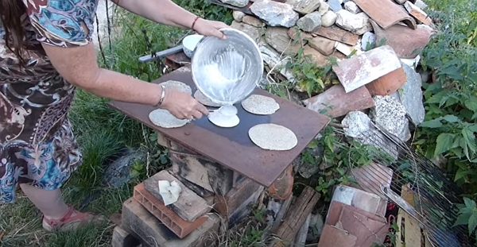

Crédits: image extraite du vlog de L’énergie autrement.

Barnabé n’utilise pas d’œuf, mais d’expérience, ça simplifie la tenue. Idem pour l’huile.

Il a fait cuire ses galettes sur une plaque en acier chauffé par un poêle dragon improvisé ! J’ai hâte d’en construire cet été !

## Étape 4 : dégustation

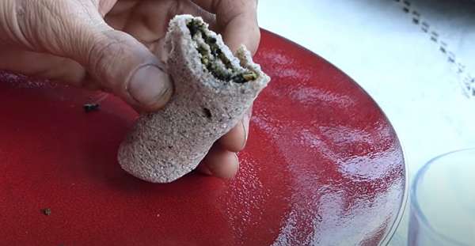

Crédits: image extraite du vlog de L’énergie autrement.

Il n’y a plus étaler le pesto et se régaler 😋

Vous avez aimé ? [Abonnez-vous à la chaîne de Barnabé](https://www.youtube.com/channel/UCg7HRuQ93hl9v8dTSt_XDHA) !
