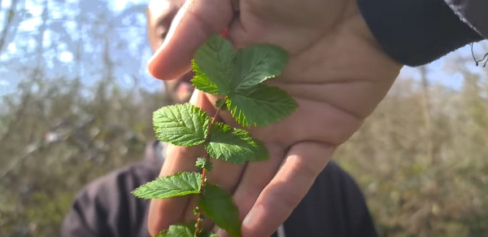
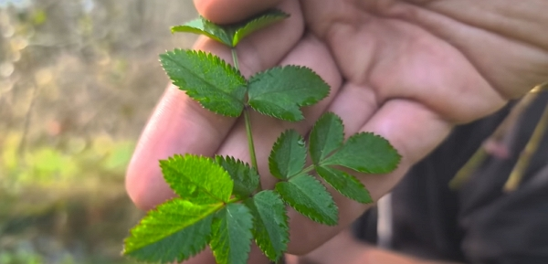
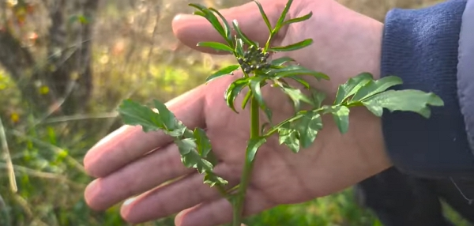
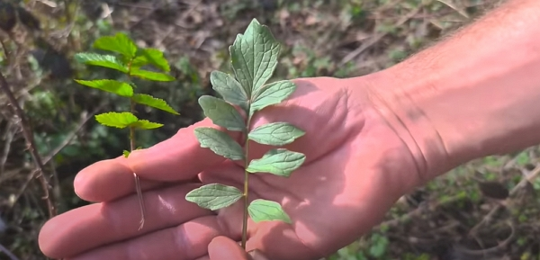
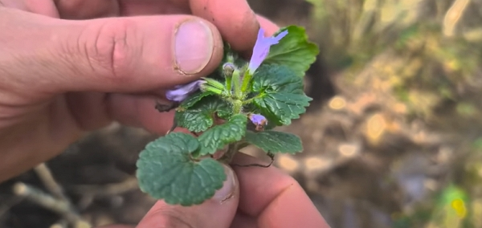
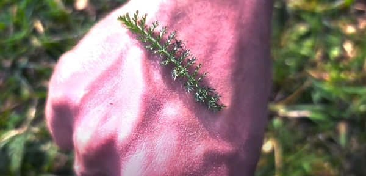
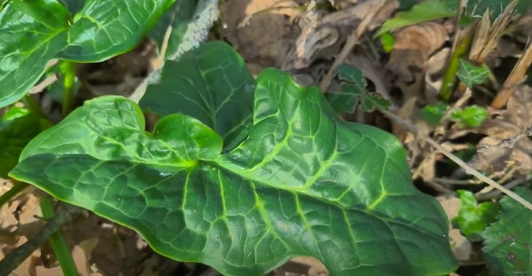

Merci à Brian et [Rémi du jardin d’émerveille](https://www.youtube.com/channel/UC9Q8WeyCb3yxySC3P3mGpBw) ([site Internet de Rémi](https://www.lejardindemerveille.net/)) pour le partage de son savoir ! Cet article résume mes notes du vlog réalisé par Brian sur sa chaîne _L’Archi'Pelle_.

<!-- more -->

Vous pouvez retrouver [la vidéo sur YouTube](https://www.youtube.com/watch?v=yULaWY3QAKE).

## Les plantes toxiques en France

Il y a en quelques-unes, mais ce n’est pas très répandu. On trouve donc, et cela varie selon les régions :

- le séneçon, qui ressemble un peu au pissenlit ([voir en image](https://www.google.com/search?q=s%C3%A9ne%C3%A7on))
- le vérâtre, qui ressemble à la gentiane, est mortel ([voir en images](https://www.google.com/search?q=v%C3%A9r%C3%A2tre))
- la ciguë qui est toxique ou mortelle, selon les variétés ([voir en images](https://www.google.com/search?q=cigu%C3%AB))
- le casque de jupiter ([voir en images](https://www.google.com/search?q=casque+de+jupiter))
- l’aconite napel ([voir en images](https://www.google.com/search?q=aconite%20napel))

## Peut-on se nourrir à l’année en plantes sauvages

Non. Dans une zone tempérée comme la France, il y a des périodes où rien n’est disponible.

Toutefois, on peut trouver de quoi compléter toute l’année son alimentation.

Manger du sauvage peut s’avérer très intéressant pour la santé. Et surtout, des fois, il ne faut pas forcément consommer beaucoup de plantes.

En effet, la société dans laquelle nous vivons nous a habitués à manger plus que ce dont on a vraiment besoin.

## Les règles de la cueillette sauvage

- On ne cueille que ce qu’on connait.
- On fait attention des zones où on cueille : est-ce que la zone est cultivée ? Si oui comment ?
- On s’assure qu’on peut cueillir si l’on n’est pas chez soi.
- On s’assure que la plante peut être cueillie, ce qui varie selon la plante et nécessite des recherches préalables.

## Connaitre les zones pour trouver les plantes recherchées

Quand on connait le sol, on est presque sûr de savoir si une plante s’y trouvera ou pas.

Par exemple, une reine des prés, qui requiert un sol humide, ne se trouvera pas dans un pré ensoleillé pendant une bonne partie de la journée.

Crédits: image extraite du vlog de L’Archipelle.

## Connaitre les principes de la botanique aide à la cueillette

Même si l’on ne connait pas toutes les plantes, il existe des principes simples dans la botanique qui permettent de savoir si une plante est comestible ou pas.

Par exemple, pour les alliacées (ail, onions, etc.), on sait que toutes les familles sont comestibles.

Autre exemple : les renonculacées sont toutes toxiques.

Aussi, certaines ne sont pas forcément consommées comme aliment, mais peuvent se rendre utiles pour des usages externes. C’est le cas de [la ficaire](https://www.google.com/search?q=ficaire) qui permet de traiter les hémorroïdes en bain de siège.

[L’aconit tue-loup](https://www.google.com/search?q=colite+tue+loup) aurait été utilisé par les bergers pour se débarrasser des loups. Lorsqu’une brebis mourait, ils _fouraient_ la carcasse de cette plante très toxique et les loups, en la mangeant, succombaient.

## Des plantes à consommer

- Les violettes ([Wikipedia](<https://fr.wikipedia.org/wiki/Viola_(genre_v%C3%A9g%C3%A9tal)>)) : les fleurs et les feuilles se mangent.
- La primevère ou aussi _le coucou_ comme je les appelais quand j’étais petit
  - Les fleurs et les feuilles se mangent.
  - Les fleurs aident à donner de la couleur au beurre fait maison.

- Les jeunes pousses de ronces épluchées
- Les chatons de noisetier
  - Le noisetier est une plante monoïque

- La pâquerette : les fleurs et les feuilles se mangent
- Le gaillet gratteron se consomme bien avec des œufs en omelette
  - On consomme les extrémités de tiges et on le coupe finement.
  - cru, il serait très intéressant, mais bon, il est un peu rêche... 😅

- l’angélique

Crédits: image extraite du vlog de L’Archipelle.

- la cardamine, de la famille des crucifères (choux, radis...) 

Crédits: image extraite du vlog de L’Archipelle.

- Le goût est fort à cause du soufre qu’elle contient.

- La valériane, pour bien dormir pour les humains, mais attention, ça excite les chats ! On consomme la racine. 

Crédits: image extraite du vlog de L’Archipelle.

- La valériane (Valeriana officinalis) est une plante commune et réputée en Europe.
- Elle doit sa réputation à ses parties souterraines qui renferment des principes actifs aux propriétés relaxantes.
- Ces derniers contribuent à apaiser l’organisme, lutter contre la nervosité et prévenir les troubles du sommeil.
- Source : [Dieti Natura](<https://www.dieti-natura.com/plantes-actifs/valeriane.html#:~:text=La%20val%C3%A9riane%20(Valeriana%20officinalis)%20est,pr%C3%A9venir%20les%20troubles%20du%20sommeil.>)

- Le lierre terrestre, pour confectionner les sirops pour la toux et à consommer en cuisine. 

Crédits: image extraite du vlog de L’Archipelle.

- La pulmonaire officinale

- L’achillée mille-feuille 

Crédits: image extraite du vlog de L’Archipelle.

- Elle aide à cicatriser.

## Le principe du Totum

Son but théorique est d’obtenir l’intégralité d’une plante et donc d’en conserver tous les bienfaits et tous les principes actifs.

Propre à l’étude des plantes médicinales, le totum d’une plante est supérieur à celui de ses constituants, et fait acquérir aux patients des effets supérieurs, parfois indésirables.

Source : [Wikipédia](https://fr.wikipedia.org/wiki/Totum#:~:text=Son%20but%20th%C3%A9orique%20est%20d,des%20effets%20sup%C3%A9rieurs%2C%20parfois%20ind%C3%A9sirables.)

Toutes ces plantes apportent principalement des oligoéléments et des minéraux, plus que les glucides, protéines, fibres et autres macronutriments.



Sur les plantes sauvages, on fera attention où l’on cueille, mais aussi, les possibles parasites et urines des animaux sauvages.

Laver sa cueillette peut être utile avant de la consommer.





Si vous cueillez proche d’une source d’eau, on fera attention à la douve du foie.

La grande douve du foie est un trématode de grande taille. C’est un ver plat parasite qui infecte le foie et les voies biliaires des herbivores ruminants, particulièrement les ovins, souvent les bovins, et occasionnellement l’homme.

Source : [Wikipédia](https://fr.wikipedia.org/wiki/Fasciola_hepatica)



## Des plantes à éviter

- l’arôme, qui ressemble à l’oseille 

Crédits: image extraite du vlog de L’Archipelle.

## D’autres plantes intéressantes

### Le lierre grimpant

Il n’est pas du tout une plante parasite.

Plutôt, il accompagne les arbres dans leur fin de vie, mais il ne cause pas leur mort.

On l’utilise pour la saponine qu’il contient dans la confection de lessive.

Aussi, il apporte de la nourriture à la biodiversité et il fixe de l’azote lorsque rien d’autre ne pousse.

En effet, en attirant les oiseaux, qui consomment ses fruits à la fin de l’hiver, les déjections de ceux-ci vont venir enrichir le sol au pied de l’arbre. Par conséquent, cela va améliorer la qualité du sol et la croissance de l'arbre.

En complément de cette vidéo, je vais regarder et prendre des notes [d’une vidéo similaire de Chritophe sur le chemin de la nature](https://www.youtube.com/watch?v=vgH_yZdig4Y).

Donc, quand on crée une forêt fruitière, on ne doit pas penser juste à nous, être humains. Pensons aussi à la biodiversité qui contribue autant, si ce n’est pas plus, que nous pour que le système fonctionne de façon optimale.

## Le conseil du jardinier herboriste

Il est très connu que le soufre tue les champignons (mildiou par exemple).

Le traitement le plus connu est la bouillie bordelaise, qui correspond à un mix de cuivre et de soufre, que l’on applique sur les vignes en général.

Au lieu d’utiliser cela, qui peut saturer le sol en cuivre, on peut aussi réaliser une infusion d’ail à raison de 2-3 gousses d’ail dans un litre d’eau. Une fois filtré, on peut pulvériser ça sur les semis par exemple.

## Conclusion

Si vous aimez ce genre d'article, partageant des notes de ce genre de vlogs, [soutenez-moi](../../../page/soutenez-moi/index.md) ou abonnez-vous à mon bulletin d’information.
