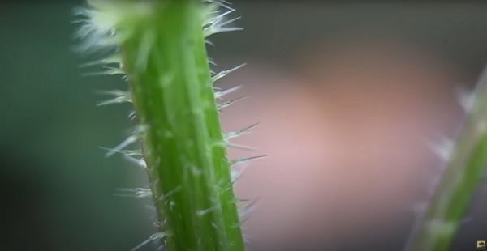
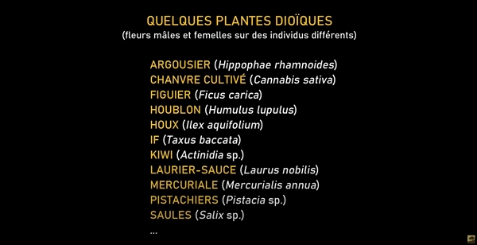
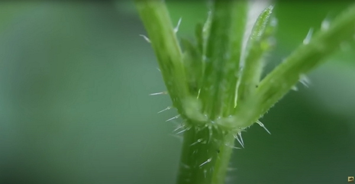
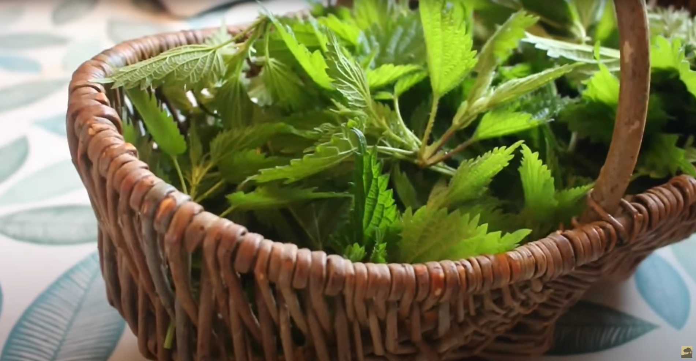
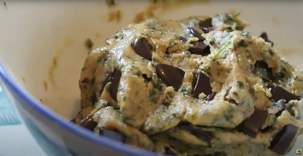
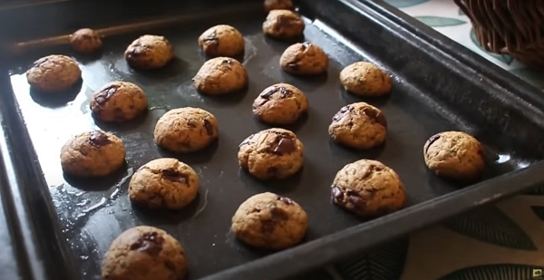
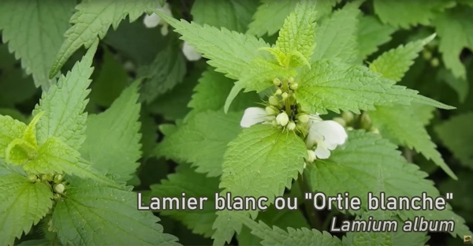
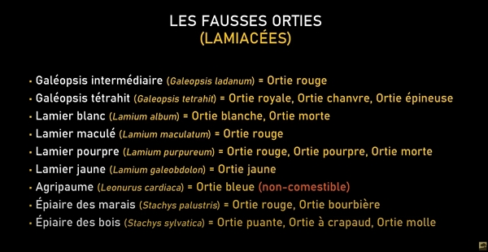
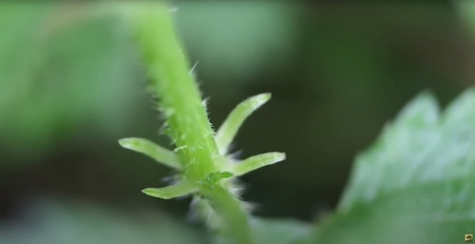
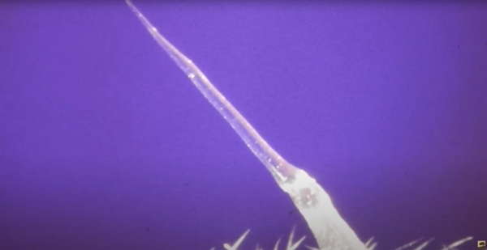

Merci à Damien et David Brico ut pour le partage de leur savoir ! Cet article résume mes notes du vlog réalisé par Damien et David sur la chaîne _Permaculture, agroécologie, etc_.

<!-- more -->

Vous pouvez retrouver [la vidéo sur YouTube](https://www.youtube.com/watch?v=U7OF07QHd0I).

## L’origine du nom

On retrouve la même racine étymologique : urtica, ortie, ortica, ortiga, urtiga dans les différentes langues.

L’origine vient du latin _Urere_ qui signifie ==brûler==.

En anglais, la plante est nommée _Nettle_ qui vient de ==Needle== qui signifie _aiguille_.

En japonais, la plante est nommée _Irkusa_ qui signifie littéralement ==herbe aux épines==.

Crédits : image extraite du vlog de Damien Dekarz.



Les Wallons en Belgique nomment l’ortie _le trèfle du pauvre_ (ou **Kaloob do pauv**) qui fait référence aux atouts de la plante autant pour les fourrages que l’alimentation.



L’ortie la plus connue est la grande ortie (_urtica dioica_), mais on trouve aussi l’ortie brûlante ou petite ortie (_urtica urens_).

La grande ortie est donc dioïque comme son nom l’indique, c’est-à-dire qu’on trouve des plants mâles et des plants femelles bien distincts.

Crédits : image extraite du vlog de Damien Dekarz.

## Qu’est-ce qui pique

Les poils de l’ortie correspondent aux aiguilles qui piquent et ils sont très fragiles.

Il suffit _simplement_ de frotter les feuilles avec des gants.



Contrairement à ce que David dit dans la vidéo, le séchage n’empêche pas que les poils piquent encore.

Le lavage et la cuisson garantissent la suppression des poils urticants par contre.



Toute la plante ne pique pas uniformément.

Les points d’insertion des feuilles sont particulièrement piquants.

Crédits : image extraite du vlog de Damien Dekarz.

En général, les poils sont orientés vers le haut, donc en _caressant dans le sens du poil_ la plante, on ne se pique pas.

Donc l’idée est de cueillir l’ortie entre 2 étages en remontant un peu.

## Qu’est-ce qu’on cueille

On ne prendra pas plus de 3 niveaux de la plante.

Pourquoi ? Les fibres de la tige deviennent plus dures et la consommation est donc moins sympa.

L’exception est la jeune ortie où la tige est plutôt tendre donc on peut en ramasser plus.

Crédits : image extraite du vlog de Damien Dekarz.

## Comment l’utiliser en cuisine

On le consomme comme un légume vert.

L’ortie jeune a un goût d’haricot vert ou d’épinard, pour certains.

L’ortie plus âgée a un goût de poisson.

La liste des plats possibles à d’ortie est très longue. Je vous donnerai juste [le lien de recherche sur Google](https://www.google.com/search?q=recette+ortie+piquante) pour faire votre choix.



Je consomme l’ortie principalement en soupe, en l’ajoutant en dernier avec des légumes cuits

Je la consomme aussi en infusion ; je laisse en général infusion 10 min puis je mange l’ortie. 😋



Les recettes sucrées utilisent plutôt l’ortie jeune et elle se marie très bien avec la banane et le chocolat.

## Cookies « chocolat ortie »

### Ingrédients

Pour 20 cookies :

- 150 g de farine de petit épeautre
- 70 g de beurre
- 40 g de miel (c’est mieux que le sucre 👍)
- 1 œuf
- de la levure
- 100 g de pâte de cacao pur
- 1 poignée d’orties

### Réalisation

1. On préchauffe le four à 180 °C
2. On fait fondre doucement le beurre
3. On casse le chocolat en pépites
4. On hache finement les orties
5. On bat l’œuf avec le miel
6. On ajoute dans l’ordre suivant les ingrédients en mélangeant entre chaque :
   - farine et levure
   - ortie
   - chocolat
7. On malaxe la pâte jusqu’à obtenir ceci :

Crédits : image extraite du vlog de Damien Dekarz.

8. On huile une plaque de cuisson
9. On forme les cookies en forme de petites boules avec 2 cuillères
10. On dispose les cookies sur la plaque
11. On laisse cuire 15 min

Crédits : image extraite du vlog de Damien Dekarz.

## Les fausses orties, c’est quoi

Dans la famille des lamiacées, le lamier blanc ou violet ou jaune ressemble aux orties, mais ne pique pas du tout.

Crédits : image extraite du vlog de Damien Dekarz.

Il y a aussi l’épiaire des bois ou l’ortie puante (_stachys sylvatica_) ou le galéopsis ou « ortie royale » (_galeopsis tetrahit_) qui ressemble à l’ortie, mais ne piquent pas non plus.

Caius Plinius, écrivain et naturaliste romain du 1er siècle, disait que les jeunes plantes piquaient, mais les plantes plus âgées ne piquaient plus.

De cela, la croyance fut qu’il y avait 2 espèces d’ortie : la piquante et la morte. Cela a perduré jusqu’au 16e siècle.

Crédits : image extraite du vlog de Damien Dekarz.

Ces plantes sont toutes comestibles sauf une : l’agripaume ou « ortie bleue ».

Le plus simple moyen de savoir si l’on a à faire avec une vraie ortie, c’est d’envoyer la main et de voir si ça pique. Sinon, regardez si voyez des stipules : il y en a 4 au niveau d’où partir les feuilles à partir de la tige.

Crédits : image extraite du vlog de Damien Dekarz.

Les lamiacées ne possèdent pas de stipules.

## Pourquoi ça pique alors

Crédits : image extraite du vlog de Damien Dekarz.

Ils sont recouverts d’une enveloppe de silice (l’aiguille) et à la base, on trouve une _ampoule_ d’un cocktail chimique qui est à l’origine de la douleur.

Crédits : image extraite du vlog de Damien Dekarz.

Il faut 1/10000 de grammes pour créer une réaction.



On retrouve les mêmes composants chimiques dans le dard d’un frelon européen.



### Comment soulager ou soigner la piqûre

Le plantain lancéolé (_plantago lanceolata_) est bien connu pour calmer les piqûres d’ortie ou d’insectes.

L’aloe vera, le romarin, la menthe ou l’oseille et le basilic se révèlent aussi utiles pour traiter des piqûres.

L’acide rosmarinique que ces plantes contiennent est un anti-inflammatoire bien connu.



Je suis d’accord avec David l’eau ne calme pas la douleur !



## Vertues médicinales

J’ai déjà écrit pas mal de choses sur les propriétés médicinales dans les articles déjà disponibles : [voir le tag « Ortie »](../../../tags/ortie).

David m’a fait connaitre l’utilisation de l’ortie par friction ou fouettement.

En théorie, la sérotonine agit en calmant, mais les effets des autres composants chimiques ne sont-ils pas supérieurs ?

A vous d’essayer ;)
