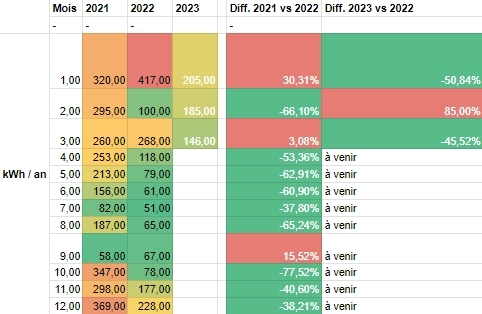

La légende de l’image ci-dessus est la suivante :

- En bleu, il s’agit de la production totale.
- En jaune, il s’agit de l’autoconsommation.
- En vert, il s’agit du surplus offert au réseau, sûrement nos plus proches voisins.

Le 27 mars 2022, nous avons mis en service notre installation photovoltaïque. Regardons les données et les conclusions à la fin de la première année.

<!-- more -->

## La série d'articles

- [Installation PV - quel retour d'expérience après 2 mois ?](../../../2022/06/retour-d-experience-sur-une-installation-pv-1mois/README.md)
- [Installation PV - quel retour d'expérience après 9 mois ? (partie 1)](../../../2022/12/retour-d-experience-sur-une-installation-pv-9mois-partie-1/README.md)
- [Installation PV - quel retour d'expérience après 9 mois ? (partie 2)](../../../2022/12/retour-d-experience-sur-une-installation-pv-9mois-partie-2/README.md)

<hr>

## Usage du cumulus en hiver

Avec le recul d’un an, on peut conclure que chauffer l’eau en hiver n’est pas exactement la même chose qu’en été.

Au-delà du côté logique de cette affirmation, il y a tout de même eu une baisse de consommation.

Ce que je n’avais pas pris en compte, c’est la température de l’eau du réseau.

L’été, elle dépasse facilement 20 °C donc pour monter l’eau à la température limite du thermostat du cumulus demande au moins 15 °C de moins à chauffer qu’en hiver.

Oui, en hiver, vous avez bien compris : l’eau du réseau descend à 5 °C.

Parfait pour des douches froides 🚿🥶. Mais, je l’avoue, ce n’est pas pour tout le monde.

Du coup, quand le routeur donne 2 kWh de surplus solaire au cumulus (pour une journée ensoleillée d’hiver), l’eau chauffe bien, mais pas assez pour mon épouse et mes jumelles, qui aiment l’eau bien chaude.

Après, cela a duré de novembre à février.

:::echarts La production (en bleu) versus la consommation pour le cumulus (en vert)

```json
{
  "xAxis": {
    "type": "category",
    "data": [
      "Jan '23",
      "Fév '23",
      "Mar '23",
      "Avr '22",
      "Mai '22",
      "Jun '22",
      "Jul '22",
      "Aou '22",
      "Sep '22",
      "Oct '22",
      "Nov '22",
      "Dec '22"
    ]
  },
  "yAxis": {
    "type": "value"
  },
  "series": [
    {
      "data": [
        44.6, 113.7, 135.2, 160.6, 210.4, 204.3, 225.4, 192.7, 150.9, 109.3,
        62.6, 36.3
      ],
      "type": "line"
    },
    {
      "data": [115, 99, 64, 31, 0, 0, 0, 0, 0, 14, 79, 125],
      "type": "bar"
    }
  ]
}
```

:::

Nous sommes fin mars et la température de l’eau du réseau a déjà repris 2 °C et les journées sont très belles et ensoleillées.

En consommation du réseau pour chauffer l’eau chaude sanitaire (ECS), sur un an, on est passé de 957 kWh sur l’année 2021 à 492 kWh sur l’année 2022, **soit -48 %**.

Pour le moment, je n’ai pas de retour sur expérience assez conséquent pour dire s’il est possible d’optimiser sans dépenser de grosses sommes supplémentaires.

Encore une fois, notre orientation et le relief ne permettent pas d’installer et rentabiliser des panneaux solaires thermiques. En effet, le coût initial est bien plus important et n’agit que sur le poste **_ECS_** alors qu’avec l’installation photovoltaïque, on agit sur tout ce qui consomme de l’électricité. Par exemple, [l’ortie est de retour](../../../tag/ortie) et on a consommé à les faire sécher.

Ainsi, on verra dans 8 ans pour augmenter la production photovoltaïque et donc l’autoconsommation solaire pour l’ECS.

## Production annuelle

La production annuelle s’élève à ==1646 kWh== et elle repartit ainsi :

| Mois           | Production | Taux d’autoconsommation |
| -------------- | ---------- | ----------------------- |
| Avril 2022     | 160,6      | 91,91 %                 |
| Mai 2022       | 210,4      | 88,59 %                 |
| Juin 2022      | 204,3      | 89,72 %                 |
| Juillet 2022   | 225,4      | 90,68 %                 |
| Août 2022      | 192,7      | 80,28 %                 |
| Septembre 2022 | 150,9      | 98,01 %                 |
| Octobre 2022   | 109,3      | 99,09 %                 |
| Novembre 2022  | 62,6       | 98,40 %                 |
| Décembre 2022  | 36,3       | 97,25 %                 |
| Janvier 2023   | 44,6       | 97,76 %                 |
| Février 2023   | 113,7      | 99,12 %                 |
| Mars 2023      | 135,2      | 97,04 %                 |
| **Total**      | **1646**   | **93,99 %**             |

L’utilisation du routeur solaire apporte vraiment un plus.

En effet, la plupart des sources trouvées _rapportent que, lissé sur l’année, le taux d’autoconsommation avoisine les 20 à 30 %. C’est-à-dire que les habitants n'utilisent pas 70 à 80 % de la production d’électricité solaire n’est dans leur maison._

Sources :

- [Quelle est la différence entre autoproduction et autoconsommation ?](https://www.comwatt.com/blog/photovoltaique-autoconsommation/comparatifs/difference-autoproduction-autoconsommation/#:~:text=Le%20saviez%20vous%20%3F,la%20production%20de%20vos%20panneaux.)
- [Taux d’autoproduction photovoltaïque et consommation électrique](https://terresolaire.com/Blog/autoconsommation-photovoltaique/taux-autoproduction-photovoltaique-et-consommation-electrique/)

En résumé, sans routeur ni obligation d’achat auprès d’EDF (car mes panneaux sont disposés au sol), j’aurai donné :

- entre 1155 kWh (autoconsommation à 30 %), soit ~238 euros (à 20.62[^source_edf] cts l’unité)
- et 1320 kWh (autoconsommation à 20 %), soit ~272 euros (à 20.62 cts l’unité)

[^source_edf]: Voir [la grille tarifaire du tarif réglementé (PDF)](https://particulier.edf.fr/content/dam/2-Actifs/Documents/Offres/Grille_prix_Tarif_Bleu.pdf) ([lien du site web EDF](https://particulier.edf.fr/fr/accueil/electricite-gaz/offres-electricite/tarif-bleu.html)).

Certains diront qu’il vous faudra une installation bien plus grosse pour rentabiliser les 300 euros d’un routeur solaire comme le mien.

En mars 2023, un kilowatt heure acheté (en heure creuse dans mon cas) à Enedis coûte environ 16 cts d’euros.

En partant du principe que le nombre de kWh non achetés sur un an correspond à la différence de l’année 2021 et de l’année 2022, on obtient 465 kWh.

Il faudra donc 1875 kWh de surplus pour rentabiliser 300 euros à 16 cts d’euros l’unité.

Cela donne une rentabilité dans 4 ans avec 1.5kWc installés.
De plus, le fait de consommer le maximum de la production va permettre de rentabiliser l’installation complète plus rapidement.

Car qui aime donner à ces entreprises qui ne nous font pas de cadeaux ? Pas moi !

### Quelles alternatives au routeur solaire

Il y en existe plusieurs :

- pour les cumulus simples (thermostat mécanique), il faudrait réduire la puissance de votre cumulus si la résistance le permet.
  - Solair'ethic a beaucoup d’idées sur le sujet : [allez les visionner sur sa chaîne YouTube](https://www.youtube.com/@ErvannR/videos)
- sans changer le cumulus, ce serait d’allumer le cumulus au moment de la journée où la production est la plus importante.
  - Toutefois, cette méthode ne s’adapte pas automatiquement à la production.

La meilleure solution reste le routeur, mais il faut bien le choisir.

## Consommation annuelle

On consomme globalement toujours autant si l’on réalise la somme de toutes les sources confondues.

| Mois      | Consommation 2021 | Consommation 2022 | Consommation 2023 |
| --------- | ----------------- | ----------------- | ----------------- |
| Janvier   | 320,00            | 417,00            | 248,60            |
| Février   | 295,00            | 100,00            | 297,70            |
| Mars      | 260,00            | 275,30            | 277,20            |
| Avril     | 253,00            | 265,60            | à venir           |
| Mai       | 213,00            | 265,40            | à venir           |
| Juin      | 156,00            | 244,30            | à venir           |
| Juillet   | 82,00             | 255,40            | à venir           |
| Août      | 187,00            | 219,70            | à venir           |
| Septembre | 58,00             | 214,90            | à venir           |
| Octobre   | 347,00            | 186,30            | à venir           |
| Novembre  | 298,00            | 238,60            | à venir           |
| Décembre  | 369,00            | 263,30            | à venir           |
| Total     | 2838,00           | 2945,80           | à venir           |

Toutefois, si l’on regarde la consommation du réseau, on voit que cela a bien diminué.



- Sur janvier, on a eu 8 jours où j’étais seul avec 1.4 kWh par jour. Ensuite, on est revenu à 8 kWh par jour.
- En février 2023, on a consommé 85 % de plus, mais nous étions présents qu’une semaine en 2022 !
- En mars, on a presque divisé par 2 la consommation du réseau, car le mois fut particulièrement bien ensoleillé.

Attendrons-nous les 1500 kWh annuels ? C’est très possible. Rendez-vous à la fin de l’année.

## Quelles sont les étapes suivantes

### Installation solaire secondaire avec batterie

Je dois toujours câbler les 2 panneaux solaires de 240Wc pour les installer derrière ma maison.

Ils serviront à charger l’Ecoflow Delta 2.

L’idée est d’utiliser cet été la station d’énergie pour alimenter le réfrigérateur la nuit afin de voir l’impact sur la consommation journalière.

Je ne pense pas réaliser cet usage toute l’année, mais j’aimerais prendre des mesures.

En effet, la batterie alimentera le réfrigérateur toute la journée. Mais avec les deux panneaux et la recharge de 400 Wc pendant la journée devraient être largement suffisant pour recharger la consommation nocturne et apporter ce qu’il faut pour la journée.

Je suis d’accord que ce ne s’agit pas forcément d’une solution rentable, vu le prix de la batterie et la capacité que j’utilise (DOD entre 90 % et 30 %).

Toutefois, la batterie nous a été utile à plusieurs reprises cet hiver pour alimenter le poêle à granulés.

### Nettoyage des panneaux et sécurisation contre le vent

J’ai nettoyé les champs 3 fois en un an. Mais c’est bien l’été où il y a le plus de travail.

En fait, je positionne les champs, surtout celui du Sud, bien plus bas et donc les chats viennent sans problème marcher dessus.

Je dois aussi attacher le champ Sud-Ouest, car il y a eu un bon coup de vent il y a 15 jours et cela a déconnecté le champ du reste. Du coup, l’onduleur était en erreur.

J’ai réussi à remettre le tout en route rapidement.

En attendant le prochain rendez-vous en fin d’année 2023, ==merci d’avoir lu cet article et n’hésitez pas à me soutenir en vous abonnant !==

:::center
⏬⏬⏬
:::

<!-- markdownlint-disable MD033 -->
<p class="newsletter-wrapper"><iframe class="newsletter-embed" src="https://iamjeremie.substack.com/embed" frameborder="0" scrolling="no"></iframe></p>
