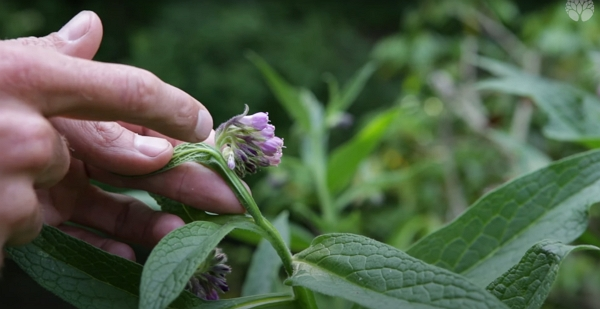
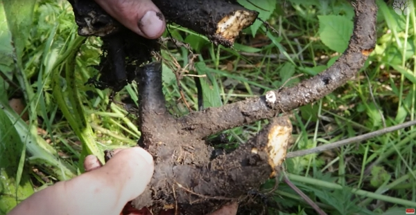
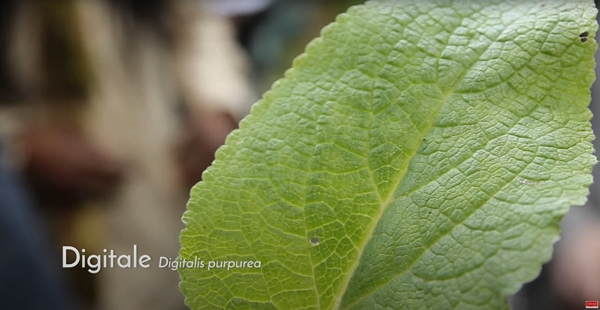

Merci à Christophe pour le partage de son savoir ! Cet article résume mes notes du vlog réalisé par Le chemin de la nature.

<!-- more -->

Vous pouvez retrouver les vlogs de Christophe sur YouTube :

- [La consoude consolide et cicatrise les tissus, peau, muscles, os…](https://www.youtube.com/watch?v=0hcaPjz8RyI)
- [Tout sur la grande consoude !](https://www.youtube.com/watch?v=dRnduELnt4s)

## Botanique

Le nom scientifique est _symphytum officinale_.

### Ses poils

Crédits: image extraite du vlog du chemin de la nature.

Ses poils bien rêches permettent d’accrocher une feuille à ses vêtements.



Appliquer une feuille de consoude sur son t-shirt attirera l’attention des passants ;) C’est une bonne astuce pour créer un lien social.

Le gadge avec une feuille n’est fonctionne qu’en appliquant la face inférieure (où se trouvent les poils recourbés) contre le tissu.



### Ses fleurs

Crédits: image extraite du vlog du chemin de la nature.

Les fleurs sont regroupées, c’est ce qu’on appelle une inflorescence. Dans le cas de la consoude, il s’agit d’un type d’inflorescence scorpionidé, comme la queue d’un scorpion. Ceci est type de la famille de _Boraginaceae_ dont fait partie la consoude.

Les couleurs des fleurs peuvent très variées : blanches, roses, violette, violette foncée, etc.

Au passage, la consoude est une plante mellifère.

### Ses racines

Crédits: image extraite du vlog du chemin de la nature.

Ses racines sont rhizomateuses et sont en général très grosses.

Elles contiennent aussi beaucoup de mucilage, qui crée comme un gel.

La récolte des racines en optimale à l’automne ou en l’hiver, même si la plante est vivace, pour donner le temps aux pollinisateurs de se régaler sur les fleurs.

### Où la trouve-t-on

Elle aime les endroits humides et riches.

## Usage

### pour la santé

Le nom de la consoude décrit ses avantages médicinaux :

- elle cicatrise
- elle régénère

Cela s’applique aussi aux tissus (peau, muscles, tendons, ligaments) et aux os.

On utilise généralement les racines, plus concentrés en l’allantoïne.

Le plus connu des usages est le baume de consoude.



J’utilise [le baume de la grande consoude du Dr Theiss](https://www.drtheiss.fr/beaute-soins/baume-a-la-grande-consoude-100ml/).

J’ai un CMT 1A et lorsque je fais des efforts trop prolongés, mes muscles se crampent facilement et tout le monde sait comment c’est douloureux.

J’ai de nombreuses fois utilisé ce baume et en une heure seulement, les crampes et les muscles se calmaient.

Je fais pousser de la consoude chez moi depuis 2 ans et je la propage depuis l’automne dernier.

Si vous intéressez, je peux essayer de récolter les graines pour les partager. [Contactez-moi pour en recevoir](../../../page/contactez-moi/index.md).

Sinon je recommande [les pots de Consoude du Jardin du PicVert](https://www.jardindupicvert.com/vivaces/2346-consoude-officinale.html). Je me suis fourni chez eux il y a 2 ans.



Christophe recommande toutefois les alcoolatures de racines fraiches (avec un alcool à 45° ou moins) qui extraient mieux l’allantoïne.

Il faut simplement découper les racines en petits morceaux et laisser macérer 3 semaines.

Vous pouvez ensuite l’utiliser en externe où vous en avez besoin.

### Au jardin

On l’utilise au jardin en paillage et sous forme de liquide fermenté.

Pour plus d’informations, si vous parlez anglais, [rendez-vous sur mon blog anglais](https://iamjeremie.me/tags/comfrey/) où je parle de la consoude, ou _comfrey_.

Si vous souhaitez que je traduise un article, [faites un don](https://buy.stripe.com/cN25m1foh6VTaPe6oq) et je créerai l’article sur le site français.



Un petit morceau de rhizome suffit pour que la plante reparte !





J’ai introduit la consoude dans mon jardin dans un bac construit à partir de palettes.

Je n’ai pas la chance d’en trouver à distance raisonnable (à pied) de chez moi.

Et elle produit beaucoup de matière verte pour mon composte donc elle est la bienvenue sur un sol AOC Saint-Joseph très granité.



## Précautions

### Consommation en interne à proscrire



Une grosse quantité peut bloquer la veine hépatique.

La consoude contient en effet des alcaloïdes pyrrolizidiniques qui sont toxiques pour le foie.

En petite quantité régulièrement, on risque le cancer du foie.



### Plante similaire

Crédits: image extraite du vlog du chemin de la nature.

==A ne pas confondre la digitale (_Digitalis purpurea_) qui est toxique.==

La feuille de la digitale est similaire, mais l’absence de poils la caractérise.

Vous aimez ce que vous lisez ? Abonnez-vous !
