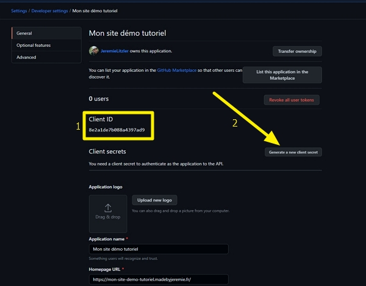
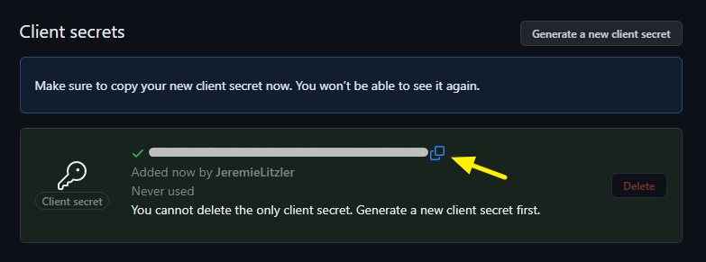
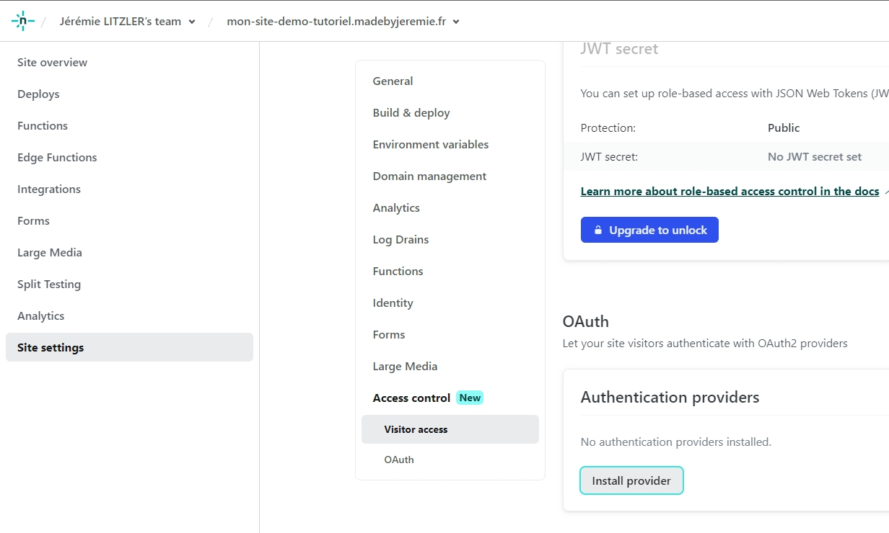
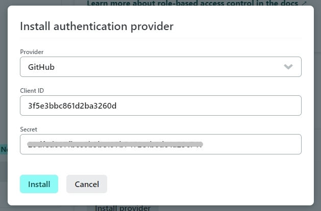
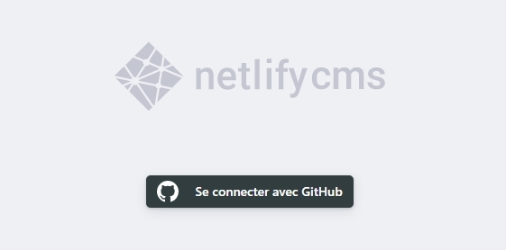
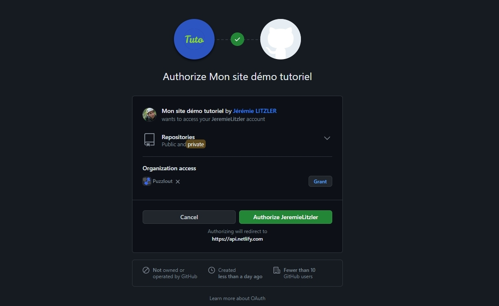
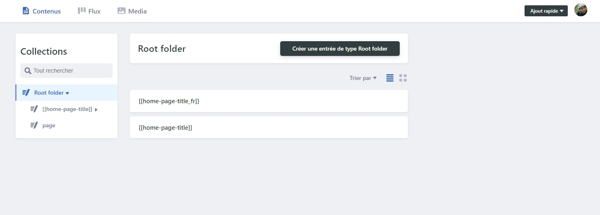
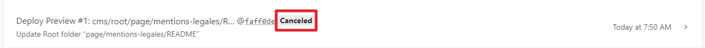
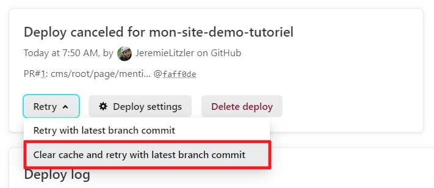
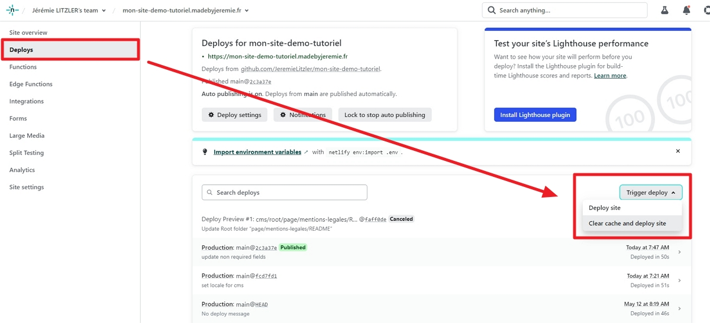

 de Snipcart.')

À la place d’une solution comme WordPress, NetlifyCMS permet de gérer son contenu sans toutes les difficultés connues du CMS le plus utilisé dans le monde.

<!-- more -->

## Activer NetlifyCMS

Par défaut, le modèle de site VuePress contient le dossier `admin` de base il faudra mettre à jour quelques éléments.

Les étapes sont assez simples.

### Dans le dépôt Git

On modifie le fichier `config.yml` se trouvant dans le dossier `docs/.vuepress/public/admin` en mettant à jour la valeur du nom du dépôt GitHub et la langue de votre site (`fr` pour Français, `en` pour Anglais, etc).

Je ne détaillerai pas le reste, car la configuration par défaut correspond à un besoin de base. Pour plus d'information, je vous invite à visiter [le site DecapCMS](https://decapcms.org/).

### Dans GitHub

Rendez-vous sur GitHub une fois que vous êtes connectés sur votre compte.

Naviguez sur [https://github.com/settings/developers](https://github.com/settings/developers) pour ajouter une nouvelle `OAuth App`. Cliquez `New OAuth App`.

Fournissez dans le formulaire comme suit :

- Le nom de l’application dans le champ `Application name`. Ex : _Mon site web_.
- L’URL de la page d’accueil de votre site dans le champ `Homepage URL`.
- La description publique de l’application dans le champ `Application description`.
- L’URL d’autorisation dans le champ `Authorization callback URL` avec la valeur `https://api.netlify.com/auth/done`.

Une fois validé, vous verrez le `Client ID` (1) et le bouton pour générer le `Client Secret` via le bouton `Generate a new client secret` (2).

Cliquez le bouton pour générer le Client secret et copiez la valeur générée.

### Dans Netlify

Rendez-vous sur Netlify et allez sur `https://app.netlify.com/sites/votre-site/settings/general` et cliquez `Identity`

Cliquez `Enable Identity`.

Modifiez-les `Registration preferences` pour permettre les souscriptions sans ou avec invitations. Par défaut, configurer `Invite only`.

Sans changer de page, descendez jusqu’à `Git Gateway` et cliquez `Enable Git Gateway`.

Dans les `Site settings`, rendez-vous sur `Access Control` tout en bas.

Allez dans `OAuth` et cliquez `Install provider` en sélectionnant `GitHub`.

Saisissez le _client secret_ copié dans GitHub et copiez-collez le client ID avant de cliquer `Install`.

:::tip Si vous n'avez pas copié le _client secret_...
Regénérez-en un, tout simplement :)
:::

Pour finir, rendez-vous sur `https://mon-super-domaine.fr/admin` et cliquez `Se connecter avec GitHub`.

:::warning Pour accéder à NetlifyCMS de votre site, soyez sûr de pouvoir vous connecter à GitHub.
:::

L’écran suivant s’affiche où il suffit de cliquer `Authorize VotrePseudoGitHub`.

Vous arrivez alors sur la page d’accueil de l’interface de gestion NetlifyCMS de votre site

Je n'irai pas dans le détail ici de comment utiliser NetlifyCMS.

## Limitations

### Il faut apprendre la syntaxe _Markdown_

Elle est très simple à maitriser, comme l'explique [Grafikart sur YouTube](https://www.youtube.com/watch?v=6hikjzymd0c).

### Les extensions du thème VuePress ne sont pas affichées correctement

En prévisualisation, les syntaxes étendues du thème de Mister Hope ne sont pas affichées correctement, car il manque leurs interprétations en HTML.

Et il manque les styles CSS.

C'est pour cela que je travaille uniquement sur Visual Studio Code, qui permet de lancer localement le site et de visualiser les pages dans leur rendu final.

### Déploiement après édition dans NetlifyCMS

Une autre limitation est qu'éditer un fichier Markdown d'une page ou un article ne va pas être détecté par Netlify comme un déploiement.

Vous risquez de voir que la mise à jour n'est pas être déployée (le _Build_ est à l'état `Canceled`).

Pourquoi ? Il semble que modifier uniquement un fichier `.md` ne suffit pas pour lancer une compilation complète (ou _build_).

Il faut alors sélectionner la fameuse compilation et cliquer le menu `Rety` puis `Clear cache and retry with latest branch commit`.

La modification est aussi soumise par NetlifyCMS à GitHub via une requête de tirage, qu'il faut alors accepter pour que le déploiement sur le site de production ait lieu.

L'avantage est de pouvoir vérifier sur une URL de prévisualisation que tout est bon.

Voici [un exemple de requête de tirage](https://github.com/JeremieLitzler/mon-site-demo-tutoriel/pull/1) sur mon site de démo réalisé pour ce tutoriel.

Après la validation de la requête de tirage, il faut aussi forcer une compilation manuellement depuis la liste des déploiements, comme indiqué ci-dessous :

Pour lancer une compilation complète, il faut éditer le fichier `docs/.vuepress/config.js` en modifiant le numéro de version en l'incrémentant par exemple.

Je compte réaliser un guide plus complet, dans le futur, sur l'usage de Netlify.

J'espère que vous avez aimé cette série et pour recevoir d'autres articles de ce type, abonnez-vous !

:::center
⏬⏬⏬
:::

<!-- markdownlint-disable MD033 -->

<iframe class="newsletter-embed" src="https://iamjeremie.substack.com/embed" frameborder="0" scrolling="no"></iframe>

