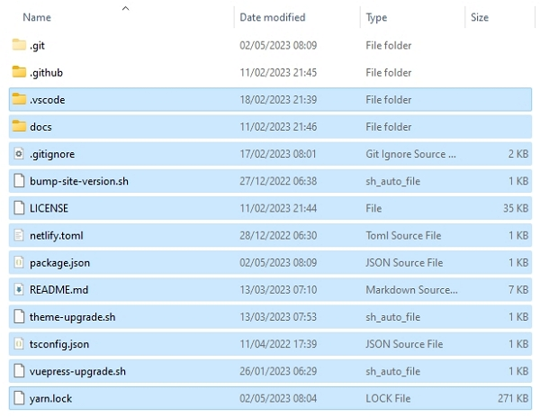
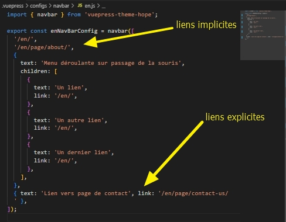

 de Snipcart.')

Dans cet article, je décris les étapes concrètes pour créer, configurer le site et personnaliser son contenu.

<!-- more -->

<!-- [< Retour à la table des matières](../comment-realiser-son-site-moderne-et-rapide/README.md) |[Préparer son PC](../preparer-un-env-pour-un-site-moderne-rapide/README.md) |[Déployer son site web sur Netlify >](../deployer-son-site-moderne-rapide/README.md) -->

## Pré-requis

- Avoir réalisé [l’étape de préparation de son PC](../preparer-un-env-pour-un-site-moderne-rapide/README.md).

## Cloner les dépôts

:::tip Optionnellement, créer un dossier <em>Git</em>
A la raine du disque C ou D de votre ordinateur ou ailleurs, cela permettra d’organiser vos dépôts locaux.
:::

- Lancer la commande suivante qui crée un dossier`NomDeVotreDepot`.

```sh
git clone https://github.com/VotrePseudoGitHub/NomDeVotreDepot
```

- Dans mon cas, j’utiliserai le dépôt `JeremieLitzler/mon-site-demo-tutoriel`(disponible [ici](https://github.com/JeremieLitzler/mon-site-demo-tutoriel)).

- Lancer la commande suivant pour cloner le dépôt contenant la structure du site à réaliser.

```sh
git clone https://github.com/Puzzlout/TemplateVuepress/
```

Le dépôt est sauvegardé dans le dossier `TemplateVuepress`à l’endroit où vous stockez vos dépôts.

Pour moi, ce sera`D:/Git/GitHub/` .

## Initialiser le site web à partir du modèle

Maintenant que les dépôts sont clonés :

### Copiez-le tout le contenu du modèle.

On copiera les fichiers du dossier `TemplateVuepress`dans le dossier`NomDeVotreDepot`, incluant le dossier `.vscode`pour les extraits de code permettant de rédiger son contenu plus rapidement.

:::warning Sauf le dossier <em>.git</em> et <em>.github</em>
:::



### Personnaliser les fichiers issus du modèle

Au minimum les fichiers suivants doivent être personnalisés, incluants :

- les fichiers définissant l'élément `head`global dans le dossier`docs/.vuepress/configs/head` .

  - vous trouverez un fichier `js`par locale ou langue que le site propose.
  - il faut au minimum modifier, **par chaque fichier `js`** :

    - la variable `websiteDomain`avec l'URL de votre site. On reviendra dessous après [le déploiement.](../deployer-son-site-moderne-rapide/README.md)
    - la variable`titleDefault`, qui doit être inférieure à 60 caractères
    - la variable`descriptionDefault`, qui doit être comprise entre 50 à 160 caractères

    - la variable `themeColor`qu'on remplacera globalement avec `CTRL+SHIF+H`

      - pour le choix de la couleur, en utilisant [ce site](https://huemint.com/brand-intersection/) et choisissez une couleur sombre.
      - sauvegarder la palette de couleur générée dans `docs/.vuepress/styles/palette.scss`

    - la variable `repoLink`où l'on remplacera globalement avec `CTRL+SHIF+H`la valeur `GitHubUsername/GitRepoName`par `VotrePseudoGitHub/NomDeVotreDepot`
    - concernant le tag méta`og:url`, en fonction de votre langue principale, il faudra adapter l'URL :
      - sur le modèle`TemplateVuepress`, la langue par défaut est l'anglais.
      - sur [le site construit pour le tutoriel](https://github.com/JeremieLitzler/mon-site-demo-tutoriel), la langue par défaut est le français.

- les fichiers définissant l'élément `nav`pour le menu de navigation dans le dossier `docs/.vuepress/configs/navbar`- vous trouverez un fichier `js`par locale ou langue que le site propose.

  - en fonction de votre langue principale, il faudra adapter les URL :

    - pour votre langue principale, pas besoin de mettre `/[[locale-courte]]/ma-page`
    - sur le modèle`TemplateVuepress`, la langue par défaut est l'anglais.
    - sur [le site construit pour le tutoriel](https://github.com/JeremieLitzler/mon-site-demo-tutoriel), la langue par défaut est le français.

  - les liens peuvent s'afficher avec un texte :
    - soit implicite, c'est-à-dire la valeur du `title`dans le fichier Markdown.
    - soit explicite, c'est-à-dire la valeur `text`



- le fichier `docs/.vuepress/public/admin/config.yml`définissant l'interface avec NetlifyCMS, si vous l'activez (voir plus loin comme l'activer).

  - il faudra alors mettre à jour le nom du dépôt, normalement déjà réaliser précédemment sur le remplacement de la valeur `GitHubUsername/GitRepoName`par`VotrePseudoGitHub/NomDeVotreDepot` .

- les fichiers `docs/.vuepress/public/site.webmanifest`et les variantes par locale, qui définissent l'application web

  - vous trouvez ce fichier déclaré dans le fichier `js`correspondant à la locale dans le dossier`docs/.vuepress/configs/head` .
  - suivez les règles listées par [MDN Web Docs](https://developer.mozilla.org/fr/docs/Web/Manifest) sur le sujet.
  - à propos de`start_url`, la même règle s'applique que précédemment concernant la présence de la locale dans l'URL.

- le fichier `docs/.vuepress/config.js`qui définit :

  - la locale par défaut, à ajuster selon votre besoin.
  - les locales actives, à ajuster selon votre besoin.
  - la même règle s'applique que précédemment concernant la locale par défaut.
    - sur le modèle`TemplateVuepress`, la langue par défaut est l'anglais.
    - sur [le site construit pour le tutoriel](https://github.com/JeremieLitzler/mon-site-demo-tutoriel), la langue par défaut est le français.

### Personnaliser le thème

À travers le fichier`docs/.vuepress/theme.ts`, qui définit certaines valeurs à ajuster selon votre cas, personnalisez :

- le `hostname`correspondant à l'URL de base de votre site.

  - Vous pouvez réaliser un `CTRL + SHIFT + H`et exécuter un remplacement de `example.com`en `votresite.fr`par exemple.

- le `author > name`correspondant à votre nom

- le `repo`correspondant à l'identification du dépôt sur GitHub.

  - normalement déjà réaliser précédemment sur le remplacement de la valeur `GitHubUsername/GitRepoName`par`VotrePseudoGitHub/NomDeVotreDepot` .

- les `docsBranch`, `docsDir`, `editLinkPattern` n'ont pas besoin d'être modifiés.

- les valeurs `logo`et `logoDark`n'ont pas besoin d'être modifié si vous suivez les instructions de création de votre logo.

  - `logoDark`peut être supprimé si `darkmode`n'est pas nécessaire.

- la liste des`locales`, qui doit correspondre à la liste déclarée dans`docs/.vuepress/config.js` .

  - toutefois, ici, on déclare les configurations du menu de navigation par locale.

- le `displayFooter`permet d'afficher le pied de page global sur le site, en configurant la propriété `footer`qui suit.

  - le `footer`peut contenir du code HTML, mais le Markdown n'est pas interprété.

- les listes des `plugins`est configuré de façon optimal pour un usage basique, mais reste toutefois riche. Si vous souhaitez davantage, visitez [le site du thème VuePress](https://theme-hope.vuejs.press/).

  - le plugin `blog`fournit par le thème.

    - l'index du blog (ex. : page `/[locale]/article/`) liste tous les articles, sauf pour les fichiers `.md`déclarant `article: false`,
    - des catégories (ex. : `/[locale]/category/ma-category/`),
    - des tags : `/[locale]/tag/mon-tag/`),
    - et autres fonctionnalités associées deviennent disponibles.
    - il est possible de [réaliser davantage de configuration du blogging dans`theme.ts`](https://theme-hope.vuejs.press/guide/blog/), mais, personnellement, je ne les utilise pas.

  - le plugin `comment` permet d'activer l'ajout de commentaires basé l'extension GitHub nommée `Giscus` qui crée des tickets dans le système de tickets GitHub de votre dépôt.

    - je ne décris pas ici comment l'activer, car [cela est réalisé par l'auteur du thème VuePress](https://theme-hope.vuejs.press/config/plugins/comment.html#intro).

  - le plugin `mdEnhance` est configuré pour un usage normal (et je recommande de ne pas trop activer d'options pour que Netlify puisse compiler le site web au déploiement)

    - il permet d'écrire du Markdown avec des syntaxes complémentaires, comme aligner du texte, ajouter des attributs personnalisés (ex. : une classe CSS), des classes CSS _container_ pour contrôler le style d'un ou plusieurs pages, etc.
    - je vous laisse découvrir.

  - le plugin `pwa` a été désactivé même s'il génère encore un fichier `service-worker.js` à la racine du site (`https://example.com/service-worker.js`).

### Création du logo et icônes

Vous devrez remplacer les images dans `docs/.vuepress/public/icons`

En utilisant [ce générateur](https://favicon.io/favicon-generator/), vous pouvez créer un logo à partir de quelques caractères.

1. Utilisez la couleur du thème choisi précédemment et une autre couleur (claire).
2. Modifiez la couleur _Font Color_ avec la couleur claire et _Background color_ avec la couleur sombre.
3. Saisissez votre texte. J'utilise en général une ou deux lettres pour que tout soit affiché. Utilisez la _Font Size_ pour ajuster cela.
4. Sélectionner le style _Background_ et la famille de police.Select the font you prefer and the font size.
5. Cliquez`Download` .
6. Extrayez les fichiers en renommant `about.txt` en`about-light-over-dark.txt` .
7. Copiez tout **sauf le fichier manifest** dans `docs/.vuepress/public/icons` pour remplacer les fichiers existants.
8. Inverser les couleurs dans [le générateur](https://favicon.io/favicon-generator/).
9. Cliquez `Download` à nouveau.
10. Extrayez les fichiers et

- renommez`about.txt` en `about-dark-over-light.txt`
- préfixez toutes les images avec`dark-` .

11. Copiez tout **sauf le fichier manifest** dans `docs/.vuepress/public/icons` pour remplacer les fichiers existants.
12. Copiez de `docs/.vuepress/public/icons` le fichier `favicon.ico` dans`docs/.vuepress/public` .

### Personnaliser les pages par défaut

Je ne détaillerai pas comment créer les pages et le contenu de votre site, car cela dépend beaucoup de votre besoin.

Voici les exemples de sites :

- le présent site, où vous vous trouvez, est créé avec le modèle (en fait, il a servi de base pour le modèle).
- le site de mon activité de microentreprise : [www.puzzlout.com](https://www.puzzlout.com).
- le site d’une productrice de quinoa que j’ai réalisé au premier semestre 2023 : [www.inflorescences-quinoa.fr/](https://www.inflorescences-quinoa.fr/)
- le site de la méthode _Passons le C.A.P_ : [wwww.passonslecap.fr](http://passonslecap.fr/)

Pour des conseils et des besoins particuliers, [contactez-moi](../../../page/contactez-moi/README.md).

Sinon, continuons avec [l’étape de déploiement](../deployer-son-site-moderne-rapide/README.md)

[< Retour à la table des matières](../comment-realiser-son-site-moderne-et-rapide/README.md)
