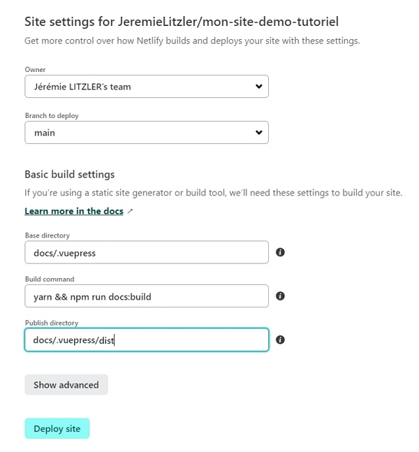

Avec les services de Netlify, le déploiement n’a jamais été aussi simple.

<!-- more -->

## Compiler et pousser les modifications sur GitHub

Maintenant que le contenu est prêt :

1. Lancer le terminal avec `CTRL+ù`dans Visual Studio Code, s’il n’est pas déjà ouvert.
2. Lancer la commande suivante :

```sh
npm run docs:build
```

3. Si vous avez une erreur, [contactez-moi](../../../page/contactez-moi/index.md) en fournissant l’URL du dépôt. Sinon, continuez avec :

```sh
git add -A && git commit "pousser le contenu sur GitHub" && git push
```

## Commande du domaine personnalisé

Sauf si vous avez besoin de mon aide, le seul coût sera celui du domaine personnalisé. Ex : `mon-super-domaine.fr`.

Je ne décris pas les étapes ici. Je vous invite à faire une petite recherche Google. Pour mes sites web, [j’utilise OVH](https://www.ovhcloud.com/fr/domains/).

### Mettre à jour la zone DNS chez votre registar de domaines.

Une fois que le domaine est provisionné, il faut paramétrer Netlify pour que le site web pointe sur le domaine.

Pour un domaine de base, il faut préalable supprimer les entrées DNS `A`sur le domaine `mon-super-domaine.fr`et `wwww.mon-super-domaine.fr`.



J’ai eu une fois un temps de propagation de la suppression de l’entrée `A`sur le sous-domaine `www` qui a pris plus des dizaines de minutes.

Soyez patients ;)



## Déployer le site sur Netlify

Rendez-vous sur [app.netlify.com](https://app.netlify.com) en vous connectant avec votre compte GitHub.


Vous devez alors autoriser l’accès à votre compte par Netlify (pour lire la liste des dépôts).

Une fois connecté, sélectionnez `Add new site` puis `Import an existing project` :


Sélectionnez `GitHub` :


Rechercher et sélectionner votre dépôt :


Configurez le déploiement en modifiant :

- `Base directory` par `docs/.vuepress`.
- `Build command` par `yarn && npm run docs:build`.
- `Publish directory` en ajouter `dist` à la valeur.



Le déploiement ne devrait pas prendre plus de 2 minutes.

En attendant, allez dans `Site settings` et cliquez `Change site name`.

La valeur par défaut est aléatoire. Je mets en général une valeur plus sympa.

Dans mon cas, ce sera `mon-site-demo-tutoriel`. Le site est alors disponible sur `https://mon-site-demo-tutoriel.netlify.app`.

## Mettre à jour l’application sur Netlify avec un domaine personnalisé

Une fois la zone DNS prête,

- ajouter le domaine dans Netlify en sélectionnant votre site depuis [app.netlify.com](https://app.netlify.com), puis en cliquant `Site settings` puis `Domain management`.
  - dans`Production domains` , cliquer `Add domain` et confirmer l’ajout sans passer par `Netlify DNS`



Vous verrez sûrement l’alerte suivante :

> .fr domains can’t be registered through Netlify. You can still add mon-site.fr to your Netlify site if you already own the domain. Select Add domain to add it to your site. You can configure Netlify DNS for this domain later.

Cliquer `Add domain` ou `Add subdomain` quand même.



- une fois sur l’écran ci-dessous : 

- Cliquez `Awaiting External DNS` et suivez les instructions :

  - pour un domaine _racine_,
    - ajouter l’entrée `A` en utilisant l’adresse IP du loadbalancer que Netlify vous fournit.
    - ajouter l’entrée `CNAME` en utilisant le DNS que Netlify vous fournit. 
  - pour un sous-domaine,
    - vous aurez seulement l’entrée `CNAME` à ajouter.

- Rendez-vous sur votre registar de domaines (ex : OVH) et dans la section`Domain > mon-site.fr > DNS Zone` , sélectionner `Ajouter un entrée` et le type selon votre besoin.

  - pour une entrée`CNAME` , ça ressemble à ceci :

  

  

  

  - confirmez et attendez quelques minutes (voire plus si votre registar de domaine est lent)
  - rafraichissez la page sur Netlify : quand tout est bon, le message `Awaiting external DNS` doit avoir disparu.

  

  - Netlify provisionne ensuite un certificat _Let's encrypt_ automatiquement pour vous.




Cela prend un peu plus de temps sur un domaine racine qu’un sous-domaine seulement.



Une fois que le certificat est déployé, vous pourrez accéder à votre site web sécurisé ! Ex : `https://mon-super-domaine.fr`.


Si vous souhaitez éditer le contenu depuis n’importe quel PC, cela est possible avec NetlifyCMS. Je vous explique [comment l’activer sur votre site web](../activer-netlifycms-sur-son-site-web/index.md).

## Limitations

Pour un blog de très grande taille (plus de 400 pages générées incluant les pseudos liens si vous utilisez les catégories et les tags), l’hébergement sur Netlify risque d’être limite.

Toutefois, l’astuce serait de déployer le dossier `dist` généré sur votre PC et de le pousser sur GitHub ensuite. Cela donne le même résultat.

Je ne l’ai toutefois pas encore testé.



Depuis la publication de cette article, j'ai trouvé une solution pour les sites avec beaucoup de contenu.

J'ai publié [un article sur le sujet](../../../post/2023-09/migrer-de-vuepress-a-hugo/index.md).

