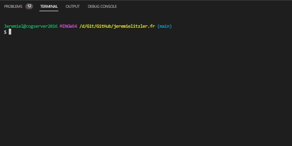

 de Snipcart.')

La première étape pour créer son site web moderne et rapide, c’est de préparer le PC pour le créer.

<!-- more -->

## Prérequis

- Un ordinateur personnel avec :
  - Windows 10 ou 11,
  - 8 Go LPDDR4,
  - un disque de 256 Go SSD
  - et un processeur Intel Celeron Quad Core
- Un compte e-mail (Google ou autre) (par ici [avec Gmail](https://accounts.google.com/) ou [avec Infomaniak](https://www.infomaniak.com/fr/email-gratuit))
- Un compte GitHub (créé avec votre compte e-mail) en [le créant par ici](https://github.com/signup)
- Un compte [chez Netlify](https://app.netlify.com/) (lié à votre compte GitHub)
- Optionnellement, un compte chez un registar de domaines (OVH, Infomaniak, etc.). Cela est utile pour le nom de domaine, si vous souhaitez une URL 100 % personnalisée.

:::tip Par défaut, Netlify fournit une URL publique
Le sous-domaine est configurable, sous réserve de disponibilité.

L’application serait alors disponible sous`https://mon-site.netlify.app` .
:::

## Créer le dépôt sur GitHub

Une fois que vous avez à disposition tous les prérequis, on commence par créer le dépôt depuis votre compte GitHub.

Pour cela, connectez-vous à votre compte GitHub et :

1. Rendez-vous sur [https://github.com/new](https://github.com/new).
2. Remplissez les champs :

- `Repository name`
- `Description`
- Choisissez la visibilité : `Public` ou`Private` .
- Ignorez la suite qui sera copiée du modèle

3. Cliquez `Create repository`en bas du formulaire pour terminer.

## Préparer le poste de développement

Une fois que le dépôt est prêt, je vous invite à préparer votre poste de développement.

Il faut :

- Installer [Git bash](https://git-scm.com/downloads). Allez visualiser [ma vidéo sur le sujet](https://youtu.be/eHTZ-2qY19s).

- Installer [NodeJS 18.16.0](https://nodejs.org/en/blog/release/v18.16.0/) en cliquant suivant (aucune personnalisation n’est nécessaire).

- Installer [Visual Studio Code](https://code.visualstudio.com/download) en cliquant suivant (aucune personnalisation n’est nécessaire).

- Configurer l’explorateur Windows pour afficher les dossiers et fichiers cachés (ex : fichier`.gitignore`, dossier`.vscode`)

  - Ouvrez l’explorateur de fichiers et sélectionnez le menu `Options`comme indiqué ci-dessous :
    

  - Sélectionnez l’affichage des dossiers et fichiers cachés :
    

:::note Pour l’étape qui suit seulement…
Peut-être que tout est bon si vous avez suivi l’étape à l’installation de Git.

L’étape est là, au cas où ce n’est pas le cas.

Toutefois, comme j’ai le même PC depuis un moment, je veux juste être sûr qu’on a tous la même configuration de poste.
:::

- Lancez Visual Studio Code et saisissez `CTRL+SHIFT+P`puis `Terminal`pour sélectionner le profil `Git Bash`

  

  Et sélectionnez `Git Bash`:

  

- Tapez `CTRL+ù`pour ouvrir le terminal avec `Git Bash`

  

Vous êtes prêts à cloner les dépôts !

Cliquez sur le lien suivant pour [créer votre site web moderne et rapide](../creer-son-site-moderne-rapide/README.md).

[< Retour à la table des matières](../comment-realiser-son-site-moderne-et-rapide/README.md)
