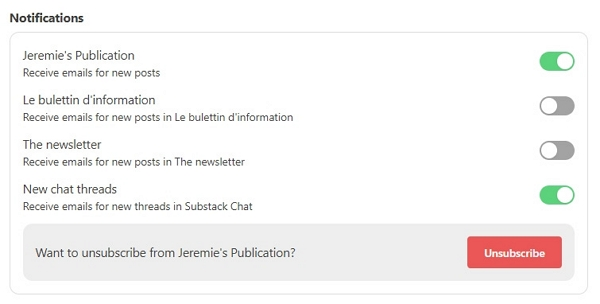

Lorsqu’il s’agit de créer votre bulletin d’information, vous disposez d’un large choix de solutions.

J’ai choisi Substack en raison de ses valeurs : donner la priorité à ceux qui écrivent et fournir des outils efficaces pour les aider à développer leur base d’abonnés.

Cependant, lorsque vous parlez couramment 2 langues, il n’est pas simple de maintenir une publication dans deux langues.

Vous pourriez utiliser deux publications distinctes, mais j’avais déjà écrit un bon nombre d’articles lorsque j’ai réalisé que je devais _ranger_ ma publication concernant le contenu bilingue.

De plus, certaines parties de la publication ne peuvent pas encore être traduites de toute façon.

## L’anglais doit être la langue par défaut

Aujourd’hui, vous ne pouvez pas configurer toutes les valeurs textuelles dans votre langue préférée, hors le contenu de vos articles.

Ce qui suit sera en anglais, alors choisissez les valeurs avec soin :

- le nom de la publication,
- la description courte (elle peut inclure les deux langues, mais elle est limitée à 258 caractères…),
- les Catégories,
- le logo,
- la photo de couverture, affichée sur la page d’accueil,
- le design du site, qui couvre simplement la couleur principale, la mise en page et la police,
- les détails de la publication, avec votre nom, vos droits d’auteur et votre adresse postale.

Quelques liens de navigation seront toujours en anglais, pour l’instant. Cependant, les microformulaires de souscription sont traduits en fonction de la langue principale de votre navigateur.

Par exemple, sur mon profil principal avec Chrome, je vois ceci :


Avec un profile chrome en français, je vois cela :


En ce qui concerne les éléments suivants, nous les examinerons dans les paragraphes suivants :

- la page _À propos_,
- le e-mail de bienvenue,
- la navigation,
- les Sections,
- les paramètres de bannière, d’en-tête et de pied de page d’e-mail
- la page de désinscription des e-mails

## Configurer la page _À propos_

J’ai choisi d’écrire le contenu de cette page en deux langues.

Vous pouvez [la visualiser ici](https://iamjeremie.substack.com/about).

La configuration est simple : j’utilise `heading2` pour séparer le contenu de chaque langue.

J’ai aussi ajouté un lien vers mon blog pour des informations plus détaillées, qui est, bien sûr, disponible en deux langues.

## Configuration des sections pour créer un bulletin d’information par langue

Ensuite, nous allons créer les sections, également appelées _newsletters_ ou bulletins d’information.

Pour chacun, vous pouvez personnaliser :

- le titre
- la description
- le nom de l’expéditeur de l’e-mail, si votre nom défini ci-dessus dans les détails de la publication n’est pas adapté à la langue avec laquelle vous traitez.
- l’URL web de la rubrique ou du bulletin d’information.
- le fait que vous souhaitiez masquer les publications sous cette rubrique depuis la page d’accueil.

Substack dit à propos ce point :

> Si cette case est cochée, les publications de cette section n’apparaîtront ni sur la page d’accueil de votre publication ni sur les archives de la publication. Les messages apparaîtront toujours dans la page de la section.

- et un logo, si vous souhaitez qu’il soit différent du logo de la Publication.

## Configurer la navigation

Une fois les sections créées, vous pouvez organiser la navigation, visible en haut de chaque page de votre publication.

Je ne me souviens pas exactement des valeurs par défaut, mais vous aurez :

- la page d’accueil,
- la page Archives,
- la page _À propos_,
- chaque page _Section_,
- et la page « Newsletters »

Je cache la page Archive et les Sections (qui sont ajoutées automatiquement au moment de leur création).

Cela vous donnera un résultat soigné (mise en avant en rouge) :


## Configurer l’e-mail de bienvenue

De même, l’e-mail de bienvenue est écrit en utilisant `heading3` pour séparer les langues (`heading2` est utilisé pour le titre).

Ce qui est important ici : vous ajouterez pour expliquer au nouvel abonné comment activer les notifications de la publication ou sur un bulletin d’information sélectionné (peut-être que votre abonné ne parle que le français, par exemple).



Dans mon cas, je devrai écrire un article spécial à mes abonnés français actuels, afin de les aider à s’abonner au bulletin d'information en français uniquement.

Voici mon e-mail de bienvenue :

```markdown
# Welcome! Bienvenue !

This email is written in english and french.

Cet e-mail est écrit en anglais et français. Défilez un peu plus bas pour le français.

## For english speakers

### Ready to learn more?

You are in the right place!

If you are like me, you may wonder how to do that or this in a wide range of fields of work.

I would like to share my experiences and provide a good return on investment to you.

You will start receiving updates right here in your inbox. You can also log in to [Substack](https://substack.com/) to read the archives [in english](https://iamjeremie.substack.com/s/the-newsletter?utm_source=blog_english) or [in french](https://iamjeremie.substack.com/s/le-bulletin-d-information?utm_source=blog_english).

### Enable the newsletter(s) you need

From your SubStack account, you willl need to toggle the newsletter(s), either english, french or both, you want to receive notifications for.

Use [this link to access your settings](https://iamjeremie.substack.com/account). You will see this:


As shown above, you will receive only posts published under the publication.

Use the toggle to either:

- receive only posts from the english newsletter named “The Newsletter”.
- receive only posts from the french newsletter named “Le bulletin d’information”.

### Some housekeeping…

If you can’t find the newsletter, check your Spam folder. And please mark this address as ‘not spam.’ If the newsletter isn’t in your spam folder, either, you should look in the Promotions tab.

You can always see everything on the [SubStack website](https://iamjeremie.substack.com/).

Thanks again, and please recommend to your friends if you feel like it.

<hr>

## Pour les francophones

### Prêt à apprendre davantage ?

Vous êtes au bon endroit !

Si vous êtes comme moi, vous vous demandez peut-être comment faire ceci ou cela dans un large éventail de domaines.

J'aimerais partager mes expériences et vous fournir un bon retour sur investissement.

Vous commencerez à recevoir des mises à jour ici même dans votre boîte de réception. Vous pouvez également vous connecter [au site Web de Substack](https://substack.com/) pour lire les archives complètes ([en anglais](https://iamjeremie.substack.com/s/the-newsletter?utm_source=blog_english) ou [en français](https://iamjeremie.substack.com/s/le-bulletin-d-information?utm_source=blog_english)).

### Activez la ou les newsletters dont vous avez besoin

Depuis votre compte SubStack, vous devrez basculer le ou les bulletins d’information, en anglais, en français ou les deux, pour lesquelles vous souhaitez recevoir des notifications.

Utilisez [ce lien pour accéder à vos paramètres concernant ma publication](https://iamjeremie.substack.com/account). Vous verrez ceci :


Comme indiqué ci-dessus, vous ne recevrez que les messages publiés sous la publication (première ligne).

Utilisez la bascule pour :

- recevoir uniquement les messages de la newsletter anglaise nommée "The Newsletter" (troisième ligne).

- recevoir uniquement les messages de la newsletter française nommée "Le bulletin d'information" (seconde ligne).

### Un peu de ménage…

Si vous ne trouvez pas le bulletin d’information, vérifiez votre dossier Spam. Et veuillez marquer cette adresse comme "non spam". Si le bulletin d’information ne se trouve pas non plus dans votre dossier Spam, vous devriez regarder dans l'onglet Promotions.

Vous pouvez toujours tout voir [sur le site Web de Substack](https://iamjeremie.substack.com/).

Merci encore et recommendez moi à vos amis si vous en avez envie.

<hr>
```

## Configurer l’e-mail de désinscription dans les deux langues

Tout comme vous l’avez fait pour l’e-mail de bienvenue, vous utiliserez les mêmes techniques pour définir le contenu bilingue sur l’e-mail de désinscription.

## Le faites-vous différemment

Faites-le-moi savoir dans les commentaires !

J’ai demandé à Substack quand ils auront le support complet pour les langues dont nous avons besoin.

Voici leur réponse :


Soyons patients et espérons pour une mise à disposition dans peu de temps !
