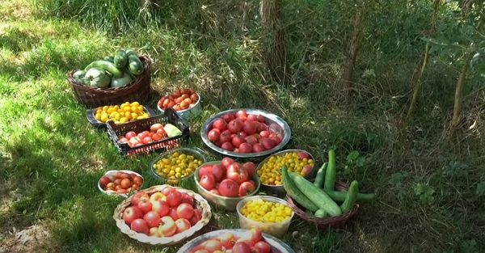
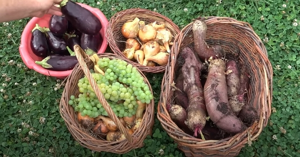
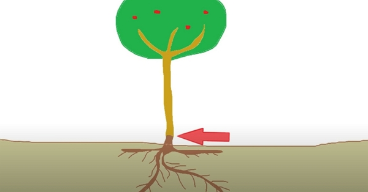
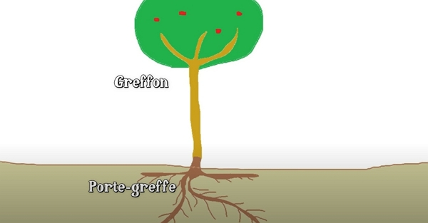
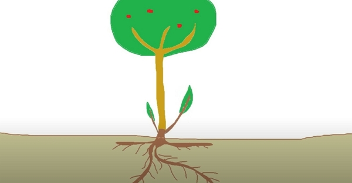
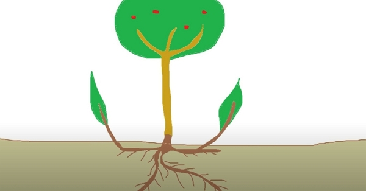
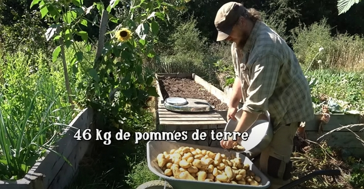

Merci à Damien pour le partage de son savoir ! Cet article résume mes notes du vlog réalisé par Damien sur sa chaîne _Permaculture, agroécologie, etc_.

Vous pouvez retrouver [la vidéo sur YouTube](https://www.youtube.com/watch?v=bkacvFjicBg).

## Avant les trois trucs

### Récolter souvent

En ce mois d'août, dans la serre, les légumes souffrent de la chaleur. Il peut y avoir fait plus de 50 degrés, mais malgré tout, la productivité peut être au rendez-vous avec tous les légumes habituels de la serre : les concombres, les tomates, les aubergines.

Au mois d'août, il faut passer une bonne partie de son temps à récolter les légumes. C'est même ce qui nous occupe le plus.

Selon ce qu'on a planté, on aura beaucoup de tomates, beaucoup de haricots, beaucoup de courgettes, beaucoup de concombre.

Et tous les deux jours, on s'affère au jardin. Il faut y retourner et récolter.

Crédits : image extraite du vlog de Damien Dekarz.

Au mois d'août, la récolte des haricots se terminent. Il est intéressant de laisser ce qu'il reste monter en graine pour avoir les semences pour l'année suivante.



Cela s'applique à toutes les semences. Par exemple, en juin, j'ai laissé les pois mangetout à rames _Sweet horizon_ produire assez de semences pour l'année prochaine.

De la même façon, j'ai récolté 14 g de graines de _JEUNE POUSSE Mizuna rouge_, qui coûte 3,10 euros sur [le site de la Semence bio](https://www.lasemencebio.com/mesclun/341-semences-bio-reproductibles-mesclun-jeune-pousse-mizuna-rouge-bio-3760110662099.html). Du coup, en une année, car c'était la première fois que j'essayais, je suis déjà autonome en graines :D



### La réalité du jardinage

Crédits : image extraite du vlog de Damien Dekarz.

Damien s'exprime sur les commentaires de certains jardiniers en herbe qui n'arrivent pas aux rendements ou au succès que Damien montre.

J'aime beaucoup sa réponse.

Ces commentaires comparent leurs jardins en difficulté à son jardin qui semble être en parfaite santé et plutôt productif.

Pour Damien, comparer les jardins n'est pas forcément une très bonne idée, car, chacun se trouve dans un contexte propre à où il se trouve et, pour Damien, il lui semble favorable :

- Il a un accès à l'eau, j
- Il a une terre qui est plutôt bonne,
- Mais surtout, il a l'habitude de jardiner.

Rappelons-nous qu'avant ça, il faisait du maraîchage commercial,

Ce qui lui semble être intéressant, c'est comparer son propre jardin avec soi-même, avec ce qu'on fait d'année en année. Il faut essayer de s'améliorer, essayer d'améliorer son jardin.

ça ne veut pas dire qu'on doit faire la même chose que ce que l'on peut voir en vidéo, sur Internet ou ailleurs et obtenir les mêmes résultats.

Pour créer un jardin comme celui de Damien, il y a beaucoup de travail. Son expérience lui a permis de s'améliorer plus rapidement qu'un novice.

Il a créé une série de vidéos nommée _"Le potager de A à Z" en 16 épisodes_, où il partage comment il a créé ce potager à partir d'une prairie.

Il relativise son _succès_ en donnant un exemple. Un jardin, c'est se réajuster en permanence et Damien rencontre tout le temps de nouvelles problématiques.

Par exemple, le paillage permet de réduire l'arrosage. Toutefois, un des inconvénients d'avoir un sol couvert de matière organique, c'est qu'on attire les limaces.

Quand on a plus de limaces, on a un nouveau problème, même si on a moins de problèmes d'arrosage.

Du coup, il a introduit des canards coureur-indien, qui éliminent les limaces, mais ça crée d'autres problématiques.

Par exemple, les canards coureur-indien, avec leurs gros pieds, vont piétiner les poireaux, ils vont peut-être manger quelques choux, quelques laitues. Et du coup, on doit encore se réadapter.

Comment ? Damien a créé des bacs de culture surélevés à l'abri des becs des canards.

Mais du coup, on en revient au problème de l'arrosage car ces bacs de culture surélevés sèchent beaucoup plus vite que les zones de culture par terre dans le sol.

La conclusion de tout cela est que le monde qui nous entoure est complexe. Les interactions différentes sont tellement nombreuses qu'on ne peut pas toutes les gérer et que parfois, il faut aussi lâcher prise un petit peu et de faire au mieux.

## Truc n°1 : entretenir les greffes

Crédits : image extraite du vlog de Damien Dekarz.

Ceci dessus, la flèche rouge représent le point de greffe. Sous ce point de greffe, on trouve le porte greffe, c'est-à-dire le système racinaire de la plante. Et au-dessus du point de greffe, nous avons le greffon ou l'arbre fruitier qui va nous donner des fruits.

Crédits : image extraite du vlog de Damien Dekarz.

Sur les jeunes arbres en particulier, on va avoir des rejets qui partent en dessous de points de greffe.

Si on laisse ces rejets, la sève va être distribuée en priorité sur ces rejets. Comme dit Damien :

> L'arbre n'a pas envie d'avoir une greffe sur la tête, donc il préfère être entièrement lui-même.

Crédits : image extraite du vlog de Damien Dekarz.

Si on ne les coupe pas, sur le moyen et long terme, le pommier "_porte-greffe_" redeviendra un pommier qui, par exemple, donne des mauvaises pommes.

Pour éviter ça, il faut couper tous les rejets qui partent en dessous du point de greffe.

Les jeunes arbres ont tendance à faire beaucoup de rejets en dessous du point de greffe.

Un autre cas de figure probable, selon le porte-greffe, c'est d'avoir des rejets qui sortent à quelques mètres de l'arbre greffé.

Crédits : image extraite du vlog de Damien Dekarz.

Damien greffe des poires sur des aubépines et, même si l'aubépine ne va pas trop prendre le dessus, il est quand même mieux de supprimer les rejets.

Par contre, pour les pruniers, c'est vraiment important, car ils créent facilement des rejets.

## Truc n°2 : récolte des pommes terres

En 2022, Damien a décide de peser la récolte de pommes de terre dans le bac de culture où elles étaient. Ce bac se trouve dans le mini-potager de 25 m².

Le bac fait 4,10 mètres par 90 centimètres, soit 3,69 mètres exactement.

Si on regarde l'agriculture industrielle, elle produit entre 2 et 5 kilos par mètre carré.

Au final, Damien arrive à 46 kilos de récolte de pommes de terre sur ces 3,69 mètres carrés, ce qui donne 12 kilos par mètre carré :O

Crédits : image extraite du vlog de Damien Dekarz.



L'année prochaine, j'essaye !



### Comment s'y est-il pris

Il détaille beaucoup plus précisément sa méthode de culture pour les pommes de terre dans [la vidéo "La pomme de terre de A à Z"](https://www.youtube.com/watch?v=KxxfsVhI-ag), si vous voulez savoir exactement comment il cultive les pommes de terre sans avoir à travailler le sol, sans avoir à buter, "_sans se casser trop la tête_".

En quelques lignes,

- il a rempli le bac de matières organiques, tout ce qu'il peut trouver facilement autour de lui, que ça soit de la tonte, du foin, du branchage, des feuilles mortes, du compost de cuisine ou de la paille.
- ensuite, par-dessus, il a mis une légère couche de compost "_fait-maison_" dans lequel il a déposé les pommes de terre
- enfin, il a ajouté un peu de paille ou de tonte ou ce que vous avez.

Et c'est tout !

## Truc n°3 : prépare les cultures d'automne et d'hiver

En août, on peut se lancer pour le potager d'automne et d'hiver. Quels que soient les réussites ou les échecs que l'on ait eu pour le potager d'été, il est temps de préparer notre potager d'automne et d'hiver.

Bon nombre de jardinier récoltent les pommes de terre à ce moment-là, ou plus tôt. Du coup, cela libère des grandes zones que l'on peut réutiliser immédiatement.

Par exemple, dans son bac de culture, il y repique des betteraves et des choux. Il démarre aussi quelques semis.

C'est aussi le moment idéal pour semer des laitues. Mais, attention : si elles sont trop au soleil, elles risquent de monter en graine rapidement. Il vaut mieux les mettre à mi-ombre.

On peut aussi semer de la roquette, des carottes, des navets, des radis, des épinards, de la mâche ou encore des engrais verts comme de la moutarde ou des phacélies.

Si vous mangez des fruits à noyaux, on peut aussi les mettre au jardin ou dans des pots pour avoir des petits arbres fruitiers qui germeront au printemps suivant.

Ces types de culture sont à adapter selon votre climent et région.
