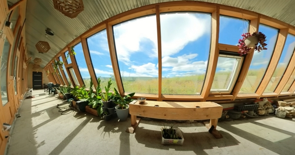
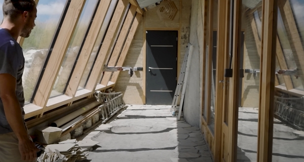
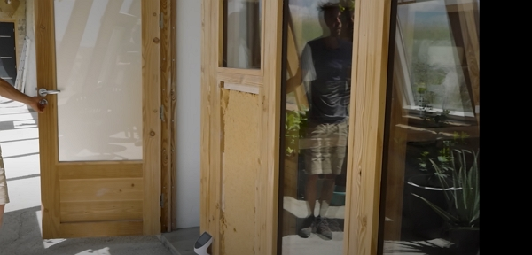
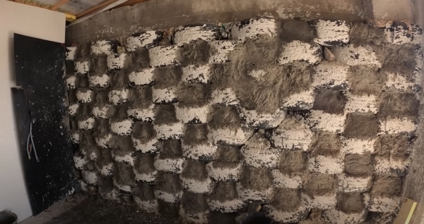
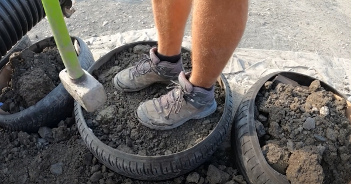
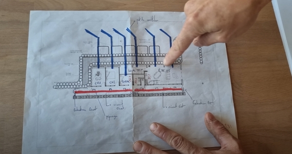
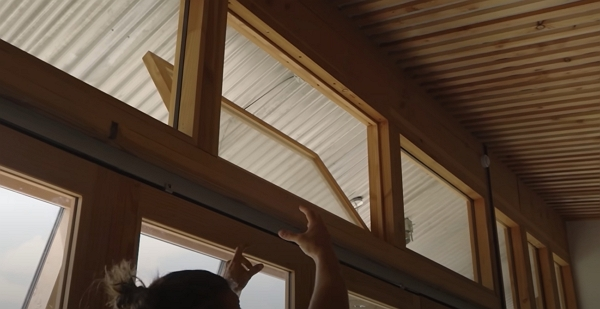
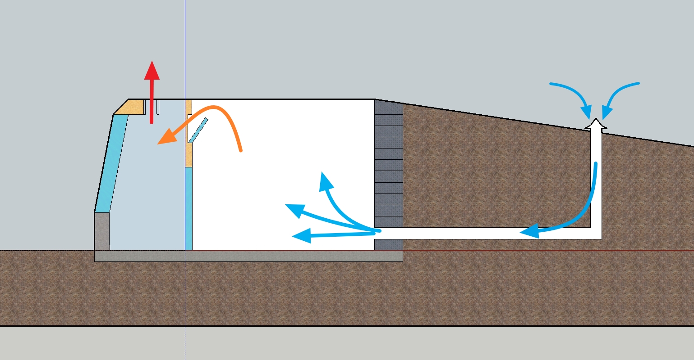
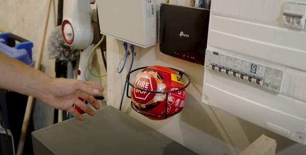
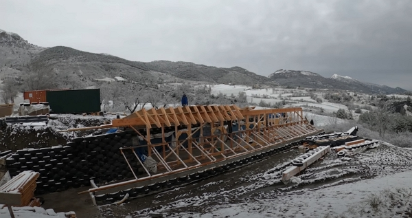

Merci à Brian pour le partage de cette expérience !

Merci à Luc et Magalie pour leur courage et honnêteté.

Cet article résume mes notes du vlog réalisé par Brian sur sa chaîne _L’Archi'Pelle_.

<!-- more -->

Vous pouvez retrouver [la vidéo sur YouTube](https://www.youtube.com/watch?v=uZFoSpYNTFk).

## Qu’est-ce qu’un géonef ou _earthship « inspiré »_

Le géonef, ou « Earthship » en anglais, est un type de construction introduite par un américain, Mickael Reynolds, dans les années 1970.

Le terme « inspiré » dénote le fait que le géonef de Luc et Magalie a été construit en s’adaptant aux normes françaises et au climat européen, très différent du climat au Nouveau-Mexique, aux Etats-Unis.

Dans le cas de ce géonef présenté par Bryan, Mickael Reynolds n’est pas intervenu.

De plus, le mot « Earthship » est un nom déposé.

Ils se sont tout de même fait assister par l’architecte de référence en la matière en France, Matthieu Guyomard et son équipe technique, surnommée _les Builder Brothers_. Vous pouvez voir son travail sur [son site web](https://lamatiere.org).

## Recensement des géonefs en France

Il existe une dizaine de maisons terminées et une quinzaine de projets en cours.

En 2023, il existe une communauté, des forums, il y a [la chaîne YouTube de Luc et Magalie](https://www.youtube.com/channel/UCNjnBUHZIh3jPwGi7E3SAjw).

Tout cela permet de comprendre la réalisation des géonefs bien plus simplement.

## Réaliser un géonef soi-même

Ce n’est pas simple.

Le principe de ce type de construction reste assez nouveau. Toutefois, ce n’est pas le type d’habitat qui a posé le plus de problèmes, mais le zonage (type « montagne »), le PLU, les strates décisionnaires avec la préfecture.

Le fait aussi que l’habitat allait être coupé des réseaux a ajouté d’autant de _bâtons dans les roues_ que Luc et Magalie ont rencontrés.

Il faut « se battre », car l’administration ne facilite pas les choses en voulant appliquer leur PLU ou leur vision des choses. Dans le cas de Luc et Magalie, il leur a fallu un an et demi pour obtenir l’accord d’implanter leur maison pour que celle-ci se trouve le plus au nord du terrain.

À la base, la mairie du village voulait imposer une position où ils auraient le terrain dans le dos, ce qui était inconcevable pour un géonef.

## Pourquoi le géonef

Le concept de géonef apporte de nombreux avantages en termes d’acoustiques, de performances thermiques, de luminosité et d'intégration dans son environnement. Tout cela rend ce type de logement très intéressant.

On peut, sous les latitudes de Luc et Magalie, se passer de chauffage l’hiver grâce aux apports calorifiques du soleil.

## Autour du géonef

Quand on construit un géonef, c’est qu’on a souci de construire une maison autonome et qui dit autonomie, dit jardin en permaculture ou culture sur sol vivant.

Par exemple, planter des arbres autour du potager est l’un des éléments clés de la résilience.

Si vous réalisez la construction en même temps que l’établissement des arbres, fruitiers ou pas, évitez les arbres à racine nus, si vous ne pensez pas pouvoir les arroser régulièrement.

Luc et Magalie sont partis des porte-greffes avec greffage et cela a mieux réussi.

Autre élément de l’autonomie, avoir des poules permet d’obtenir des apports riches en azote que le potager appréciera beaucoup.

## La serre

Dans celle de l’habitat de Luc et Magalie, elle est orientée légèrement Sud-Est pour éviter les très grosses surchauffes estivales.

Il faut aussi ne pas oublier de prévoir une _casquette_ pour la serre. En effet, ce n’est pas un problème l’hiver, car on veut que le maximum de rayons de soleil rentre, mais en été, si l’on fait comme Luc et Magalie, il peut faire très chaud dans la serre.

Le calcul de la taille de la casquette est sûrement réalisé par l’architecte ou le bureau d’études et il est fonction de l’orientation et de la latitude du lieu.

On peut aussi prévoir un vitrage droit plutôt qu’incliné comme chez Luc et Magalie.

Crédits : image extraite du vlog de L’Archipelle.

Au solstice d’hiver, le soleil pénètre jusqu’au mur au fond des pièces.

Au solstice d’été, le soleil n’illumine qu'une partie de la serre.

Au niveau des cellules botaniques, il est différent du géonef classique pour un souci pratique, mais surtout de contrôle de l’humidité.

En effet, [le géonef de Pauline et Benjamin](https://www.youtube.com/watch?v=LqzkyOHF7WQ), construit en Dordogne, a souffert de gros problèmes d’humidité au niveau des cellules botaniques, car le bois des fenêtres a été endommagé par des écoulements de condensation.

Luc et Magalie ont préféré maitriser l’apport d’eau.

Cela montre aussi que, même si Mickael Reynolds connait bien son concept, le géonef doit être construit avec les spécificités climatiques du lieu.

Cette serre, ou verrière, constitue le système de chauffage de la maison, sur les 25 mètres de long de la maison.

Grâce aux fenêtres coulissantes entre l’intérieur de la maison et la serre, en l’hiver, ils peuvent faire remonter la température jusqu’à 21 °C sans problème en quelques minutes.

Mais l’apport calorifique par le soleil ne serait rien sans le mur nord avec une masse thermique de 2 rangées de pneus, d’un mètre de terre en épaisseur totale et d'une couche d'isolant (non nommé dans la vidéo).

Crédits : image extraite du vlog de L’Archipelle.

Ils ont isolé entre la serre et l’intérieur de la maison avec de la laine de bois (je dirai entre 10 et 15 cm à vue d’œil sur la vidéo à [53:00](https://youtu.be/uZFoSpYNTFk?t=3180)).

## Le mur de pneus

Dans le cas de ce géonef, les pneus usagés de voiture ont été utilisés. Ceux-ci sont normalement brûlés pour faire du ciment (pas top en terme d’émissions toxiques…), mais, dans le cas du géonef, ils sont remplis de terre et enterrés, loin des rayons du soleil et de l'oxygène de l'air. Ainsi, aucune émission toxique n’est pas possible.

Une étude l’a démontré d'après Luc.



J’ai trouvé [cette étude](https://www.sciencedirect.com/science/article/abs/pii/S0141029622003145) **en anglais** réalisée en Australie, mais, comme elle est payante, je ne sais pas si elle mentionne la toxicité des pneus enterrés.

J’ai trouvé l’étude dans [cet article en français](https://www.build-green.fr/une-etude-ouvre-la-voie-a-une-utilisation-architecturale-generalisee-des-pneus-en-fin-de-vie/) qui résume l’étude, plus sur la structure et la solidité des murs.

Il y a aussi [le site « Pneusol.eu.org »](https://www.pneusol.eu.org/) et j’ai contacté les auteurs pour savoir s’ils connaissaient la référence de l’étude sur la toxicité.

D’après [« L’Action concertée de la D.G.R.S.T (Délégation Générale à la Recherche Scientifique et Technique) : Récupération du caoutchouc et des matières plastiques »](https://www.pneusol.eu.org/TheseLong/FR/1-dgrst78.pdf) :

> La corrosion des pneumatiques est pratiquement nulle dans le sol.



Avec ce mur de pneus remplis de terre compactée, la masse thermique absorbe l’été la chaleur et la rediffuse l’hiver (grâce au principe de conduction).

L’épaisseur des murs est étudiée pour accumuler 6 mois de l’année et restituer sous forme d’infrarouges les 6 autres mois pour « chauffer » l’habitat.

Avec ce type de mur, Luc et Magalie ont 23 °C dans l’habitat avec plus de 40 °C dans la serre.

Pendant la construction, ils ont découpé un flanc pour des raisons pratiques. À la masse, ils ont tassé la terre et cela constitue le mur calorifique.

Le mur est complété d’un enduit argile-paille à l'intérieur de l'habitat pour ses propriétés hydro-régulatrices. Derrière les pneus, ils ont mis 1 mètre de terre, un isolant, une étanchéité et un mur drainant, obligatoire quand on est sous terre afin de diriger les écoulements d'eau hors de l'habitat.

## La dalle

Elle a été isolée avec un isolant proche de la _pouzolane_ connu sous le nom de _misapor_. Il s’agit d’un granulat de verre isolant et assurant une non-remontée par capillarité de l'humidité.

## Les retours de mur

En général, les retours de mur sur les côtés sont eux aussi en pneus.

Dans le cas de l’habitat de Luc et Magalie, c’est uniquement le côté ouest qui est ainsi isolé.

Le côté est reste ouvert, pour la luminosité supplémentaire, et le mur a été réalisé en béton de chanvre qui donne un beau rendu et procure des avantages thermiques, acoustiques, hydro-régulatrices et anti-feu non négligeables.

## La climatisation

Pour éviter la surchauffe, des puits de ventilation courent dans le mur sur 6 mètres à l’horizontale et 3 mètres à la verticale. La température à 1,5 mètre de profondeur, et au-delà, est de 13 °C et cela est utile en été.

En hiver, ils sont fermés.

Avec l’extraction mécanique de l’air par la serre, une dépression se forme, aspirant l’air chaud de l’intérieur de la maison dans la serre vers l’extérieur. Et par conséquent, l’air frais entre par les puits qui rafraîchissent l’habitat.

En tout cas, il faut le savoir, dans un géonef, il y a des différences de température importantes :

- en été, on passe de 42 °C dans la serre à 23 °C ou moins dans les pièces de vie.
- en hiver, il fait plus chaud dans les pièces de vie que dans la serre, selon la météo et l’ensoleillement.

C’est important à savoir, surtout pour ceux qui n’aimeraient pas les grands delta de température.

## Cuisine

Luc et Magalie utilisent le gaz, qu’ils aimeraient produire eux-mêmes grâce à la formation de [picojoules](https://www.picojoule.org/) sur la production de biogaz.



Comme chez moi, ils utilisent en journée une plaque à induction et un petit four, alimentés par l’excédent de production électrique.

À la maison, et l’été, l’eau chaude sanitaire est chaude très rapidement et donc on se permet de cuisiner dans la véranda le riz, les légumes vapeur en cuisant doucement, mais alimenté principalement par le solaire.

On reste raccordé au réseau pour le moment.



## Les toilettes sèches

Ce n’est pas toujours facile de faire accepter de faire ses besoins dans des toilettes sans eau.

Dans le cas de Luc et Magalie, ils ont opté pour la séparation des urines du reste, car ils voulaient valoriser les urines en tant qu’engrais au jardin.

Toutefois, pour éviter la manutention avec une cuve, ils utilisent un système de la marque _Trobolo_.

Pour finir, ils ont prévu un retour vers des toilettes classiques pour leurs vieux jours.

Ils ont eu l’idée d’utiliser la chasse d’eau pour diluer les urines à 10 % et l’utiliser au jardin. Le problème est qu’il aurait été mieux de dédier un tuyau d’évacuation pour cela.

Je n’ai pas trop compris comment ils ont fait, car l’urine est diluée dans leur évacuation principale (qui va vers la phytoépuration), mais ils la récupèrent et l’envoient dans la cuve de stockage en surplomb du jardin.

### Et la phytoépuration

Ils sont passés par Aquatiris pour celle-ci. Ils ont maçonné le bac de phytoépuration avec le reste de pneus usagés.

## L’eau dans le géonef

Il y a 5 cuves de 5000 litres, ce qui peut paraitre surdimensionnés, mais avec l’évolution de climat, il vaut mieux prévoir plus que pas assez.

Dans le cas de Luc et Magalie, ils utilisent l’eau pour le sanitaire et la consommation d’eau potable. Toutefois, à terme, il n’est pas exclu qu’ils l’utilisent aussi pour le jardin.

Le système de remplissage de chaque cuve par trop plein a été réalisé comme le recommande [Pierre l’écoleau](https://www.ec-eau-logis.com/). Du coup, à la cinquième cuve, l’eau est limpide.

Pour mesurer le niveau d’eau, il utilise le principe d’Archimède avec un tuyau plastique connecté à la sortie de la cinquième cuve ([voir à la démonstration à partir de 30:54 dans le vlog](https://youtu.be/uZFoSpYNTFk?t=1854)).

Ensuite, ils ont installé une pompe de type camping-car, pour mettre en pression l’eau.



La pompe fait du bruit et il faut réfléchir à sa position. Surtout que dans le cas de l’habitat de Luc et Magalie, la pompe vibre et cela s’entend dans la charpente et les vibrations sont ressenties dans les diverses pièces de la maison.



L’eau sous pression à 3 bars vient ensuite remplir une vessie de 100 L, qui continue son parcours dans une série de filtres.

Le premier est un filtre textile à 50 micromètres.

Entre le premier et le second filtre, un tuyau va alimenter les éléments de la maison ne nécessitant pas d’eau potable.

Le second est un filtre textile à 20 micromètres. Le troisième est un filtre à charbon actif. Le quatrième est un filtre textile à 1 micromètre qui est particulièrement utile pour filtrer les _déchets du charbon actif_, qui peuvent facilement bloquer la céramique…

Le quatrième est un filtre à céramique avec 6 bougies à 0,2 micromètre.



Luc et Magalie ont remarqué une baisse de pression tous les mois et demi et ils ne savent pas si cela ne viendra pas de l’argile très fine présent dans leur eau et qui boucherait la céramique.

Normalement, la maintenance est réalisée tous les 6 mois.

Ils cherchent encore la source du problème et sa solution.



Je me suis posé les questions suivantes :

- les cuves permettent-elles un nettoyage ?
- quelle est la régularité du nettoyage ? Je suppose que la cuve 1 est plus _encrassé_ que la cuve 5, n’est-ce pas ?

## L’eau chaude sanitaire

Ils utilisent un système solaire thermique en tubes à vide, et une chaudière à gaz pour de l’appoint.

Pour le thermique solaire, le système de tubes à vide est populaire en Portugal, Maroc, Turquie, mais pas en France. Pourtant le rendement est supérieur. Toutefois, les tubes sont fragiles, donc il faut protéger les capteurs contre la grêle par exemple.

Dans [cette autre vidéo](https://www.youtube.com/watch?v=LqzkyOHF7WQ) dont j'ai pris [les notes il y a 2 ans](https://medium.com/@jeremie-litzler/earthship-g%C3%A9onef-une-maison-autonome-et-autosuffisante-a62e593e270), Brian a rencontré une charmante dame qui protège ses capteurs avec du grillage à poules ou à lapin tendu au-dessus.

Luc et Magalie utilisent un circulateur pour l’échange thermique dans le ballon.

À la sortie du ballon d’ECS, une vanne thermostatique mesure l’eau de sortie, et si nécessaire, c’est là que le chauffe-eau au gaz ajuste la température à 60 °C pour éviter les problèmes de salmonelles.

Avec cet appoint de gaz, ils consomment une bouteille par an environ, dans leur région bien ensoleillée et avec 2 mètres carrés de capteur thermique solaire.

## La production d’électricité

### Sécurité

Quand on parle de production d’électricité, surtout avec des batteries pour le stockage, il y a toujours un risque et Luc et Magalie utilisent des extincteurs automatiques.

Ils explosent au contact de flammes en dégageant du CO2 et de la poudre.

Pour en trouver, il faut simplement chercher sur Internet « *boules incendie* ».

### Dimensionnement et configuration de l’installation

Ils ont installé 4,7 kWc de panneaux couplés à 2 fois 4 kW de batteries lithium.

Ils ont pensé à la technologie Nickel-Fer, plus durable, mais l’entretien régulier leur a fait choisir la _facilité_.

Ils utilisent la marque BYD, connue pour les véhicules électriques.

Avec ce dimensionnement de batteries, ils n'ont eu de problème, sauf un jour, en hiver, où la capacité des batteries est descendue à 8 %.



Vivre en autonomie signifie surveiller sa production et gérer sa consommation, aussi bien en électricité qu'en eau.

Cela permet de se reconnecter à la nature en travaillant étroitement avec ce qu’elle nous apporte.

Rien n’est automatique et comme sur la mer, on doit ajuster le cap en fonction des énergies et des ressources mises à disposition.

Il faut donc mesurer et décider.



Côté onduleur, ils utilisent :

- un onduleur Fronius pour recevoir l’énergie des panneaux en DC
- un onduleur Victron Multiplus 2 5000VA et 48V pour convertir le DC en AC.

Enfin, au bout du circuit, on trouve les éléments de sécurité pour les batteries et des tableaux électriques respectant les normes pour desservir le courant AC dans la maison.

Luc a appris « quoi et comment » installer tout cela avec Kévin et Salomé de la chaîne _Comme un pingouin dans le désert_ et les nombreuses ressources sur Internet.

En moyenne, la capacité de la batterie descend de 20 % par nuit, été comme hiver. Il faut savoir que, même lorsqu’il fait gris, les panneaux photovoltaïques produisent assez pour remplir ces 20 %.

## Connexion Internet

Comme chez moi, ils utilisent un routeur 4G+ de la marque TP-Link qui permet d’utiliser une carte SIM classique et de profiter d’une connexion Internet plus que décente.



Dans mon cas, j’ai installé le routeur à 100 mètres de la maison, pas seulement pour éviter les ondes électromagnétiques dans la maison, mais aussi parce que la réception était bien meilleure là-bas.

J’ai construit une tour en moellons et j’ai abrité le routeur dans sa maison en bois.

Résultat : entre 40 et 50 Mo/s descendants et une petite dizaine en débit montant.

Cela m’a coûté un peu plus de 300 euros avec :

- le routeur (135 euros il y a 3 ans),
- le câble d’alimentation de 100 mL en 1,5 mm²,
- le câble Ethernet Catégorie 6 de 100 mL
- et les petites bricoles comme les prises mâle et femelle pour l’alimentation et un petit adaptateur pour connecter 2 câbles Ethernet ensemble.

Au passage, la distance n’a aucun effet sur le débit : j’ai testé directement connecté au routeur et derrière le switch Cisco 8 ports dans la maison et le débit restait identique.

Aussi, je n’ai pas mis de parafoudre, car le routeur n’est pas en route sauf si l’on s’en sert et on le débranchait au cas d’orage.



Le choix de l’opérateur dépend de l’antenne mobile la plus proche de chez soi sur [https://antennemobile.fr](https://antennemobile.fr).

Aussi, pour améliorer le débit, il est possible de combiner 2 opérateurs pour faire de l’agrégation de signal.

## Comment apprendre et réaliser tout cela

Il y a tellement de ressources sur Internet, de différentes communautés, on peut apprendre.

Toutefois, il faut de l’aide humaine et les chantiers participatifs sont la clé, même s’il n’a pas été facile de réaliser des chantiers 7 jours sur 7.

60 bénévoles sont passés sur le chantier de Luc et Magalie et sans eux, rien n’aurait été possible.

Il ne faut pas non plus sous estimer l'aide de professionels, comme Matthieu Guyomard.

## Inconvénients et avantages du géonef

Pour construire un tel habitat, on n’utilisera pas forcément que des matériaux écologiques : le béton est utilisé en bonne quantité, des isolants issus de l’industrie pétrochimique pour leurs propriétés imputrescibles (quand on n’a pas les moyens d’utiliser du liège) peuvent faire partie des choix réalisés.

Mais, les capacités thermiques et le recyclage de certains matériaux rééquilibrent l’ensemble.

## Le côté financier

Pour 200 m² dont 150 m² habitables, Luc et Magalie ont dépensé 165 000 euros pour la construction de l’habitat. À cela, il faut ajouter ensuite 75 000 euros pour le terrain de 5600 m².

Les banques ne sont pas vraiment présentes en autoconstruction… Il faut donc autofinancer le projet.

Dans le cas de Luc et Magalie, ils ont quand même réussi à financer le terrain avec un prêt.

### Comment trouve-t-on 165 000 euros en fonds propres avec des salaires modestes

Il faut faire un prévisionnel et _serrer la ceinture sur le dernier niveau_… pendant plusieurs années !

Luc et Magalie avaient un van au départ, dans lequel ils voyageaient dans toute la France, pour apprendre sur des chantiers participatifs et découvrir les régions de France et faire leur choix.

Ils se sont mis à réparer plus que la moyenne, ce qui allait dans le sens du géonef où l’on est _capitaine du vaisseau_ et l’on n’est pas en mode _consommateur lambda_.

**Le plus important pour y arriver** est de rester aligner avec ses valeurs tout le long.

Même après la construction, Luc et Magalie n’ont que très peu changé leur mode de vie.

> Le bonheur n’est pas dans l’avoir, mais dans l’être.
>
> ~ Luc.

_In fine_, cela donne une liberté financière encore plus importante après le chantier.

Mais il faut le vouloir, ce qui rejoint la définition des valeurs de la personne ou du couple.

## Le côté prise de conscience

Luc et Magalie sont passés par toutes les options : yourte, tinyhouse, caravane. Mais c’est bien le géonef qui les a séduits.

Pourquoi ? Selon Luc, les autres habitats type yourte, tinyhouse ou caravane signifient une plus grande précarité lorsqu’on vit dans ceux-ci.



Tout est une question point de vue de chacun.

[L’association des hameaux légers](https://hameaux-legers.org/), par exemple, travaille avec acharnement pour faciliter l’accès aux hameaux légers et de les faire reconnaître auprès des autorités.

Peut-être que cela améliorera la qualité de vie dans les habitats légers.

Leur campagne de financement participatif a permis de rassembler pour développer un centre de formation pour créer son habitat léger.

Ainsi, pour certains, l’habitat peut ne pas être précaire, mais simplement plus petit par rapport à l’habitat aux dimensions conventionnelles.



Luc et Magalie se sont rencontrés alors qu’ils vivaient tous les deux ce malaise de la vie de société qu’on vit tous : boulot de 9 h à 17 h, vivre en ville, dans un appartement, etc.



Je ne pense pas que tout le monde choisisse la vie en ville, dans un appartement, ou le boulot de 9 h à 17 h, mais la majorité tombe dans ce cas.

La société, le modèle économique actuel, nous fait croire que cela est le plus simple, le meilleur pour vivre.

Toutefois, je pense qu’on devrait plus remettre en question ces fausses généralités: _Le modèle identique pour tout le monde_ est-il viable ? N'y a-t-il pas une résilience innée dans la diversité des réalisations ? Se remettre en question quand on sent que les choses ne vont pas est sûrement un bon point de départ.

Il faut construire des projets uniques et les partager pour en inspirer d’autres après nous.



Posez-vous les questions suivantes :

- où ?
- comment ?
- pourquoi ?
- avec quoi ?

Rapidement, on se rend compte qu’il faut alors :

- changer de travail ou de façon de travailler
- mettre de l’argent de côté pour acquérir une indépendance financière

Rien que ça, cela peut être effrayant !

## Le côté administratif

Quand on vient vers la mairie pour obtenir les permis, on peut simplement dire :

> Nous voulons construire une maison.

Il faut ensuite batailler pour l’autonomie en eau, en électricité, en phytoépuration, car ce n’est pas le chemin commun de s’établir hors réseaux.

Dans le cas de Luc et Magalie, cela a pris du temps, car chaque aspect de la maison donnait lieu à des discussions.

Même si l’on parle de développement durable, respect de l’environnement, ils n’ont pas été accueillis comme ils le pensaient.

L’administration a mis beaucoup de _bâtons dans les roues_ et il faut le savoir : c’est le cas pour beaucoup de ce type de projet.



C’est nouveau, c’est différent, ça peut faire un peu peur et cela prend beaucoup plus de temps pour l’administration à comprendre et accepter.

Mais les consciences évoluent et il faut persévérer.



La leçon de Luc et Magalie : il ne faut rien lâcher.

## Le côté réaliste

On en vient au côté réaliste, où il ne faut pas être trop naïf.

Luc et Magalie ne s’attendaient pas du tout ce qu’ils ont vécu et, comme ils le disent, ils se sont _pris quelques claques_.

D’abord, du point de vue technique, ayant choisi un bâtiment non conventionnel, ils ont fait face à pas mal de problèmes techniques pas très simples à résoudre.

> Le _faire le choix parmi les solutions_ est l’étape la plus compliquée, bien loin devant la réalisation.

Ils sont passés par plusieurs chantiers participatifs, épaulés par de nombreux bénévoles. Sans cela, le chantier de 3 ans en aurait pris plus de 10.

Toutefois, recevoir des bénévoles signifie les nourrir et les loger. Ce n’est pas une tâche simple.

Et ils ont dû travailler 7 jours sur 7, été comme hiver.

Par conséquent, si le couple ou même l’équipe des travaux ne s’entend pas, cela peut devenir très très compliqué et épuisant mentalement et physiquement.

De plus, il ne faut pas oublier qu’on ne peut pas laisser de côté le travail, _le gagne-pain_, même si, il faut être réaliste, Luc et Magalie ont diminué le temps passé dans celui-ci.

Dans la quête d’autonomie, il faut faire des changements : passer en travailleur indépendant par exemple.

### Comment réussir alors ?

Il faut prendre du recul.

Il faut bien se connaitre.

Il faut bien partager les mêmes valeurs.

Il faut être honnête.

Les bénévoles ont été très motivants et ils ont amené de la fraîcheur au projet dans les moments difficiles en (re)motivant Luc et Magalie.

À chaque vague de bénévoles, ils ressentaient la fraîcheur et la volonté de faire progresser.

Aussi, il faut prendre en compte la météo et les saisons et il faut prioriser la mise hors eau.

## Conclusion

Luc et Magalie sont vraiment contents de pouvoir participer à montrer l’exemple et à inspirer beaucoup de monde.

> Quand on a des rêves, c’est possible de les réaliser. Il faut se donner les moyens. Le chemin peut être long, il peut être semé d’embûches, mais il faut rester souder et être conscient où on est et où on veut aller.
>
> ~ Magalie

Et garder un regard d’enfant, car cela rend les choses plus simples.
