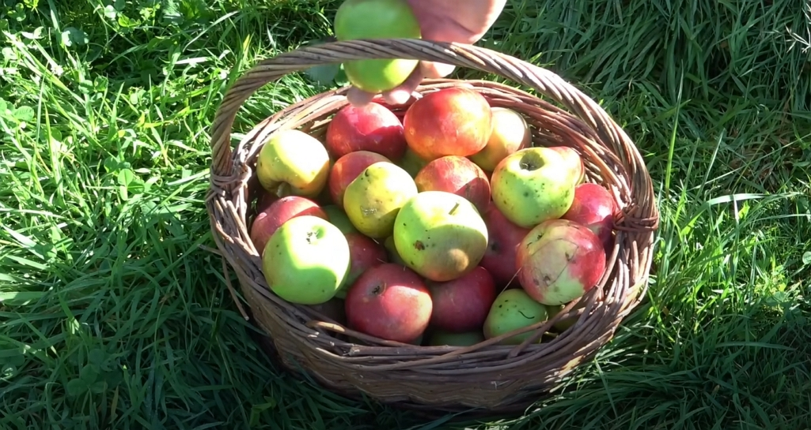
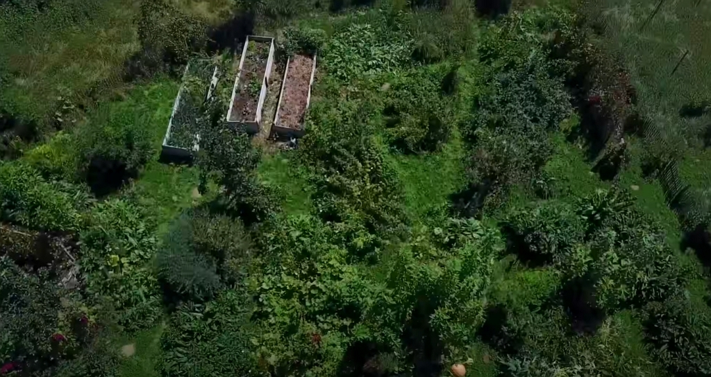
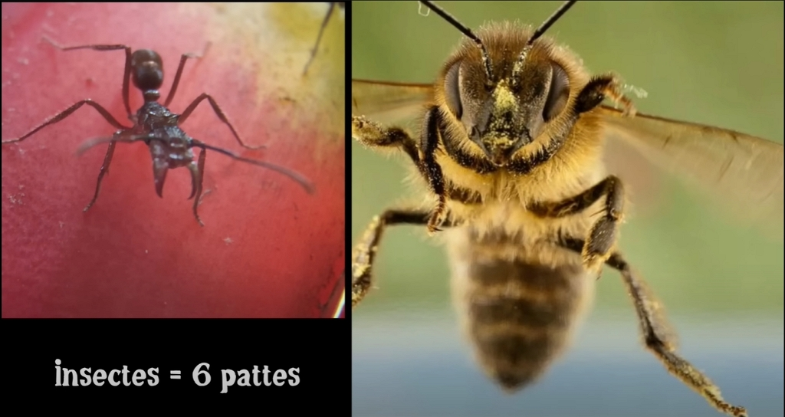
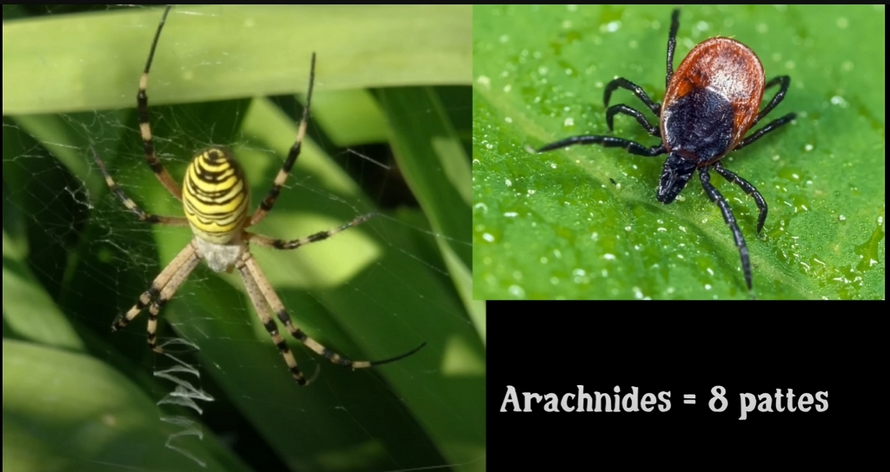
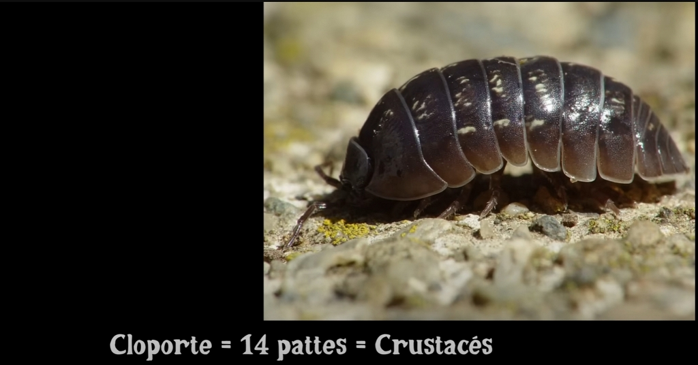
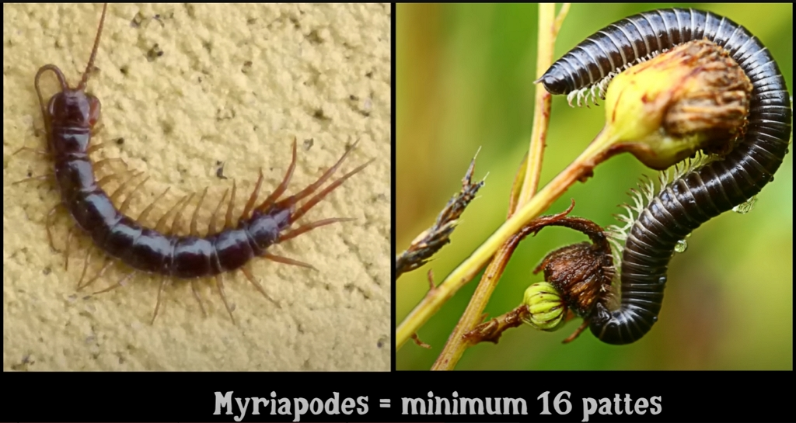
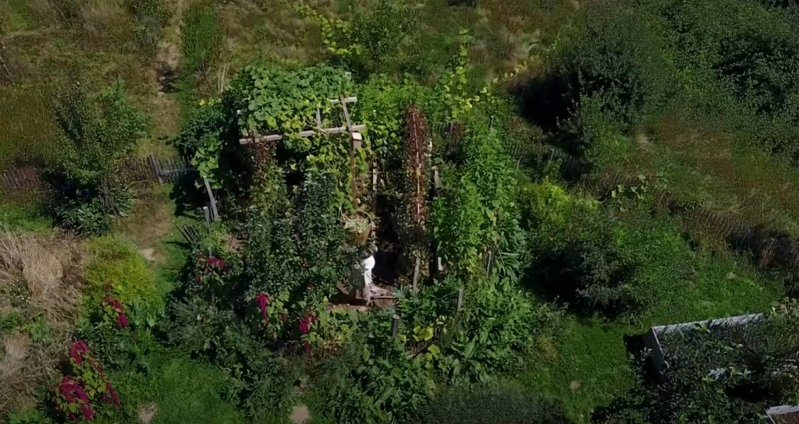
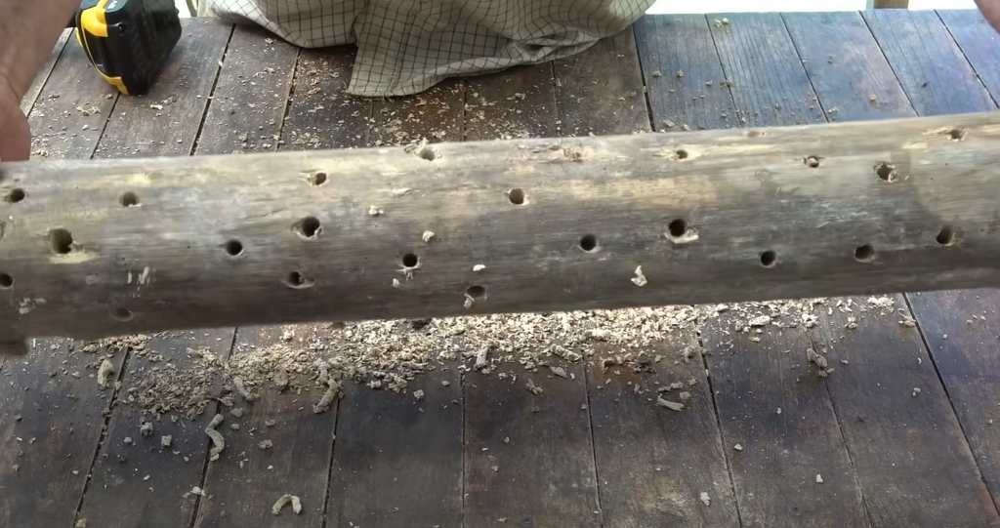
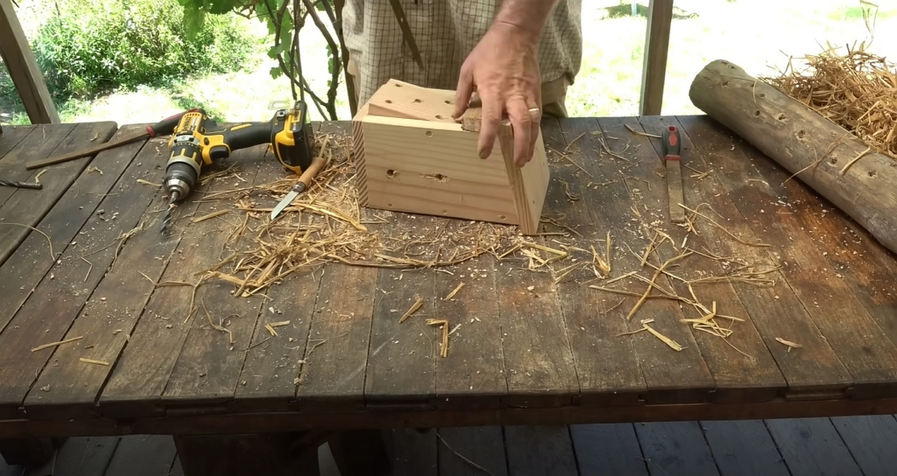
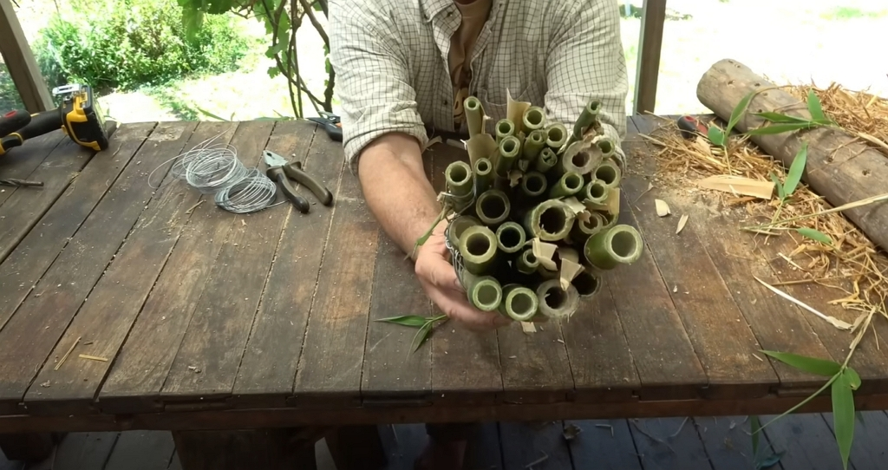

Merci à Damien pour le partage de son savoir ! Cet article résume mes notes du vlog réalisé par Damien sur sa chaîne _Permaculture, agroécologie, etc_.

<!-- more -->

Vous pouvez retrouver [la vidéo sur YouTube](https://www.youtube.com/watch?v=PmWl6oY8ChI). Les notes qui suivent incluent aussi ce que Damien a partagé il y a 7 ans dans [cette autre vidéo](https://www.youtube.com/watch?v=con-c2_o9uc) au mois de septembre.

## Le point sur les récoltes

C’est très actif au jardin ce mois-ci : les légumes, les fruits et bien d’autres végétaux comestibles pour leurs feuilles (ex. du tilleul bien que le meilleur moment de l’année soit le printemps, car les feuilles sont tendres) ou leurs graines.

Si vous suivez Damien ou que vous avez lu mes notes sur les mois précédents, Damien évoquait le pommier dans le jardin de 25 m² : il n’était pas sûr qu’il produirait.

En fin, il a bien donné 5 ans plus tard !

Crédits : image extraite du vlog de Damien Dekarz.

### … et les semences

On laissera les courgettes, les courges, les tomates ou encore les laitues grossirent le maximum ou monter en graine pour que les semences soient bien matures.



Dans mon cas, j’ai cultivé du basilic pourpre cette année à partir de graines que j’avais récupérées d’un plant l’année dernière.

Le plant a bien poussé et il monte à son tour en graine.

<!-- Mettre une photo -->



### Laisser les vieux plants

Même s’il est vrai que cela n’est pas _esthétique_, laissez vos anciens plants sur place. Ne les jetez pas !

Les déchets seront utiles pour enrichir le sol.

### Et les plants malades ?

Les arracher et les brûler n’est pas très utile. Je suis tout à fait d’accord avec Damien pour que les légumes apprennent et deviennent plus résistants.

Ainsi, si le mildiou a sévi sur les tomates, laisser au sol les plants malades et planter autre chose au même endroit l’année qui suit.

## Truc n° 1 : préparer la serre pour l’automne

Cela signifie qu’il faut sacrifier des plants de tomates dans le cas de Damien pour libérer de l’espace.

Mais pourquoi ?

Il souhaite produire au maximum dans la serre toute l’année, bien sûr, en choisissant les cultures adéquates pour l’automne et surtout l’hiver, qui est assez rude en Corrèze.

En gros, cela comprend :

- les épinards
- les laitues
- les radis
- la roquette
- la mâche



Ça me fait penser que je devrais m’essayer à planter des épinards pour cet hiver.

Pour cela, il faudrait que j’ajoute du compost dans le jardin !



Damien resème directement en terre après avoir nettoyé la zone de culture.

Il évite de pailler la zone avec du foin à cause des graines qu’il contient et qui pourraient germer avec les semis en pleine terre…

## Truc n° 2 : Les engrais verts

Crédits : image extraite du vlog de Damien Dekarz.

Généralement, en automne et en hiver, semer des engrais permet de garder le sol couvert, surtout quand l’activité de culture est ralentie dans certaines zones devenues vierges après les récoltes.

### Quels engrais verts

On peut utiliser :

- la phacélie
- le trèfle incarnat (qui fixe l’azote atmosphérique, très utile pour enrichir le sol au printemps)

L’engrais vert est ensuite couché au printemps.

Dans le cas du trèfle, les fleurs sont aussi très belles et mellifères.

## Truc n° 3 : Préservation de la biodiversité

Ceci est un sujet qui tient à cœur à Damien et qui ne le serait pas quand on voit ce que la nature nous offre. En prenant soin de la vie qu’on y trouve, on prend soin de nous.

Par exemple, les arthropodes incluent les arachnides, les crustacés, les myriapodes et les insectes.

Toutes les _petites bêtes_ que l’on voit au jardin sont utiles.

Les insectes, comme la fourmi et l’abeille, ont 6 pattes, pour **très faire simple.**

Crédits : image extraite du vlog de Damien Dekarz.

Chez les arachnides, cela inclut les araignées et les tiques.

Crédits : image extraite du vlog de Damien Dekarz.

Chez les crustacés, on trouve par exemple le cloporte.

Crédits : image extraite du vlog de Damien Dekarz.

Enfin, on trouve les myriapodes avec au moins de 16 pattes.

Crédits : image extraite du vlog de Damien Dekarz.

Selon une étude allemande, 60 % des arthropodes auraient disparu. Que cela soit juste ou pas, préserver la biodiversité est une tâche essentielle du jardinier.

### Créer des habitats pour la biodiversité

Peu importe la surface que vous avez à disposition, vous pouvez faire un geste, même petit.

Par exemple, Damien suggère de :

- des tas de pierres
- des tas de bois
- de l’eau
- des zones sèches
- des zones humides
- des arbres morts
- des arbres vivants

Le but est d’avoir un maximum de biotopes.

En septembre, créer des nids pour les arthropodes permet qu’ils restent sur votre jardin durant l’hiver.

Crédits : image extraite du vlog de Damien Dekarz.



Même si construire un hôtel à insectes est très pédagogique, cela pose un problème : les locataires vont se manger les uns les autres…



Damien suggère de construire des nichoirs.

### Comment construire les abris de biodiversité

On peut utiliser un rondin de bois dans lequel on vient percer des trous assez profonds comme l’image ci-dessous le montre.

Crédits : image extraite du vlog de Damien Dekarz.

Autrement, vous pouvez utiliser un nichoir d’oiseau dans lequel on fera aussi des trous. Mais surtout, il faudra boucher l’entrée aux oiseaux pour éviter que l’hôtel des arthropodes devienne une cantine pour oiseaux…

Crédits : image extraite du vlog de Damien Dekarz.

Enfin, un dernier exemple d’abris pour arthropodes : un _fagot_ de bambou peut faire l’affaire.

Crédits : image extraite du vlog de Damien Dekarz.

Ensuite, allez les installer à divers endroits de votre jardin.

Pour les coccinelles, il faut disposer les abris au soleil pour que ça chauffe assez, surtout au plus froid de l’hiver.

## Conclusion

Et vous, que faites-vous au jardin en septembre ?

N’hésitez pas à partager cela sur les réseaux sociaux.
