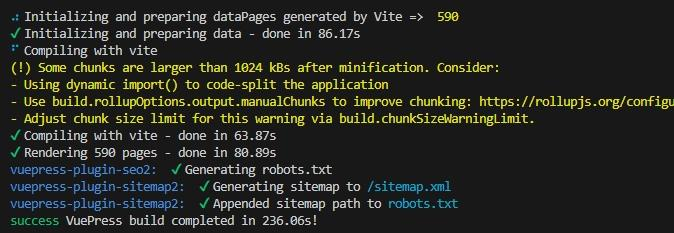

Au travail, la génération du site nécessite :

- 86 secondes pour initialiser et préparer les données
- 64 secondes pour compiler
- 81 secondes pour générer les pages

Ce qui équivaut à 236 secondes au total.



Sur une machine virtuelle sur laquelle nous travaillons, cela prend :

- 61 secondes pour initialiser et préparer les données
- 199 secondes pour compiler
- 90 secondes pour générer les pages

Ce qui équivaut à 368 secondes au total.

Cela semble bien et le canal d’intégration contenu sur Azure DevOps prend environ 4 minutes, ce qui est similaire.

Mais deux collègues ont rapporté que cela avait pris plus de 800 secondes pour eux…

La raison derrière cela est détaillée ici : [https://github.com/orgs/Vuepress-theme-hope/discussions/2887](https://github.com/orgs/Vuepress-theme-hope/discussions/2887).

Personnellement, sur mes sites web, j’ai plus eu des problèmes de SEO :

- taxonomie non normalisée,
- pas d’accès à la personnalisation des pages de catégories et de tags,
- frontmatter gonflé pour ajouter des liens canoniques et des méta OpenGraph.

## Quelle alternative

### L’objectif

J’avais besoin :

- des fonctionnalités en termes de syntaxe Markdown,
- d’une génération performante,
- d’une prise en charge de "blockcontainer", par exemple pour afficher des notes, des conseils, des avertissements, etc.,
- d’une prise en charge des métadonnées pour OpenGraph et canonique,
- d’une taxonomie avec catégories et tags,
- des liens "Markdown" pour lier les articles les uns aux autres.

De plus, si je pouvais avoir un support pour le référencement naturel avec la possibilité de personnaliser le titre et la description de toutes les pages (en particulier les pages de taxonomie) et de normaliser les URL pour que le référencement soit heureux, ce serait génial.

Ce dernier point serait possible (une belle surprise), mais je ne le savais pas lorsque j’ai commencé à enquêter sur Hugo.

### Le choix

J’ai pensé à utiliser un générateur de site statique comme Hugo pour son efficacité sur l’étape de génération.

Cela nécessiterait cependant d’adapter le contenu, car Vuepress et Hugo sont très différents lorsqu’il s’agit d’analyser et convertir le Markdown en HTML (le premier est en JavaScript et l’autre en Go…).

Et je ne connaissais rien au langage Go :O

## Prérequis avec Hugo

Tout d’abord, nous avons besoin de :

- télécharger et installer `Go` (rien de particulier à faire pendant l’installation, juste "Suivant, suivant, suivant…") : [https://go.dev/dl/](https://go.dev/dl/)
- télécharger Hugo (j’ai téléchargé la version 0.117.0) : [https://github.com/gohugoio/hugo/releases/](https://github.com/gohugoio/hugo/releases/)

### Installer Hugo

Pour les utilisateurs Windows, il faut :

- Créer un dossier `Hugo` dans `C:\Program Files`
- Copier le contenu du ZIP, téléchargé précédemment, dans `C:\Program Files\Hugo`
- Ajouter au `PATH` le chemin vers le dossier content l’exécutable de Hugo : `C:\Program Files\Hugo`
- (Re)Lancer Visual Studio Code et ouvrir le terminal `Git Bash` avec `CTRL+ù`.
- Exécuter la commande `hugo`. Vous devriez lire le message “_Error: Unable to locate config file or config directory. Perhaps you need to create a new site_”. Cela confirme qu’Hugo est bien installé :)



Pour lancer la commande `hugo`, préférez l’usage de :

- Git Bash, inclut avec Git par défaut.
- Powershell 7.x ou plus récent.



## Les tâches de migration du contenu

### 1- Ne pas utiliser les _blocs de code_ avec des "{x,y,...}" suivant la déclaration du langage de programmation

Quelque chose comme ce qui suit ne compilera pas :

````markdown
```xml{1,26}
... some XML ...
````

Nettoyez ces cas si vous en avez.

### 2- Copier le contenu de `.Vuepress/public` dans le dossier `content/static`

De plus, si vous utilisez quelque chose comme Drawio et que vous utilisez la fonctionnalité _export en HTML_, vous devrez ajouter ce qui suit en haut de chaque fichier HTML exporté :

```markdown
+++
+++
```

Cela permet que le site web soit généré sans erreur (voir [cette discussion sur le forum de Hugo](https://discourse.gohugo.io/t/solved-using-html-for-content-pages-instead-of-markdown/3374/5)).

### 3- Renommer tous les `README.md` en `index.md`, si vous l'utilisez pour nommer le fichier racine d'une page ou d'un article

Hugo exige que les fichiers markdown d'un répertoire soient nommés `index.md` lorsque vous utilisez la structure de dossiers suivante :

```md
content/
    |__ post/
        |__ mon-article/
            |__ index.md
            |__ images/
```

J'ai vu des tutoriels où les gens les nommaient `quelque-chose-d-autre.md`, mais c'est lorsque vous utilisez cette autre structure de dossiers :

```md
content/
    |__ post/
        |__ mon-article.md
```

Je préfère le premier, car je conserve les images spécifiques à une publication au même endroit que le fichier Markdown.

Le script ci-dessous doit être exécuter dans le dossier `content` pour renommer les `README.md` en `index.md`.

```bash
find . -iname 'README.md' -execdir mv {} index.md \;
```

### 4- Choisir le thème

J'ai tenté d'utiliser le thème suggéré par la documentation de Hugo. Toutefois, il est trop simpliste et surtout, je n'arrivais pas à afficher les pages de type "liste" à s'afficher correctement.

Puis, je suis tombé sur [le thème de Jimmy](https://github.com/CaiJimmy) : [https://github.com/CaiJimmy/hugo-theme-stack-starter](https://github.com/CaiJimmy/hugo-theme-stack-starter).

Il est riche, fonctionne et est documenté !

Avec ce thème, il me manquait les blocs de mise en avant de contenu que j'utilisais sur Vuepress pour tout ce qui est notes, astuces, avertissements et messages de danger.

### 5- Personnaliser la thème

Pour être honnête, aux premiers abords, le thème recommendé par la documentation de Hugo m'a rendu confu à propos du fonctionnement de Hugo.

Puis, en utilisant le [thème de Jimmy](https://github.com/CaiJimmy/hugo-theme-stack-starter), j'ai commencé à comprendre.

Mon but était de conserver les liens relatifs naturels entre les différents fichiers (liens relatifs) du site web et utiliser la syntaxe Vuepress fournie dans le thème de Mr Hope pour [l'usage des blocs de mise en avant de contenu](https://theme-hope.vuejs.press/guide/markdown/container.html).

#### Les liens relatifs

Par défaut, Hugo ne fournit pas la possibilité de générer un lien relatif d'un page ou d'un article à un autre :

```markdown
[Mon lien vers une autre page dans le site web](../page/a-propos.md)
```

Le Markdown ci-dessus deviendrait en HTML ceci :

```HTML
<a href="https://mondomaine.com/page/a-propos/">Mon lien vers une autre page dans le site web</a>
```

Même si les auteurs de Hugo et la documentation proposent d'utiliser le _shortcode_ ``, ce n'est pas du tout pratique et cela ne permet pas d'utiliser l'intellisense dans VSC pour sélectionner le fichier cible.



Faites ce que Joe Mooring indique [dans le ticket GitHub du dépôt de Hugo](https://github.com/gohugoio/hugo/issues/11054#issuecomment-1572295424).



De plus, je n'arrivais pas à trouver comment remplacer les centaines de liens relatifs sur mes sites Web pour passer de la syntaxe native markdown à la syntaxe shortcode...

Heureusement, après un peu de recherche, j'ai trouvé un autre modèle pour écraser la logique par défaut dans `render-link.html` et cela me permet de générer des liens relatifs comme je le voulais.

Voici le code [dans mon dépôt](https://github.com/JeremieLitzler/jeremielitzler.fr-with-hugo-theme-stack/blob/master/layouts/_default/_markup/render-link.html).

Vous devez le mettre sous `layouts/_default/_markup/render-link.html` pour écraser la logique par défaut.



Cependant, pour les liens vers des fichiers qui sont pas nommés `index.md`, cela ne fonctionne pas.

J'utilise cette organisation pour les pages ou articles de grande taille :

```Markdown
content/
    |__ post/
        |__ mon-article/
            |__ images/
            |__ index.md
            |__ partie-1.md
            |__ partie-2.md
            |__ ...
            |__ partie-N.md

```

Pour que les liens relatifs fonctionnent, il faudrait :

- mettre chaque fichier dans son propre dossier.

```markdown
content/
    |__ post/
        |__ mon-article/
            |__ images/
            |__ index.md
            |__ partie-1/
                |__ index.md
            |__ partie-2/
                |__ index.md
            ...
            |__ partie-N/
                |__ index.md

```

- ou fusionner les parties dans le fichier `index.md`.



#### Les blocs de mise en avant de contenu

Ensuite, je voulais pouvoir utiliser une syntaxe similaire à ceci avec Hugo :

```markdown
:::warning Le titre du bloc

Le contenu du bloc

:::
```

Avec l'aide de [Lovirr](https://github.com/Lovirr) et [CaiJimmy](https://github.com/CaiJimmy), nous avons trouvé la solution : créer un _shortcode_ personnalisé. N'hésitez pas à consulter [ma discussion avec eux sur GitHub](https://github.com/CaiJimmy/hugo-theme-stack/discussions/867) sur le sujet.

Les shortcodes se placent dans `layouts/shortcodes`. Dans mon cas, je l'ai nommé `blockcontainer.html`.

Le code du _shortcode_ [est disponible dans mon dépôt](https://github.com/JeremieLitzler/jeremielitzler.fr-with-hugo-theme-stack/blob/master/layouts/shortcodes/blockcontainer.html).

Vous pouvez modifier la classe CSS si vous le souhaitez. Mes styles sont les suivants :

```css
root {
  --theme-color: #3eaf7c;
  --accent-color: var(--theme-color);
  --body-text-color: rgba(0, 0, 0, 0.8);

  --notice-note-light: #fdfdfe;
  --notice-note-dark: #858585;
  --notice-tip-light: #e6f6e6;
  --notice-tip-dark: var(--theme-color);
  --notice-warn-light: #fff8e6;
  --notice-warn-dark: #e6a700;
  --notice-danger-light: #ffebec;
  --notice-danger-dark: #e13238;
}

:root[data-scheme=dark] {
  --body-text-color: rgba(255, 255, 255, 0.8);

  --notice-note-light: #858585;
  --notice-note-dark: #fdfdfe;
  --notice-tip-light: var(--theme-color);
  --notice-tip-dark: #e6f6e6;
  --notice-warn-light: #e6a700;
  --notice-warn-dark: #fff8e6;
  --notice-danger-light: #e13238;
  --notice-danger-dark: #ffebec;
}

.jli-notice {
  padding: 0.5em;
  border-radius: 0.5em;
  margin: 1em 0;
}

.jli-notice .highlight,
.jli-notice .gallery,
.jli-notice blockquote {
  margin-left: initial;
  margin-right: initial;
  width: initial;
}


.jli-notice p {
  margin: 0;
}

.jli-notice-title {
  font-weight: bold;
}


.jli-notice-note {
  background-color: var(--notice-note-light);
  border: 1px solid var(--notice-note-dark);
  border-left: 4px solid var(--notice-note-dark);
}

.jli-notice-tip {
  background-color: var(--notice-tip-light);
  border: 1px solid var(--notice-tip-dark);
  border-left: 4px solid var(--notice-tip-dark);
}

.jli-notice-warning {
  background-color: var(--notice-warn-light);
  border: 1px solid var(--notice-warn-dark);
  border-left: 4px solid var(--notice-warn-dark);
}

.jli-notice-danger {
  background-color: var(--notice-danger-light);
  border: 1px solid var(--notice-danger-dark);
  border-left: 4px solid var(--notice-danger-dark);
}
```

Ensuite, j'ai créé [ce snippet pour Visual Studio Code](https://github.com/JeremieLitzler/jeremielitzler.fr-with-hugo-theme-stack/blob/master/.vscode/shortcodes.code-snippets) à utiliser très facilement dans un fichier Markdown pendant la rédaction d'une page ou d'un article.

Dans le fichier markdown, cela ressemble à ceci :

```markdown


Le corps du bloc.


```

Pour être clair, dans l'exemple ci-dessus :

- `jli-notice-warning` correspond à la classe CSS ajouter à la `div` du bloc. Cela correspond `$noticeType` dans le code du _shortcode_.
- `Le titre du bloc` correspond au titre que le _shortcode_ génère dans le premier élément `p`.
- `Le corps du bloc.` correspond au corps du bloc du _shortcode_. Cela peut être n'importe quel contenu Markdown multi-lignes valide. `$raw` dans le code du _shortcode_ représente ce contenu.

Comme vous le voyez, les shortcodes fonctionnent comme un élément HTML, avec une balise d'ouverture et de fermeture.

Vous pouvez utiliser uniquement la syntaxe d'ouverture :

```markdown

```

Vous pouvez utiliser Markdown standard pour les images et les liens dans le corps.

Pour les liens relatifs vers d'autres pages ou articles au sein d'un même site, veillez à ne pas utiliser le contenu markdown suivant lorsque vous êtes à l'intérieur du bloc.

Par exemple, avec la structure de dossier suivante dans le dossier `content` :

```css
content/
    |__ post/
        |__ un-super-article/
            |__ index.md
        |__ un-premier-article/
            |__ index.md
```

Vous pouvez écrire le Markdown suivant :

```markdown


[Mon super article](../mon-super-article/index.md)


```

Même si le lien fonctionnerait en dehors du _shortcode_, il ne fonctionnera pas à l’intérieur… Je n’ai pas compris pourquoi.

Cependant, j'ai compris comment le faire fonctionner dans le _shortcode_. Vous devez utiliser une référence absolue :

```markdown


[Mon super article](/post/mon-super-article/index.md)


```

### 6- Mettre à jour la _frontmatter_

Premièrement, j'utilisais les propriétés `heroImage` et `heroAlt` (texte alternatif pour `heroImage`).

Dans Hugo, `heroImage` devient `image` et cela fonctionne de la même façon et même mieux. La valeur `image: /images/mon-image.jpg` signifie que l'image est sourcé dans le dossier `static/images/`.

Toutefois, la valeur `image: images/mon-image.jpg` fonctionne contrairement à Vuepress. Elle doit alors être stockée par exemple dans `content/post/mon-article/images`.



Vous devez ajouter du frontmatter à chaque fichier Markdown.

Sinon, vous voyez l'article mais aucun titre sur lequel cliquer pour accéder à la page ou à la publication, même si vous avez `Mon titre` en haut...



### 7- Les images dans les fichiers Markdown

Il vous suffit de déclarer une image de la manière habituelle :

```markdown
<!-- quand un dossier « images » existe au même niveau que le fichier Markdown -->


<!-- quand l’image est dans "/static/images" -->

```

## Comparaison entre Vuepress et Hugo

- Temps de génération ⇒ meilleur avec Hugo

  pour le même contenu, cela prend moitié moins de temps

  

  au lieu de

  

  Dans le site de documentation de mon équipe au travail, le temps de construction est passé d’environ 250 secondes à 5 secondes. Pas mal ;)

- Les blocs de contenu ⇒ OK, en utilisant un _shortcode_ personnalisé.

- Metadata ⇒ OK, OpenGraph + URL canonique sont générés par défaut et ils utilisent les valeurs dans le frontmatter pour les propriétés `title`, `description`, `image` et le nom du dossier pour l’URL.

- SEO ⇒ meilleur, car j’ai le contrôle sur toutes les pages, en particulier les catégories et les étiquettes (_tags_), même si je dois créer les pages pour chaque taxonomie manuellement afin d’avoir un titre et une description unique. Sinon cela prend la valeur par défaut du site web.

  - Allez voir [la démo du thème](https://github.com/CaiJimmy/hugo-theme-stack-starter). Vous comprendrez rapidement le principe.

- Image ⇒ Je ne suis pas sûr. Bien que la documentation indique que les images peuvent être _adaptées à la taille de l’écran_ et que `webp` est disponible, seulement la première option est possible. La transformation de `jpg` à `webp` n’est pas si trivial.

- Je n’ai pas pu comparé Vuepress à Hugo, car LightHouse, PageSpeed.web.dev et GTMetrix me disent tous que le site Vuepress est non analysable…

- Taxonomie des catégories et étiquettes ⇒ meilleures, l’URL est normalisée à la génération du lien dans un article et la page pour chaque taxonomie est personnalisable :)

- Liens relatifs vers d’autres pages dans le même site web ⇒ OK

Une chose que j’ai dû réaliser fut de réorganiser le contenu pour ne pas dépasser les 100 caractères maximum pour chaque URL (page et article). J’utilisais cette structure pour mes articles :

```md
docs/
    |__ 2023/ <!-- année -->
        |__ 08/ <!-- mois -->
            |__ mon-article/
                |__ index.md
                |__ images/
```

Je suis passé à cette structure :

```md
content/
    |__ post/
        |__ 2023-08 <!-- "année-mois" -->
            |__ mon-article/
                |__ index.md
                |__ images/
```

J’ai donc dû implémenter des redirections de l’ancien chemin vers le nouveau, car j’avais partagé des articles !

Ceci est possible avec le fichier de configuration `netlify.toml`. Consultez [https://docs.netlify.com/routing/redirects/](https://docs.netlify.com/routing/redirects/) pour comprendre comment cela fonctionne.

Sinon, n’hésitez pas à utiliser [cette Google Sheet](https://docs.google.com/spreadsheets/d/1cAA9Gfhx3jg3GRdvWGFvq-Gz2yXH66e8Yg4P_BFpw3Q) pour construire vos redirects.

Aussi, vous pouvez utiliser ce script bash pour lister tous les chemins vers vos articles pour les copier dans la Google Sheet :

```bash
cd /docs
find . -iname 'README.md'
```

Vous voici à la fin de ce long article ! J’espère que vous l’avez trouvé utile et je vous souhaite un merveilleux voyage avec Hugo.
