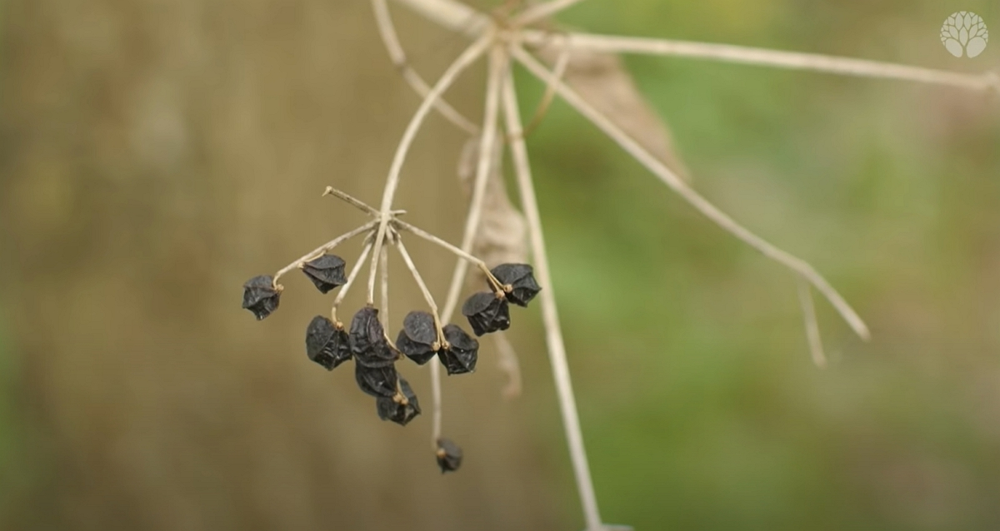
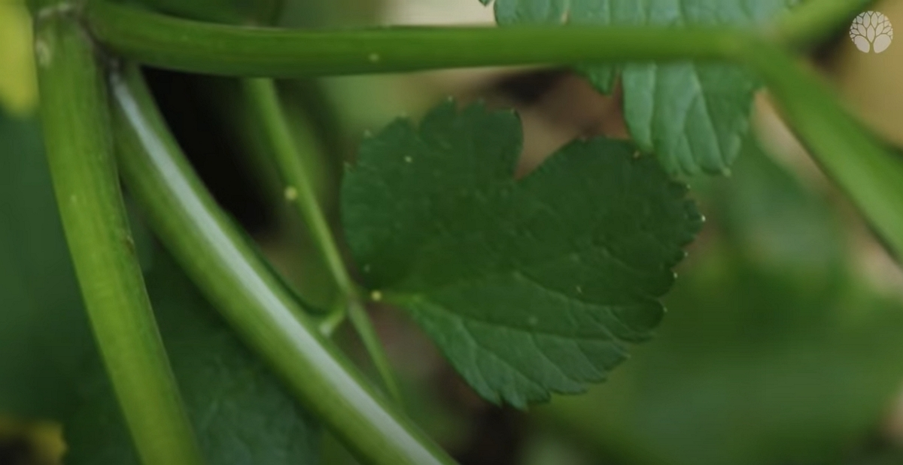

Merci à Christophe pour le partage de son savoir !
Cet article résume mes notes du vlog réalisé par le chemin de la nature.

<!-- more -->

Vous pouvez retrouver [la vidéo sur YouTube](https://www.youtube.com/watch?v=oKQrt59zoFc).

## Description de la plante

Le maceron se compose d’une tige mince et de feuilles allongées. Ses fleurs sont petites et blanches.

Elle fait partie de la famille des Apiaceae.

## Récolte

Tout se mange dans la plante.

On peut récolter le maceron toute l’année. Il faut cueillir les feuilles et les tiges jeunes, avant qu’elles ne deviennent trop coriaces.

Pour les racines, on préférera la récolte avant que la tige sorte.



Christophe n’explique pas dans cet extrait comment reconnaitre le maceron quand il est à peine sorti du sol.



## Utilisations

Le maceron peut être utilisé, frais, ou séché. Il est très utilisé en cuisine, comme condiment.

Il peut également être utilisé en infusion, pour ses propriétés diurétiques et laxatives.

## Préparation

Pour utiliser le maceron frais, il suffit de le ciseler et de l’ajouter aux plats.

Quand les fleurs deviennent des graines, il nous offre des fruits noirs, comme du poivre noir.

Credits : image extraite du vlog de Christophe sur le Chemin de la Nature.

Il peut également être utilisé pour aromatiser les vinaigrettes, les sauces, ou les marinades.

Pour sécher le maceron, il suffit de le laver, de le sécher, puis de le mettre dans un endroit sec et aéré. Une fois sec, il peut être conservé dans un bocal hermétique.

Pour diminuer l’amertume, Christophe suggère de faire mijoter la plante avec des fruits de saison. Par exemple, le citron ajoute un peu d’acidité qui aidera à rendre le maceron plus attractif.

## Propriétés médicinales

Le maceron est connu pour ses propriétés diurétiques et laxatives.

Il est donc utilisé pour traiter les problèmes de digestion, tels que la constipation, la diarrhée, ou les ballonnements.

Il est également utilisé pour traiter les infections urinaires.

## Précautions

Bien que le maceron est une plante comestible, il est important de la consommer avec modération, comme toute plante sauvage.

Le maceron peut être confondu avec d’autres plantes, telles que la salicorne comestible ou la salicorne toxique.



**Les plantes sans poils sur la tige sont mortelles**.



Credits : image extraite du vlog de Christophe sur le Chemin de la Nature.

Donc :

- soit on s’abstient (le plus sûr)
- soit on voit que cela ressemble à du cèleri

Il est donc important de s’assurer de l’identification de la plante avant de la consommer.

[Christophe propose une formation](https://www.lechemindelanature.com/formations-en-ligne/1-formation-du-cueilleur.html) (lien non affilié) sur le sujet de la cueillette des plantes sauvages en France.

Quand j’aurai un peu de temps et quelques économies, ça fait partie des formations que j’aimerai beaucoup réaliser.

En attendant, attention pendant votre cueillette !

_Crédit : toutes les images sont issues du vlog de Christophe. Merci à lui._
