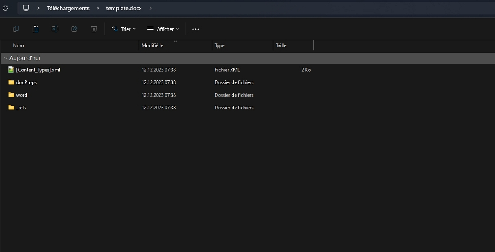
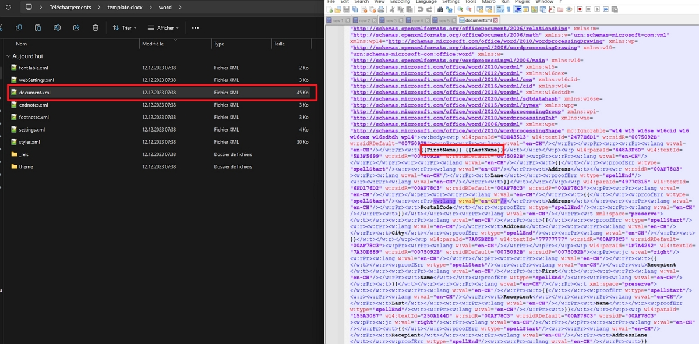
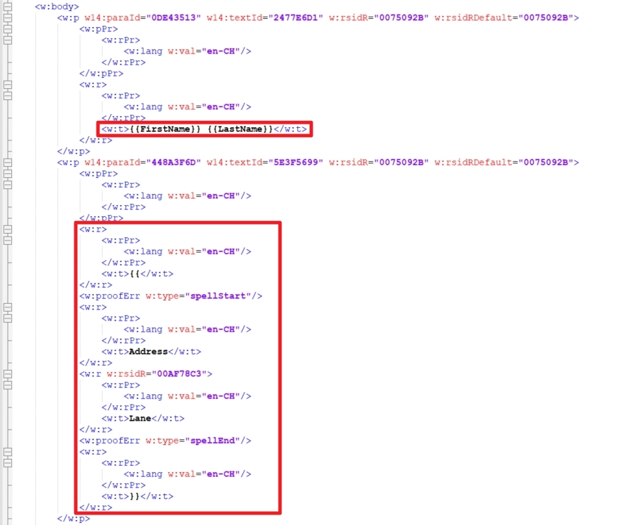

Pour un projet, j'ai eu la tâche de :

- Prendre un modèle de document Word contenant des balises prédéfinies par une besoin spécificique,
- Remplacer les dites balises par des données dynamiquement issues d'une base de données.
- Permettre la préservation des styles du modèles (texte gras, surligné, sousligné, de différentes, etc) même après le remplacement des balises.

## Quelle solution

Après une petite recherche sur Google, je comprends vite que le format de document Word aujourd'hui respecter _la une norme ISO/CEI 29500 créée par Microsoft, destinée à répondre à la demande d’interopérabilité dans les environnements de bureautique et à concurrencer la solution d’interopérabilité OpenDocument soutenue par tous les autres éditeurs de suites bureautiques, notamment Apache et The Document Foundation_ (source : [Wikipedia](https://fr.wikipedia.org/wiki/Office_Open_XML)).

En lisant les divers articles, je comprends que renommer une fichier `mon-document.docx` en `mon-document.docx.zip` permet ensuite de dézipper le fichier et obtenir ceci :

Les fichiers `XML` définissent le document Word.

Par exemple, le fichier `document.xml` correspond au contenu du document au format `XML`.

On voit bien les balises entourées de leur _double moustaches_, par exemple `{{FirstName}} {{LastName}}`.



Le choix de `{{Balise}}` est arbitraitre. J'aurai aussi bien pû utiliser `{Balise}` ou `[Balise]` ou même `%Balise%`.



Par contre, on voit aussi que d'autres balises où on peut se demander comment le remplacement va être possible.

Que s'est-il passé sur la balise `{{AddressLane}}` ? En fait, en éditant le document (suppression, ajout de caractères, correction, etc), la balise est découpé en `<w:t>...</w:t>` (définit [ici dans la spécification OOXML](http://www.datypic.com/sc/ooxml/e-w_t-1.html)).

Du coup, quand on veut remplacer `{{AddressLane}}`, comment fait-on ?

La théorie est très bien détaillé [dans cette réponse](https://stackoverflow.com/a/59328568) de [Thomas Barnekow](https://stackoverflow.com/users/4654643/thomas-barnekow) sur stackoverflow.

Thomas utilise deux librairies disponibles sur Nuget.org pour démontrer le remplacement efficace des balises :

- DocumentFormat.OpenXml (version 3.0.0 au 12/12/2023)
  - dépôt de [DocumentFormat.OpenXml](https://github.com/dotnet/Open-XML-SDK)
- Open-Xml-PowerTools (version 4.5.3.2 au 12/12/2023)

  - dépôt de [Open-Xml-PowerTools](https://github.com/OpenXmlDev/Open-Xml-PowerTools)

Je me suis inspiré de [l'exemple de génération `TextReplacer02` avec Open-Xml-PowerTools](https://github.com/OpenXmlDev/Open-Xml-PowerTools/tree/vNext/OpenXmlPowerToolsExamples/TextReplacer02)

## L'algorithme de génération

L'algorithme est le suivant :

- Lire les données dynamiques.

  - Dans mon projet d'exemple, j'utilise l'outil _[Fake Name Generator](https://www.fakenamegenerator.com/)_ pour obtenir deux identités de personnes.

- Faire une copie du modèle.

  - Dans mon cas, le document est copié dans le dossier `bin` du projet de tests.
  - Dans le cas du projet que j'ai réalisé, j'ai copié le modèle dans un dossier séparé en le renommant `generated-[GUID].docx`.

- Ouvrir **en écriture** la copie du modèle.



Il faut que les modèles soient des vrais `.docx`, `dotx` ou `dotm` (même `magicnumber` égale à `8075`.



- Remplacer chaque balise à partir de la liste prédéfinie dans un enum, par exemple.

- Ecrire le fichier.

## Le code

J'ai créé un projet sur GitHub où vous pouvez trouver le code pour démontrer le code correspondant à l'algorithme.

Vous avez aimé ? Partagez !

A bientôt pour un nouvel article.
