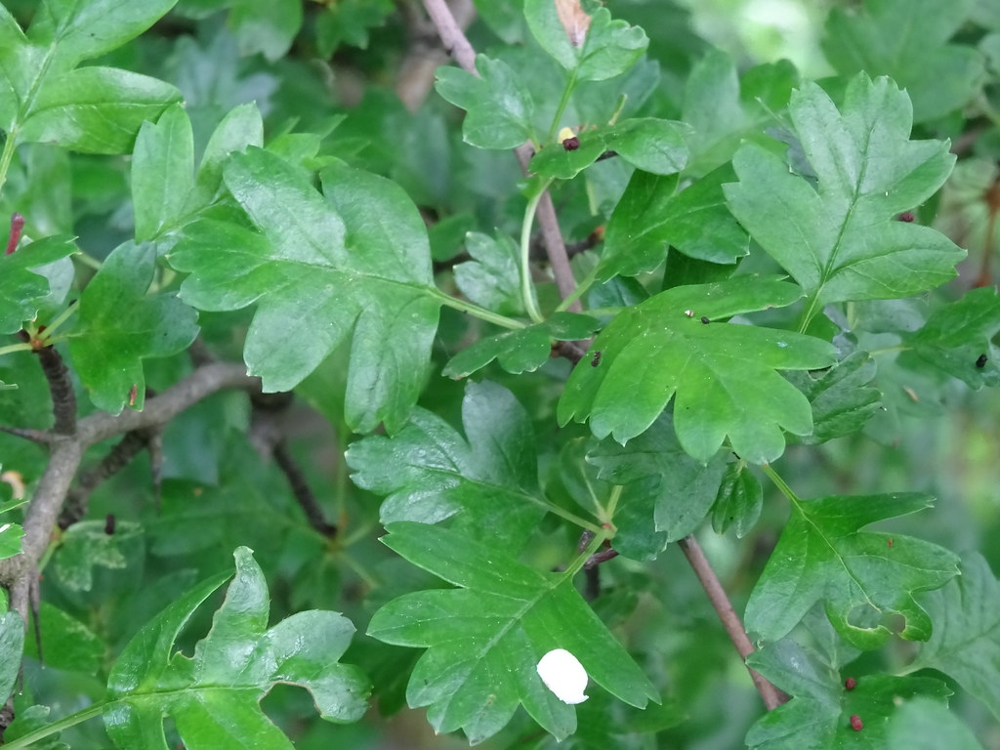

Merci à Christophe pour le partage de son savoir ! Cet article résume mes notes des vlogs réalisés par le chemin de la nature.

Toutes les images sont extraites des vlogs.

<!-- more -->

Vous pouvez retrouver l’intégralité des vidéos de Christophe sur le sujet ici :

- [Les usages de l’aubépine](https://www.youtube.com/watch?v=okW9-N9gX3A),
- [Aubépine, cœur stress et grignotage](https://www.youtube.com/watch?v=xy4CWKc8Huc) et
- [Aubépine, arbuste des problèmes de cœur et de stress](https://www.youtube.com/watch?v=cYaZejgjDmE).

## Description de l’aubépine

Le faux fruit est nommé la cenelle. Il ne s’agit pas d’une baie.

Elle fait partie de la même famille que le pommier ou le poirier.

Pourquoi ? Cela est dû aux fleurs, composées de 5 pétales et de nombreuses étamines. Il s’agit donc de la famille des rosacées.

Le fruit est assez petit et contient un noyau plutôt gros et très dur pour la taille du faux fruit.

La chair du faux fruit est plutôt farineuse, avec un petit goût sucré.

L’aubépine peut vivre jusqu’à 500 ans, avec une hauteur jusqu’à 6-7 mètres. On parle d’arbuste quand on ne dépasse pas 7 mètres.

Il existe deux espèces d’aubépine : une avec un noyau et une avec deux noyaux. Personnellement, j’ai uniquement l’espèce à un noyau autour de chez moi dans le sud de la France.

Si vous n’osez pas goûter le faux fruit, regardez les feuilles de plus près. Plus elles sont découpées, plus il est probable qu’il s’agisse de l’espèce à un noyau.

## Ses propriétés médicinales

Du point de vue nutritionnel, il n’y a rien d’extraordinaire : un peu de sucre, un peu de vitamine C.

Son plus grand avantage réside dans ses propriétés médicinales.

C’est les bourgeons d’aubépine qui se révèlent intéressants pour leur action sur le cœur. On parle de propriétés tonicardiaques et régulatrices du rythme cardiaque.

Elle permet aussi de calmer le stress et donc faciliter le sommeil.



En effet, on dit que l’aubépine est une plante pour les cœurs _sains_.



Les faux fruits et les fruits contiennent les mêmes molécules, mais comme souvent, elles sont plus concentrées dans les fleurs.

## Comment l’utiliser

Les faux fruits se consomment directement sur l’arbuste en automne.

Avec mes filles, on aime les cueillir et en déguster. Il n’y a pas grand-chose à consommer, toutefois il y a une grande abondance de faux fruits sur chaque arbuste.

On peut aussi extraire la pulpe avec une presse ou les faire sécher pour mélanger la chair avec la farine classique.

Toutefois, l’utilisation la plus commune est celle des fleurs ou des bourgeons.

Bien que les bourgeons peuvent s’utiliser en gemmothérapie, ce sont les fleurs qui ont été les plus étudiées.

On peut aussi faire sécher les fleurs au mois de mai pour concocter des infusions.



L’aubépine peut faire office de porte-greffe, ce qui peut se révéler très intéressant vu que la rusticité de l’arbuste.

Autour de chez moi, il y en a partout et je ne les vois pas souffrir de la chaleur.

Du coup, en greffant un poirier sur une aubépine, il y a de plus grande chance de survie.



_Crédit : toutes les images sont extraites des vlogs de Christophe, sauf autre mention._
