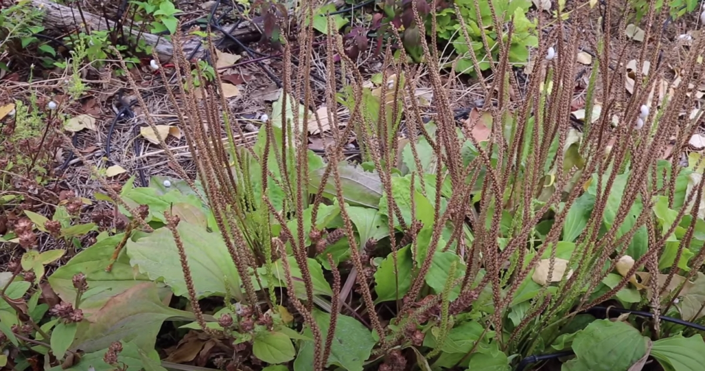

Merci à Christophe pour le partage de son savoir !
Cet article résume mes notes du vlog réalisé par Christophe sur sa chaîne Altheaprovence.

<!-- more -->

Vous pouvez retrouver [la vidéo sur YouTube](https://www.youtube.com/watch?v=fpibm9InWOg).

## Étude botanique

Il existe 2 plantains très connus :

- le plantain lancéolé (_plantago lanceolata_)
- le plantain commun (_plantago major_)

On reconnait le premier par ces feuilles longues et fines alors que le second est reconnaissable par ses grandes feuilles de forme ovale.

Crédits : image extraite du vlog de AltheaProcence.

Il existe aussi le plantain corne de cerf (_plantago coroconopus_), le plantain moyen (_plantago media_) ou le plantain des indes (_plantago ovata_) dont on extrait le psyllium blond.

Le plantain est vivace bien que les feuilles disparaissent l’hiver.

## Où le trouve-t-on

Le plantain se trouve très facilement en France.

Le plantain lancéolé indique que l’on se trouve sur un sol riche et aéré alors que le grand plantain signifie que le sol est plutôt pauvre et compacté.

Je le vois chez moi, devant ma maison où je ne trouve que du grand plantain. Par contre, dès qu’on se promène dans les prairies, c’est le plantain lancéolé que vous rencontrez le plus souvent.

## Les propriétés les plus utiles

Trouver le plantain facilement dans la nature ne signifie pas qu’il est « faiblard » en ce , pour reprendre les mots de Christophe.

### Anti-inflammatoire de la peau et des muqueuses

Sous forme de macérat huileux, le plantain se révèle toujours utile pour une simple irritation de la peau, comme un érythème fessier chez les très jeunes enfants, ou de l’eczéma.

Simplement résumé, si ça pique, si ça gratte, le plantain soulage.

L’utilisation du plantain pour soulager une piqûre d’insecte est sûrement son utilisation la plus connue. Que ce soit une abeille, une guêpe, un moustique, le plantain prémâché dans la bouche pour le transformer en pâte fonctionne très bien.

Je me souviens encore de la fois où mon épouse m’a appelé après qu’une de nos filles ait été piquée. Elles se promenaient et donc je lui ai immédiatement dit de prendre du plantain, de mâcher une feuille et d’appliquer la pâte sur la piqûre.

La blessée s’est tout de suite calmée après l’application du remède, non pas parce que le plantain agit immédiatement, mais parce qu’elle était intriguée.

C’est encore une bonne histoire qu’on se raconte.

Christophe suggère d’ajouter quelques gouttes d’huile essentielle de lavande vraie pour faire des heureux.

Il partage aussi [le cas d’une personne](https://youtu.be/fpibm9InWOg?si=ORukH7-zy1slSvyA&t=241) où la piqûre d’une guêpe. Son bras avait très fortement enflé et, en quelques heures, le bras avait repris sa taille normale grâce à un cataplasme de plantain mâché.

Du côté des muqueuses, le plantain agit sur les gencives, l’œsophage, l’estomac, et les intestins.

En le combinant avec la racine de réglisse, on traite aussi bien les ulcérations de ces muqueuses.

### Antihistaminique

Oui, le plantain peut aider à vivre les périodes d’allergie.

Le plantain lancéolé semble plus efficace que le grand plantain, selon les observations de Christophe.

Toutefois, il faut bien l’utiliser pour qu’il soit efficace.

Il a une action de fond. Cela prend du temps pour en ressentir les effets.

Préparer une infusion de plantain n’arrêtera pas un nez qui coule par exemple.

Concrètement, il faut commencer des cures d’infusions 2 à 3 semaines avant les allergies saisonnières. Et, on continue pendant la période difficile.

On peut l’associer avec des plantes pour des besoins plus spécifiques :

- l’euphraise (_euphrasia officinalis_) pour les yeux rouges.
- la verge d’or (\*\*) pour le nez qui coule beaucoup.

## Comment l’utiliser

Quand c’est la saison, le mieux est de cueillir les feuilles fraiches.

On peut aussi faire sécher les feuilles. Elles vont brunir, c’est normal. On garde que les feuilles restées vertes et on composte les brunes.

Ce n’est pas facile à le sécher, mais soyez persévérant.

Ensuite, il faut stocker les feuilles bien au sec et à l’abri de la lumière. En effet, les mucilages qu’elles contiennent veulent se regorger d’eau à la moindre occasion et cela fera noircir la feuille.

On utilise ensuite 6-7 grammes par tasse de 250 ml d’infusion. Ça peut paraitre beaucoup. Il s’agit d’une infusion thérapeutique.

Bonne cueillette !

_Crédits :_

- image d’entête par ErnstA, CC BY-SA 3.0<http://creativecommons.org/licenses/by-sa/3.0/>, via Wikimedia Commons
- autres images extraites du vlog de AltheaProcence.
