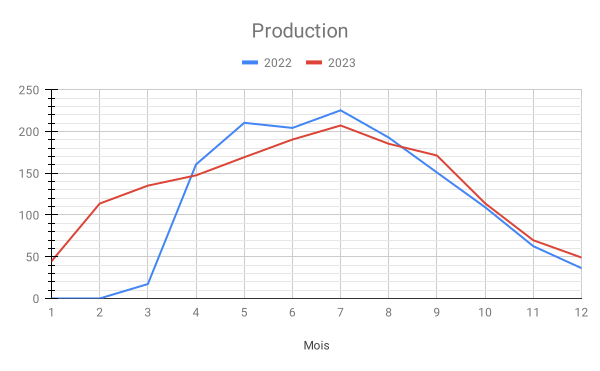
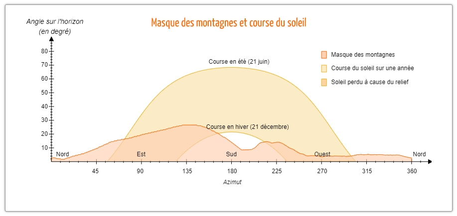
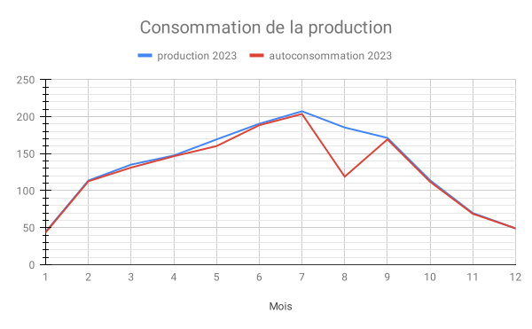
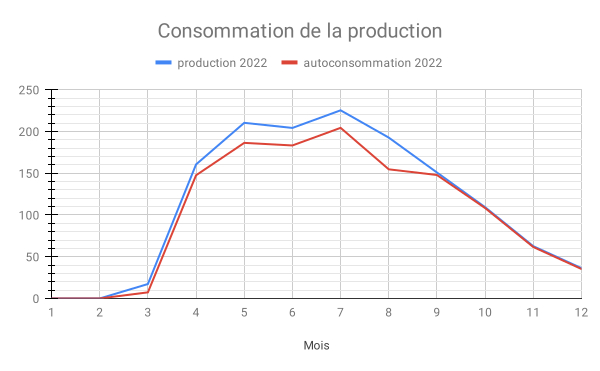
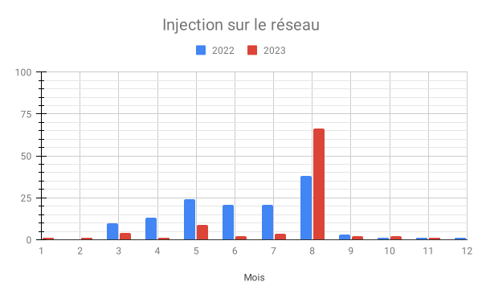
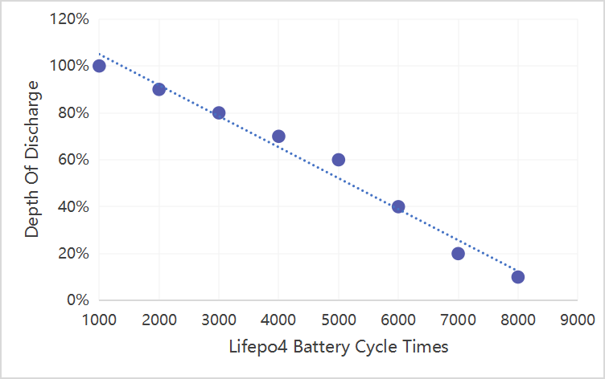

## La série d'articles

- [Installation PV - quel retour d'expérience après 2 mois ?](../../2022-06/retour-d-experience-sur-une-installation-pv-1mois/index.md)
- [Installation PV - quel retour d'expérience après 9 mois ? (partie 1)](../../2022-12/retour-d-experience-sur-une-installation-pv-9mois-partie-1/index.md)
- [Installation PV - quel retour d'expérience après 9 mois ? (partie 2)](../../2022-12/retour-d-experience-sur-une-installation-pv-9mois-partie-2/index.md)
- [Installation PV - quel retour d'expérience après 1 an ?](../../2023-03/retour-d-experience-sur-une-installation-pv-1an/index.md)

## Production

Pour commencer, quelle a été la production annuelle ?

Nous avons atteint 1597 kWh produits, avec un pic à 207,22 kWh en juillet et une production minimale de 44,60 kWh en janvier.

En images, cela donne ceci en kWh (axe Y) par mois (axe X) :



La mise en route de la production solaire a eu lieu le 27 mars 2022.



On voit que les mois printaniers ont été bien moins productifs en 2023 : la météo fut plus maussade avec plus de nuages.

Toutefois, l’automne fut plus clément en rayons de soleil.

Sur une année complète, on a donc produit 1597 kWh. Cela donne un peu plus de 1 kWh produit par watt crête installé pour un lieu dont le profil d’ensoleillement est loin d’être avantagé.

Source : [site web « https://www.heliorama.com/ »](https://www.heliorama.com/).



On a installé 1,5 kWc en mars 2022 avec 8 panneaux d’une puissance crête de 190W et âgés de 7-8 ans.



## Autoconsommation

Grâce à la déshydratation plus importante de mai à septembre, on a gagné **+ 4 % d’autoconsommation** (en 2022, nous étions à 90,29 %, en 2023, nos avons atteint 94,18 %).

On voit bien le creux en août 2023 où nous étions en vacances. Il est plus prononcé qu’en 2022, car j’étais plus à la maison.

Cela nous donne les pourcentages suivants pour les 2 années :

| Mois             | 2022    | 2023     |
| ---------------- | ------- | -------- |
| 1                | n/a     | 97,76 %  |
| 2                | n/a     | 99,12 %  |
| 3                | 42,20 % | 97,04 %  |
| 4                | 91,91 % | 99,32 %  |
| 5                | 88,59 % | 94,68 %  |
| 6                | 89,72 % | 98,95 %  |
| 7                | 90,68 % | 98,25 %  |
| 8                | 80,28 % | 64,17 %  |
| 9                | 98,01 % | 98,83 %  |
| 10               | 99,09 % | 98,24 %  |
| 11               | 98,40 % | 98,57 %  |
| 12               | 97,25 % | 100,00 % |
| Moyenne annuelle | 90,29 % | 94,18 %  |

Qui dit mieux sans utiliser de batterie solaire ?



Je considère le cumulus d’eau chaude et la déshydratation de fruits et légumes comme une optimisation de l’énergie produite à un instant T pour un besoin identifié utile en prévision d’un usage ultérieur. Ça ressemble à une batterie, non ? C’est bien plus efficace par contre !



## Injection sur le réseau

Malgré une plus grosse injection en août (35 % de la production du mois), le total injecté sur le réseau passe de 133 kWh à 93 kWh, soit 40 kWh de moins pour une production de 227 kWh plus importante.

Cette injection est à surveiller, mais j’avoue avoir essayé un peu trop de consommer chaque kWh produit. En appliquant la loi Pareto, nous avons sûrement atteint la limite d’optimisation pour que les efforts supplémentaires soient vraiment rentables.

Après presque 2 ans, ce que je retiens le plus est que le dimensionnement de l’installation est très important.

Dans notre cas, je pense que nous avons bien dimensionné.

Je ne suis pas sûr qu’avec 3 kWc installés, l’autoconsommation aurait été aussi bonne. Pour notre profil de consommation, 1,5 kWc installés fut le bon choix.

Pour connaitre comment je m’y suis pris, je vous invite à visiter mon autre site web : [« Passons le C.A.P »](https://passonslecap.fr/) et [mes articles sur le sujet](https://jeremielitzler.fr/tags/passons-le-c.a.p/).

## Retour sur investissement, où en est-on

Parlons du sujet le plus important : quand l’installation aura-t-elle assez produit pour être rentable ?



La rentabilité est atteinte quand les revenus issus de la production dépassent le coût d’installation, d’entretien et de réparation du système.



Le coût n’a pas changé : 2083,90 €.

Les revenus issus de la production réelle sont les suivants :

| Mois                | 2022         | 2023         |
| ------------------- | ------------ | ------------ |
| 1                   | 0,00 €       | 6,01 €       |
| 2                   | 0,00 €       | 18,07 €      |
| 3                   | 0,93 €       | 21,03 €      |
| 4                   | 18,84 €      | 23,49 €      |
| 5                   | 23,80 €      | 25,68 €      |
| 6                   | 23,40 €      | 30,20 €      |
| 7                   | 26,09 €      | 32,64 €      |
| 8                   | 19,75 €      | 21,74 €      |
| 9                   | 18,88 €      | 30,94 €      |
| 10                  | 13,83 €      | 20,46 €      |
| 11                  | 8,49 €       | 14,73 €      |
| 12                  | 4,87 €       | 8,99 €       |
| **Revenus annuels** | **158,88 €** | **253,98 €** |

Les revenus sont calculés sur le prix TTC du kWh en heures creuses jusqu’à octobre 2023. Depuis novembre 2023, nous sommes passés au tarif de base. En effet, garder un tarif HC/HP n'est pas avantageux quand le gain est de quelques euros sur l’année alors que l’effort est important…

Je vous explique davantage sur le sujet [dans un article de novembre dernier](../../../post/2023-11/comprendre-les-heures-pleines-et-les-heures-creuses/index.md).

Je n’avais pas emprunté à une banque pour la réalisation de l’installation, mais j’ai quand même emprunté sur notre épargne personnelle. J’aurai fini de _« nous rembourser »_ exactement 22 mois après la mise en service. Beaucoup mieux qu’un emprunt de 10 ans, non ?

En prenant les hypothèses suivantes :

- une augmentation de 8,36 % du coût d’achat du kWh d’électricité. Je me base sur la mesure moyenne de 2014 à 2023 pour notre contrat d’électricité
- une production équivalente à 2023 chaque année,

On obtient le retour sur investissement qui suit :

| Année | Production annuelle | Prix du kWh (optimiste) | Economie annuelle | Cumul Revenus PV | Différence revenus vs coût |
| ----- | ------------------- | ----------------------- | ----------------- | ---------------- | -------------------------- |
| 2022  | -                   | -                       | 158,88 €          | 158,88 €         | -1 925,02 €                |
| 2023  | -                   | -                       | 253,49 €          | 253,49 €         | -1 830,41 €                |
| 2024  | 1500,00             | 0,21 €                  | 319,21 €          | 572,70 €         | -1 511,20 €                |
| 2025  | 1500,00             | 0,23 €                  | 345,89 €          | 918,59 €         | -1 165,31 €                |
| 2026  | 1500,00             | 0,25 €                  | 374,81 €          | 1 293,41 €       | -790,49 €                  |
| 2027  | 1500,00             | 0,27 €                  | 406,15 €          | 1 699,55 €       | -384,35 €                  |
| 2028  | 1310,00             | 0,29 €                  | 384,35 €          | 2 083,91 €       | 0,01 €                     |

Ainsi **en fin octobre 2028**, on aura rentabilisé l’installation si l’on n’achète rien de plus d’ici là. Cela revient à une **rentabilité atteinte au bout de 6 ans et 7 mois**.



J’avais donné un retour sur investissement plus précoce (septembre 2027) dans un article sur LinkedIn : l’erreur venait d’un décalage d’année dans mon tableau de calcul… 😋





Depuis la publication de l’article, je me suis rendu compte que j’avais pris en compte le total de production pour le calcul du retour sur investissement. Or, il est plus juste de prendre en compte le total d’autoconsommation !

Cela a donc rallongé de 4 mois l’estimation.



## Idées d’amélioration et d’évolution pour 2024

### Plus de déshydratation

Depuis octobre, je travaille loin de chez moi et donc, je ne suis pas autant à la maison. Par conséquent, préparer des fruits et légumes à déshydrater tous les 2 jours sera compliqué.

Je pense acheter quelques étages supplémentaires [du modèle que je possède](https://www.google.com/search?q=d%C3%A9shydrateur+stockli) à ce jour.

Cela permettra de préparer plus d’aliments à sécher et de le réaliser seulement 2 fois par semaine même s’il faut laisser sécher un peu plus longtemps.

### Achat de micro-onduleur de secours

Ceci est prioritaire à l’extension de puissance crête, car, même si le micro-onduleur APS QS1 est encore sous garantie 8 ans, son remplacement pourrait prendre du temps, s’il venait à tomber en panne.

Dans mon cas, j’aurai besoin de 2 micro-onduleurs APS DS3 et de 2 câbles AC Bus.

Au jour de publication de cet article,

- un micro-onduleur APS DS3 coûte :
  - entre 160 euros avec 10 ans de garantie (source : allo.solar)
  - et 185 euros avec une garantie de 20 ans (source : monkitsolaire.fr).
- un câble coûte
  - entre 14 euros (source : monkitsolaire.fr)
  - et 18 euros (source : allo.solar).
- les frais de port coûtent
  - entre 15,55 euros (source : allo.solar)
  - et 30 euros (source : monkitsolaire.fr).

Donc le nouveau retour sur investissement pour augmenter la résilience du système est le suivant :

- début août 2029 si j’achète chez allo.solar (cf. le tableau ci-dessous).
- mi-septembre 2029 si j’achète chez monkitsolaire.fr.

| Année | Production annuelle | Prix du kWh (optimiste) | Economie annuelle | Cumul Revenus PV | Différence revenus vs coût |
| ----- | ------------------- | ----------------------- | ----------------- | ---------------- | -------------------------- |
| 2022  | -                   | -                       | 158,88 €          | 158,88 €         | -2 297,02 €                |
| 2023  | -                   | -                       | 253,49 €          | 253,49 €         | -2 202,41 €                |
| 2024  | 1500,00             | 0,21 €                  | 319,21 €          | 572,70 €         | -1 883,20 €                |
| 2025  | 1500,00             | 0,23 €                  | 345,89 €          | 918,59 €         | -1 537,31 €                |
| 2026  | 1500,00             | 0,25 €                  | 374,81 €          | 1 293,41 €       | -1 162,49 €                |
| 2027  | 1500,00             | 0,27 €                  | 406,15 €          | 1 699,55 €       | -756,35 €                  |
| 2028  | 1500,00             | 0,29 €                  | 440,10 €          | 2 139,65 €       | -316,25 €                  |
| 2029  | 995,00              | 0,32 €                  | 316,34 €          | 2 455,99 €       | 0,09 €                     |

Cela revient à 10 ou 11 mois de plus.

### Extension de 800 Wc

Cela correspondrait à 4 panneaux de 200 Wc, un micro-onduleur APS DS3 son câble AC Bus et les quelques éléments accessoires (support en bois, plots en béton, câble solaire, câble de terre et visserie).

Il faudra toutefois :

- Vérifier que la section de câble (6 mm²) supporterait l’installation d’une puissance supplémentaire. En effet, nous avons environ 80 m de l’installation jusqu’à un point de jonction avec un second câble d’environ 40 m qui rentre dans la maison et est connecté au tableau électrique de l’installation photovoltaïque.

  - Le but est de ne pas dépasser la limite d’échauffement.
  - Je ne suis pas sûr si le calcul est le même si le câble est continu ou pas (un morceau ou 2 morceaux).
  - Dans notre cas, on peut descendre jusqu’à 1,5 kW sur 130 m et 2 kW sur 100 m.
  - J’ai prévu de mesurer cet été la puissance instantanée maximum avec une pince ampèremétrique pour connaitre la marge disponible et ne pas avoir à installer un autre câble.
  - Source : [COMMENT DIMENSIONNER UN CÂBLE ÉLECTRIQUE ?](https://www.electricitebleu.com/content/7-comment-dimensionner-un-cable-electrique)

- Financer le micro-onduleur APS DS3, les panneaux et les accessoires.
- Calculer le nouveau retour sur investissement afin d’identifier si cela vaut le coup.

### Étude du cas d’achat d’une deuxième batterie à coupler avec mon Ecoflow Delta 2

On a acheté l’Ecoflow Delta 2 pour sécuriser le fonctionnement du poêle à granulés contre les coupures d’électricité. L’hiver dernier, ça a été très utile un jour très froid pendant une coupure de 6 heures non planifiée par Enedis.

Le but serait de couvrir la consommation pendant les vacances, mais est-ce que ça vaut le coup ?

**Les faits :**

- La capacité utile d’une batterie Lithium Fer Phosphate (LFP) n’est celle que le vendeur met avant. Cela prendrait un article complet pour l’expliquer (et [certains l’on déjà fait (article en anglais)](https://www.google.com/search?q=harveypoweress+Lifepo4+Battery+Depth+Of+Discharge%3A+Best+Usable+Capacity+To+Maximizing+Battery+Life)).
  - En résumé, la capacité utile d’une batterie LFP varie entre de 40 à 80 % de sa capacité maximum.

- De plus, la consommation de l’onduleur interne (environ 15-20 Wh) réduit l’autonomie de façon non négligeable.

**Les hypothèses :**

- Une DOD de 60 % (niveau charge [SoC] variant de 30 % à 90 %),
- Un nombre de cycles égale à 5000 pour la DOD de 60 %,
- Deux batteries de 1024 Wh de capacité maximum chacune coûtant
  - 1199 euros pour l’unité principale neuve,
  - 549 euros pour l’unité secondaire reconditionnée,
- Une autoconsommation de 90 %,
- Une production annuelle de 1600 kWh,
- Un coût du kWh qui augmente de 8,36 % par an.
- Une consommation de l’onduleur interne d’environ 15 Wh.

**Le retour sur investissement :**

- On obtient `[1024 Wh x 2] x [60 % DOD] - [360 Wh] = 868.8 Wh` de capacité utile.
- On obtient 160 kWh injectés à « *récupérer* ».
- On obtient 184 cycles de 868,8 Wh pour 160 kWh.
- On obtient 1748 euros pour les 2 batteries.

Ainsi, rentabiliser le système avec des batteries prendrait 21 ans. C'est envisageable vu que les 5000 cycles donnent une durée de vie de 27 ans.

#### Toutefois…

Ce n’est pas si simple que ça. Réarranger les circuits électriques de la maison engendre des coûts supplémentaires.

De plus, le talon en dehors des heures de production tourne autour de 1 kWh de toute façon. C’est donc un peu limite pour une capacité utile de 868,8 Wh…

Enfin, le surplus injecté à utiliser n’est pas disponible au moment où on en a besoin. En effet, les 160 kWh ne sont pas répartis de homogène dans le temps. Cf [le graphique sur l’injection réseau](#injection-sur-le-réseau).

Du coup, je peux mettre de côté ce projet. Peut-être qu’avec un coût du kWh augmentant plus vite et une technologie de batterie meilleure marché ([Sodium ion](https://en.wikipedia.org/wiki/Sodium-ion_battery) ?), on s’y retrouverait peut-être mieux.

## Conclusion

Je pense qu’on a déjà fait beaucoup. Je le redis : un effort de 80 % pour améliorer les 20 % restants ne vaut pas vraiment le coup.

Par contre, apprendre et tester d’autres appareils comme un [poêle « dragon » en brique réfractaire](https://www.youtube.com/results?search_query=po%C3%AAle+dragon+en+brique+r%C3%A9fractaire) ou un [piège à moustiques tigres](https://www.youtube.com/watch?v=PYcrZCXeyy8) ou encore un [four solaire en tube de verre](https://youtu.be/fAYNytaWxBg?si=iuYaYzDngCBKJtq4&t=2150), ça serait intéressant.

À suivre…
