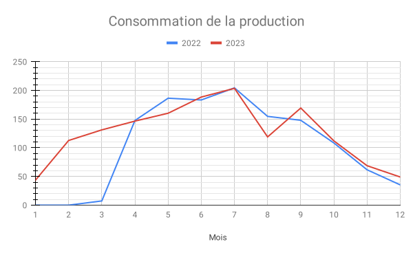

## La série d'articles

- [Installation PV - quel retour d'expérience après 2 mois ?](../../2022-06/retour-d-experience-sur-une-installation-pv-1mois/index.md)
- [Installation PV - quel retour d'expérience après 9 mois ? (partie 1)](../../2022-12/retour-d-experience-sur-une-installation-pv-9mois-partie-1/index.md)
- [Installation PV - quel retour d'expérience après 9 mois ? (partie 2)](../../2022-12/retour-d-experience-sur-une-installation-pv-9mois-partie-2/index.md)
- [Installation PV - quel retour d'expérience après 1 an ?](../../2023-03/retour-d-experience-sur-une-installation-pv-1an/index.md)

## Production

Pour commencer, quelle a été la production annuelle ? Nous avons presque atteint 1597 kWh produits, avec un pic à 207.22 kWh en juillet et 44.60 kWh en janvier.

En images, cela donne ceci en kWh (axe Y) par mois (axe X) :



La mise en route de la production solaire a eu lieu le 27 mars 2022.



On voit que les mois printaniers ont été bien moins productifs en 2023 : la météo fut bien plus maussade avec plus de nuages.

Toutefois, l'automne fut plus clément en rayons de soleil.

Sur une année complète, on a donc produit 1597 kWh. Cela donne un peu plus de 1kWh produit par Wc installé pour un lieu dont le profil d'ensoleillemment est loin d'être avantagé.

Source : [site wen "https://www.heliorama.com/"](https://www.heliorama.com/).



On a installé 1.5 kWc en mars 2022 avec 8 panneaux d'une puissance crête de 190W et agés de 7-8 ans.



## Autoconsommation

Grâce à la déshydratation plus importante de mai à septembre, on a gagné **+ 4 % d'autoconsommation**.

On voit bien le creux en août où nous étions en vacances. Il est plus prononcé qu'en 2022, car j'étais plus à la maison.

Cela nous donne un taux d'autoconsommation de 94% en 2023 :

| Mois             | 2022   | 2023    |
| ---------------- | ------ | ------- |
| 1                | n/a    | 97,76%  |
| 2                | n/a    | 99,12%  |
| 3                | 42,20% | 97,04%  |
| 4                | 91,91% | 99,32%  |
| 5                | 88,59% | 94,68%  |
| 6                | 89,72% | 98,95%  |
| 7                | 90,68% | 98,25%  |
| 8                | 80,28% | 64,17%  |
| 9                | 98,01% | 98,83%  |
| 10               | 99,09% | 98,24%  |
| 11               | 98,40% | 98,57%  |
| 12               | 97,25% | 100,00% |
| Moyenne annuelle | 90,29% | 94,18%  |

Qui dit mieux sans utiliser de batterie solaire ?



Je considère le cumulus d'eau chaude et la déshydratation de fruits et légumes une optimisation de l'énergie produite à un instant T pour un besoin identifié utile en prévision d'un usage ultérieur. ça ressemble à une batterie, non ? C'est bien plus efficace par contre !



## Injection sur le réseau

Malgré une plus grosse injection en août (35 % de la production du mois), le total passe de 133 kWh à 93 kWh, soit 40 kWh de moins pour une production de 227 kWh plus importante.

Cette injection est à surveiller, mais j'avoue avoir essayé un peu trop de consommer chaque kWh produit. En appliquant la loi Pareto, il serait plus efficace d'investir 20% pour éviter 80% de l'injection plutôt que le contraire.

Après presque 2 ans, ce que je retiens le plus est que le dimensionnement de l'installation est très importante.

Dans notre cas, je pense qu'on a bien dimensionné.

Je ne suis pas sûr qu'avec 3 kWwc installés, l'autoconsommation serait aussi bonne.

## Retour sur investissement, où en est-on

Parlons du sujet le plus important : quand est-ce que l'installation aura produit assez pour être rentable ?



La rentabilité est atteinte quand les revenus issus de la production dépassent le coût d'installation, d'entretien et de réparation du système.



Le coût n'a pas changé : 2083.90 €.

Les revenus de productions sont les suivantes :

| Mois                | 2022        | 2023        |
| ------------------- | ----------- | ----------- |
| 1                   | 0,00€       | 6,01€       |
| 2                   | 0,00€       | 18,07€      |
| 3                   | 0,93€       | 21,03€      |
| 4                   | 18,84€      | 23,49€      |
| 5                   | 23,80€      | 25,68€      |
| 6                   | 23,40€      | 30,20€      |
| 7                   | 26,09€      | 32,64€      |
| 8                   | 19,75€      | 21,74€      |
| 9                   | 18,88€      | 30,94€      |
| 10                  | 13,83€      | 20,46€      |
| 11                  | 8,49€       | 14,73€      |
| 12                  | 4,87€       | 8,99€       |
| **Revenus annuels** | **158,88€** | **253,98€** |

Les revenus sont calculés sur le prix TTC du kWh en heures creuses jusqu'à octobre 2023.

Depuis novembre 2023, nous sommes passés au tarif de base. En effet, il n'était pas avantageux de garder un tarif HC/HP quand le gain est de quelques euros sur l'année alors que l'effort est important...

Je vous explique davantage sur le sujet [dans un article de novembre dernier](../../../post/2023-11/comprendre-les-heures-pleines-et-les-heures-creuses/index.md).

Je n'avais pas emprunté à une banque pour la réalisation de l'installation, mais j'ai quand emprunté sur notre épargne. J'aurai fini de _"nous rembourser"_ exactement 22 mois après la mise en service. Beaucoup mieux qu'emprunt de 10 ans, non ?

## Idées d'amélioration et d'évolution pour 2024

### Plus de déshydratation

Depuis octobre, je travaille loin de chez moi et donc, je ne suis pas autant à la maison. Par conséquent, préparer des fruits et légumes à déshydrater tous les jours sera compliqué.

Je pense acheté quelques étages supplémentaires du modèle que je possède à ce jour.

Cela permettra d'en préparer plus seulement 2 fois par semaine et en les séchant un plus longtemps.

### Extension de 800 Wc

Cela correspondrait à 4 panneaux de 200 Wc.

Il faudra toutefois :

- vérifier que la section de câble (6 mm²) le supporterait, car nous avons environ 80m de l'installation jusqu'à un point de jonction avec un second câble d'environ 40 m.

  - Le but est de ne pas dépasser la limite d'échauffement.
  - Dans notre cas, on peut descendre jusqu'à 1.5 kW sur 130m et 2 kW sur 100 m.
  - J'ai prévu de mésurer cet été la puissance instantanné maximum avec une pince ampèmétrique pour connaitre la marge disponible pour ne pas avoir à installer un autre câble.
  - Source : [COMMENT DIMENSIONNER UN CABLE ÉLECTRIQUE ?](Source : https://www.electricitebleu.com/content/7-comment-dimensionner-un-cable-electrique- ou https://schema-electrique.net/section-cable-et-fil-electrique-abaques-tableau.html)

- financer le micro-onduleur APS DS3, les panneaux et les accessoires.
- calculer le nouveau retour sur investissement.

### Achat de micro onduleur de secours

Ceci est prioritaire sur l'extension, car, même si le micro-onduleur APS QS1 est sous garantie, son remplacement pourrait prendre du temps.

Dans mon cas, j'aurai besoin de 2 unités APS DS3 et de 2 câbles AC Bus. Aussi, le remplacement prendrait très peu de temps.

Il faudra calculer le nouveau retour sur investissement vu qu'on augmente la résilience du système.

### Achat d'une deuxième batterie Ecoflow Delta 2

Le but est de couvrir la consommation pendant les vacances, mais est-ce que ça vaut le coup ?

Cela peut aussi permettre de stocker le surplus de production, mais l'efficacité serait moindre. En effet, mon installation se trouve à 120 m de la maison et c'est le micro-onduleur qui transforme le courant continue des panneaux en courant alternatif.

La station Detla 2 possède une entrée solaire de 500W (dont une plage de tension comprise entre 11 et 60V et un courant maximum de 15A). A voir...
