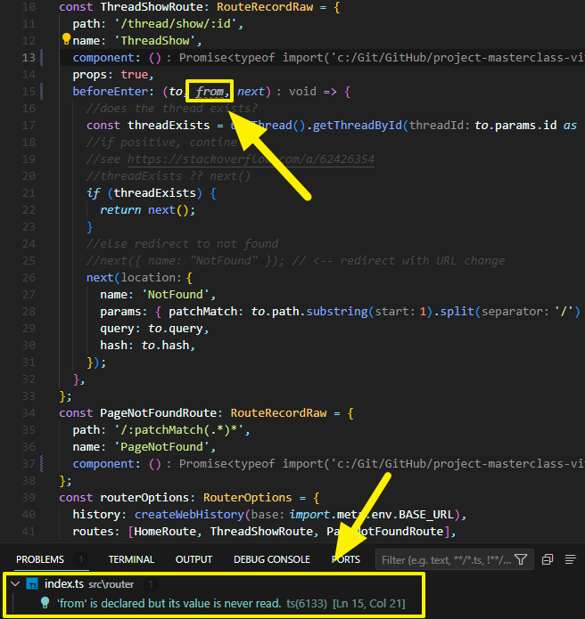

Je suis encore assez novice en TypeScript, mais je progresse grâce au [curriculum VueSchool.io](https://vueschool.io/courses).

J’aime ce que TypeScript apporte au code et comment il vous fait réfléchir davantage sur la façon d’écrire votre code.

En progressant, je me suis posé une question : comment résoudre l’erreur de linting TypeScript lorsqu’on n’utilise pas un argument dans une méthode alors qu'il est obligatoire ?

Je suis rapidement tombé sur ce cas d’utilisation.

Dans le cas ci-dessus, je n’avais pas le choix. Le garde de navigation `beforeEnter` dans `vue-router` exige de fournir le second argument `from`, même si je ne l’utilise pas…

Comment ai-je résolu le problème ? C’est simple : prêtez attention à ce que ESLint vous indique. Parfois, il fournit une solution rapide.

Dans mon cas, il m’a suggéré de marquer l’argument non utilisé avec un underscore (\_\_\_) et voilà, ESLint est devenu heureux.
