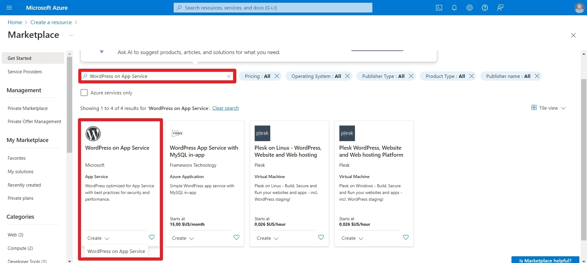
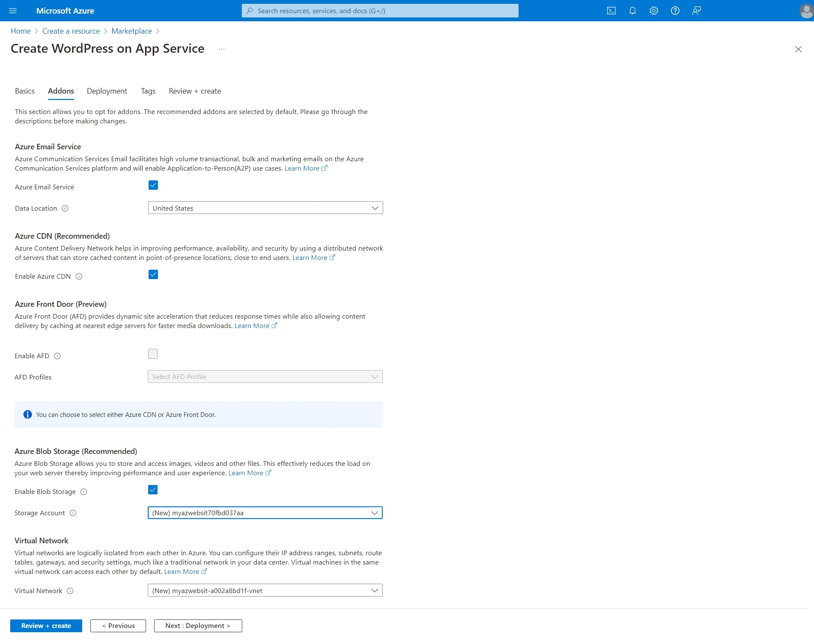
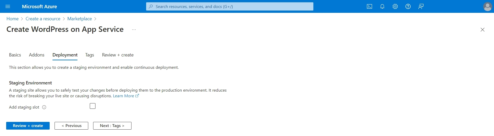
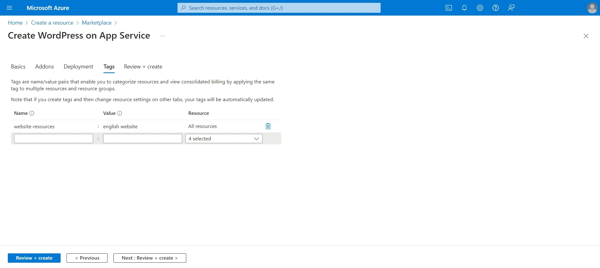
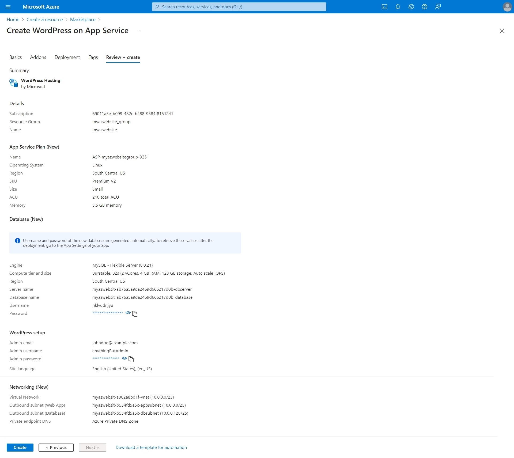
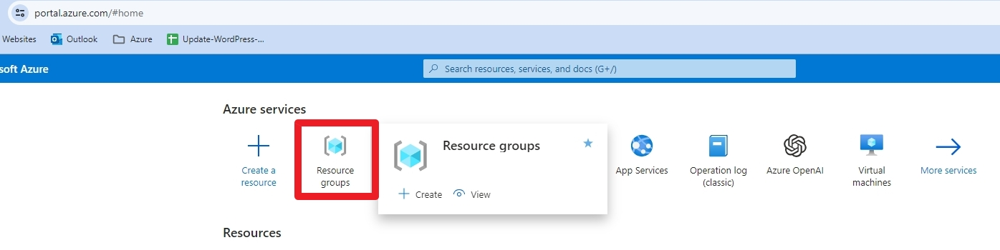
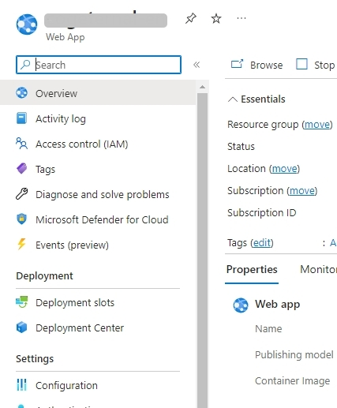
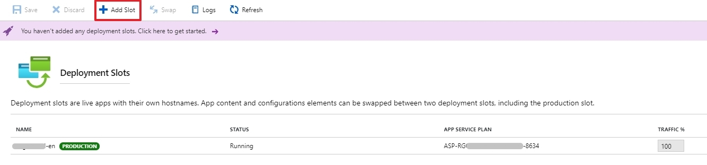
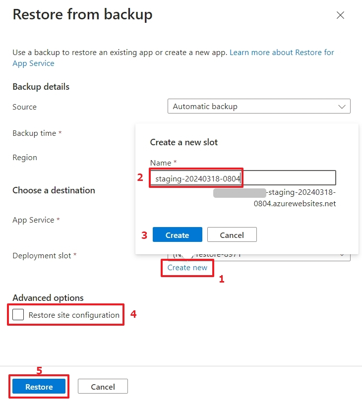

## Conditions préalables

Pour commencer, vous devez :

- disposer d’un compte et d’un abonnement sur Microsoft Azure. Il peut s’agir d’un essai gratuit ou d’un parrainage de Microsoft pour les associations.
- pouvoir accéder à l’hébergement source à partir duquel vous voulez migrer.
- pouvoir installer le plugin `All-In-One WP Migration` sur le site source pour migrer son contenu.

## Créer le service d’application (ou App Service)

L’architecture du service d’application WordPress sur Microsoft Azure est la suivante :

Crédit : image tirée de [cet article](https://learn.microsoft.com/en-us/azure/architecture/example-scenario/infrastructure/wordpress-app-service) sur Microsoft Learn.

Nous allons nous concentrer sur l’**App Service** et le **Serveur flexible Azure Database avec MySQL**.

Je mentionnerai le compte de stockage, mais je n’entrerai pas dans les détails.

Donc, à partir du [Portail](https://portal.azure.com/#home),

1. Vous sélectionnez `Créer une ressource`
2. J’ai suivi le [guide Microsoft sur la migration WordPress](https://learn.microsoft.com/en-us/azure/app-service/migrate-wordpress) et voici les étapes résumées en 5 étapes :



Utilisez l’option officielle `Microsoft App Service`.





- créer un nouveau groupe de ressources pour organiser les ressources créées, par exemple avec le `RG_Websites_Ressources`.
- sélectionner la taille initiale du plan App Service, en commençant par le plan gratuit.

N.B. Si vous effectuez une migration, le compte d’administration WordPress initial n’est pas important. Vous le remplacerez dans les étapes ultérieures avec celui du site à migrer.









J’ai **tout décoché**, _comme le montre la capture d’écran_.

Si vous avez besoin de créer un compte de stockage, vous pouvez le faire ultérieurement.









Je pense qu’il est important d’étiqueter les ressources que vous êtes sur le point de créer pour les organiser.





La création des ressources prend un certain temps. Faites une pause et revenez dans 15-20 minutes.



## Nettoyer les ressources

Pour voir toutes les ressources que vous venez de créer, allez sur [la page d’Accueil](https://portal.azure.com/#home) et sélectionnez la tuile `Groupes de ressources`.

Ensuite, sélectionnez le groupe de ressources que vous avez créé précédemment, par exemple `RG_Websites_Ressources`.

Lorsque vous créez un _App Service_ en utilisant le modèle de Microsoft Azure, il crée un peu trop de ressources.

Je n’ai pas noté toutes celles que j’ai supprimées, alors laissez-moi vous montrer celles que vous devez conserver :

- Un compte de stockage, si vous l’avez créé.
- Un _App Service_ par site web
- Une instance de base de données par _App Service_
- Un réseau virtuel

Si vous créez plusieurs _App Services_ en utilisant la méthode de l’étape précédente, vous vous retrouverez avec beaucoup de ressources.

De plus, vous aurez un abonnement d’_App Service_ par création, ce qui n’est pas forcément ce que vous souhaitez. Par exemple, sur le projet auquel j’ai participé, 2 _App Services_ fonctionnent en utilisant un seul abonnement d’_App Services_.

Il est facile de créer un nouveau _App Service_ à partir d’un service existant.

Les seules ressources distinctes dont vous avez besoin sont un _App Service_ et une instance de serveur MySQL (et même celle-ci peut être partagée entre les services applicatifs, mais je n’ai pas rencontré ce scénario).

## Dimensionner les ressources correctement

La bonne nouvelle est que vous pouvez redimensionner le _App Service_ et/ou le serveur MySQL après leur création respective. Et cela ne prend _que_ quelques clics.

Dans mon cas, j’avais 2 sites web et l’un était significativement plus grand que l’autre.

Pour modifier la taille du service d’application, il suffit de :

- Naviguer jusqu’à la ressource _App Service_ ciblée.
- Sélectionnez la lame `Scale up (app service Plan)`.
- Sélectionnez la taille souhaitée.
- Confirmez en cliquant sur le bouton `Select`.

Pour modifier la ressource du serveur MySQL :

- Naviguez jusqu’à la ressource.
- Sélectionnez dans le menu vertical `Compute + storage`.
- Sélectionnez le type : soit `Burstable`, `General Purpose` ou `Business Critical`.
- Sélectionnez la taille.
- Ajustez la taille du stockage (le minimum de 20 Go est largement suffisant).
- Ajustez les paramètres de sauvegarde si nécessaire. Personnellement, je n’ai rien modifié.
- Confirmez en cliquant sur le bouton `Save`.

## Activer HTTP/2

Avec WordPress, les thèmes et les extensions peuvent générer un grand nombre de requêtes à chaque chargement de page. HTTP/2 tire parti de la technologie pour optimiser cela et abandonner la stratégie de regroupement des ressources JavaScript et/ou CSS que nous avons utilisée avec les serveurs HTTP/1.1 par le passé.

Microsoft a annoncé la prise en charge de HTTP/2 dans [cet article](https://azure.microsoft.com/fr-fr/blog/announcing-http-2-support-in-azure-app-service/), le 27 mars 2018.

Pour l’activer, voici les étapes à suivre :

- Allez dans l’_App Service_.
- Sélectionnez le menu _Configuration_, puis l’onglet _General Settings_.
- Faites défiler vers le bas pour trouver le paramètre HTTP/2 et réglez-le sur `2.0`.
- Sauvegardez et redémarrez l’_App Service_.

Vous pouvez également trouver la configuration brute de l’_App Service_ dans [Azure Resource Explorer](https://resources.azure.com), mais il est plus délicat de l’éditer.

Si vous êtes intéressés, rendez-vous sous _subscriptions > Microsoft Azure Sponsorship > resourceGroup > RG-YourOrg-Websites > providers > Microsoft.Web > sites > YourWebsiteName (c’est-à-dire le nom de votre \_\_\_\_App Service_.

## Migrer de l’hébergement mutualisé vers Microsoft Azure

C’était la tâche principale.

Alors que j’avais commencé à effectuer la migration en utilisant [la méthode manuelle](https://learn.microsoft.com/en-us/azure/app-service/migrate-wordpress#manual-migration-process) pour plus de flexibilité, j’ai dû revenir à [la méthode utilisant l’extension](https://learn.microsoft.com/en-us/azure/app-service/migrate-wordpress#migrate-wordpress-with-all-in-one-wp-migration-plugin).

Pourquoi ?

L’extension [Advanced Custom Fields](https://www.advancedcustomfields.com/) ne fonctionnait pas après avoir effectué les étapes manuelles. Ce n’était pas possible de s’en passer, car le site web existant l’utilisait beaucoup.

Après quelques tentatives pour trouver la cause, j’ai finalement migré le site web en utilisant l’extension `All-In-One WP Migration`.

Les étapes restent assez simples et rien ne manque dans le guide.

En ce qui concerne les actions après la migration, ce que Microsoft énumère est à peu près ce que j’ai fait :

- Rechercher et remplacer (chemins et domaines) en utilisant [l’extension _Better Replace_](https://wordpress.org/plugins/better-search-replace/) pour utiliser le domaine temporaire (par ex. : `mywebsite.azurewebsites.net`; à vous d’ajuster à votre besoin).

- Configurez le domaine personnalisé une fois que nous avons vérifié que toutes les fonctionnalités fonctionnent et que les pages utilisent bien toutes le domaine temporaire.

  - Pour configurer votre site avec un domaine personnalisé, suivez les étapes décrites dans [le guide « Map existing custom DNS name »](https://learn.microsoft.com/en-us/azure/app-service/app-service-web-tutorial-custom-domain).

  

  

- Mettre à jour les certificats SSL : une fois que Microsoft Azure dessert le domaine, allez le menu `Custom domains` dans l’_App Service_ et d’ajouter le type `SNI SSL`. Cela nécessite que vous configuriez votre gestionnaire de domaines pour pointer le domaine cible vers Microsoft Azure.

## Coût : pour les associations, profitez du parrainage de Microsoft

Si vous êtes une association, vous pouvez bénéficier d’un parrainage de Microsoft.

Au moment où j’écris ces lignes, c’est **2000 dollars par an** !

Pour cette somme, vous pouvez facilement héberger un grand site web. Dans le cas que j’ai traité, nous avons :

- deux serveurs MySQL,
  - le premier à 62,33 $ par mois (pour le grand site web avec plus de 6000 pages et articles et un bon trafic régulier avec un pic le samedi).
  - le second à 10,21 $ par mois (petit site web pour l’instant),
- un abonnement _App Service_ (taille _Premium v2 P1V2_) à 75,92 $ par mois, ce qui est suffisant pour faire fonctionner 2 services d’application.
- un compte de stockage avec 772 Go de stockage Blob et 6 Go de stockage de fichiers (oui, l’organisation sert beaucoup de fichiers audio, vidéo et PDF).

Pour en savoir plus, consultez le site [https://www.microsoft.com/fr-fr/nonprofits/offers-for-nonprofits](https://www.microsoft.com/fr-fr/nonprofits/offers-for-nonprofits).

## Maintenance et mises à jour avec les _slots_ de déploiement

Même si j’ai été tenté d’utiliser une extension WordPress pour cela, je ne l’ai pas fait.

Dans les paragraphes suivants, je détaille les étapes que j’ai suivies pour utiliser les _slots_ de déploiement.

### Pourquoi des _slots_ de déploiement

Une fois la migration du site web terminée, il est temps de réfléchir à la manière d’en assurer la maintenance. Cela inclut la mise à jour du noyau de WordPress, du thème et des extensions.

Bien que vous puissiez utiliser une extension, comme UpdrafPlus ou autre, je vous recommande d’utiliser les _slots_ de déploiement, natifs de Microsoft Azure, et qui sont gratuits.

Je suis d’accord avec vous : c’est plus technique, mais l’abonnement les inclut.

De plus, j’ai personnellement essayé UpdrafPlus sur Microsoft Azure et cela ne s’est pas passé comme je l’aurais souhaité (verrouillage aléatoire de la base de données si le serveur MySQL n’était pas assez puissant).

J’ai partagé ci-dessous une procédure complète utilisée pendant des mois pour cet ancien client aux États-Unis. Et elle fonctionne à merveille !

### À propos des sauvegardes dans Microsoft Azure

Avant de nous plonger dans la procédure elle-même, parlons des sauvegardes.

Par défaut, votre instance de base de données et votre _App Service_ sont sauvegardés automatiquement.

La base de données est sauvegardée une fois par jour, environ une heure après son heure de création.
Vous pouvez effectuer des sauvegardes manuelles à tout moment, dans la limite de 50 par instance.



Lorsque vous créez une nouvelle instance (ce qui est le cas lorsque vous effectuez une maintenance), le compteur repart à 0.

Vous ne serez donc jamais à court 😁



L’_App Service_ est sauvegardé toutes les heures. Vous pourriez mettre en place des sauvegardes manuelles, mais je n’en vois pas l’utilité.
De plus, il faut créer un compte de stockage (coûts supplémentaires) et le relier à l’_App Service_.

Ne pas faire de sauvegarde manuelle du service d’application signifie que la synchronisation entre la base de données et le service d’application peut être un peu décalée.

Pour éviter toute perte de données, je recommande d’effectuer une sauvegarde manuelle de la base de données juste après une sauvegarde automatique de l’_App Service_ (il s’agit d’une des premières étapes de la procédure).

Abstenez-vous également d’effectuer des modifications (en dehors des mises à jour à effectuer) avant d’avoir terminé les tâches de maintenance.

### Utiliser les _slots_ de déploiement

Rendez-vous sur le menu `Deployment slots` dans le menu vertical.

Une fois dans le tableau de bord, vous pouvez créer un _slot_ à partir de `Add Slot` :

Vous devrez :

- Saisir le nom du _slot_. Ci-dessous, je partage la façon dont je le nomme.
- Sélectionner l’_App Service_ parent à partir duquel vous souhaitez cloner les paramètres.

- Confirmez en cliquant sur `Add`.

Après quelques secondes, le tableau de bord des _slots_ de déploiement est mis à jour :



Il fallait ajouter le réseau virtuel au _slot_, car il n’était pas _copié_ par défaut.

Microsoft semble avoir résolu ce problème ! Hourra 🎆



## Prochaines suivantes

J’ai créé pour l’association qui m’a sollicitée [une liste d’actions sur Google Sheet (en anglais)](https://docs.google.com/spreadsheets/d/1G8uoIAh-UOGrIepgz0q-iR9WkbgJVocGeL8J9RQMpbY) que vous pouvez copier et utiliser.

Si vous trouvez un problème ou une étape obsolète, [faites-le-moi savoir](../../../page/contactez-moi/index.md).

Je recommande de réaliser cette procédure tous les mois minimum. Elle prend moins d’une heure une fois que vous vous êtes familiarisé avec elle.

## Conclusion

Je suis parti de zéro, sans aucune expérience sur Microsoft Azure. Pourtant, j’ai appris assez rapidement et j’ai appliqué les compétences que je détenais pour organiser les ressources correctement et mener le projet à son terme.

Je n’ai pas tout réalisé, mais j’ai posé des questions sur ce que ces points. Le fils du responsable de l’association a insisté pour que l’on utilise Microsoft Azure pour profiter du parrainage de Microsoft. Comme il occupe le poste de responsable de l’optimisation des coûts et des ressources sur Microsoft Azure, le choix est tout fait.

Il a aidé à mettre en place le CDN pour servir les contenus audio, vidéo et PDF. Il a également aidé à configurer le compte Office 365 dédié à l’envoi des messages depuis le site web. En utilisant l’extension [_WPO365 | MICROSOFT 365 GRAPH MAILER_](https://wordpress.org/plugins/wpo365-msgraphmailer/), nous avons connecté les formulaires au compte Office 365 pour envoyer les messages des utilisateurs du site web.

Microsoft Azure peut être intimidé par les vastes possibilités qu’il offre. C’est un écosystème complexe et complet. Pourtant, il s’agit d’une compétence précieuse et je suis heureux de l’avoir acquise.
