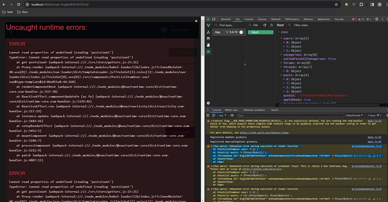

Très souvent, nous nous retrouvons à avoir un composant parent, disons un fil de discussion avec une liste de messages, où il transmet à son enfant (par ex.: le composant _liste de messages_) des données récupérées de manière asynchrone.

Dans ce scénario, vous utiliserez le hook `created` (avec l’API Options) pour récupérer toutes les données avant d’afficher la page.

Et parce que cela s’effectue de manière asynchrone, vous utilisez `await` sur les méthodes de récupération (ou les actions si vous utilisez la gestion d’état) et `async` sur le hook.

Par exemple :

```jsx
async created() {
    const thread = await this.$store.dispatch("fetchThread", {
      id: this.$route.params.id,
    });
    const posts = await this.$store.dispatch("fetchPosts", {
      ids: thread.posts,
    });
    const users = posts.map((post) => post.userId);
    await this.$store.dispatch("fetchUsers", {
      ids: users,
    });
  }
```

Ensuite, vous utilisez une `computed` pour récupérer les données :

```jsx
//
  computed: {
    threadPosts() {
      const matches = this.$store.getters['posts/getPostsByThread'].filter((post) => post.threadId === this.id);
      return matches;
    }
  }
```

Et le transmettre à l’enfant dans le modèle du parent :

```html
<template>
  <div class="col-large push-top">
    ...
    <post-list :posts="threadPosts" />
    ...
  </div>
</template>
```

Mais quand on teste cela tel quel, on obtient ceci :



Parce que vous n’avez pas dit au composant enfant que les données sont **prêtes**, il essaie de charger sa propre template même si les _props_ sont indéfinies…

Avec Vue, à moins que le parent ne dise explicitement le contraire aux enfants, il (Vue) chargera tous les composants sous-jacents.

Comment résoudre ce problème ? C’est très simple : chargez conditionnellement les composants enfants en attendant les données du parent :

```html
<post-list :posts="threadPosts" v-if="$store.getters.isAppIsReady" />
```

`$store.getters.isAppIsReady` est un _getter_ de la gestion d’état, que vous assignez à `true` lorsque la récupération des données est terminée dans le hook `created`.

Vous pouvez également l’utiliser dans le composant du parent avec deux sections :

- la première pour indiquer le chargement en cours, affichée pendant que le hook `created` récupère les données,
- la seconde lorsque les données sont prêtes.

```html
<template>
  <app-loading-state
    v-if="!$store.getters.isAppIsReady"
    message="Loading the thread... Please wait ⌛"
  />
  <section v-else>
    <div class="col-large push-top">
      ...
      <post-list :posts="threadPosts" />
      ...
    </div>
  </section>
</template>
```

Ainsi, lorsqu’un composant enfant semble manquer les données qu’il reçoit par les _props_, vérifiez que le parent gère correctement la récupération de données asynchrones. En indiquant à Vue de ne charger les composants uniquement lorsque le parent est prêt, vous éviterez l'erreur ci-dessus.

Crédit: Photo par [Ferenc Almasi](https://unsplash.com/@flowforfrank?utm_content=creditCopyText&utm_medium=referral&utm_source=unsplash) sur [Unsplash](https://unsplash.com/photos/text-ayjnmG4oUX4?utm_content=creditCopyText&utm_medium=referral&utm_source=unsplash)
