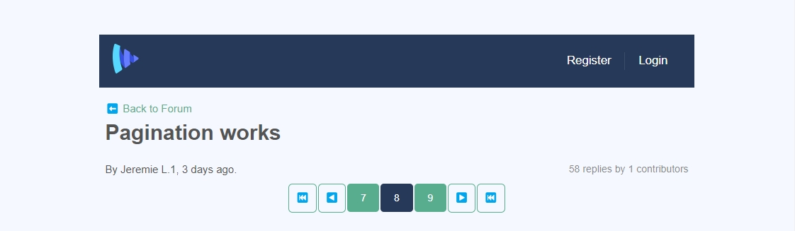

Pendant que je travaillais sur [le cours Masterclass de Vueschool.io](https://vueschool.io/the-vuejs-master-class), j’ai construit cette pagination géniale à partir de rien pour me mettre au défi :



Vous pouvez la voir en action sur [cette page de démonstration](https://vueschool-masterclass-vite.netlify.app/forum/-KvdCowY9mDvM0EH8Pvs) ou [celle-ci](https://vueschool-masterclass-vite.netlify.app/thread/-KsjwU_A01lZRcljDlOp).

Elle contient des boutons _page précédente_ et _page suivante_ pour se déplacer d’une page à l’autre, ainsi qu’un bouton _plage précédente_ et un autre pour la _plage suivante_ pour avancer dans la pagination et sélectionner une page spécifique.

J’ai utilisé la chaîne de requête `page=x` dans l’URL pour que la page actuelle soit détectée lors du chargement et du changement de page.

Une fois que j’avais bien stabilisé l’algorithme de mise à jour de la plage affichée et la logique d’affichage des boutons dans un état particulier, j’ai essayé de l’intégrer à un composant parent.

Au début, j’ai utilisé le hook `updated` pour gérer le changement de page et cela a fonctionné sur l’application gérée avec Vuecli.
Tout fonctionnait bien avec l’API Options.

Mais après avoir transposé le JavaScript en TypeScript et utilisé l’API Composition, l’application gérée avec Vite ne se comportait pas comme prévu sur le clic des boutons _page précédente_ et _page suivante_, ce qui bloquait la navigation.

Qu’est-ce qui n’allait pas ?

Dans mon `App.vue`, je n’utilisais pas un `:key` unique sur le composant `router-view`.

Cela provoquait un échec visuel du re-rendu de la page.

Pour résoudre ce problème, grâce à Daniel Kelly, comme [il l’a expliqué dans cette leçon](https://vueschool.io/lessons/storing-the-current-page-as-a-url-query-variable), j’ai eu besoin d’inclure la chaîne de la route courante dans la clé.

Auparavant, j’avais :

```html
<router-view :key="`$route.path" />
```

Après, c'est devenu :

```html
<router-view :key="`${$route.path}${JSON.stringify($route.query)}`" />
```

Lors d'un changement de route, l'utilisation de la propriété `:key` est vraiment essentielle pour éviter des bugs comme celui-ci.
