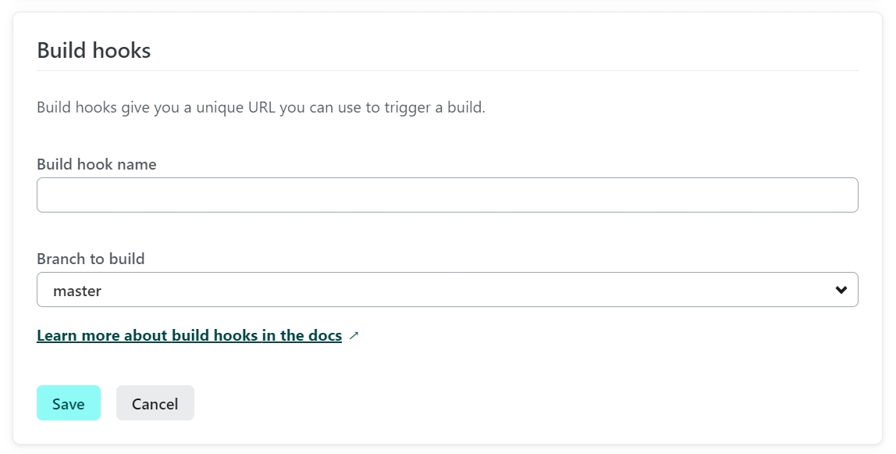
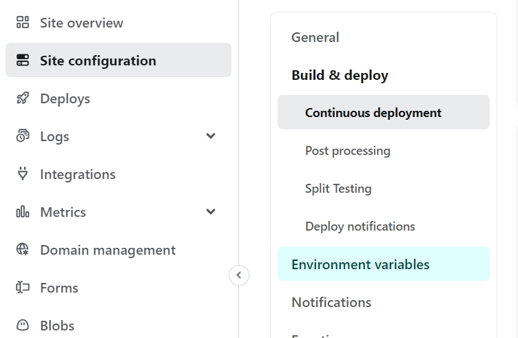
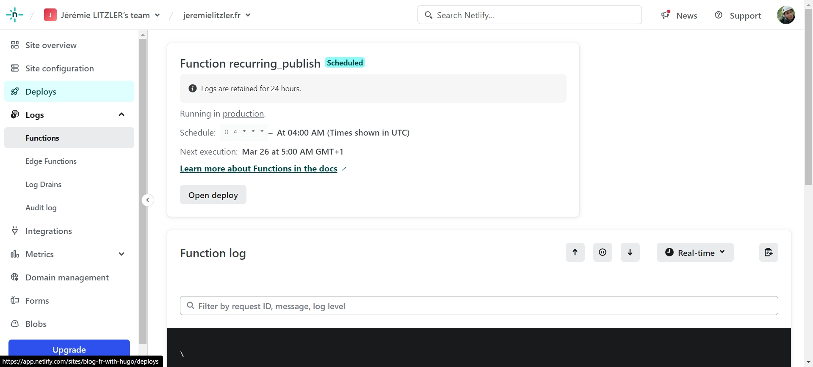

## Pourquoi planifier les _builds_

En utilisant Hugo comme un SSG (Static Site Generator), vous pouvez écrire un article et fixer la date de publication dans le futur.

Cependant, en raison du fonctionnement des SSG, vous avez besoin d'un _build_ pour publier l'article à la date choisie.

Je pouvais facilement déclencher un _build_ manuellement à partir du tableau de bord de Netlify, mais ne serait-il pas préférable qu'un processus automatisé s'en charge ? Comment faites-vous pour automatiser un _build_ ?

Grâce à [Talves](https://answers.netlify.com/u/talves) sur [ce fil de discussion](https://answers.netlify.com/t/scheduling-builds-and-deploys-with-netlify/2563/5) qui m'a orienté vers [ce guide](https://www.raymondcamden.com/2022/02/04/an-early-look-at-netlify-scheduled-functions) (même si la solution est un peu obsolète), j'ai réussi à trouver la solution à partir de ce point de départ.

## Les étapes

### Sur le tableau de bord de Netlify

- Créer un _build hook_ à partir de `https://app.netlify.com/sites/<votre-nom-de-site>/configuration/deploys`

  - Sélectionnez votre site.
  - Ensuite, allez dans la lame `Deploys` dans le menu principal.
  - Ensuite, sélectionnez `Deploy settings`.
  - Par défaut, vous êtes dans l'écran approprié (`Build & deploy > continuous deployment`). Là, faites défiler vers le bas `Build hooks`.
  - Cliquez sur `Add build book`.
  - Donnez un nom à votre hook comme _Daily publish_ et sélectionnez la branche que vous voulez cibler.

  

  - Cliquez sur _Save_ et copiez l'URL.

- Ensuite, rendez-vous dans `Environment variables`, qui se trouve un peu plus bas dans ce menu secondaire.

  

- Ajoutez une nouvelle variable d'environnement que vous appellerez `RECURRING_PUBLISH` et collez l'URL copiée comme valeur.





### Dans votre IDE avec un clone de votre dépôt

- Installez Netlify CLI en tant que dépendance de développement sur votre dépôt :

  ```bash
  npm i -D netlify-cli*
  ```

- Installez le paquet _@netlify/functions_ pour que Netlify sache comment exécuter votre fonction, en particulier la partie planification :

  ```bash
  npm i @netlify/functions\*
  ```

- Ajoutez un script _npm_ pour pouvoir lancer la CLI pour créer la fonction :

  ```json
  "netlify" : "netlify"

  ```

- Créer une fonction en utilisant la Netilfy CLI :

  ```bash
  npm run netlify functions:create recurring_publish\*
  ```

- Ajoutez l'endroit où vous stockez les fonctions dans le fichier `netlify.toml` :

  ```toml
  [build]
  ignore = "exit 1"
  publish = "public"
  functions = "functions" #la fonction a été créée dans le répertoire 'functions' à la racine de votre référentiel.
  ```

- Utilisez ce code pour la fonction (je l'ai fortement commenté) :

```jsx
/**
 * Import the schedule function to use cron expression
 * for recurring functions.
 */
import { schedule } from "@netlify/functions";
import { log } from "console";
log("RECURRING_PUBLISH>Starting registering recurring-publish function...");
/**
 *
 * @param {Object} event The event sent by Netlify CD to the function.
 * @returns
 */
const handler = async (event) => {
  log("RECURRING_PUBLISH>Starting function");
  log("RECURRING_PUBLISH>event", event);
  /**
   * Environment variables are retrieved via process.env
   * but not the global object `Netlify.env` as some docs
   * suggests.
   * Or it requires a certain package. The said-
   * docs don't mention it.
   *
   * @see https://docs.netlify.com/functions/get-started/?fn-language=ts#environment-variables
   *
   * For setting Environment Variable, go to your app deploy settings and select the "Environment Variables" blade.
   *
   * @see https://docs.netlify.com/configure-builds/environment-variables/
   */
  let RECURRING_BUILD_HOOK = process.env.RECURRING_BUILD_HOOK;
  log(
    "RECURRING_PUBLISH>Got RECURRING_BUILD_HOOK variable =>",
    RECURRING_BUILD_HOOK
  );
  log("RECURRING_PUBLISH>Fetching as POST the RECURRING_BUILD_HOOK...");
  /**
   * Note: because functions use the standard Fetch API,
   * which was only added natively to Node.js in version
   * 18.0.0, no need for other libraries...
   *
   * As of March 25th 2024, it should be fine.
   * @see https://docs.netlify.com/functions/get-started/?fn-language=ts#runtime
   */
  try {
    await fetch(RECURRING_BUILD_HOOK, { method: "POST" });
    log("RECURRING_PUBLISH>Build hook fetch success!");
    return {
      statusCode: 200,
      body: JSON.stringify({ message: `Build triggered successfully.` }),
    };
  } catch (error) {
    log("RECURRING_PUBLISH>Build hook fetch error!");
    return { statusCode: 500, body: error.toString() };
  }
};

/**
 * This was my attempt to use an environment variable to configure the cron.
 * But Netlify build agent tells me it is not possible...
 * Though the logs show the variable is read...
 */
let RECURRING_PUBLISH_CRON = process.env.RECURRING_PUBLISH_CRON;
log(
  "RECURRING_PUBLISH>Got RECURRING_PUBLISH_CRON variable =>",
  RECURRING_PUBLISH_CRON
);
//module.exports.handler = schedule(RECURRING_PUBLISH_CRON, handler);
//module.exports.handler = schedule("*/5 * * * *", handler);//every 5 min
module.exports.handler = schedule("0 4 * * *", handler); //every day at 4am GMT
log("RECURRING_PUBLISH>Done registering");
```

- Pousser le tout pour un nouveau _build_.

### Retour sur le tableau de bord Netlify

A la fin du _build_, vérifiez la lame _Logs > Functions_ sous votre application :



La fonction _recurring_publish_ devrait apparaître et vous dire qu'elle s'exécutera au prochain `cron` paramétré dans la fonction, dans l'exemple à 4:00 GMT.

NB : vous ne pouvez pas utiliser une variable d'environnement pour définir la valeur de `cron` car Netlify vous le dira :

```log
9:25:40 AM:   Unable to find cron expression for scheduled function.
              The cron expression (first argument) for the `schedule` helper needs to be
              accessible inside the file and cannot be imported.
```

Cette procédure fonctionne le 8 avril 2024.

Comme je l'utilise pour mes deux blogs, si elle nécessite des ajustements, je mettrai à jour cet article en conséquence.

Merci d'avoir lu jusqu'ici et profitez de vos _builds_ planifiés sur Netlify.

Crédit : photo d'entête par [Lukas Blazek](https://unsplash.com/@goumbik?utm_content=creditCopyText&utm_medium=referral&utm_source=unsplash) sur [Unsplash](https://unsplash.com/photos/person-holding-white-mini-bell-alarmclock-UAvYasdkzq8?utm_content=creditCopyText&utm_medium=referral&utm_source=unsplash).
