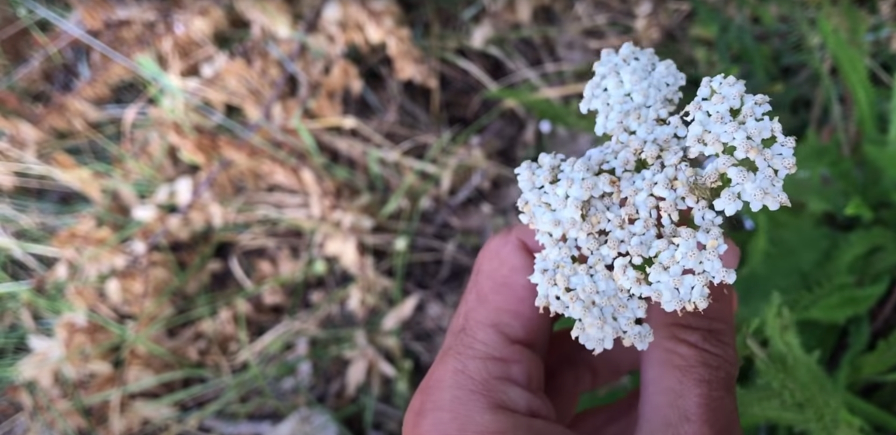

Merci à Christophe pour le partage de son savoir !
Cet article résume mes notes du vlog réalisé par Christophe sur sa chaîne Altheaprovence.

<!-- more -->

Vous pouvez retrouver [la vidéo sur YouTube](https://www.youtube.com/watch?v=0meAqoQRqEU).

Prononce-t-on « aquilé » ou « Achillé » ? Les 2 prononciations sont possibles. Mais comme le dit Patrice de Bonneval, on n’a jamais parlé d’« Aquil » dans la mythologie grecque ni du talon d’Aquil.

À vous de choisir.

## Botanique

C’est une plante de la famille des astéracées, très grande famille botanique qui englobe de nombreuses plantes médicinales.

Pourquoi « Astérassé » ? Cela provient du capitule floral qui contient de nombreuses toutes petites fleurs à l’intérieur.

Dans la même famille, il existe beaucoup de plantes, comme la camomille romaine, la matricaire, l’armoise commune, l’artichaut, le pissenlit, le souci, la verge d’or, etc.

Beaucoup de ces plantes s’utilisent en médecine.

L’achillée est une plante vivace et très commune. Vous allez la rencontrer dans les prairies, sur le bord des chemins, dans à peu près toutes les régions de France et d’Europe.

Elle propage par stolon, et si vous l’introduisez dans un jardin, elle se multipliera rapidement et facilement.

Ses feuilles sont très caractéristiques. Elles s’alternent et elles sont très découpées.

On comprend le terme « 1000 feuilles »

Cela nous fait penser aux réseaux sanguins, aux veines et aux artères, aux artérioles. Cela vous aidera à vous rappeler qu’il s’agit d’une grande plante du sang.

La tige est angulaire.

Les sommités fleuries ressemblent à des ombelles de couleur blanche.
Toutefois, il en existe aussi des jaunes et roses.

Une bonne achillée est très aromatique, en froissant les sommités dans les doigts.

## Les propriétés

### Pour la circulation sanguine

L’achillée agit à de multiples niveaux sur la circulation sanguine.

Déjà, la plante agit pour soulager la congestion de sang en apportant de l’oxygène, des nutriments, etc.

Le cas le plus classique est celui des règles douloureusement. On en parle une peu plus loin en détail.

Ensuite, elle soutient les problèmes de circulation du sang dans les organes (cœur, foie).

En général, l’achillée se prend en interne, mais pour favoriser les retours veineux, un macérat huileux peut s’utiliser en massage sur les jambes.

Enfin, l’achillée s’utilise traditionnelle pour freiner les saignements. On parle de propriété hémostatique.



En cas de blessure grave, consultez un médecin ou rendez-vous aux urgences.



Comment l’utiliser sur place ?

On va bien mâcher quelques feuilles pour former une boule dans la bouche. Prenez soin de bien garder le jus de la plante dans votre bouche.

Un moment après, une fois que vous avez bien mâché, recrachez cette pâte et appliquez à l’endroit qui saigne.

On peut la maintenir en place avec un morceau de tissu.

L’achillée est aussi antibactérienne.

### Pour le cycle menstruel

L’achillée accompagne les femmes pour les dysménorrhées. En infusion bien chaude, cela peut fortement soulager les règles difficiles.



Chez certaines femmes, l’achillée peut provoquer des règles plus abondantes.

Même si ce n’est pas courant, il faut le savoir pour ne pas paniquer si vous vous trouvez dans ce cas.



Ensuite, en cas d’aménorrhée, c’est-à-dire l’absence de règles, l’achillée accompagne la jeune fille ou la femme d’âge mûr.

On peut la combiner avec l’armoise commune pour créer une combinaison efficace.

Dans les cas d’inflammation de type endométriose dans l’utérus, l’achillée agit comme anti-inflammatoire.

### Pour les déséquilibres hormonaux

C’est assez subtil.

Par exemple, si le foie n’élimine pas correctement les toxines, la plante se rend utile pour libérer l’organe et régule les hormones annexées.

Par exemple, elle équilibre le taux d’œstrogène par rapport à la progestérone.

Dans cette situation, il peut être intéressant de l’associer au [gattilier](https://www.google.com/search?q=gattilier&sclient=img&udm=2).

### Pour la digestion

L’achillée possède cette combinaison aromatique et amère, très utile dans ce domaine.

Les substances aromatiques vont calmer les ballonnements ou la production de gaz. Elles agissent comme antispasmodiques.

Les substances amères relancent la digestion pour favoriser une meilleure production de suc gastrique,

On peut ainsi en boire avant les repas comme tonique amère pour préparer la digestion.

Mais le moment le plus utile a lieu pendant la digestion, lorsqu’on se trouve en pleine crise.

Par exemple, si on a trop mangé, la veine porte, qui emmène les nutriments dans le foie, est congestionnée et l’achillée va aider à relâcher tout ça.

Plus loin, dans l’intestin, l’achillée aide grandement, en infusion chaude.

## Utilisation

On peut utiliser les feuilles et les fleurs.

En revanche, ces dernières se révèlent plus aromatiques.

Allez les récolter dans la nature, dans des zones non polluées.

### Comment contrôler la plante

La présence de goût aromatique clair et certain est indispensable pour qu’elle soit efficace dans un traitement, quel qu’il soit.

Sinon, il n’y aura pas les effets attendus.

### Comment l’utiliser

D’après Christophe, des infusions de sommités fleuries se révèlent être la plus efficace et économique des utilisations même s’il est possible de réaliser des teintures.

On laisse alors infuser pendant 10 min de l’eau bouillante une belle sommité, fraîche ou sèche.

On prendra 2 à 3 tasses par jour.

## Précautions

L’achillée est contre-indiquée pendant la grossesse ou en cas d’allergie aux Astérassées.
