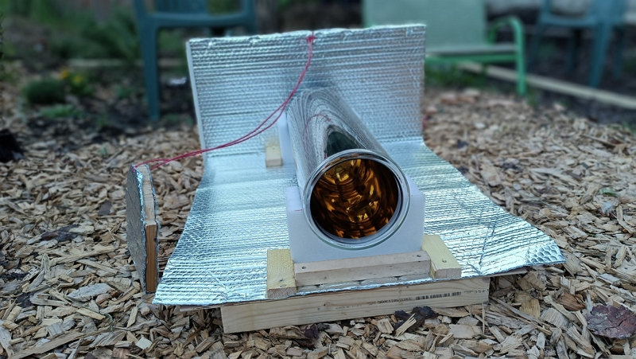
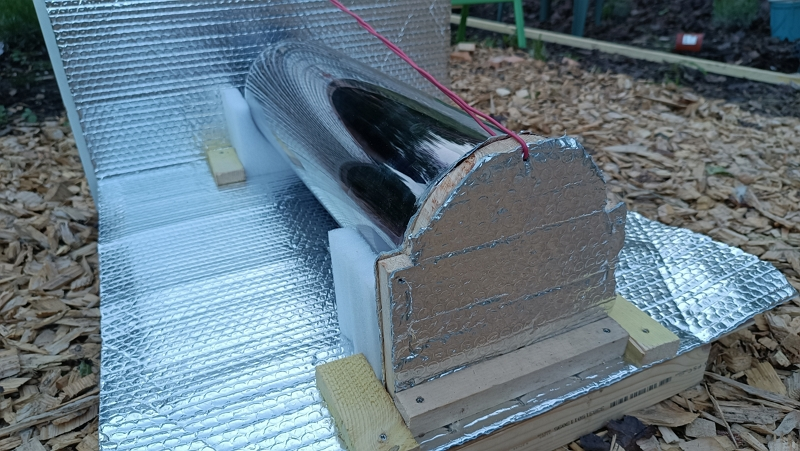
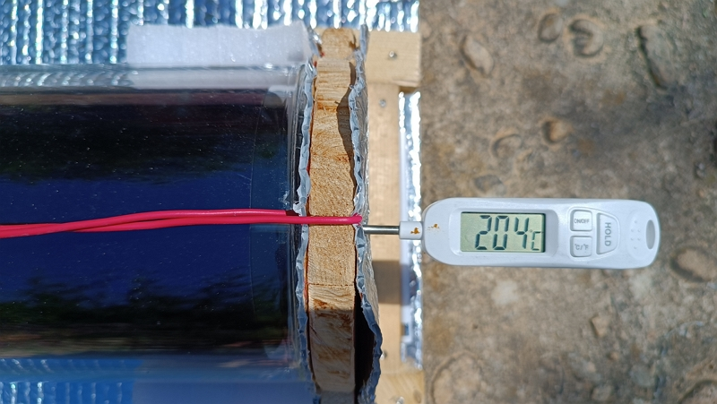
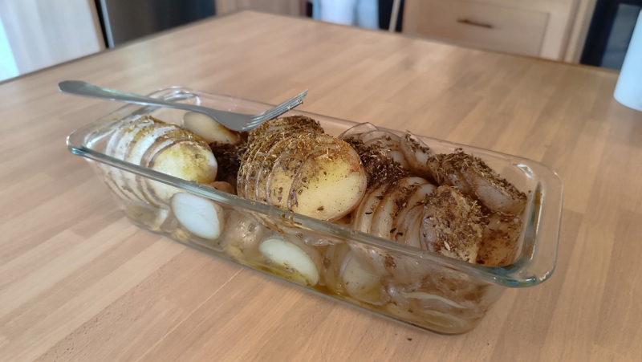

Tout d’abord, merci à « **[DU SOLEIL DANS NOS ASSIETTES](https://www.dusoleildansnosassiettes.com/content/22-tubes-solaires)** ». Je les ai découverts via la chaîne de l’Archipelle sur [cette vidéo](https://www.youtube.com/watch?v=fAYNytaWxBg&t=1698s).

David explique en détail comme cela fonctionne pour le tube de cuisson et celui utilisé pour la stérilisation.

Dans cet article, je parlerai du tube de cuisson utilisable comme un four.

## Le tube de cuisson

Il mesure **13,5 cm** (+/- 2 mm) **de diamètre intérieur**, **16 cm à l’extérieur** pour une **longueur de 61,4 cm.**

J’ai réalisé **le support du tube** avec les **mousses de l’emballage** et quelles chutes de planches et de tasseaux.

D’après « **[DU SOLEIL DANS NOS ASSIETTES](https://www.dusoleildansnosassiettes.com/content/22-tubes-solaires)** » :

> Les températures sont de l’ordre de **180°**, ce four est donc adapté à des gratins, cakes, lasagnes, légumes, riz, ou gâteaux. L’utilisation est possible les 2/3 de l’année.

On verra plus bas ce qu’il en est vraiment.

## Où le commander

Avec le tube de cuisson, on peut cuire des aliments comme s’ils se trouvaient dans un four.

Pour cela, il faut [commander un tube](https://www.dusoleildansnosassiettes.com/boutique/21-tube-de-sterilisation-solaire.html) (120 euros TTC) sur le site « **[DU SOLEIL DANS NOS ASSIETTES](https://www.dusoleildansnosassiettes.com/content/22-tubes-solaires)** » et vous récupérez celui-ci dans un point relais autour de chez vous.

## La construction du support

Ensuite, on se construit un support en bois.

J’ai pris :

- pour la base : une chute de contre-plaqué un peu plus long que le tube et presque aussi large que long,
- pour le fond : une chute d’agglomérée un peu plus haut que le tube
- pour le « boost » énergétique : une chute d’isolant thermique en film aluminisé double face à bulles de 3 mm pour optimiser les performances.
- pour les pieds du support : des chutes de tasseaux de sapin
- pour la porte :
  - une chute de sapin (18 mm d’épaisseur)
  - une chute de câble électrique pour maintenir la porte bien fermée

Le support en bois simple à construire.

_PHOTO PAR DESSOUS A PRENDRE_

J’ai coupé les tasseaux à la largeur de la plaque de contre-plaqué pour les utiliser comme pieds.

Puis, j’ai vissé le fond en aggloméré.

Ensuite, j’ai agrafé l’isolant thermique en film aluminisé sur l’intégralité de la base et du fond.

J’ai coupé en deux l’une des protections en mousse qui sont fournies avec le tube pour stabiliser le tube. Je les ai ensuite agrafées sur la base en contre-plaqué.

Pour la porte, j’ai découpé un morceau de la planche de sapin au diamètre du tube puis j’ai découpé la moitié supérieure pour épouser la forme du tube.

J’ai fait deux trous :

- un pour insérer le thermomètre.
- un pour insérer le câble pour maintenir la porte fermée.

_PHOTO A PRENDRE_

Pour finir, j’ai installé le câble électrique pour maintenir la porte bien fermée en utilisant la planche d’aggloméré qui de fond vertical.

## Observations du premier essai

À 10 h, le 12 mai, le soleil pointe son nez au-dessus de notre colline (eh oui, le soleil se lève tard chez nous à cause du relief).

En quelques secondes, la température monte immédiatement !



Deux heures plus tard (pour le premier essai, je n’étais pas tout le temps à côté), la température a atteint 204 °C. On peut dire que le préchauffage a réussi !

Nous avons alors préparé des pommes de terre coupées en tranche de 5 mm.

Au bout de 30 min, la température est à 135 °C.

Au bout de 1 h 30, on a gagné 10 °C de plus et les pommes de terre du dessus sont « aldente ».

Au bout de 2 h 30, la cuisson se termine et la température a atteint 155 °C. Les pommes de terre du fond manquent un petit peu de cuisson, mais globalement, ça se mange bien.

Alors, oui, ce n’est pas croustillant, car l’humidité de la cuisson est restée à l’intérieur et il n’y a pas de « résistance ».

Toutefois, d’après David, tant qu’il y a de l’humidité (j’avais mis un peu d’eau au fond du plat), aucun risque de rater la préparation.

## Conclusion

Une cuisson de 2 h devrait suffire la prochaine fois, car, en ayant ouvert et fermé 3 fois pour vérifier la cuisson, on a perdu la chaleur à chaque fois.

Toutefois, cela remontait rapidement à la température max. avant l’ouverture.



Il faut noter que la température à vide et en charge diffère sensiblement. Je pense que cela vient du fait de la masse à chauffer, relativement froid, comparé à l’air et bien sûr plus lent à chauffer.

Maintenant, est-il possible de cuire un pain dans ce tube ? Peut-être, mais sans trop d’ouverture et fermeture pendant la cuisson. Je pense que je vais demander à David s’il a déjà essayé.

Je sais aussi qu’il faudra le mettre dès le matin et une bonne partie de la journée.

Avant cet essai, on va essayer de cuire un clafoutis. Il y aura moins de risque et on connait cette préparation.

Si vous aimez ce que j’écris, n’hésitez pas à me le dire [sur X](http://www.twitter.com/share) ou [en m’apportant votre aide](../../../page/soutenez-moi/index.md). Merci.
