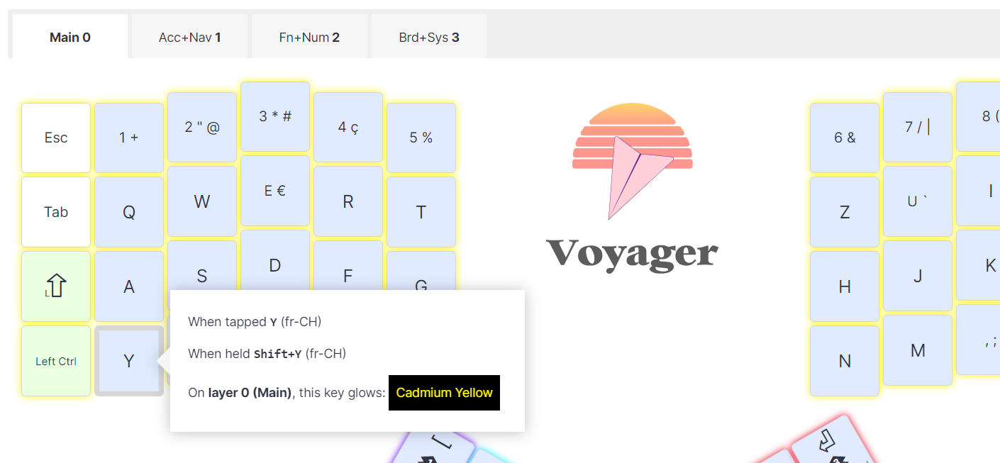
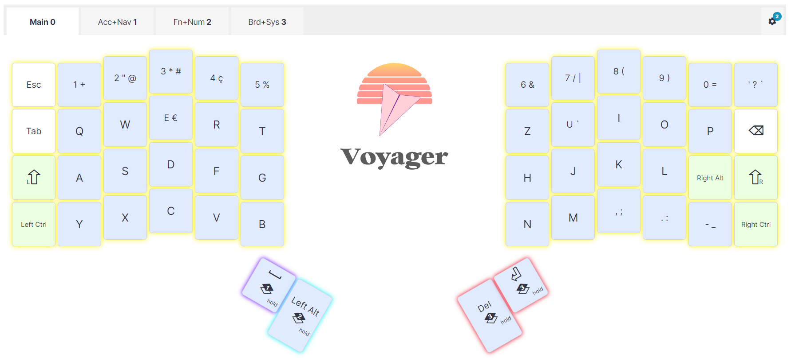
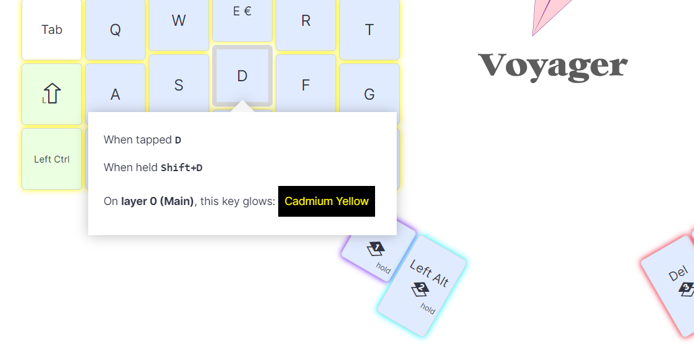
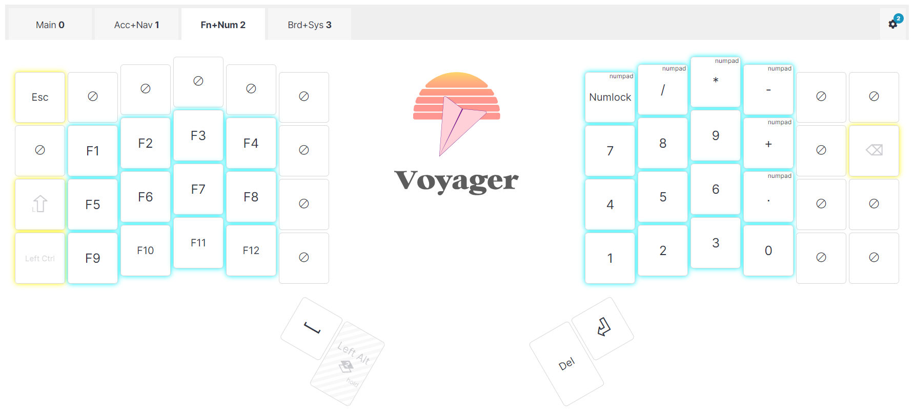
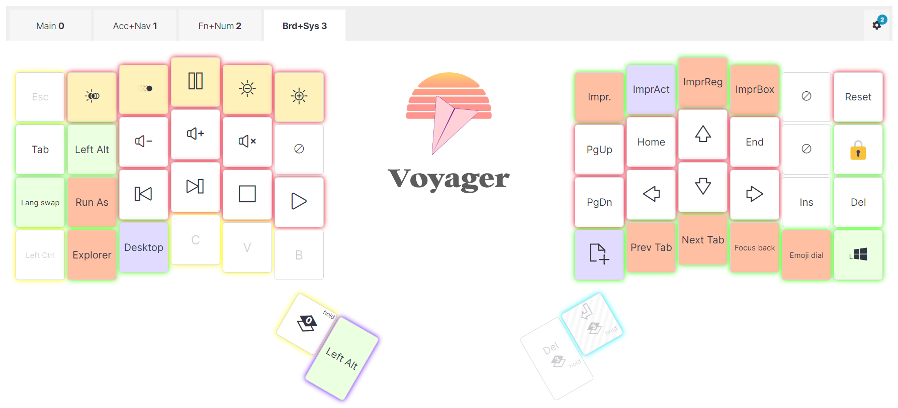

## Pourquoi un clavier divisé

Depuis que j’ai commencé à travailler à Genève, j’ai dû apprendre la disposition du clavier franco-suisse sur un clavier Logitech ordinaire. Bien que cela ait été difficile les deux premières semaines, je peux dire que j’ai réussi à adopter à cette disposition. Je la trouve plus sympa pour les développeurs en raison de la position des caractères spéciaux.

Un de mes collègues utilise un ZSA Moonlander depuis un petit moment, un modèle plus grand que le Voyager, avec une rangée supplémentaire, et j’ai pensé qu’il serait intéressant d’essayer un clavier divisé.

Comme les claviers ZSA sont très populaires, si je ne parviens pas à m’habituer à la disposition, je pourrai facilement le revendre en Europe.

Ce qui m’intéresse surtout, c’est de voir s’il peut m’aider à positionner mes mains, mes bras et surtout mes épaules. Cela doit éviter les problèmes sur le long terme qui peuvent survenir à la suite de longues journées de travail à écrire sur l’ordinateur.

## Pourquoi le modèle Voyager

Mon collègue m’a dit qu’il n’utilisait presque jamais certaines touches.

Comme ZSA Technology Labs vend le Moonlander et le Voyager au même prix, j’ai pensé qu’il valait mieux utiliser un clavier plus restreint, tout en profitant des fonctions entièrement configurables pour obtenir les dispositions nécessaires à mes habitudes.

## Première configuration

Si vous êtes comme moi et que vous utilisez une disposition internationale (française, suisse, etc.), lisez d’abord [cet article de ZSA (en anglais)](https://blog.zsa.io/international-setup/#:~:text=Ce%20setting%20is%20usually%20in,our%20article%20about%20unsupported%20languages). Il explique quelques points à garder à l’esprit lors de la configuration de vos mises en page.

Une fois que vous avez activé votre internalisation et que vous vous êtes assuré que votre système utilise la langue correspondante, voici les quelques points d’attention :

### Les touches n’affichent pas les caractères « SHIFT » ou « ALT-GR » mais ils sont bien présents

Les touches fournies avec le Voyager sont minimalistes. ZSA a imprimé un seul caractère sur chacune d’entre elles, parfois un gros point en haut pour les touches neutres.

Par exemple, la rangée numérique d’un clavier franco-suisse comporte des caractères spéciaux disponibles en appuyant sur n’importe quelle touche combinée à une touche _SHIFT_.

Ils sont également disponibles sur votre clavier ZSA, par défaut.

Il en va de même pour les caractères activés par « *AltGr* » ou « *Right Alt* ».

### La réaffectation d’une touche internationale à l’aide du code spécifique à la langue est importante

Par exemple, lors de l’utilisation d’un clavier franco-suisse, les touches Z et Y doivent être interverties.

Pour ce faire, il faut attribuer « Y **(fr-CH)** » à la touche Z habituelle et « Z **(fr-CH)** » à la touche Y habituelle.

Si vous utilisez les touches « Y » et « Z » dans l’échange, vous obtiendrez deux Y lorsque vous utiliserez la langue du système suisse romand… Pourquoi ? Car le code de la touche « Y » et « Y **(fr-CH)** » diffèrent dans la langue système « Français (Suisse) » de Windows.

Ceci est vrai pour toutes les autres touches qui ont un équivalent « fr-CH ».

Soyez donc attentif à ce point lorsque vous configurez vos schémas.

## Organiser les « couches » du clavier

C’est la partie la plus difficile, car avec seulement 52 touches, il faut bien réfléchir à la façon de rendre le système le plus efficace possible pour une utilisation quotidienne.

Dans mon cas, j’écris beaucoup et je code quotidiennement pour mon travail, alors comment ai-je combiné les deux ?

### Première couche

Il s’agit du couche pour les caractères les plus courants et la ligne supérieure numérique.

J’ai essayé de laisser autant que possible les touches _SHIFT_ disponibles sur la ligne supérieure.

J’ai également laissé les touches activées par _ALT GR_ telles qu’elles fonctionnent par défaut.

Après quelques semaines d’utilisation du clavier et de mauvaises performances dans la zone de formation sur le site de ZSA, j’ai remarqué que mes touches activées par la touche _SHIFT_ affichaient beaucoup d’erreurs.

Je pense que c’est dû à mon manque de flexibilité pour étirer le petit doigt jusqu’à n’importe quelle touche de majuscule.

À partir de là, j’ai décidé de configurer toutes les touches de la première couche pour qu’elles produisent le caractère _MAJ+touche_ lorsque je maintiens la touche enfoncée un peu longtemps.

Ainsi, en tapant sur la touche A, on obtient « a » et en maintenant la touche A enfoncée, on obtient « A ».

J’ai effectué les changements sur toutes les touches sauf :

- les 4 touches inférieures assignées au pouce,
- les 4 touches de la première colonne (ESC, TAB, SHIFT LEFT et CTRL LEFT),
- les 3 touches de la dernière colonne (BACKSPACE, SHIFT RIGHT, CTRL RIGHT),
- la touche ATLGR positionnée à droite du _SHIFT_ droit.

Avec ce changement, la précision des caractères activés par la touche _SHIFT_ s’est beaucoup améliorée. Je ne vois pas d’inconvénient à passer plus de temps à appuyer sur n’importe quelle touche pour produire le caractère correspondant.

### Deuxième couche

Ensuite, je me suis attaqué à la couche suivante : les accents et les caractères spéciaux.

Sur cette couche, j’ai également inclus les touches de navigation que j’utilise beaucoup : _Ins_, _Home, End_, _Page Up_ et _Page Down_ sur le pavé gauche avec les accents spéciaux sur la rangée en dessous.

Le pavé droit est réservé aux caractères de codage et aux caractères accentués restants (é, à et è).

La rangée supérieure me permet de maintenir la touche enfoncée pour obtenir le caractère « SHITF+touche » habituel à ce niveau.

Jusqu’à présent, je ne me suis pas suffisamment entraîné pour dire si la configuration fonctionne bien. Cependant, le regroupement des caractères va m’aider à coder, une fois habitué au clavier divisé… 😛

### Troisième couche

Ici, j’ai regroupé les touches de fonction sur le pavé gauche en rangées de quatre et le pavé numérique sur le pavé droit.

J’ai désactivé toutes les touches qui auraient été actives par transparence, c’est-à-dire que les touches de la première couche fonctionneraient même en ayant la couche 3 active.

Je ne suis pas sûr que ce soit la meilleure configuration.

Mais j’ai laissé les touches CTRL et SHIFT de gauche activées pour faire des combinaisons comme `CTRL+F5`, par exemple.

### Quatrième couche

Il s’agit de la couche média et des macros. Bien que je n’utilise pas beaucoup de touches média, j’utilise beaucoup de raccourcis !

En gros, des choses comme :

- L’inversion de la tabulation avec « *SHIFT+TAB »* pour revenir en arrière sur le focus.
- Le changement de langue avec « *SHIFT+ALT »*.
- La boîte de dialogue des emoji avec « *WINDOWS+caractère point »*.
- Le verrouillage de Windows avec _« WINDOWS+L »_.
- La navigation dans l’onglet du navigateur avec _« CTRL+SHIFT+TAB »_ (onglet précédent) ou _« SHIFT+TAB »_ (onglet suivant).
- Les différents raccourcis de l’écran d’impression lors de l’utilisation de PicPick, par exemple.
- La création d’un nouveau fichier dans Visual Studio Code en utilisant l’extension « advanced-new-file ». Je m’en sers beaucoup pour coder !

Note : J’ai laissé la possibilité d’utiliser les touches standard « CTRL+ATL+SUPPR » (pour verrouiller la session Windows) ou « CTRL+ALT+INS » (pour déverrouiller VMWare qui tourne sur mon poste de travail) parce que la touche combo avec ces touches ne fonctionnait pas.

Les deux touches du pouce droit me permettent donc :

- de passer temporairement à la disposition (tant que je maintiens la touche supérieure du pouce droit)
- ou d’activer la couche (tant que je maintiens la touche inférieure du pouce droit).

## Coloration des couches

La logique que j’ai utilisée a été de choisir 4 couleurs très distinctes pour voir visuellement la couche dans lequel je me trouve :

- Jaune pour la première,
- violet pour la deuxième,
- Bleu pour la troisième,
- Rouge pour la quatrième,

Ensuite, je me suis assuré que les touches transparentes des couches 2 à 4 étaient de la même couleur que la couche 1.

Toutes les touches macro ou les touches différentes du thème d’une couche utilisent la couleur verte.

Cela m’aide beaucoup à les trouver sur les couches 2 et 4.

Au moment où j’écris ces lignes, j’utilise les deux touches de gauche et la première touche de droite pour activer avec le pouce correspond une couche.

J’utilise la même couleur que le calque pour le changement de couche. Cela me permet de savoir rapidement où se trouve la couche dont j’ai besoin.

Enfin, toutes les touches désactivées n’utilisent aucune couleur.

## Formation et premier test

Le site web de ZSA est génial et fournit les outils nécessaires à la formation.

Il comprend des formations pour :

- La prose, en commençant par _Alice au pays des merveilles_.
- Extraits de livres
- Les chiffres et les symboles
- Le mode _Whack-a-key_, qui permet d’apprendre les caractères spéciaux.
- Le code
- et texte personnalisé ou saisie libre

Alors que la prose et les extraits de livres m’ont pris une heure pour voir des progrès, les chiffres et les symboles m’ont incité à revoir ma première approche sur la façon dont j’ai organisé les couches, comme je l’ai décrit ci-dessus.

Je vais passer les prochaines semaines à m’entraîner et à l’utiliser dans des scénarios réels pour voir si je vois une différence.

En attendant, merci d’avoir lu jusqu’ici et si vous êtes intéressé par ma mise en page, voici [le lien public](https://configure.zsa.io/voyager/layouts/GoJRR/latest).

Merci d’avoir lu jusqu’à la fin.
