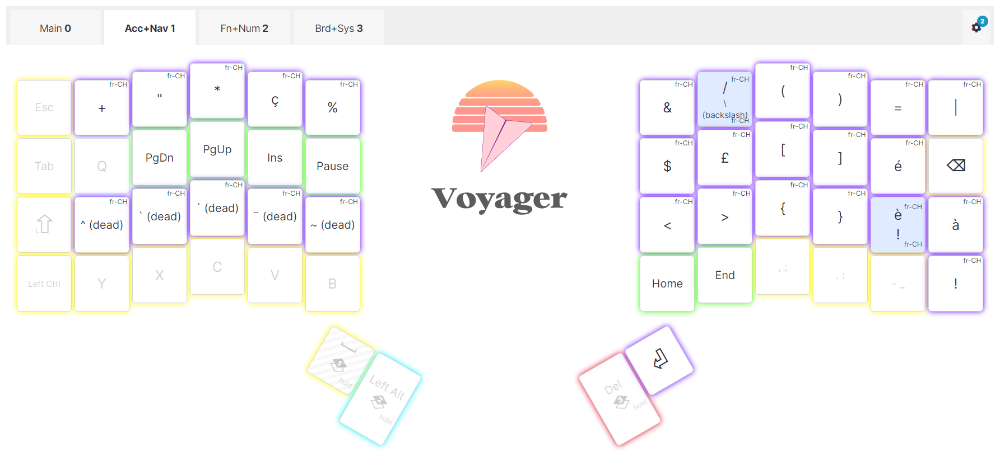

## Why a split keyboard

Since I started the job in Geneva, I had to learn the Swiss French layout on a regular Logitech keyboard. Though it was difficult the first couple of weeks, I can say that I have switched successfully on this layout. I find it more developer-friendly because of the position of the special characters.

A colleague of mine has been using a ZSA Moonlander, a larger model with an extra row and I thought it would be interesting to try a split keyboard.

Since ZSA keyboards are very popular, if I cannot get used to the layout, I could sale it back easily in Europe.

I’m mostly interested to see if it could help me position my hands, arms and shoulders to avoid the long-term issues that could occur from a day-long typing job.

## Why the Voyager model

My colleague told me that some of the keys he almost never used. Since both Moonlander and Voyager are the same price, I thought I’d be better off using a more restricted keyboard while leveraging the fully-configurable features to get the layouts needed for my usual typing habits.

## First configuration

If you are like me and you use an international layout (French, Swiss, etc), then read [this article from ZSA](https://blog.zsa.io/international-setup/#:~:text=This%20setting%20is%20usually%20in,our%20article%20about%20unsupported%20languages) first. It explains a few points to keep in mind while configuring your layouts.

Once you enabled your internalization and made sure your system is using the matching language, here are the few things to understand:

### The keys don’t print the “SHIFT” character but there are present

For example, the numeric row on a French swiss keyboard has special characters available when pressing any shift key.

They are also available on your ZSA keyboard, by default.

The same is true with “AltGr” or “Right Alt”-enabled characters.

### The reassignment of a key using the language specific code is important

For example, when using a French swiss keyboard, the Z and Y must be swapped.

To do so, you need to assign “Y (fr-CH)” to the usual Z key and “Z (fr-CH)” to the usual Y key.

If you use the plain “Y” and “Z” key in the swap, you will get two Y when using the Swiss French system language…

This is true for all other keys that have a “fr-CH” equivalent.

So be mindful about this when you configure your layouts.

## Organizing the layouts with special characters

This was the most challenging part because with only 52 keys, you have to think a bit more about how to make it the most efficient for a day-to-day use.

In my case, I write a lot of articles and I code daily for work so how did I combine the two?

### First layer

This is the layer for the most common characters and the numerical top row.

I tried to use as much as possible the SHIFT-enabled keys available on the top row.

Also, I left the ALT GR-enabled keys as it works by default.

After a couple weeks of using the keyboard and not performing well in the training area, I noticed that my SHIFT-enabled keys showed a lot of errors. I think it is due to my lack flexibility to stretch the pinky finger all the way to any shift key.

From there, I decided to configure all keys on the first layer to output the SHIFT+key character when the key was held.

So tapping the A key output “a” and helding on the A key output “A”.

I made the changes on all keys except (circled in red below):

- the 4 four thumb keys,
- the 4 keys of the first column (ESC, TAB, SHIFT LEFT and CTRL LEFT),
- the 3 keys of the last column (BACKSPACE, SHIFT RIGHT, CTRL RIGHT),
- the ATLGR key postionned to the right of the the right shift.

With this change, the accurracy of the SHIFT-enabled characters improved a lot.

### Second layer

Next, I tackled the next layer: the accents and special characters.

On this layer, I also included the navigation keys that I use use a lot: _Ins_, _Home, End_, _Page Up_ and _Page Down_ on the left pad with the special accents just below.

The right pad is reserved for the coding characters and the remaining accentuated characters (é, à and è).

The top row allows me to simply press the key to get the usual “SHITF+key” character at theis level.

So far, I haven’t trained enough to say if the setup work well. However, the grouped brakets characters helped with coding I get used to the split keyboard… 😛

### Third layer

Here, I grouped the function keys on the left in row of three and the numeric pad on the right.

I disabled every key that would have been transparent, e.g. the keys of the first layer would work.

I’m not sure it is the best setup.

But I left the left CTRL and SHIFT enabled to do combo like CTRL+F5 for example.

### Fourth layer

This is the media and macro layer. Tough I don’t use a lot the media keys, I use a lot of shortcuts…

Basically, things like:

- Reverse Tab with “_SHIFT+TAB”_ to go back on the focus.
- The language swap with “_SHIFT+ALT”._
- The emoji dialog with “_WINDOWS+dot character”_
- The Windows lock with _“”WINDOWS+L”_.
- The navigation in the browser tab with _“CTRL+SHIFT+TAB”_ (previous tab) or _“SHIFT+TAB”_ (next tab).
- The various print screen shortcuts when using PicPick for example.
- The creation of a new file in Visual Studio Code when using the “advanced-new-file” extension. I use that a ton when coding!

Note: I left the ability to do the standard “CTRL+ATL+SUPPR” (for locking the Windows session) or “CTRL+ALT+INS” (for unlocking the VMWare running on my work station) because the combo key with those keys wasn’t working.

The two right thumb keys therefore enable me to switch temporaly to the layout (as long as I hold the top thumb key) or activates the layer (as I hold the bottom thumb key).

## Coloring the layers

The framework I used was to pick 5 colors that are very distinct to visually see the layer I’m in:

- Yellow for the first,
- Purple for the second,
- Blue for the third,
- Orange for the fourth,

Then I made sure the transparent keys on layer 2 to 4 were the color of the layer 1.

All the macro keys or keys that were different than the theme on a layer used the green color.

That helps a lot I find those on layers 2 and 4.

At the time of writing this, I use the 2 thumb-keys on the left and the first thumb-key on the right to activate the layer on hold. The bottom thumb-key on the right is used to activate fully the fourth layer.

I use the same color as the layer for the layer switch. It help me to quickly know where is the layer I need.

And finally, all desactivated keys used no color.

## Training and first test

ZSA website is awesome and provides the tools to train. It includes training for:

- Prose, starting with _Alice in Wonderland_
- Book Excerpts
- Numbers & Symbols
- The _Whack-a-key_ mode, which is good for learning special characters.
- Code
- and custom text or free typing

While the prose and book excerpts took me an hour to see progress, the Numbers & Symbols prompted me to rethink my first approach on how I organized the layers.

I’ll spend the next weeks to train and use it in real life scenarios to see if I see a difference.

In the meantime, thanks for reading thus far and if you’re interested in my layout, here is [the public link](https://configure.zsa.io/voyager/layouts/GoJRR/latest).

Thanks for reading.
