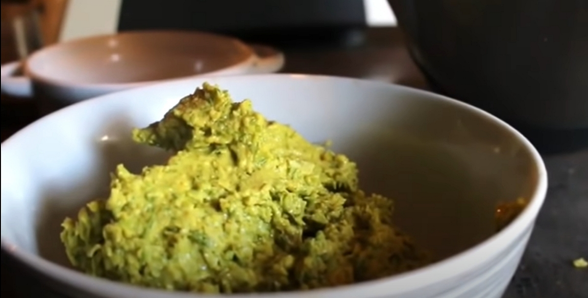
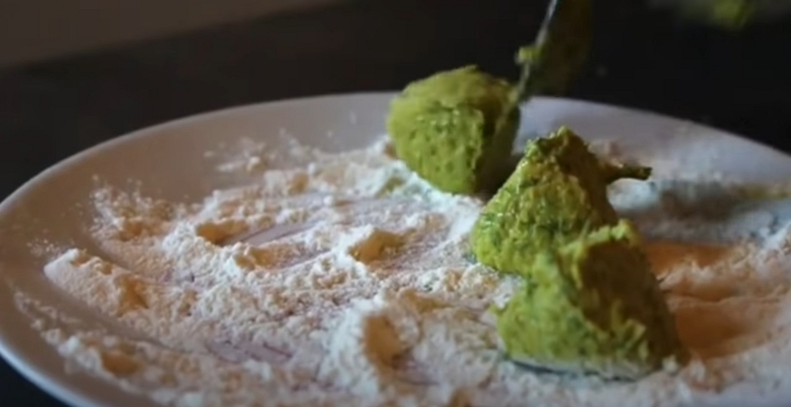
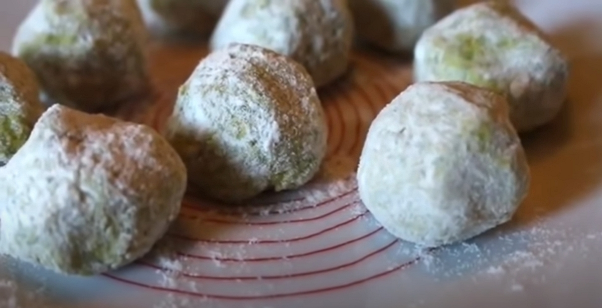

Merci à David Bricout et Damien Dekarz pour le partage de ce savoir !
Cet article résume mes notes du vlog réalisé par David sur la chaîne _Permaculture, agroécologie, etc_.

<!-- more -->

Vous pouvez retrouver [la vidéo sur YouTube](https://www.youtube.com/watch?v=381Y_pdQgCw).

## Etymologie

Le nom "Achillée" tient son origine du héros grec Achille. Il fut instruit la maîtrise de la faune sauvage, le maniement des armes, la musique, mais surtout la médecine par les plantes.

Selon la légende, il aurait utilisé l'achillée pendant la guerre contre Troie, principalement grâce à ses propriétés hémostatiques, c'est à dire qui arrête les saignements.

## Botanique

## Biodiversité autout de l'Achillée

## Comment la consommer en cuisine

Dans la vidéo, David présente la recette de Falafels aux fèves et à l'achillée.

Pour cela, il vous faut :

- des fèves fraiches, ou des pois chiches à défaut.
- des feuilles d'achillée mille-feuille.

Ensuite, on écosse les fèves pour en obtenir environ 150g et on prépare les autres ingrédients :

- 1 demi oignon
- 1 goutte d'ail
- 50g de farine de votre choix
- 1 demi sachet de levure
- du sel et des épices
- 1 petit poignée d'achillée (les fanes de carottes, du persil ou d'autres herbes font aussi bien l'affaire)
- de l'huile d'olive

Cela suffit pour réaliser 15 falafels.

La préparation suit les étapes suivantes :

1. découper grossièrement les ingrédients
2. les mixer dans un mixeur pour les affiner, si vous ne le faites pas à la main.

   

3. ensuite, rouler des boules de la pâte créée dans de la farine

   
   

4. laisser réposer pendant 30 min.
5.

_9>01_

## Usage en médicine douce

Crédit : l'image d'entête est extraite de la vidéo de David. Merci à lui.
