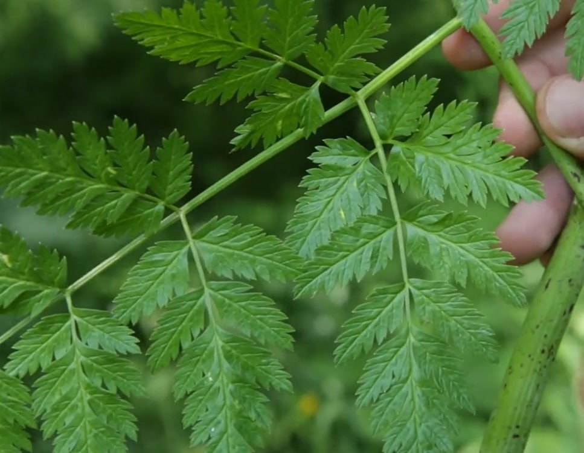

Merci à David Bricout et Damien Dekarz pour le partage de ce savoir !
Cet article résume mes notes du vlog réalisé par David sur la chaîne _Permaculture, agroécologie, etc_.

<!-- more -->

Vous pouvez retrouver [la vidéo sur YouTube](https://www.youtube.com/watch?v=381Y_pdQgCw).

## Étymologie

Le nom « Achillée » tient son origine du héros grec Achille. Il fut instruit la maîtrise de la faune sauvage, le maniement des armes, la musique, mais surtout la médecine par les plantes.

Selon la légende, il aurait utilisé l’achillée pendant la guerre contre Troie, principalement grâce à ses propriétés hémostatiques, c’est à dire qui arrête les saignements.

## Botanique

## La reconnaître

On confond l’achillée avec les ombellifères de la famille des Apiacées (cerfeuil, céleri, fenouil, persil, coriandre, carotte sauvage, angélique…).

Chez les Apiacées, la grappe de fleurs forme un dôme inversé d’où partent tous les pédoncules. Imaginez les baleines d’un parapluie quand le vent souffle très fort.

Chez les Astéracées, les pédoncules partent d’un point différent pour former des grappes de fleurs.

Pourquoi est-ce important de ne pas confondre l’achillée avec les plantes des Apiacées ?

Les ciguës ou l’œnanthe safranée sont des plantes toxiques, voire mortelles.

Je trouve que les feuilles sont très différentes des ciguës ou de l’œnanthe.

Crédits :

- photo de la feuille d’achillée : `https://fr.wikipedia.org/wiki/Achill%C3%A9e_millefeuille`.
- photo de la feuille de ciguë : `https://www.lechemindelanature.com/articles/a/tout-sur-les-cigues-famille-ombellieres-qui-peut-tuer`.
- photo de la feuille d’œnanthe : `https://foretvirtuelle.com/botanique-plantes/Oenanthe-safranee.php`.

De plus, s’il n’y a pas de fleurs, on peut identifier l’achillée par ses rhizomes qui impliquent qu’on la trouve en tapis sur le sol plutôt qu’une plante isolée.

L’achillée possède une odeur camphrée assez proche du thym, ce qui la distingue des Apiacées.

Grâce à ses rhizomes, l’achillée résiste bien à la chaleur et au sol sec ou compacté.

On la trouve un peu partout en France, sauf dans les zones très calcaires.

Dans le monde, on la trouve dans l’hémisphère nord, bien qu’on est introduite dans l’hémisphère sud.

## Comment la consommer en cuisine

Dans la vidéo, David présente la recette de Falafels aux fèves et à l’achillée.

Pour cela, il vous faut :

- des fèves fraiches, ou des pois chiches à défaut.
- des feuilles d’achillée millefeuille.

Ensuite, on écosse les fèves pour en obtenir environ 150 g et on prépare les autres ingrédients :

- 1 demi-oignon
- 1 goutte d’ail
- 50 g de farine de votre choix
- 1 demi-sachet de levure
- du sel et des épices
- 1 petite poignée de feuilles d’achillée (les fanes de carottes, du persil ou d’autres herbes font aussi bien l’affaire)
- de l’huile d’olive

Cela suffit pour réaliser 15 falafels.

La préparation suit les étapes suivantes :

1. découper grossièrement les ingrédients
2. les mixer dans un mixeur pour les affiner, si vous ne le faites pas à la main.

   

3. ensuite, rouler des boules de la pâte créée dans de la farine

   
   

4. laisser reposer pendant 30 min.
5. faire frire dans une poêle les boules en retournant pour bien les faire dorer.

   

_Crédit : images et recette par David Bricout et Marie Fernandez._

## Usage en médecine douce

Premièrement, la plante cicatrise grâce à ses propriétés antiseptique (infections), analgésique (douleurs) et hémostatique. Cela se révèle donc utile pour les plaies infectées ou les saignements.

Par simple application de feuilles machées, un saignement peut être arrêté rapidement. Toutefois, pour des hémorragies, allez aux urgences.

Ensuite, elle possède des propriétés décongestionnantes, par l’intermédiaire d’une meilleure circulation sanguine. Cela concerne les jambes lourdes, les varices, les hémorroïdes, les ecchymoses ou le foie.

La plante contient des tanins amers, utile pour stimuler et favoriser la digestion.

Chez la femme, elle peut aider à réguler ou démarrer les règles, ainsi qu’adoucir des règles douloureuses ou soutenir dans le cas du syndrome prémenstruel.

Pour les problèmes de peau, comme l’eczéma, l’application d’une teinture aide à nettoyer la peau.

En cas de problème de reins ou de cystite, l’achillée devient utile grâce à ses propriétés diurétiques.

Enfin, pour la fièvre, la plante stimule la transpiration et donc soulage la personne qui combat un virus.

Pour la consommer:

- en interne, on réalise soit des infusions de fleurs, des teintures d’alcool de fleurs ou des vins de fleurs.
- en externe, on l’utilise sous forme de macérat huileux de fleurs, de compresses d’infusions de fleurs ou des cataplasmes de feuilles broyées.

## Précautions

La plante est neurotoxique à forte dose et elle est aussi tonique.

**La dose maximum ne doit pas dépasser 3 à 4 tasses de 250 ml par jour sur un mois.**

On la déconseille chez les personnes épileptiques, allergiques aux Astéracées ou se trouvant sous anticoagulants.

On proscrit aussi l’huile essentielle chez les femmes enceintes ou allaitantes et les enfants de moins de 12 ans.

## Biodiversité autour de la famille des Astéracées



Dans la famille des Astéracées, ce que l’on voit ci-dessous, ce sont en fait des regroupements de plusieurs centaines de fleurs, qu’on appelle « inflorescences », concentrées au centre, et plus espacées aux extrémités.



Les insectes pollinisateurs aiment particulièrement cette famille de plantes.

Pourquoi ?

L’insecte peut alors se nourrir sur des centaines de fleurs à la fois.

L’achillée fournit encore plus de surface d’atterrissage avec ses grappes d’inflorescences et il s’agit d’une stratégie qui favorise énormément la pollinisation.

En France, l’achillée se décline en 18 espèces différentes, dont l’achillée millefeuille en est une.

Enfin, pour les oiseaux, les nids confectionnés dans des tiges d’achillée aideraient à éviter les problèmes de parasites.

Crédit : l’image d’entête et les autres images (hors exception) sont extraites de la vidéo de David. Merci à lui.
