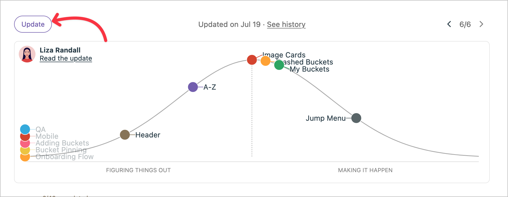

## Introduction

Nous connaissons Basecamp comme un éditeur de logiciels produisant des méthodes de travail innovantes. L’entreprise a introduit « Shape Up » en 2018 par Ryan Singer, responsable de la stratégie de Basecamp, en tant qu’alternative aux méthodologies agiles traditionnelles.

Elle trouve son origine dans les propres expériences de Basecamp et le besoin d’une approche plus ciblée du développement de leurs produits.

Le livre en ligne gratuit « [Shape Up : Stop Running in Circles and Ship Work that Matters](https://basecamp.com/shapeup) » décrit la méthodologie en détail.

En voici un résumé :

### Les étapes clés

Vous trouverez 4 étapes pour donner forme à vos projets :

1. Phase de mise en forme ou *Shaping* : Définir et esquisser les projets potentiels.
2. Phase de pari : et décider quels projets vous souhaitez poursuivre pour le cycle à venir.
3. Phase de réalisation : pendant un cycle de six semaines, le développement ciblé a lieu.
4. Phase de décélération ou *Cool-down* : c’est la période de réflexion et de préparation de deux semaines pour le cycle suivant.

Entrons dans le détail de chaque étape.

## 1. Phase de mise en forme

Nous appelons _Mise en forme_ la phase initiale au cours de laquelle l’équipe définit les projets à un niveau macroscopique. Elle comprend la définition du problème et de la solution, l’établissement de limites, l’identification des risques et la détermination de l’investissement en temps approprié, aussi nommé _l’« appétit »_.

### Ce que la mise en forme comprend et ne comprend pas

Elle comprend une définition de haut niveau du problème, les grandes lignes de la solution, des esquisses, l’identification des risques.
Cependant, vous devriez vous pencher sur des spécifications détaillées, des maquettes parfaites au pixel près, des listes complètes de fonctionnalités et des estimations de temps précises.

### Critères d’achèvement de cette étape

La mise en forme se termine lorsque le travail est « mis en forme » — c’est-à-dire bien défini, mais flexible, avec des limites claires et des risques identifiés, prêt pour la phase de pari.

## 2. Phase de pari

Au cours de la phase de pari, les parties prenantes examinent le travail façonné et décident des projets à poursuivre au cours du cycle suivant.

### Comment le processus de pari est-il organisé ?

Tout d’abord, les responsables parient sur les projets façonnés. Cela se produit avant chaque cycle de six semaines, lors de la phase de décélération, décrite ci-dessous.

Il s’agit d’une prise de décision : les projets sont pleinement engagés à 100 % ou pas du tout, en fonction de leur impact potentiel et des ressources disponibles. Les projets non sélectionnés entrent dans la réserve pour la phase de pari suivante ou peuvent même être remodelés sur la base des retours recueillis au cours d’un cycle.

Enfin, les dirigeants affectent de petites équipes aux projets retenus.

## 3. Phase de réalisation

Cette phase dure six semaines au cours duquel les équipes travaillent de manière autonome à la réalisation des projets qu'on leur a confiés.

### Processus de construction et bonnes pratiques

De petites équipes autonomes travaillent sans interruption.

L’équipe visualise les progrès accomplis à l’aide de « diagrammes en pente » ou _hill chart_.

Source : [de basecamp-help](images/hill-chart-example.png) [de basecamp-help.com](https://3.basecamp-help.com/article/412-hill-charts)

L’équipe gère activement le périmètre réalisable par le biais du « scope hammering » (martelage du périmètre). Le principe consiste à supprimer ce qui n’est pas essentiel. Voir ci-dessous les « limites de réduction du périmètre ».

Aucune réunion quotidienne n'a lieu et la communication reste asynchrone et efficace.

La livraison de projets complets constitue l’objectif de l’équipe, même si les fonctionnalités sont potentiellement réduites.

### La qualité pendant la construction

L’équipe intègre l’assurance qualité tout au long du processus de développement.

Les méthodes utilisées comprennent les méthodes bien connues : TDD, programmation en binôme, tests automatisés, intégration continue, tests manuels et exploratoires.

### Limites de réduction du périmètre

La réduction doit préserver la valeur fondamentale et la capacité de résolution des problématiques fonctionnelles pour le client final.

Elles ne doivent pas compromettre l’expérience de l’utilisateur ou la viabilité technique.

En outre, les réductions ne doivent pas empêcher l’extensibilité future ou compromettre les objectifs commerciaux.

## 4. La phase de décélération

On se trouve ici dans la fin du cycle.

Après le cycle de six semaines, l’équipe prend généralement une période de deux semaines pour la réflexion, la correction des anomalies et la planification du cycle suivant.

À ce moment-là, l’équipe envoie le travail terminé au(x) client(s).

L’équipe évalue les résultats du projet et peut ne pas achever le travail non terminé. Cela dépend vraiment de la prochaine phase de mise en forme.

En outre, les enseignements tirés sont appliqués à la mise en forme et aux paris futurs et l’équipe se prépare à entamer le cycle suivant.

## Conclusion

Que pensez-vous de la méthodologie *Shape Up* ?

Je trouve utile de s’engager envers les projets sélectionnés de façon complète pendant la réalisation. Cela responsabilise l’équipe pour donner le meilleur d’elle-même. Aussi, avec une période assez longue, le résultat semble permettre de construire un meilleur produit avec les informations clés de la mise en forme.

Au total, vous prenez 8 semaines pour compléter un cycle et cela semble suffisant pour apporter de la valeur et de la qualité à un produit.

J’ai hâte de l’essayer.



Merci d’avoir lu cet article. Assurez-vous de [me suivre sur X](https://x.com/LitzlerJeremie), de [vous abonner à ma publication Substack](https://iamjeremie.substack.com/) et de marquer mon blog d’un signet pour lire d’autres articles à l’avenir.



Crédits : l’image d’en-tête provient du [site web ProductPlan](https://www.productplan.com/glossary/shape-up-method/).
