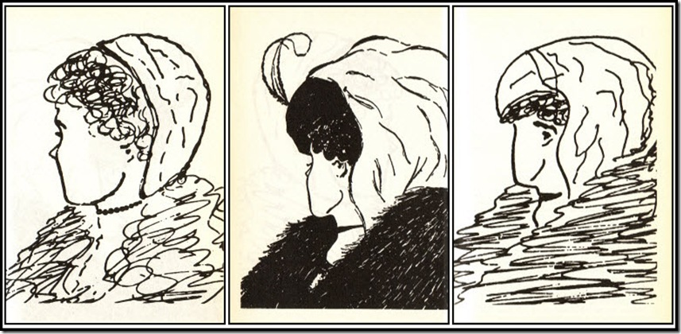

## Changement de paradigme

> Le bon sens n’est pas toujours une pratique courante
>
> ~ Stephen R. Covey

CORPS ⇒ PENSÉE ⇒ CŒUR ⇒ ESPRIT

Demandez-vous : comment est-ce que je perçois mon attitude ?

Il n’y a pas de raccourcis dans la vie. Si vous en prenez un, vous obtiendrez peut-être un succès à court terme, mais vous récolterez probablement des difficultés sur le long terme....

> Ce que nous sommes est bien plus éloquent que tout ce que nous pouvons dire ou faire.
>
> ~ Stephen R. Covey

Quelles sont les conceptions sur « la façon dont les choses sont » (réalités) et « la façon dont les choses devraient être » (valeurs) ?

Combien de jeunes femmes distinguez-vous ? Et combien de femmes âgées ?

À la page 39 du livre, le changement de paradigme est intéressant à observer au moment où on peut avoir l’impression que des enfants sont bruyants autour de nous :

> Un homme et ses enfants sont entrés dans le métro, les enfants étaient très bruyants et dérangeaient les autres passagers. Le père ne semblait pas s’en préoccuper.
>
> Stephen R. Covey est venu le voir et lui a demandé de les contrôler pour qu’ils gênent les autres passagers. L’homme venait de voir sa femme mourir il y a une heure.

Réfléchissez à ce paradigme : vaut-il la peine de crier et de se mettre en colère auprès d'enfants lorsqu’ils vous *ennuient* ou vous _dérangent_ ? Certainement pas.

Voir une citation de Thoreau :

> « Pour chaque millier de coups portés aux feuilles du mal, il y en a un qui frappe à la racine »

Comme l’a dit Stephen R. Covey :

> Nous ne pouvons obtenir que des améliorations partielles dans nos vies si nous nous attaquons aux feuilles de nos attitudes et de nos comportements et si nous travaillons sur la racine [du problème], les paradigmes à partir desquels nos attitudes et nos comportements se développent.

## Principes

Il s’agit des éléments suivants :

- l’équité
- l’intégrité
- l’honnêteté
- le service
- la qualité/excellence
- la dignité humaine
- la patience
- la bienveillance
- l’encouragement

Il y a un processus à suivre pour aller de A à B.

Aucun raccourci n’est possible. Je sais de quoi je parle : dans mon métier d’ingénieur logiciel, lorsque nous sautons une étape _juste pour gagner du temps_ ou _pour livrer plus vite_, nous le payons plus cher par la suite.

Cela est encore plus vrai dans nos relations.

Aussi, pour grandir, nous devons faire des pas dans la bonne direction.

Les relations interpersonnelles impliquent d’écouter. Et pour écouter, il faut de la force émotionnelle.

Regardez et étudiez ce dessin :

[Les principes intériorisés et les modèles de comportement font nos habitudes](images/2023-09-31-internalized-principles-and-patterns-of-behavior.jpg)

Quelles sont donc les 7 habitudes ?

Elles vous permettent de passer :

- premièrement, de la dépendance à l’indépendance.
- deuxièmement, de l’indépendance à l’interdépendance.

Je pense que je suis trop axé sur l’indépendance. En lisant les pages 57 et 58, je vois que je peux continuer à essayer de m’améliorer seul, mais je ne me sentirai ni satisfait ni efficace.

J’ai besoin d’aide : l’interdépendance, c’est continuer à grandir avec les autres.

En réalité, trop d’indépendance est souvent un signe de dépendance.

On pourrait comparer cela à la récolte d’une culture avant l’avoir plantée au lieu du contraire, ce qui est évidemment impossible.

## Efficience définie

C’est un équilibre de P/PC.

P signifie Production.

PC signifie « Production Capabilities » ou Capacités de production en français.

Si l’un des deux manque, cela ne peut pas fonctionner.

Par exemple, dans son livre, Stephen R. Covey raconte l’histoire de la poule aux œufs d’or. Le fermier la tue lorsqu’il devient trop gourmand pour attendre le lendemain afin d’obtenir l’œuf d’or. Il pensait qu’en « ouvrant la poule », il obtiendrait plus d’œufs d’or. Mais en fin de compte, il n’en aura plus jamais un seul.

Le principe P/PC s’applique à trois types d’actifs :

- Physiques
- Financiers
- Humains

L’équilibre du principe P/PC est atteint lorsque les actifs sont préservés, mais pas seulement.

De même, l’équilibre des actifs est la clé du succès et de l’efficience.

Qu’est-ce que cela signifie ? Si vous avez trop d’actifs physiques par rapport aux actifs relationnels, que se passerait-il pour un couple marié qui aurait trop d’« œufs d’or » mais pas de relation ?

Autre exemple : vous pourriez acheter une grelinette qui vous aide à aérer la terre dans le jardin. Vous l’utilisez souvent, car elle fait très bien son travail. Mais vous négligez de la ranger en le laissant à l’extérieur et, au fil des semaines et au contact de la pluie, le bois du manche commence à pourrir et finalement, lors d’une utilisation, les manches se cassent et vous vous retrouvez sans rien pour prendre soin du jardin. Vous devrez acheter de nouveaux manches alors qu’en prenant quelques secondes pour ranger l’outil après chaque utilisation, vous auriez évité cela.

Dans ce cas, nous nous sommes trop concentrés sur l’aération du sol (P) par rapport à l’entretien de l’outil (PC).

Aux pages 63 à 64, les quatre derniers paragraphes démontrent que négliger la poule (PC) pour les œufs d’or (P) dans un couple ou dans une relation parent/enfant rend la poule malade de jour en jour et finit par la faire mourir.

Permettez-moi de citer deux paragraphes :

> Et qu’en est-il de la relation d’un parent avec son enfant ? Lorsque les enfants sont petits, ils sont très dépendants, très vulnérables. Il devient alors si facile de négliger le travail PC — la formation, la communication, la relation, l’écoute. Il est facile de prendre l’avantage, de manipuler, d’obtenir ce que l’on veut comme on le veut — tout de suite ! Vous êtes plus grand, plus intelligent et vous avez *raison* ! Alors, pourquoi ne pas leur dire ce qu’ils doivent faire ? Si nécessaire, criez-leur dessus, intimidez-les, insistez pour obtenir ce que vous voulez.
>
> Ou alors, vous pouvez vous laisser aller. Vous pouvez vous laisser tenter par les œufs d’or de la popularité, en leur faisant plaisir, en leur donnant toujours ce qu’ils veulent. Ils grandissent alors sans aucun sens interne des normes ou des attentes, sans engagement personnel à être disciplinés ou responsables.
>
> ~ Stephen R. Covey



Merci d’avoir lu cet article. Assurez-vous de [me suivre sur X](https://x.com/LitzlerJeremie), de [vous abonner à ma publication Substack](https://iamjeremie.substack.com/) et d’ajouter mon blog à vos favoris pour ne pas manquer les prochains articles.


