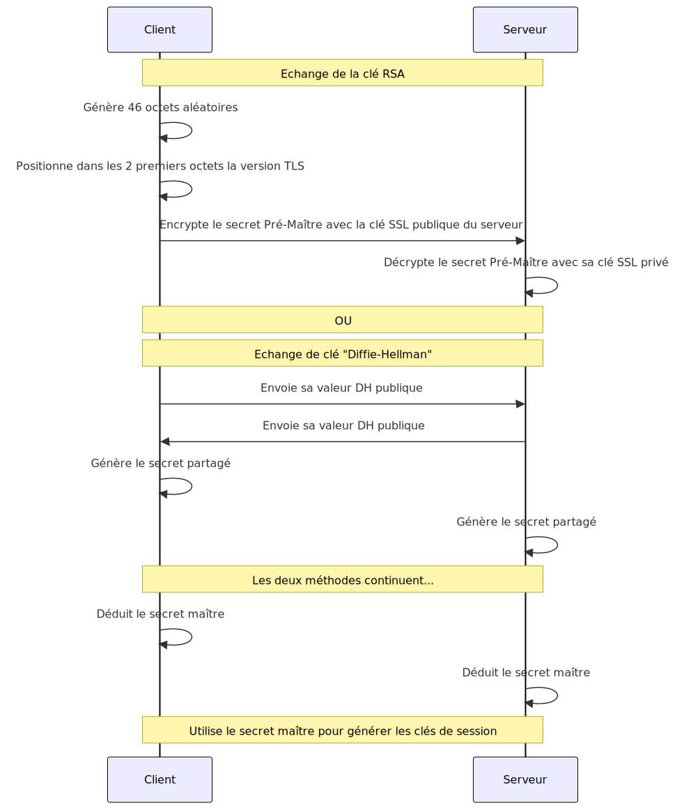

## Pourquoi avons-nous besoin de certificats SSL ?

Les certificats SSL permettent :

1. **le cryptage des données:** les certificats SSL cryptent les données transférées entre le serveur et le client, ce qui empêche les personnes malveillantes d’intercepter ou de falsifier des informations sensibles (par exemple, des numéros de carte de crédit, des données personnelles).
2. **l’authentification:** ils authentifient l’identité du site web, garantissant aux utilisateurs qu’ils communiquent avec un site web légitime et non avec un imposteur. Cela permet d’éviter les attaques de type « man-in-the-middle ».
3. **l’intégrité des données:** les certificats SSL garantissent que personne ne modifie les données envoyées et reçues pendant la transmission. Si les données sont altérées, la connexion est interrompue.
4. **la confiance et la réputation** des sites web: ceux dotés de certificats SSL affichent une icône de cadenas et utilisent « https » dans l’URL, ce qui renforce la confiance des utilisateurs. Certains navigateurs signalent également les sites non SSL comme « non sécurisés », ce qui peut dissuader les utilisateurs.
5. **la conformité:** De nombreuses normes réglementaires (par exemple, PCI DSS pour le traitement des paiements) exigent que les sites web utilisent le protocole SSL pour protéger les données sensibles.

En assurant le cryptage, l’authentification et l’intégrité, les certificats SSL sont essentiels pour sécuriser les communications et les transactions en ligne et instaurer la confiance entre les utilisateurs et les sites web.

## Création d’un certificat SSL

Vous trouverez ci-dessous les étapes détaillées de la création d’un certificat.

### Génération de la clé privée et de la demande de signature de certificat ou CSR (Certificate Signing Request)

La **clé privée** correspond à une longue chaîne de caractères aléatoires. Le serveur stocke cette clé secrète en lieu sûr.

Ensuite, vous construisez la **demande de signature de certificat** à l’aide de la clé privée, le propriétaire du site web crée cette demande à partir des informations sur le site web et le propriétaire.

### Soumission de la demande de signature de certificat à une autorité de certification pour validation

Le propriétaire du site web soumet la demande de signature de certificat à une autorité de certification de confiance, qui vérifie les informations fournies. L’autorité de certification vérifie l’authenticité de l’organisation ou de la personne qui demande le certificat.

Selon le type de certificat SSL, l’autorité de certification peut effectuer différents niveaux de validation.

Cela peut aller :

- de la vérification de la propriété du domaine (pour les certificats à validation de domaine)
- à la vérification des détails de l’organisation (pour les certificats à validation d’organisation)
- et même à la réalisation d’un processus d’examen approfondi (pour les certificats à validation étendue).

### Délivrance du certificat

Une fois que l’autorité de certification a validé les informations, elle émet un certificat SSL, qui comprend la clé publique du site web et la signature numérique de l’autorité de certification. Ce certificat est renvoyé au propriétaire du site web.

### Installation du certificat

Le propriétaire du site web installe le certificat SSL sur son serveur web. Le serveur peut désormais établir des connexions sécurisées avec les clients (navigateurs).

## Fonctionnement des certificats SSL

Pour sécuriser une connexion entre un client (généralement un utilisateur sur un navigateur web) et un serveur (une machine qui répond aux demandes de contenu comme une page Web), quelques étapes sont nécessaires avant de pouvoir échanger des données de manière cryptée.

Tout d’abord, le client établit une connexion : lorsqu’un utilisateur accède à un site web avec SSL, son navigateur demande au serveur de s’identifier.

Ensuite, le serveur envoie une copie du certificat SSL, qui comprend la clé publique et la signature numérique de l’autorité de certification.

Le navigateur vérifie ensuite le certificat par rapport à une liste d’autorités de certification de confiance. Il vérifie que le certificat provient d’une source fiable, qu’il n’a pas expiré et qu’il est utilisé aux fins prévues.

Enfin, le client lance l’échange de clés de chiffrement : si le certificat est fiable, le navigateur génère une clé de session, la chiffre avec la clé publique du serveur et l’envoie à ce dernier. Seul le serveur peut déchiffrer cette clé de session à l’aide de sa clé privée.

Le navigateur et le serveur disposent désormais d’une clé de session partagée, qu’ils utilisent pour crypter toutes les données échangées au cours de la session.

Le diagramme de séquence ci-dessous illustre les étapes du fonctionnement des certificats SSL au cours d’_une poignée de main SSL_ typique entre un client (navigateur) et un serveur (site web).

```text
Client (navigateur)               Serveur (site web)
   |                                |
   |--- 1. Client Hello ----------->|
   |                                |
   |<-- 2. Server Hello ------------|
   |<-- 3. Server Certificate ------|
   |<-- 4. Server Key Exchange -----|
   |<-- 5. Server Hello Done -------|
   |                                |
   |--- 6. Client Key Exchange ---->|
   |--- 7. Client Finished -------->|
   |                                |
   |<-- 8. Server Finished ---------|
   |                                |
   |--- 9. Encrypted Data --------->|
   |<-- 10. Encrypted Data ---------|

```

### Les étapes expliquées en termes simples

Imaginez que vous fassiez passer des notes secrètes dans une salle de classe. Voici comment des nombres aléatoires (comme ceux utilisés dans le protocole SSL aux étapes _Hello_) rendraient cette opération plus sûre :

- Une « poignée de main » unique : disons qu’avant de passer des notes, vous (le client) et votre ami (le serveur) convenez d’une poignée de main secrète. Mais au lieu d’utiliser la même poignée de main à chaque fois, vous lancez tous les deux un dé et utilisez les chiffres pour créer une poignée de main unique à chaque fois. Ainsi, même si quelqu’un voit votre poignée de main une fois, il ne peut pas utiliser cette connaissance pour se faire passer pour vous la prochaine fois. En outre, votre ami transmet sa clé pour créer un code à usage unique.
- Création d’un code à usage unique (échange de clés du client) : après votre poignée de main, vous utilisez les chiffres que vous avez tous deux obtenus pour créer un code ou une clé spéciale (un secret _prémaître_) pour votre message. Ce code change à chaque fois (à chaque session) parce que les jets de dé sont différents. Ainsi, même si quelqu’un déchiffre un message, il ne pourra pas lire le suivant.
- Vérification de la _fraîcheur de la session_ : si vous écrivez l’heure actuelle sur votre message ainsi qu’un nombre aléatoire, votre ami peut être sûr qu’il s’agit d’un nouveau message et non d’un ancien que quelqu’un lui renvoie pour le piéger.
- Prévenir les suppositions : puisque le jet de dé fournit un nombre aléatoire, personne ne peut deviner le suivant.

### Les étapes expliquées en détail

1. **Client Hello:** le client initie la poignée de main en envoyant un message « Client Hello » au serveur. Ce message comprend la version SSL/TLS du client, les suites de chiffrement prises en charge par le client (pour chiffrer les données suivantes, voir les étapes 9 et 10) et un numéro généré de manière aléatoire.
2. **Server Hello:** le serveur répond par un message « Server Hello ». Ce message comprend la version SSL/TLS du serveur, la suite de chiffrement choisie par le serveur dans la liste fournie par le client et un numéro généré de manière aléatoire.
3. **Certificat du serveur** : ensuite, le serveur envoie son certificat SSL au client. Ce certificat contient la clé publique du serveur et est signé par une autorité de certification (CA) de confiance.
4. **Échange de clés du serveur (si nécessaire):** si la suite de chiffrement choisie nécessite un échange de clés, le serveur envoie les paramètres d’échange de clés nécessaires.
5. **Server Hello Done:** le serveur envoie un message « Server Hello Done » pour indiquer qu’il a terminé sa partie de la négociation initiale.
6. **Client Key Exchange:** le client génère un secret prémaître, le crypte avec la clé publique du serveur (provenant du certificat du serveur) et l’envoie au serveur. Le client et le serveur utilisent ce secret prémaître pour générer un secret maître.

   La formule pour la valeur du secret maître est la suivante :

   ```text
   MasterSecret = PRF(PreMasterSecret, "master secret",
                      ClientHello.random + ServerHello.random)

   Où:
   PRF = Pseudorandom Function (une fonction de hachage cryptographique selon la suite de chiffrement choisie par le serveur)
   PreMasterSecret = Valeur secrète générée par le client
   ClientHello.random = Le nombre aléatoire envoyé par le client
   ServerHello.random = Le nombre aléatoire envoyé par le serveur
   ```

7. **Client Finished** : le client envoie un message « Client Finished », chiffré avec la clé de session dérivée du secret maître, pour indiquer que la partie client de la poignée de main est terminée.
8. **Server Finished** : le serveur répond par un message « Server Finished », également crypté avec la clé de session, pour indiquer que la partie serveur de la poignée de main est terminée.
9. **Encrypted Data (par le client)** : le client et le serveur peuvent maintenant échanger des données en toute sécurité en utilisant un chiffrement symétrique, avec des clés dérivées du secret principal.
10. **Encrypted Data (par le serveur)** : le serveur répond aux données cryptées du client. Cet échange se poursuit pendant toute la durée de la session.

### Création du secret prémaître

Vous pouvez utiliser deux méthodes pour générer du secret prémaître.

Décrivons les étapes de chaque méthode. La méthode de création du secret prémaître dépend de l’algorithme d’échange de clés utilisé. Les deux méthodes les plus courantes sont les suivantes :

a) Échange de clés RSA :

- Le client génère le secret prémaître.
- Il s’agit généralement d’une valeur de 48 octets (384 bits) chiffré par la clé publique du certificat SSL du serveur.
- Les deux premiers octets correspondent au numéro de version du protocole TLS.
- Les 46 octets restants sont générés à l’aide d’un générateur de nombres aléatoires sécurisé.

b) Échange de clés Diffie-Hellman :

- Le client et le serveur contribuent tous deux à la génération du secret prémaître.
- Il est calculé sur la base du secret partagé dérivé de l’algorithme Diffie-Hellman.

Comme indiqué ci-dessus, le secret prémaître est créé à partir de deux octets :

- Pour RSA, 2 octets contiennent la version du protocole TLS (telle que comprise par le client) et 46 octets contiennent les données aléatoires.

- Pour Diffie-Hellman : le secret partagé calculé à partir des paramètres de Diffie-Hellman.

Décrivons les deux méthodes sous forme de diagramme :



Vous devez tenir compte du niveau de sécurité des deux méthodes et choisir celle qui répond le mieux à vos besoins :

- Dans l’échange de clés RSA, seul le client connaît initialement le secret prémaître. Le serveur doit le décrypter.
- Dans la méthode Diffie-Hellman, les deux parties calculent indépendamment le même secret prémaître.
- Le secret prémaître n’est jamais envoyé en texte clair sur le réseau.
- Son caractère secret est essentiel pour la sécurité de l’ensemble de la session SSL/TLS.

Bien que la méthode RSA soit plus simple, il n’offre pas de secret de transmission.
En revanche, Diffie-Hellman (en particulier DH éphémère) assure le secret en aval, ce qui signifie que les sessions passées restent sécurisées même si la clé privée à long terme du serveur est compromise à l’avenir.

### Qu’est-ce qui interrompt une session ?

De nombreux facteurs peuvent interrompre une session. Par exemple :

1. Expiration naturelle de la session : Les sessions SSL/TLS ont une durée de vie prédéterminée, généralement fixée par le serveur. Une fois cette limite de temps atteinte, la session expire naturellement.

2. Fin explicite : Le client ou le serveur peut initier une fermeture correcte de la connexion. Cela se fait par le biais d’un message spécifique du protocole SSL/TLS appelé « Close Notify ».

3. Problèmes de réseau : Une perte soudaine de connectivité réseau, une latence réseau importante ou une perte de paquets peuvent interrompre la session entre le client et le serveur.

4. Actions côté serveur : Redémarrage ou panne du serveur ou équilibrage de la charge qui déplace la connexion vers un autre serveur.

5. Actions côté client : La fermeture du navigateur ou de l’application ou la mise en veille d’un appareil mobile met fin à la session en cours.

6. Mesures de sécurité : La détection de possibles menaces pour la sécurité peut amener le serveur à mettre fin aux sessions ou simplement à changer les certificats SSL/TLS du serveur.

7. Délai d’inactivité : De nombreux serveurs mettent en œuvre un délai d’inactivité pour libérer des ressources.

8. Transfert maximal de données : certaines implémentations peuvent mettre fin à une session après le transfert d’une certaine quantité de données.

Il convient de noter que dans de nombreuses applications web modernes, le concept de « session » va souvent au-delà de la session SSL/TLS proprement dite. Les sessions au niveau de l’application (comme les sessions de connexion) peuvent persister à travers plusieurs sessions SSL/TLS grâce à des mécanismes tels que les cookies ou les jetons de session.

Lorsqu’une session est interrompue, un nouveau processus d’échange doit avoir lieu pour établir une nouvelle connexion sécurisée. Cela implique la génération de nouveaux nombres aléatoires, d’un nouveau secret prémaître et, par conséquent, de nouvelles clés de session. Cela garantit que même si un attaquant parvient à compromettre une session, il n’aura pas automatiquement accès aux sessions suivantes.

## Conclusion

Comprenez-vous mieux le fonctionnement des certificats SSL ?
Après avoir lu davantage sur le sujet et l’avoir résumé ici, je comprends les concepts des certificats SSL.

[N’hésitez pas à poser des questions](../../../page/contactez-moi/index.md) si vous en avez besoin.



Merci d’avoir lu cet article. Assurez-vous de [me suivre sur X](https://x.com/LitzlerJeremie), de [vous abonner à ma publication Substack](https://iamjeremie.substack.com/) et d’ajouter mon blog à vos favoris pour ne pas manquer les prochains articles.



Crédit : Photo par [Cytonn Photography](https://unsplash.com/@cytonn_photography?utm_content=creditCopyText&utm_medium=referral&utm_source=unsplash) sur [Unsplash](https://unsplash.com/photos/two-people-shaking-hands-n95VMLxqM2I?utm_content=creditCopyText&utm_medium=referral&utm_source=unsplash).
