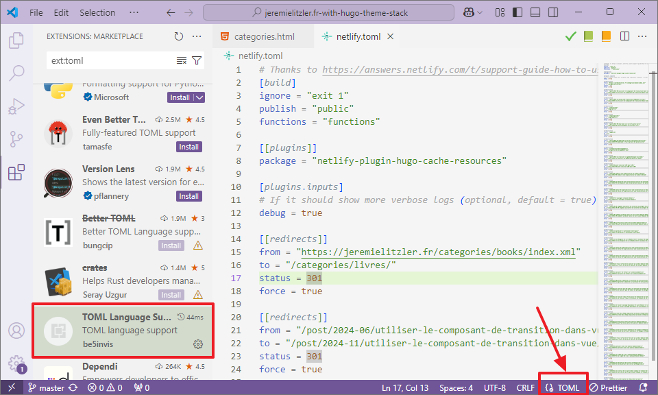
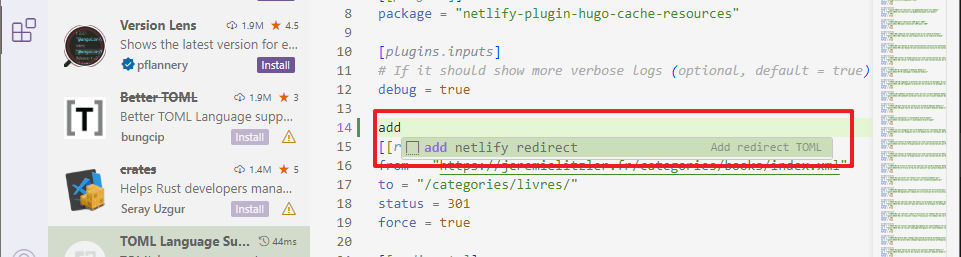

J’ai rencontré un problème après avoir créé mon premier extrait de code `TOML` pour Visual Studio Code.

Voici pourquoi cela n’a pas fonctionné !

## L’extrait de code

J’ai construit cet extrait de code pour ajouter une redirection à mon fichier `netlify.toml` :

```toml
{
  "Add redirect TOML": {
    "scope": "toml",
    "prefix": "add netlify redirect",
    "body": [
      "[[redirects]]",
      "from = \"$1\"",
      "to = \"$2\"",
      "status = 301",
      "force = true",
    ],
    "description": "add a redirect handled by Netlify",
  },
}
```

## Le problème

Quand j’ai essayé de l’utiliser dans mon fichier `netlify.toml`, `add netlify redirect` ne s’affichait pas… 🤔

Pourquoi ? La raison se trouve sur cet écran. Vous la voyez ?


Oui, le « _Plain Text_ » en bas à droite. Puisque j’ai défini le champ d’application de l’extrait de code pour travailler sur du code `toml`, son absence s'explique facilement… L’extrait de code ne spécifie pas « _Plain text_ » dans son champ d’application.

## La solution

Vous devez simplement installer l’extension « _TOML Language Support_ ». Une fois l’extension activée, vous pouvez utiliser l’extrait de code dans `netlify.toml` !

Vous pouvez voir que l’association de fichiers fonctionne :



Et l’extrait de code fonctionne :



## Conclusion

Bien que Visual Studio Code soit livré avec de bonnes associations de fichiers, j’ai rencontré ce problème pour la première fois.

Donc, si, comme moi, vous remarquez qu’un extrait de code ne fonctionne pas, pensez à regarder en bas à droite… 😁



Merci d’avoir lu cet article. Assurez-vous de [me suivre sur X](https://x.com/LitzlerJeremie), de [vous abonner à ma publication Substack](https://iamjeremie.substack.com/) et d’ajouter mon blog à vos favoris pour ne pas manquer les prochains articles.



Photo d’[Anete Lusina](https://www.pexels.com/photo/person-choosing-document-in-folder-4792285/).
