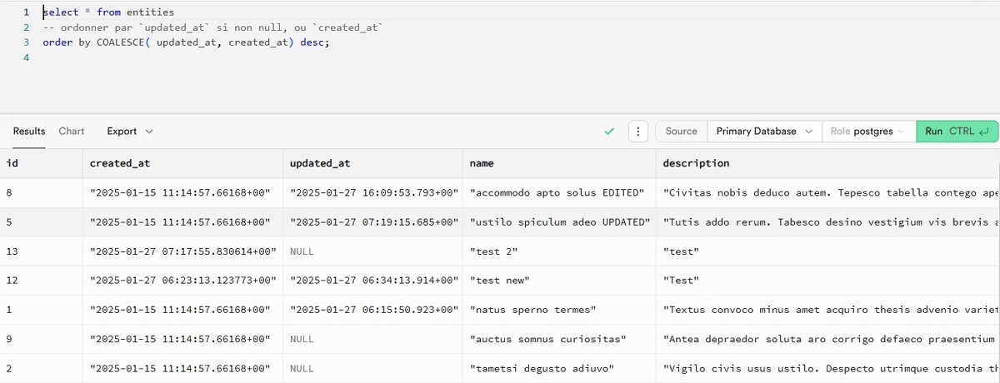

I’m writing this small tip of the day to describe the behavior when you order a query result and null values exist on a target column.

## The Use Case

Let’s say we have a table with a `created_at` column and another named `in_progress_at`.

The first column never equals to `null` while the second can until the record is updated.

Now, the business logic want to order records in descending order with the updated records first and then the rest.

If you order in descending order on the `in_progress_at` first and then on `created_at` also in descending order, what will happen if you have a record without a `in_progress_at` set and another with no value on `in_progress_at`?

Well, the record with the null value on `in_progress_at` will come before first.

And what if you add a new record and update an existing one? Well, the new record will stay on top…

What about ascending order? It’s the opposite: the record with a null value comes second.

## Testing With Supabase Dashboard

It’s easy:

- Create a [Supabase account](https://supabase.com/) and a project.
- Create a table `entities` with the two date columns described above.
- Insert a few records
- Use the SQL editor to test it:

```sql
select * from entities order by updated_at desc, created_at desc
```

The query above will give the following result:


```sql
select * from entities order by updated_at asc, created_at asc
```

The query above will give the following result:


Neither achieve the result expected. The entity 12 should arrive second and the entity 5 first.

## Solution With SQL

The SQL solution is simple:

```sql
select * from entities order by COALESCE( updated_at, created_at) desc nulls first;
```

We get the right result:



## Issue Using Supabase Public API

But how do you that using Supabase JavaScript client?

Not like that!

```ts
export const allEntitiesQuery = supabase
  .from("entities")
  .select()
  // TODO > about ordering with Supabase !
  .order("coalesce(updated_at, created_at)", {
    ascending: false,
    nullsFirst: false,
  });
```

You get an error:

```plaintext
failed to parse order (coalesce(updated_at, created_at).desc.nullslast)" (line 1, column 9) ;

Details: unexpected '(' expecting letter, digit, "-", "->>", "->", delimiter (.), "," or end of input" with the following code: PGRST100
```

How we solve that?

## Solution Using Supabase Public API

The answer: Postgres functions!

In our case, it’ll look as follows:

```sql
CREATE OR REPLACE FUNCTION coalesce_updated_at_or_created_at_sort(
    target_table text,
    selected_columns text DEFAULT '*',
    sort_direction text DEFAULT 'DESC',
    --
    nulls_position text DEFAULT 'FIRST'
) RETURNS SETOF json AS $$
BEGIN
    IF sort_direction NOT IN ('ASC', 'DESC') THEN
        RAISE EXCEPTION 'sort_direction must be either ASC or DESC';
    END IF;
    IF nulls_position NOT IN ('FIRST', 'LAST') THEN
        RAISE EXCEPTION 'nulls_position must be either FIRST or LAST';
    END IF;

    RETURN QUERY EXECUTE format(
        'SELECT row_to_json(t) FROM (SELECT %s FROM %I ORDER BY COALESCE(updated_at, created_at) %s NULLS %s) t',
        selected_columns,
        target_table,
        sort_direction,
        nulls_position
    );
END;
$$
 LANGUAGE plpgsql SECURITY DEFINER;
```

To use it, run the SQL above, generate your TypeScript types using the CLI and update the TypScript code:

```ts
export const allEntitiesQuery = supabase.rpc(
  "coalesce_updated_at_or_created_at_sort",
  {
    target_table: "entities",
    selected_columns: "*",
    sort_direction: "DESC",
    nulls_position: "LAST",
  },
);
```

I could improve it, but it solves my business logic.

You can read more in the official Supabase documentation about:

- [Ordering records](https://supabase.com/docs/reference/javascript/order)
- [Postgres functions](https://supabase.com/docs/guides/database/functions)

## Conclusion

That was a tricky one. I had written a draft of this article and while completing it, I realized that I was far from the goal!

Did you learn something today? I sure did!



Thanks for reading this article. Make sure to [follow me on X](https://x.com/LitzlerJeremie), [subscribe to my Substack publication](https://iamjeremie.substack.com/) and bookmark my blog to read more in the future.



Photo by [Pavel Danilyuk](https://www.pexels.com/photo/fashion-creative-girl-pattern-6461495/).
