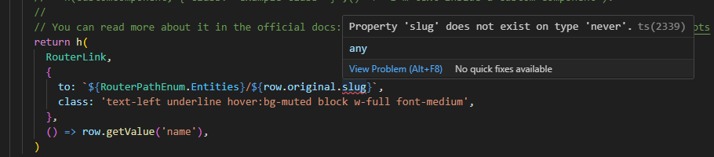
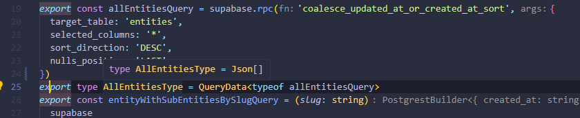

Le 27 janvier, j’ai partagé une astuce pour [utiliser les fonctions Postgres](../../2025-01/la-clause-order-by-avec-supabase/index.md) afin d’effectuer un classement avancé des résultats retournés pour une table.

Laissez-moi vous montrer l’erreur que je n’ai pas détectée tout de suite.

## Le problème

Sur tout le code lié à `allEntitiesQuery`, j’ai remarqué de nombreuses erreurs de TypeScript.

La première que j’ai remarquée se trouvait dans la définition des colonnes de la table de données où TypeScript me disait que les propriétés de `AllEntitiesType` n’existaient pas.



## La cause

La méthode `rpc` de Supabase renvoie le bon type en fonction du type de retour de la fonction Postgres, tel que défini dans le schéma de votre base de données ([source](https://www.restack.io/docs/supabase-knowledge-supabase-rpc-typescript-guide)).

Dans mon cas, j’ai spécifié `RETURNS SETOF json AS $$` et c’est ce qui s’est passé :



Puisque vous pouvez appeler la fonction avec le nom de la table comme paramètre d’entrée, le type retourné me semble logique.

Mais comment corriger les erreurs TypeScript ?

## La solution

Pour résoudre ce problème, vous devez utiliser les types générés par Supabase et créer un nouveau type personnalisé :

```tsx
import type { Database } from "@/types/DatabaseTypes";

export type EntityRecordWithRpc =
  Database["public"]["Tables"]["entities"]["Row"];
```

Ensuite, vous mettez à jour le type retourné à `as unknown as PostgrestSingleResponse<EntityRecordWithRpc[]>` sur la `allEntitiesQuery`.

Le TypeScript requiert la conversion `as unknown` avant le `as PostgrestSingleResponse<EntityRecordWithRpc[]>` parce qu’aucun type ne se superpose suffisamment à l’autre (voir la règle [_ts(2352)_](https://medium.com/@maciej.osytek/downcasting-in-typescript-how-to-avoid-the-ts-2352-error-632a7b122b16)).

Ensuite, remplacez toutes les références de `AllEntitiesTypes` par `EntityRecordWithRpc`.

Terminez par une nouvelle exécution du script de compilation. Il devrait montrer la résolution de toutes les erreurs TypeScript !

## Conclusion

Ce que j’en retiens : Jj'ai besoin d’ajouter une étape de CI pour exécuter le `npm run build` systématiquement sur chaque PR à destination de `develop`. Un sujet pour un autre article. Restez à l’écoute !



Merci d'avoir lu cet article. Assurez-vous de [me suivre sur X](https://x.com/LitzlerJeremie), de [vous abonner à ma publication Substack](https://iamjeremie.substack.com/) et d'ajouter mon blog à vos favoris pour ne pas manquer les prochains articles.



Photo de [Mido Makasardi ©️](https://www.pexels.com/photo/red-led-traffic-cone-2743739/)
