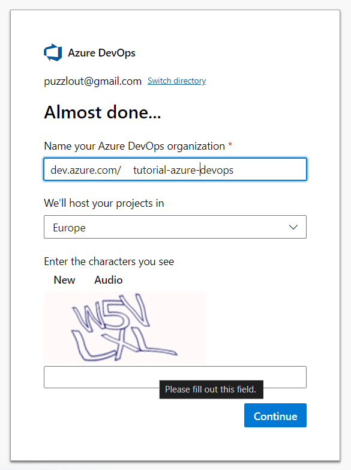

## Pourquoi

Il offre une **flexibilité** en permettant l’intégration de divers outils et plateformes, ce qui le rend adapté à divers environnements de développement.

En outre, Azure DevOps prend en charge les pipelines **d’intégration et de livraison continues (CI/CD)**, qui automatisent les processus de génération, de test et de déploiement, réduisant ainsi considérablement le délai de mise sur le marché des applications logicielles.

Cette automatisation améliore l’efficacité et réduit les risques opérationnels, ce qui en fait un choix intéressant pour les entreprises qui cherchent à sécuriser leurs processus de développement.

Un autre avantage clé d’Azure DevOps est sa capacité à **favoriser la collaboration** et **améliorer la qualité du code**.

Il offre des plateformes centralisées pour la gestion du code, le suivi des projets et la collaboration des équipes, garantissant que toutes les parties prenantes ont une visibilité sur l’avancement du projet.

Enfin, Azure DevOps offre une **haute disponibilité** avec un SLA de 99,9 % et des fonctions de sécurité robustes, ce qui en fait un choix fiable pour les entreprises.

## Prérequis

- Créez un compte sur Microsoft. Vous pouvez utiliser n’importe quelle adresse e-mail existante et il n’est pas nécessaire que ce soit une adresse Microsoft.
- Naviguez ensuite jusqu’à :

  ```plaintext
  https://portal.azure.com
  ```

- S’inscrire pour le niveau gratuit
- Naviguez sur la page d’accueil pour créer votre organisation qui vous permettra de démarrer avec DevOps :

  ```plaintext
  https://aex.dev.azure.com/me
  ```

## Création du DevOps

Une fois que vous êtes sur la page `aex.dev.azure.com`, cliquez sur _Create an organization_ (« Créer une organisation »).

Choisissez un nom et choisissez la région où héberger le code que vous allez créer.







Une fois l’organisation créée, DevOps vous invitera à créer le premier projet dans lequel vous organiserez votre travail, stockerez votre code et générerez les artéfacts de vos applications que vous créerez.

Indiquez le nom du projet et cliquez sur _Create project_ (« Créer le projet »):






Et voilà : votre espace de travail DevOps gratuit est prêt à être utilisé !


## Description d’Azure DevOps

### Sur la lame _Overview_

Vous pouvez configurer des widgets à partir des écrans « Résumé » ou « Tableaux de bord » pour visualiser rapidement les progrès de votre équipe.

Vous accédez également au Wiki, un espace où vous pouvez partager des processus, des guides et d’autres documentations rapides en Markdown.

Je ne le trouve pas assez flexible, mais ayant utilisé différentes versions d’Azure DevOps, je constate qu’il s’est amélioré au fil du temps.

Pour moi, la recherche et le partage de liens ne sont pas assez conviviaux par rapport à un site web Hugo.



Si vous avez créé une organisation et un premier projet avec des espaces, le partage des liens du Wiki sera complexifié à cause de l’encodage naturel de ceux-ci dans toutes les URL.



### Sur la lame _Board_

Vous pouvez créer vos histoires, vos tâches, etc., pour organiser votre travail. Dans le cadre de la version gratuite, ces éléments sont inclus :

- Jusqu’à 5 utilisateurs
- Nombre illimité de dépôts Git privés
- 1 tâche parallèle CI/CD hébergée par Microsoft (jusqu’à 1800 minutes par mois)
- Fonctionnalités de base d’Azure Boards

Vous pouvez configurer votre flux de travail et définir comment les éléments de travail doivent être organisés selon vos besoins (avec ou sans Agilité).

### Sur la lame _Repos_

Vous pouvez commencer à stocker votre code ou créer un dépôt personnalisé avec un autre nom que celui du premier projet.

[Écran DevOps Git Repositories](4-the-devops-git-repositories.png)

Utilisez Visual Studio Code et Git sur votre ordinateur personnel et exécutez la commande pour cloner le dépôt et commencer à coder :

```bash
git clone https://tutorial-azure-devops@dev.azure.com/tutorial-azure-devops/my-tutorial-azure-devops/_git/my-tutorial-azure-devops
```

Ou utilisez le bouton sur l’écran DevOps :


### Sur la lame _Pipelines_

Vous pouvez configurer les processus (« *build* ») pour générer l’application à partir du code de votre dépôt et les déployer (par contre, il faudra payer des ressources Azure pour automatiser le tout).

Voir le lien en conclusion pour un exemple concret étape par étape.

### À propos des lames _Test Plans_ et _Artifacts_

Je ne les ai pas utilisées jusqu’à présent, c’est donc hors sujet dans cet article pour l’instant.

## Conclusion

Voilà, c’est fait ! Vous êtes prêt à transformer vos idées géniales en logiciel et à les partager avec le monde entier.

Continuez l’aventure avec l’article « [Déployer une API REST Python vers Microsoft Azure](../../2024-08/deployer-une-api-rest-python-sur-microsoft-azure/index.md) qui explique comment déployer une application Flask vers Azure à partir d’un référentiel DevOps.



Merci d’avoir lu cet article. Assurez-vous de [me suivre sur X](https://x.com/LitzlerJeremie), de [vous abonner à ma publication Substack](https://iamjeremie.substack.com/) et d’ajouter mon blog à vos favoris pour ne pas manquer les prochains articles.



Photo de [Jakub Zerdzicki](https://www.pexels.com/photo/close-up-of-a-3d-printer-extruding-orange-plastic-31137405/)
